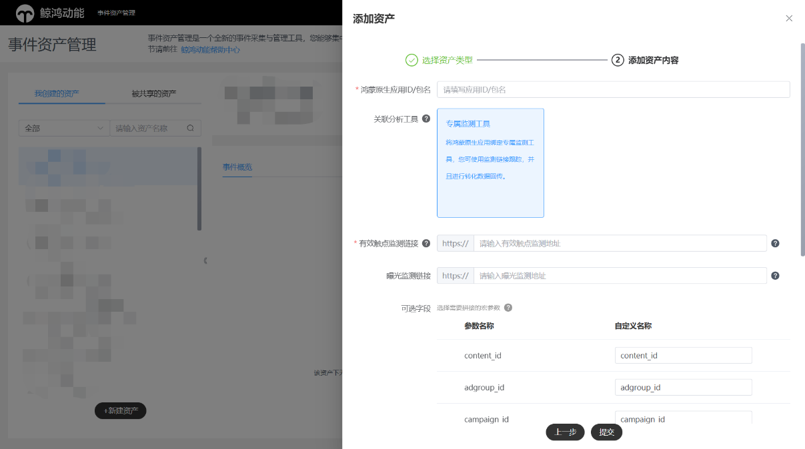
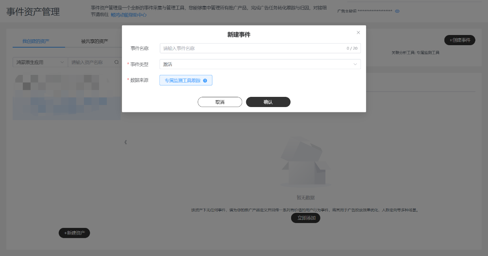
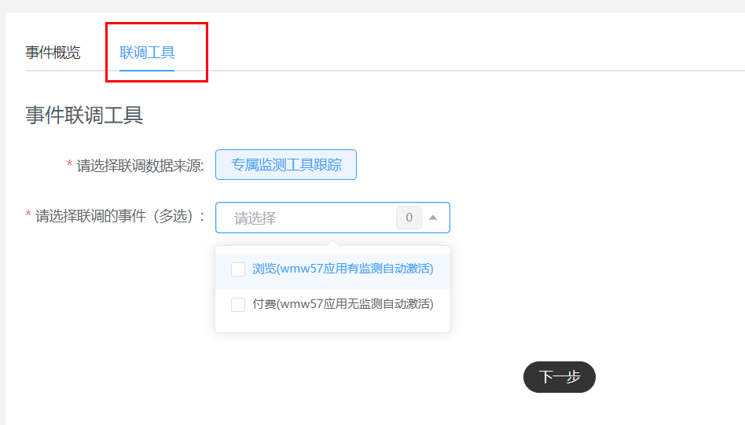
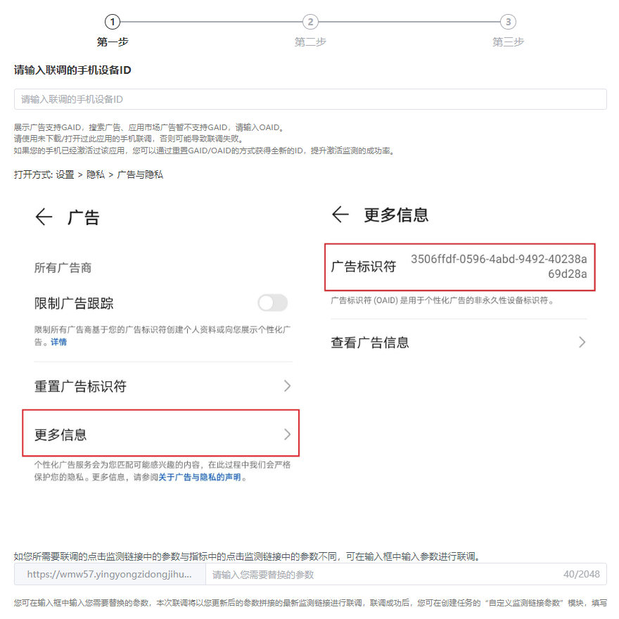
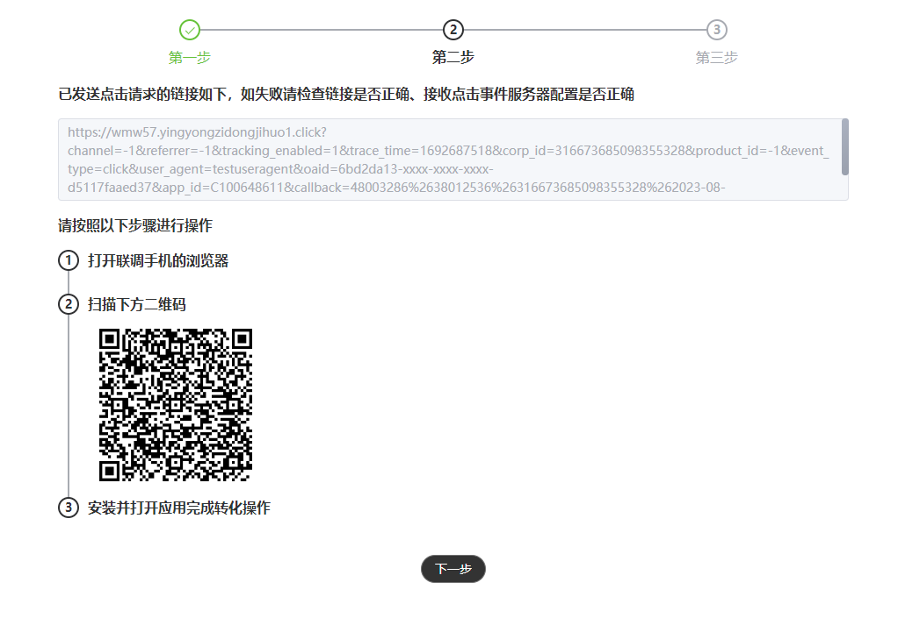
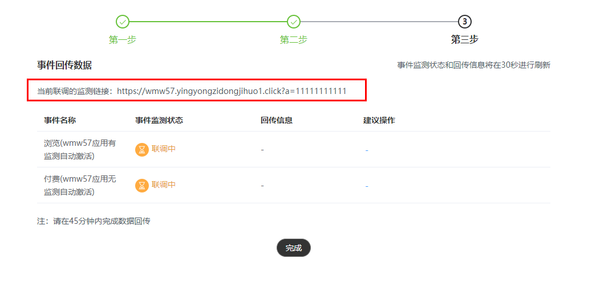

# 监测链接跟踪

## 基本原理

通过监测链接跟踪，可以实现鲸鸿动能和广告主的信息互通，完成广告效果的归因；广告主需要准备好监测链接域名，监测链接通常包含用户设备ID信息、广告任务信息、转化回传标识（callback），广告主可使用设备ID进行转化归因，使用广告任务信息制作分析报表，使用转化回传标识回传转化数据给鲸鸿动能。

 

广告主回传给鲸鸿动能的转化数据有效回溯窗口期为曝光后2天/点击后30天/激活后180天，超过有效回溯窗口期的转化数据将被鲸鸿动能视为无效。

鲸鸿动能支持的监测链接顶级域名如下：

.com;.cn;.net;.top;.cc;.xyz;.vip;.fun;.huawei;.mobi;.me;.home;.org;.tech;.tech;.tv;.team;.xgjc;.ssyd;.online;.wedobest;.pub;.reading;.wang;.asia;.hk

如果您的监测链接域名不在上述名单中，请联系鲸鸿动能运营人员进行处理。

## 配置监测链接

客户端：鲸鸿动能服务器

服务端：广告主服务器

请求协议：HTTPS

请求方式：GET

请求内容类型：application/json

接口示例：

<strong>https://www.advertiser.com/feedback?</strong>param1=param1\_value&param2=param2\_value&content\_id=\\{xxx\\}&adgroup\_id=\\{xxx\\}&campaign\_id=\\{xxx\\}&oaid=\\{xxx\\}&trace\_time=\\{xxx\\}&callback=\\{xxx\\}&corp\_id=\\{xxx\\}&app\_id=\\{xxx\\}

其中加粗部分URL由广告主提供的点击监测地址，红色字体即为广告主提供的原始URL中的参数，其余参数为鲸鸿动能根据您账号配置拼接在上的，灰色部分参数为鲸鸿动能根据您账号配置拼接在上，无需手工填写。

|  |  |  |  |
| --- | --- | --- | --- |
| <strong>默认参数名称</strong> | <strong>类型</strong> | <strong>是否必然携带</strong> | <strong>描述</strong> |
| content\_id | string | 是 | 创意id |
| adgroup\_id | string | 是 | 任务id |
| campaign\_id | string | 是 | 计划id |
| oaid | string | 是 | 设备OAID标识符，明文 |
| tracking\_enabled | string | 是 | 0：不允许跟踪，此时不能对用户进行画像、精准推荐和精准营销  1：允许跟踪 |
| ip | string | 是 | 点击时的IP地址 |
| user\_agent | string | 是 | 做URL编码 |
| trace\_time | string | 是 | 事件发生的时间，Huawei Ads生成，Unix时间戳，单位秒 |
| callback | string | 是 | 回调参数，需要在回传的转化行为数据中携带 |
| corp\_id | string | 可选 | 广告主标识 |
| app\_id | string | 可选 | 推广的App标识 |
| campaign\_name | string | 可选 | 广告计划名称 |
| adgroup\_name | string | 可选 | 广告任务名称 |
| content\_name | string | 可选 | 广告创意名称 |
| deep\_link | string | 可选 | deeplink链接 |
| os\_version | string | 可选 | 系统版本 |
| emui\_version | string | 可选 | emui版本号 |
| transunique\_id | string | 可选 | 统一跟踪ID |
| publisher\_type | int | 可选 | 1：内部站点 2：外部站点 |
| publisher\_app\_id | string | 可选 | 媒体ID，加密字段（此字段需向对应的行业运营申请权限） |
| log\_id | string | 可选 | 日志ID（一次请求下发生的日志ID，可对应点击ID） |
| referrer | string | 是 | 广告跟踪标识符 |
| channel | string | 是 | 媒体渠道流量入口 |
| product\_id | string | 可选 | 推广商品ID |
| store\_id | string | 可选 | 商品库ID |
| dpa\_referee | string | 可选 | 推荐方 |
| first\_industry | string | 可选 | 媒体行业一级分类 |
| second\_industry | string | 可选 | 媒体行业二级分类 |
| screen\_width | string | 可选 | 设备屏幕宽度 |
| screen\_height | string | 可选 | 设备屏幕高度 |
| oaid\_md5 | string | 可选 | 设备OAID标识符，MD5加密 |
| exp\_id | string | 可选 | 实验ID |

以上点击监测发送宏参数，不要求广告主返回任何具体内容，使用HTTP协议的状态码表示是否成功，返回状态码为200或\\{status:0\\}或success表示成功。

## 操作步骤

1. <strong>新建资产</strong>

   操作入口：“工具”-&gt;“事件资产管理”-&gt;“新建资产”

   - 关联分析工具：转化跟踪工具，此处请选择‘专属监测工具’，即广告主自主进行转化数据的跟踪和归因。
   - 监测链接：监测链接由广告主提供，用于鲸鸿动能将用户的广告行为发送给广告主，格式由广告主域名和鲸鸿动能拼接的参数组成。

     有效触点监测链接：必填；一个资产有且仅能绑定一个有效触点监测地址；如后续资产下发生监测地址编辑，手动联调通过后，新的监测地址生效。

    

   - 对于视频广告而言，有效触点为点击和有效播放（用户看了X秒以上或者看完了整个视频广告），其他情况有效触点仅为点击。
   - 如实际广告投放中只有点击没有视频有效播放，有效触点量为1；没有点击有视频有效播放，有效触点量为1；有点击同时也有视频有效播放，有效触点量为2。

   曝光监测链接：选填，用于监测曝光数据。一个资产有且仅能绑定一个曝光监测地址，资产下新建/编辑监测地址不会触发手动联调，立即生效。

   安装监测链接：选填，用于监测安装数据。此安装监测需要申请权限，一个资产有且仅能绑定一个安装监测地址，资产下新建/编辑监测地址不会触发手动联调，立即生效。

   - 可选字段：

     您可以自定义宏参数名称，宏参数的明细字段，请参照<strong>[配置监测链接](/docs/monetize/promotion/ads_gongjujiance_yy-0000001458784668#section19201181219)</strong> <strong>。</strong>

   

    

   - 监测链接的填写广告主定义参数不能与参数默认名称相同，否则会导致宏替换失败。例如经宏替换后出现两个callback=xxx1&callback=xxx2的情况。
   - 监测不支持手动在监测链接后拼接宏参数，宏参数配置仅允许从页面可选字段配置。
2. <strong>新建事件</strong>

   操作入口：“选择资产”-&gt;"新建事件"

   - 事件名称：选填，转化名称长度应在20字符内，只能包含中英文、数字、下划线和空格。如果不填事件名称默认为事件类型。
   - 事件类型：见[鲸鸿动能转化跟踪接口对接说明](https://alliance-communityfile-drcn.dbankcdn.com/FileServer/getFile/cmtyPub/011/111/111/0000000000011111111.20260529160258.11067529960218048655995819836838:20260531101422:2800:FA130CCC99F9A8E5802DE17673008A56AB4A88AB9954D92F8EA8673F4F489CB5.pdf?needInitFileName=true)文档附录处，广告主可以多选。
   - 数据来源：选择专属监测工具跟踪，该数据来源是您在新建资产时绑定的点击/曝光监测链接，通常来说这是由点击监测下发的设备ID，由广告完成归因后，回传的事件数据。

   

    

   - 同一个资产下每个事件有且仅能被添加一次，不允许重复添加。
   - 资产下的一个事件仅可能存在一个数据来源，不支持多选数据来源。
3. <strong>手动联调</strong>
   - 选择数据来源：此数据来源选择范围为该资产下具体存在哪几类数据来源，此时请选择专属监测工具跟踪。
   - 选择事件类型：选择您需要手动联调的事件。
   - 开始联调

   

   （1）输入联调参数

   - 设备ID：请输入手机的OAID，需使用未下载激活过该应用的OAID，如手机已经激活过该应用，为避免历史转化影响，请重置测试手机的OAID。单击“下一步”将发送模拟点击事件。
   - 监测链接支持自定义参数：如您所需要联调的点击监测链接中的参数与创建资产时的点击监测链接中的参数不同，可在输入框中输入参数进行联调。诸如添加a=huawei&b=202308等参数。该类场景多适用于在监测链接后加入一些渠道id等个性化自定义参数。

   

   （2）接收测试点击事件，按照页面提示步骤完成转化操作。

   

   （3）等待结果，事件状态和回传信息将在每30秒进行刷新，平台收到回传后将刷新事件监测状态，请在45分钟内完成数据回传，超时事件状态将进行刷新与迭代。

   

## 数据回传

请参考[鲸鸿动能转化跟踪接口对接说明(中国大陆)v2.1.6](https://alliance-communityfile-drcn.dbankcdn.com/FileServer/getFile/cmtyPub/011/111/111/0000000000011111111.20260529160258.37735985074988752121369422376017:20260531101422:2800:913775BDA7384F232EAEEA5CADF80CD94F08452234CC372C4DA2FF851956664C.pdf?needInitFileName=true)
