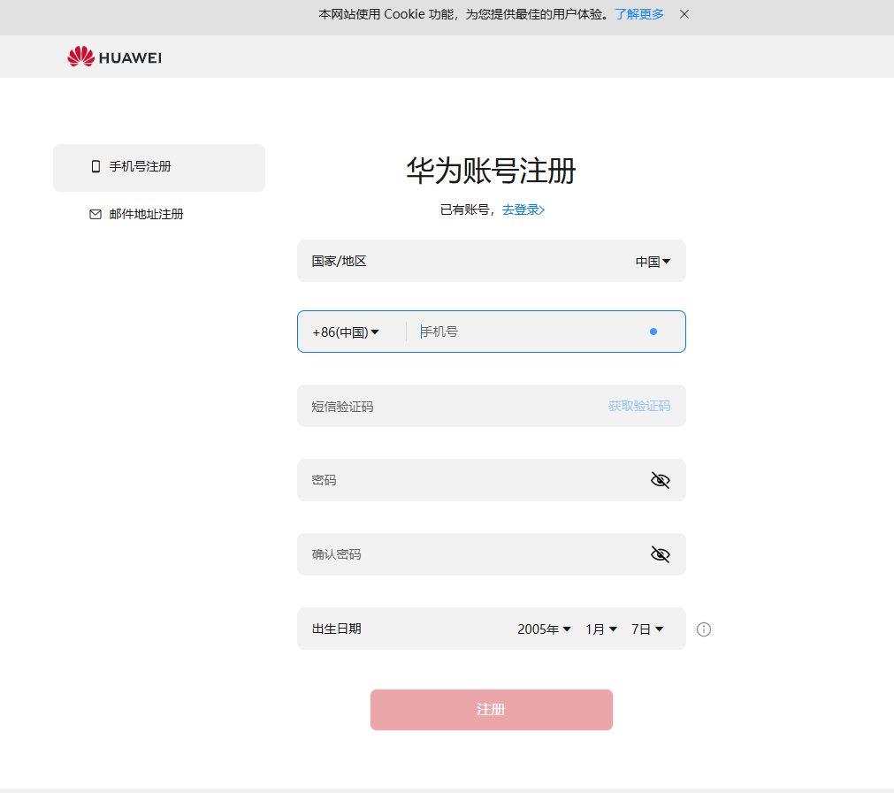

# 华为账号

## 简介

华为账户是访问所有华为服务的唯一用户账号，用以帮助您更好地使用华为应用、服务、网站或其他非华为服务，在登录的不同设备上享受统一快捷的账号服务体验，广告主注册华为账号后才能在鲸鸿动能投放平台进行一系列操作和服务。

## 华为账号注册步骤

1. 登录鲸鸿动能官网```https://ads.huawei.com（建议您使用Chrome浏览`器`）`，单击页面右上角“立即开始”。

   
2. 进入华为账号注册界面，可选择手机号注册或者邮箱地址注册方式，按照要求填写相关信息进行注册。

   

注：若您的手机号此前已经注册过华为账号，输入验证码之后将会弹出“此号码已被注册，请登录”弹窗。

更多详情可参考：[华为账号常见问题](https://id1.cloud.huawei.com/AMW/portal/faq/zh-cn_faq.html?version=china&regionCode=cn&lang=zh-cn&reqClientType=90&loginChannel=90000300&clientID=101476933)
