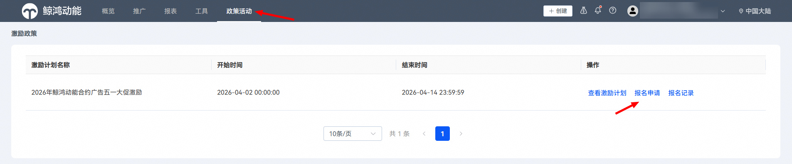
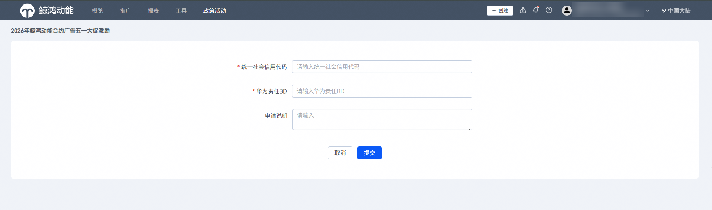

# 2026年鲸鸿动能合约广告五一营销大促激励政策

<strong>政策周期：</strong>2026.4.15-2026.5.5

<strong>面向对象：</strong>FSD-N1&FSD-N2服务商下的合约投放客户。

<strong>参与条件：</strong>2026年五一营销节点期间，针对客户现金消耗部分存在增量。

<strong>报名方式：</strong>子客页面-政策活动，选择【2026年鲸鸿动能合约广告五一大促激励】，进行报名 。

注意点：

①一个客户（即一个社会信用代码），只需要报名一次（系统会校验是否重复）。

②若社会信用代码填错，可以联系对应运营和销售，申请驳回；或重新提交一条报名申请。

<strong>报名截止时间：</strong>2026.4.14

<strong>互斥政策：</strong>综合各项激励政策总体合约刊例下单折扣不低于2折。

激励内容：

|  |  |  |  |  |
| --- | --- | --- | --- | --- |
| <strong>激励名称</strong> | <strong>激励类型</strong> | <strong>计算基数</strong> | <strong>采买模式</strong> | <strong>激励细则</strong> |
| 合约广告五一营销大促激励 | 资源赠送 | 同比25年同期现金消耗增量部分 | 合约 | 赠送大促期合约下单现金消耗增量部分等额刊例价的标准刊例资源，赠送资源限定仅能适用于华为自有广告媒体资源消耗。 |

注：仅限鲸鸿动能DSP，综合DSP和直客DSP不适用本激励。

激励发放形式和使用：

|  |  |  |  |
| --- | --- | --- | --- |
| <strong>合约投放</strong> | <strong>通知形式</strong> | <strong>发放周期</strong> | <strong>有效期</strong> |
| 合约零元下单 | 站内信 | 次 | 激励申请审批通过后120天，非大促时间段（618、双十一）使用。 |

结算方式：

1. 账单和激励金额数据以鲸鸿动能数据为准。
2. 如发现不符合激励条件的情况，鲸鸿动能将对数据进行复核，并仅在符合激励条件的范围内发放激励，金额以复核调整后的为准。激励发放后，如果客户有异议，可以通过服务商发邮件向鲸鸿动能反馈问题，鲸鸿动能进行数据复核。
3. 如涉及数据差异的，数据差异在鲸鸿动能数据的10%以内时，以鲸鸿动能数据为准；如差异超过10%，请于五个工作日内发正式邮件反馈数据差异排查，双方友好协商一致确认最终数据；如未及时反馈，视为确认以鲸鸿动能数据为准。

补充说明：

1. 适用政策期间，推广产品及相关推广投放应保持合法合规运营，不得出现违反法律法规或侵犯第三方合法权益的情形，否则鲸鸿动能有权取消推广产品的政策适用资格并采取相关处罚措施。
2. 服务商、客户享受鲸鸿动能提供的返利金等权益，需以其账户处于有效且可操作状态为前提。因广告主或服务商相关账户注销等账户状态异常情形，致使鲸鸿动能客观上无法向其账户成功充值返利金或发放其他权益的，由此产生的返利金等无法发放的后果，由服务商或客户自行承担，并视为其默认放弃该等权益，鲸鸿动能将不再进行发放操作。
3. 异常作弊、违规操作、恶意修改预算/出价、利用系统漏洞、滥用系统机制、可疑或非法交易等不当行为不可享受激励。经鲸鸿动能合理判定服务商或客户存在前述行为的，鲸鸿动能有权拒绝发放激励并追回已发放的激励，并采取相应处罚措施，由此造成的损失或赔偿责任由服务商或客户承担。
4. 如因产品功能、计算错误、系统错误等任何原因导致激励超额发放、重复发放或错误发放，一经发现，鲸鸿动能有权追回多发部分或按核实后的应发激励调整发放。
5. 对于应追回的激励金额，鲸鸿动能可按以下方式扣除或追缴：（1）从下期激励中扣除；（2）从鲸鸿动能尚未向服务商或客户支付的各种激励、费用、分成、代收款等款项中直接扣除；（3）从服务商或客户在华为平台的其他激励、账户或待结算款项中扣除；（4）采取其他可行的方式要求服务商或客户在30个工作日内退回、支付或赔偿。
6. 如对本政策有任何疑问，请联系鲸鸿动能。
