# 经理账户

## 功能简介

同一公司使用多个账户进行广告投放时，希望能够对多个账户统一管理。通过给广告账户绑定经理账户，您可以在登录经理账户后方便的在各个广告账户之间切换登录并进行数据查看等操作，同时可通过经理账户实现跨账户共享广告资产。

 

经理账户的权限开通需要分别由鲸鸿动能广告和应用市场应用推广分别管理，如您的直客账户推广权限同时开通了鲸鸿动能广告和应用市场应用推广推广范围，请分别联系相关运营开通。

以下内容仅介绍鲸鸿动能广告经理账户内容，应用市场应用推广经理账户详情请参考：[应用市场应用推广经理账户](/docs/monetize/promotion/bp-start-guestteam-admin-0000001526225136)申请

具体功能如下：

| 功能 | 功能介绍 |
| --- | --- |
| 账户切换 | 支持多个账户免登录一键切换 |
| 数据汇总 | 支持多个账户效果数据、财务数据汇总 |
| 财务转账 | 绑定账户之间支持转账 |
| 资产共享 | 支持经理账户下的所有关联账户的自定义人群包、商品库、落地页互相共享 |

## 开户指引

### 概述

您可以为经理账户申请一个新的华为账号或者使用已有的华为账号注册鲸鸿动能广告平台的经理账户，已经注册过鲸鸿动能广告账户（包括直客广告、服务商、L服务商、子客）的华为账号不能用于注册鲸鸿动能广告经理账户。

### 注册流程

### 注册步骤

1. 单击[经理账户注册链接](https://ads.huawei.com/usermgtportal/html/index.html#/managerAccount/SignUp)，使用手机号或邮件地址按界面提示进行注册。

   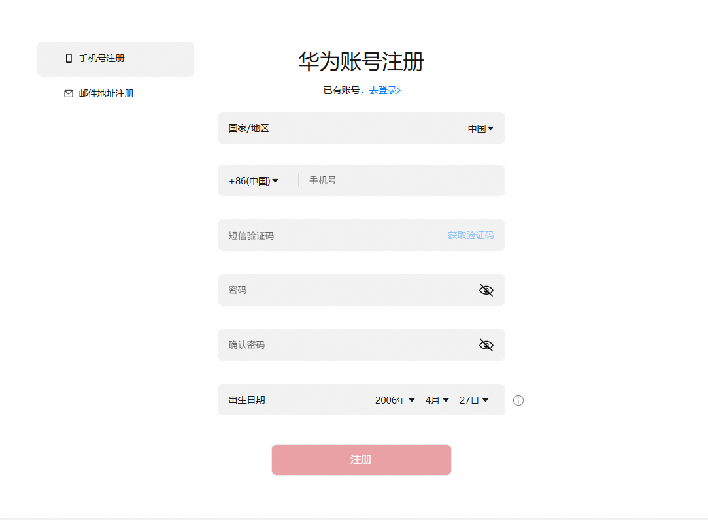
2. 填写经理账户信息，并上传资质。

   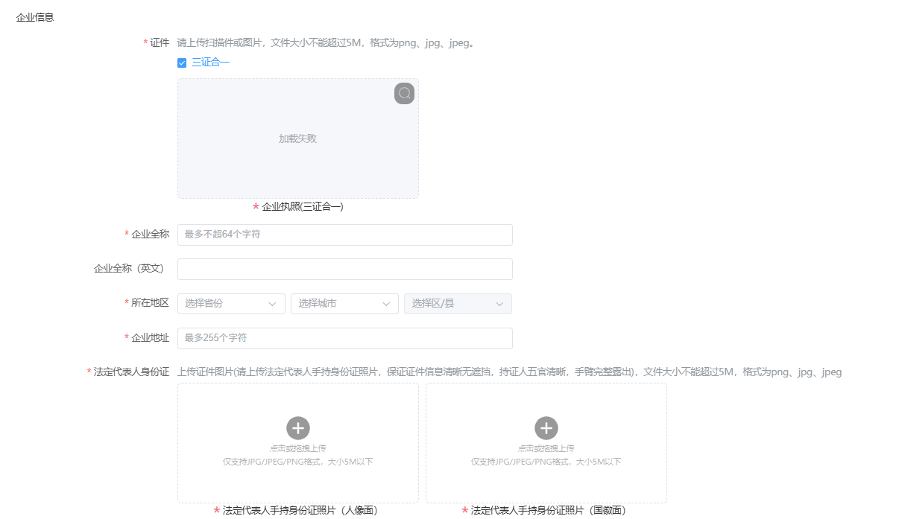

   企业信息：

   - 企业全称：请确保与营业执照上的企业名称保持一致。
   - 企业全称（英文）：请填写您的企业英文名称，若无可不写。
   - 所在地区：请填写与营业执照一致的省份和城市。
   - 企业地址：详细地址信息请按照您营业执照上的注册地址填写，两者不一致可能导致账户注册失败。
   - 证件：上传企业营业执照、税务登记和组织结构代码的扫描件或图片，也可三证合一。
   - 法定代表人身份证：上传法定代表人身份证正面和反面的扫描件或图片。

   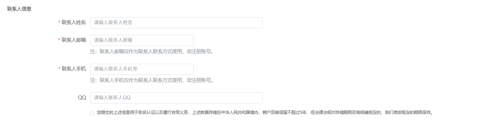

   联系人信息

   - 联系人姓名：请输入联系人姓名。
   - 联系人邮箱：请输入联系人邮箱，仅作为联系人联系方式使用，非注册账号。
   - 联系人手机：请输入联系手机号，仅作为联系人联系方式使用，非注册账号。
   - QQ：请输入联系人QQ。
3. 信息补充完成后单击提交，系统将会进行审核，经理账户开户审核结果将以邮件形式通知。

## 首页

### 关联广告账户

<strong>操作流程</strong>

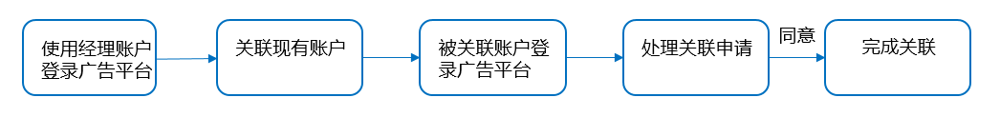

1. 使用审核通过的经理账户，登录广告平台：&lt;https://ads.huawei.com/&gt;，进入经理账户首页。

   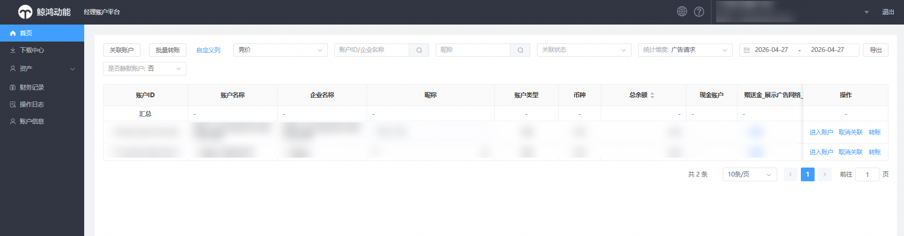
2. 在经理账户首页，单击“关联账户”，可通过输入账户ID，关联现有的广告账户。

   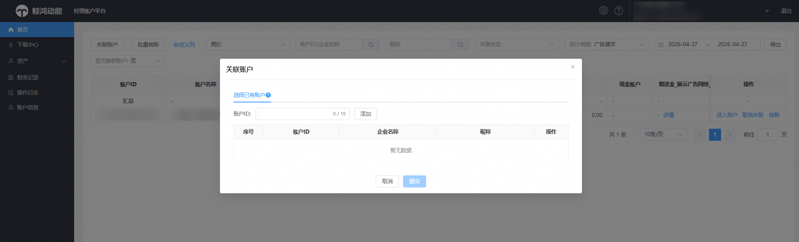
3. 登录被关联的广告账户处理关联请求。在“工具”-&gt;“广告账号管理”中，单击“处理”并“同意”，即完成关联。

   
4. 关联成功后即可对已关联账户进行“进入账户”、“取消关联”、“转账”等管理操作。

 

- 经理账户下仅能关联同一账户类型（子客/直客）的广告账户。
- 1个广告账户只能关联1个经理账户。

### 切换广告账户

在经理账户界面或投放平台首页，单击账户右上角“”，即可看到关联的经理账户和其他广告账户，单击名称可进行自由切换。

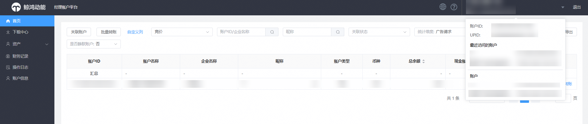

 

<strong>为保障平台内投放环境的有序性，从 2024 年 8 月 12 日起，小艺建议竞价版位（包括首页促活和非首页促活）将升级为按投放期间实际产生的点击数据结算进行扣费处理，当账户余额不足时，超投部分会记入欠费金额进行延迟扣费，待账户充值后系统自动扣除欠费金额。</strong>

可在经理账户首页账户列表中的“总余额”列，查看到该经理账户下的关联账户是否存在欠费金额，当关联账户有欠费时才会展示欠费金额。

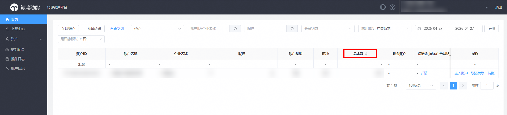

### 转账功能

<strong>方式一：指定账户转账</strong>

1. 选择您要转账的广告账户，单击操作栏中的“转账”，进入转账页面。

   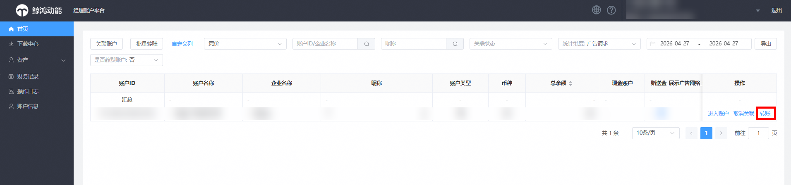
2. 确认转入账户信息，输入转出账户ID、转出方式、转出金额。

   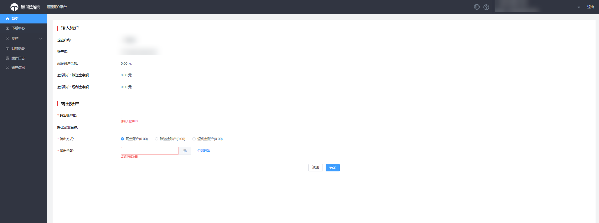

   - 现金账户：现金是广告主实际充值的金额。
   - 返利金：鲸鸿动能根据线下合同约定的消耗返利政策，给与服务商的消耗返利金额。
   - 赠送金：鲸鸿动能赠送给广告主的可消耗金额，一般由活动或其他特殊场景产生。赠送金又分为通用和华为自有媒体两个类别。

   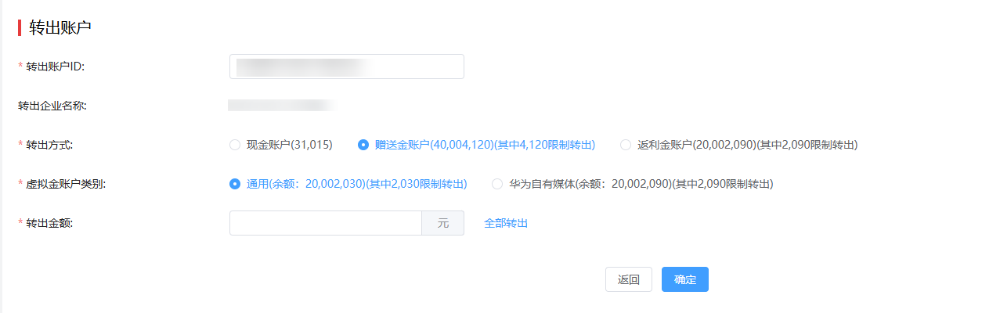

    

   1.当您选择转出方式为“赠送金账户”时，如果您账户的赠送金中有部分订单显示 “其中XX限制转出”。此时您输入的“转出金额”应小于等于“总余额-限制转出余额”；若选择“全部转出”，在“转出金额”输入框将会显示目前可转出的全部余额，方便您一键全部余额。

   2.如果您的“返利金账户”中有部分订单为 “限制转出”订单，其使用逻辑同“赠送金账户”。

   3.绑定了经理账户的子客账户之间可以进行互相转账，暂时不支持直客账户之间互转。

   4.经理账户关联直客账户之后，直客账户之间转账校验相同企业主体之间才允许转账。
3. 单击确定，转账完成实时到账，转账通知支持通过站内信通知。

<strong>方式二：批量转账</strong>

1. 进入首页，单击“批量转账”，进入转账页面。

   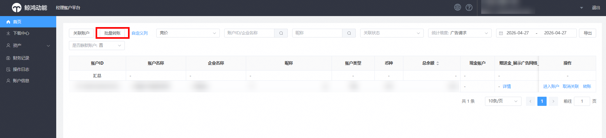
2. 选择转出账户：在批量转账的页面<strong>，</strong>依次填写转出的账户ID（必须是已关联账户），转出方式（分为现金账户、赠送金账户、返利金账户），虚拟金账户类别。

   注意：若转出方式填写现金账户，则无需填写虚拟金账户类别；若转出方式填写了赠送金账户或者虚拟金账户，则需要填写虚拟金账户类别。

   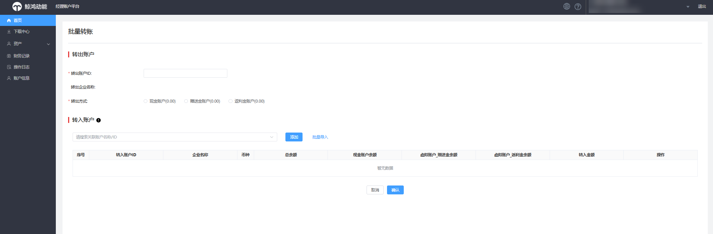

   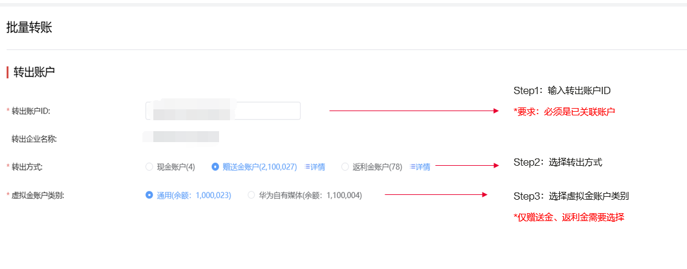
3. 添加转入账户：在批量转账的页面，有两种添加转入账户的方式，分别是搜索框添加（最多可添加10个已关联账户）和批量导入（最多可添加10个已关联账户，并且需要通过校验才可完成）。

   方式1：搜索框添加

   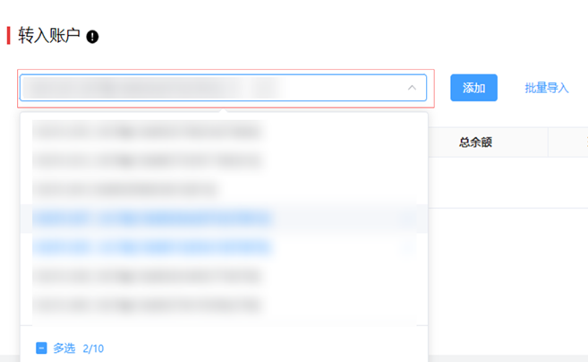

   方式2：批量导入

   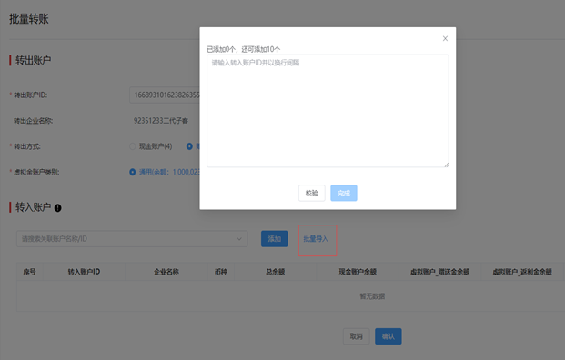
4. 完成添加转入账户的步骤后，页面会显示已添加的账户的基础信息，可支持删除已添加账户的功能。

   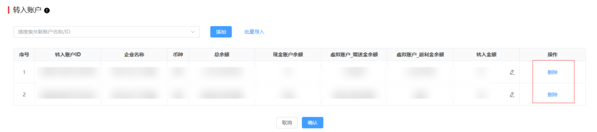
5. 填写转入金额：在输入框内依次输入转入金额，点击“确认”后，会出现一次弹框确认提示，再次点击“确认”后，会收到转账结果的弹框提示（如下图），点击“我知道了”，最终自动跳转至“转账记录”，至此流程结束。

   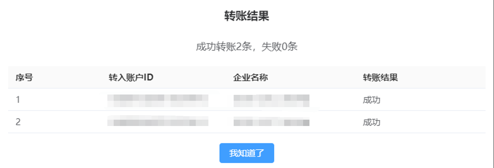

   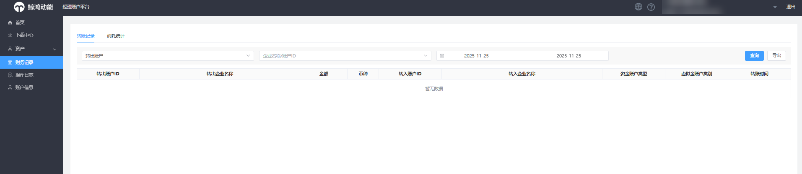

 

1.当您选择转出方式为“赠送金账户”时，如果您账户的赠送金中有部分订单显示 “其中XX限制转出”。此时您输入的“转出金额”应小于等于“总余额-限制转出余额”；若选择“全部转出”，在“转出金额”输入框将会显示目前可转出的全部余额，方便您一键全部余额。

2.如果您的“返利金账户”中有部分订单为 “限制转出”订单，其使用逻辑同“赠送金账户”。

3.绑定了经理账户的子客账户之间可以进行互相转账，暂时不支持直客账户之间互转。

## 下载中心

您可通过下载中心对导出数据所生成的下载任务进行集中管理，通过筛选来源、文件名和导出状态等条件查看首页清单、转账记录和消耗统计等数据。

注：列表展示历史生成的导出文件数据记录且从创建时间起默认保留7天历史数据。

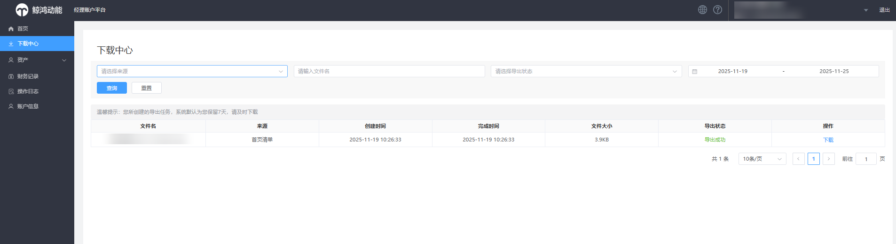

## 资产

您可通过经理账户把关联账户下的自定义人群包、商品库、维纳斯落地页、自动规则共享给其他关联广告账户使用。

### 自定义人群包

- 您可通过经理账户共享自定义人群包，页面内展示已关联账户下创建的所有人群包。您可以在人群包列表中查看到人群名称、来源、覆盖人数、创建时间等信息。

1. 从左侧导航栏“资产”-&gt;"自定义人群包”进入广告主自定义人群包管理页面。

   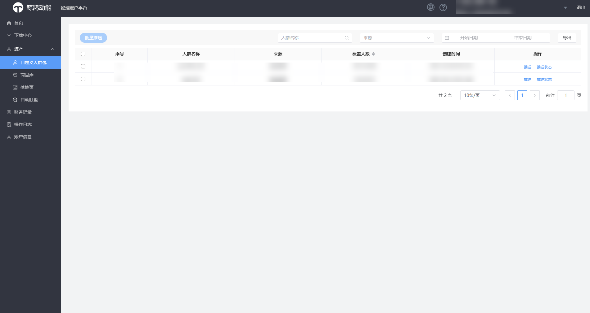
2. 选择需要共享的人群包，单击“推送”；或勾选多个人群包，单击“批量推送”，配置人群包共享给哪个账户使用。共享范围页面左侧为本次可选择共享的广告账户，选择添加至右侧列表中，添加完成后单击提交。

   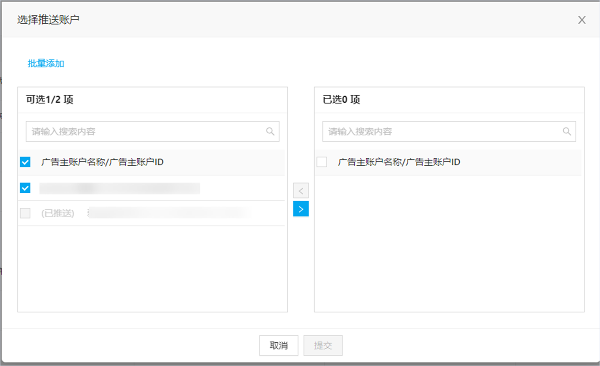
3. 提交后可在人群包列表，单击“推送状态”，查看该人群包是否成功共享给其他账户。

   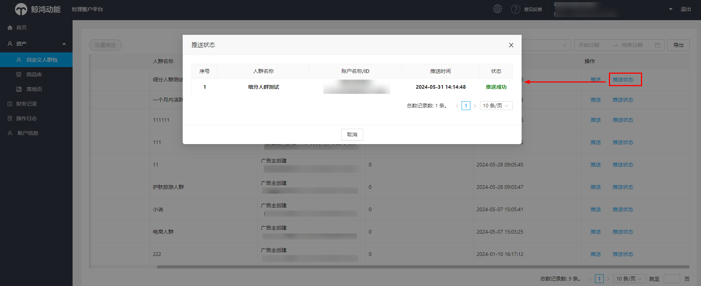

### 商品库

- 您可通过经理账户共享商品库，页面内展示已关联账户下创建的所有商品库。单击商品库名称进入商品库信息页面，可查看商品库基本信息与和数据源配置信息。
  - 您可通过广告主账户ID搜索某一个账户下的商品库。
  - 您可输入商品库名称/ID搜索商品库，或通过商品库类型筛选商品库。

1. 从左侧导航栏“资产” -&gt;<strong>“</strong>商品库<strong>”</strong>进入商品库管理页面。

   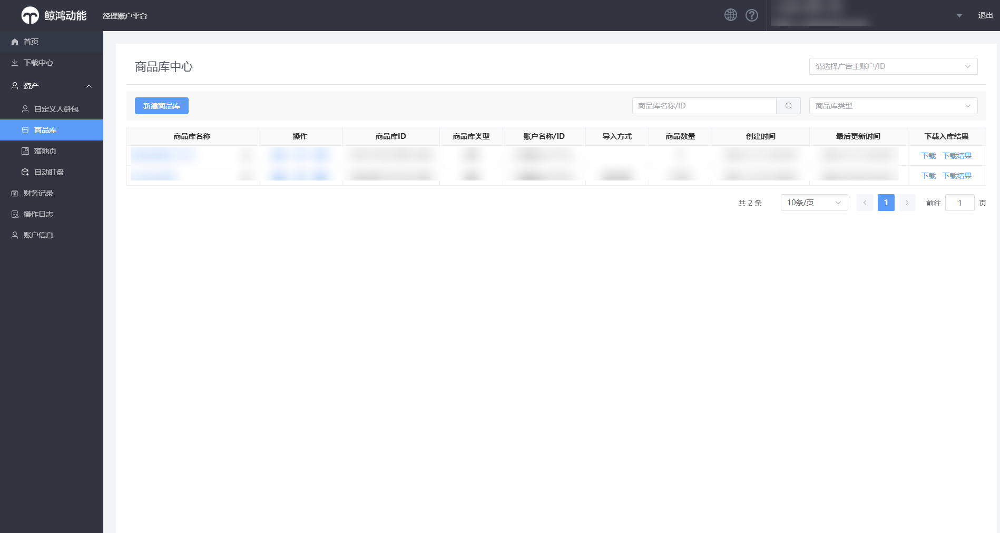
2. 选择需要共享的商品库，单击“共享<strong>”</strong>，在左侧选择框内选择需要共享的账户，可把该商品库共享给该经理账户下其他已开通DPA权限的账户。页面左侧为本次可选择共享的广告账户，选择添加至右侧列表中，提交后即完成共享，可在被共享账户中看到该商品库。

   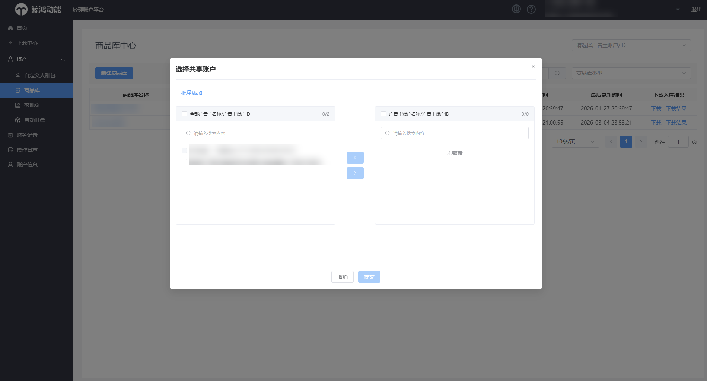
3. 您可通过经理账户新建商品库。单击“新建商品库”，选择新商品库要绑定的广告账户，后续商品库新建流程与普通账户在投放端创建商品库的流程一致。新创建商品库在经理账户和所绑定账户的商品库列表页同步展示。

   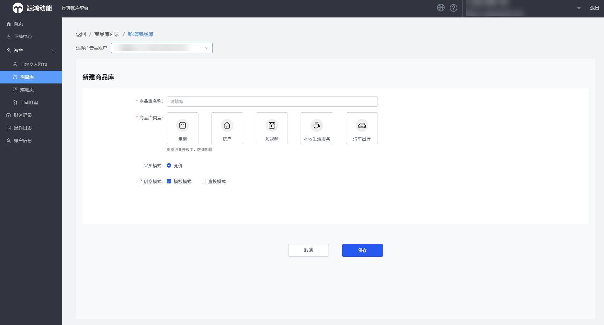
4. 新建完成后，您可在经理账户中对商品库进行管理。

   （1）单击“编辑”，进入商品库编辑页面，可修改基本信息与数据源配置信息；修改后商品库owner账户、接收共享账户同步修改；经理账户与所属账户可编辑商品库，共享账户不支持修改。

   （2）单击“删除”，即在经理账户中删除该商品库，同时会在共享账户的商品库列表中同步删除该商品库；当商品库有投放任务时，不支持删除。

   （3）单击“下载入库结果”，您可以Excel格式下载该商品库的商品入库结果。

   （4）在操作日志页面可查看商品库新建、共享等历史操作。

### 落地页

- 您可通过经理账户共享维纳斯落地页，页面内展示已关联账户下创建的所有维纳斯落地页，支持落地页直接预览、手机扫码预览以及复制链接打开。

1. 从左侧导航栏“资产”-&gt;"落地页”进入落地页管理页面。

   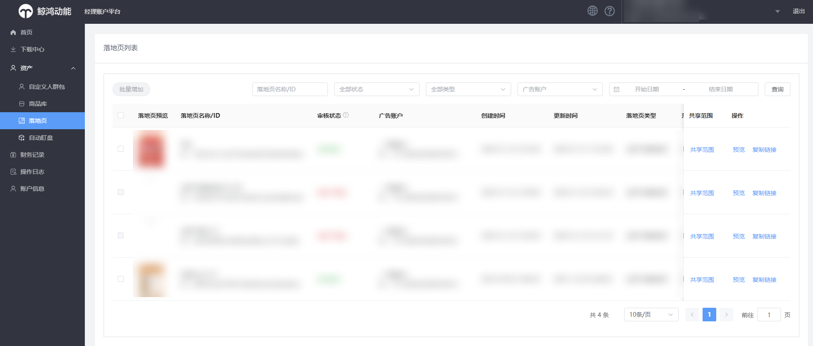
2. 选择需要共享的落地页，单击“共享范围”；或勾选多个落地页，单击“批量增加”，配置落地页共享给哪个账户使用。共享范围页面左侧为本次可选择共享的广告账户，选择添加至右侧列表中，提交后即完成共享，可在被共享账户中看到该落地页。

   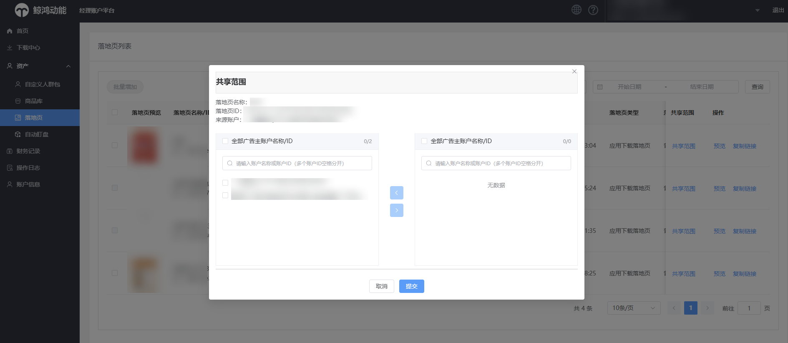

    

   （1）可共享落地页范围包含审核通过、更新审核通过、更新审核不通过的落地页。

   （2）当前仅支持应用推广类落地页共享。

   （3）单次最多选中20个落地页进行批量共享。

   （4）可选择的共享账户个数和经理账户可关联账户个数一致。

   （5）被共享账户不支持修改共享落地页，仅支持在创建落地页的账户中修改，如有需要可在被共享账户中复制落地页后新建修改。

   （6）引用账户修改落地页后，被共享账户中的落地页会自动同步更新。
3. 被共享的账户在投放平台-&gt;创意上传页面可直接使用共享的落地页创建任务投放。

   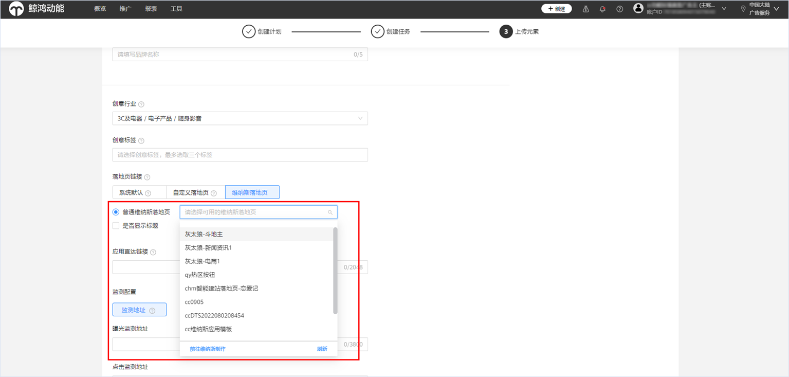
4. 使用共享的落地页投放后，您可在“落地页工具”-&gt;“数据分析”中查看到落地页的投放数据。落地页数据按照使用者账户进行详情数据区分统计，如账户A创建了落地页1，共享落地页1至账户B用于投放，那么账户A中看到的落地页数据仅为账户A投放的数据，账户B看到的为账户B投放的数据。

   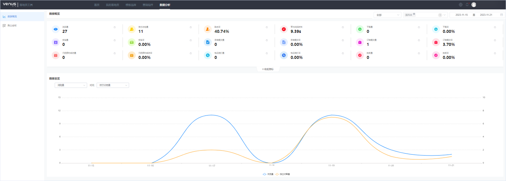

### 自动盯盘

您可以通过资产页面单击“自动盯盘”，把相应的知道你盯盘规则共享到关联账户。盯盘规则共享到其他关联账户后，被共享账户无需二次确认。您可以选择单条或者多条进行批量共享、

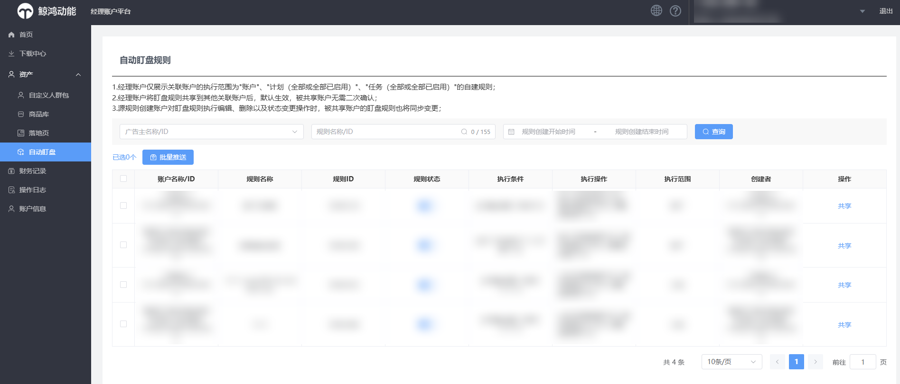

单击“共享”，共享范围页面左侧为本次可选择共享的广告账户，选择添加至右侧列表中，提交后即完成共享。

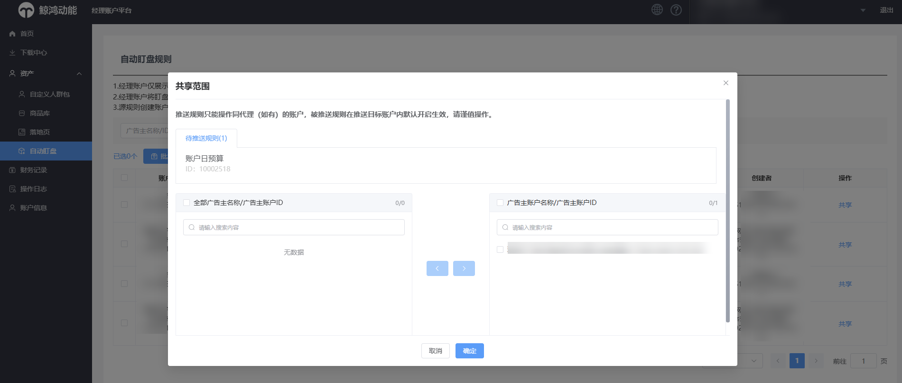

 

1.经理账户：仅拥有规则的批量共享权限，无法对规则内容进行编辑或删除；

2.被共享账户：对收到的共享规则仅支持查看，且已被共享的规则不支持调整其执行范围;

3.变更同步：若经理账户对源规则进行了修改或删除，所有被共享账户的对应规则将自动同步更新。

## 财务记录

经理账户平台支持查看财务记录，包括“转账记录”和“消耗统计”两部分。

- 转账记录：您可查看转入和转出的转账记录，并且进行数据导出，导出方式支持<strong>直接导出</strong> <strong>与</strong> <strong>异步导出</strong> <strong>两种模式。</strong>您可根据数据量灵活选择，当数据量少于5000条时使用<strong>直接导出</strong>以快速获取；当处理超出5000条数据时，请选用<strong>异步导出</strong>，有效避免任务超时。导出成功后可在下载中心统一查看并下载结果，全面保障数据调取的效率。

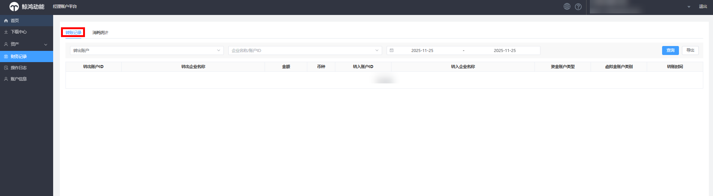

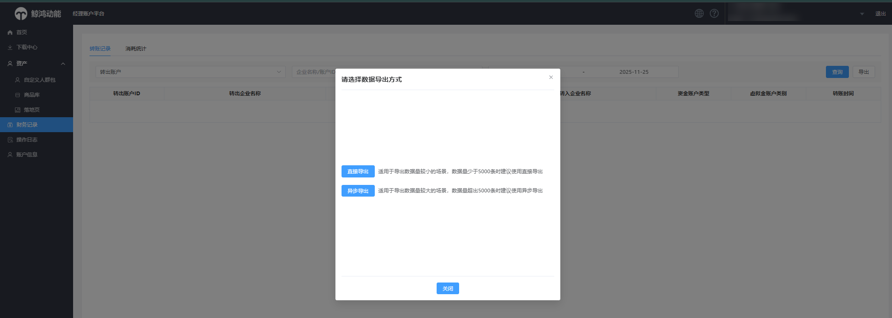

- 消耗统计：您可查看管理的广告账户消耗，包括竞价资源消耗和应用推广资源消耗，导出方式支持<strong>直接导出</strong> <strong>与</strong> <strong>异步导出</strong> <strong>两种模式。</strong>您可根据数据量灵活选择，当数据量少于5000条时使用<strong>直接导出</strong>以快速获取；当处理超出5000条数据时，请选用<strong>异步导出</strong>，有效避免任务超时。导出成功后可在下载中心统一查看并下载结果，全面保障数据调取的效率。

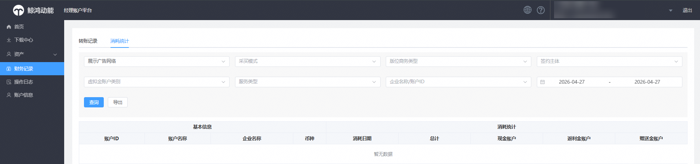

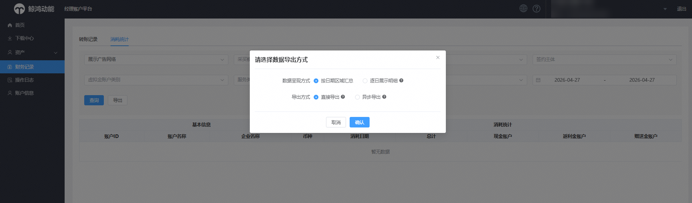

## 操作日志

经理账户中的操作日志可以查看到<strong>谁</strong>在哪个广告账户做了哪些动作及变更项。包含操作对象、操作者、操作内容以及变更项等内容。

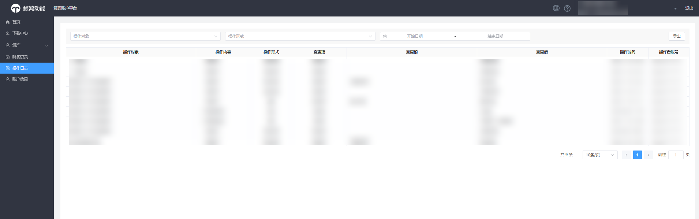

## 账户信息

单击首页左侧“账户信息”，您可查看、编辑企业信息与联系人信息。

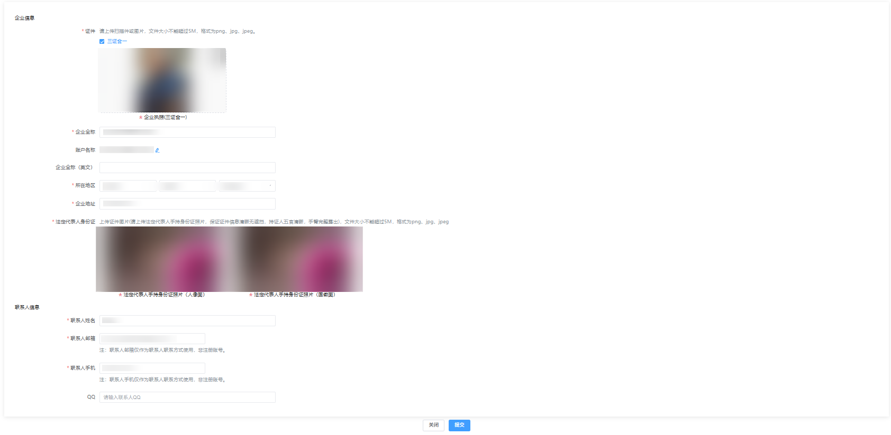
