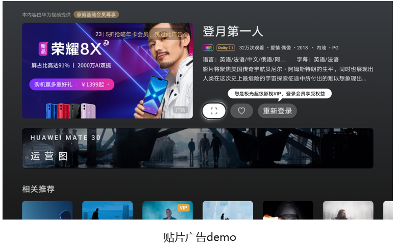
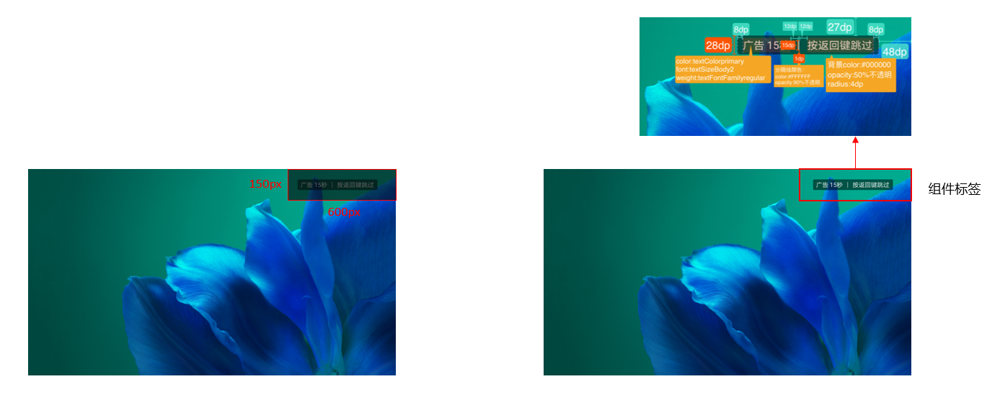
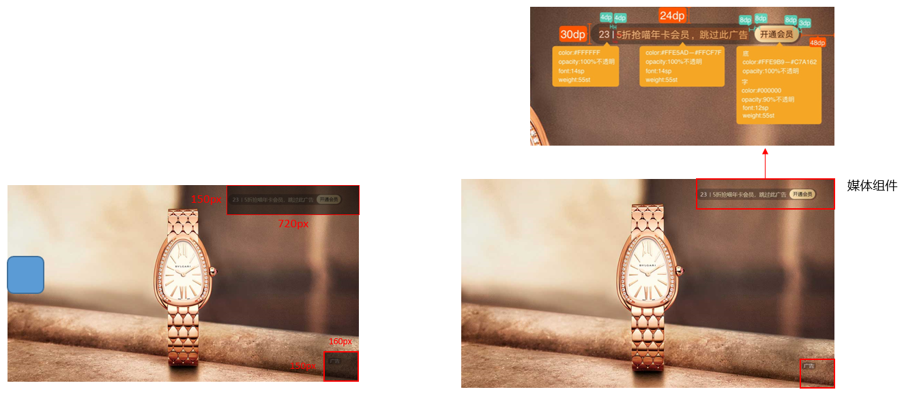

# 智慧屏开机

<strong>智慧屏广告设计规范</strong>

<strong>视频格式</strong>

大屏开机

尺寸：1920\*1080px，1280\*720px

格式：mp4 大小：&lt;=15M

时长：15s

帧率：&gt;=24帧/s

视频扫描方式：逐行扫描

大屏贴片

尺寸：1920\*1080px，1280\*720px

格式：mp4

大小：&lt;=10M

时长：15S/ 30S

帧率：&gt;=24帧/s

视频扫描方式：逐行扫描

<strong>开机广告</strong> <strong>\_layout</strong>

<strong>主内容安全区</strong>

标识占位：右上

阴影区域面积600\*150px

关键信息（logo/文字信息）不得位于阴影区域

贴片广告\_layout

<strong>主内容安全区</strong>

标识占位：右上

阴影区域面积720\*150px

关键信息（logo/文字信息）不得位于阴影区域

<strong>通用规范</strong>

<strong>一.版权</strong>

确保设计用图的版权、人物肖像权、字体版权

<strong>二.元素内容</strong>

1.广告必须符合国家相关的法律标准,内容与品牌宣传相关、不得出现虚假广告；

2.动态视频不支持PPT效果、图片轮播，上下滚动截图，gif图等方式;

3.不支持没有经过前期严格分镜头设计的生活随拍;

4.不支持录屏样式的素材；

5.不支持效果前后对比类的设计;

6.不允许出现影视片段节选内容；

7.允许出现企业二维码/微信号/电话号码，二维码的高/宽度不得超过200px（不得出现个人二维码/微信号/电话号码）；

8.不允许出现股票代码，销量数据等；

9.不允许出现引导按钮

<strong>三.字体</strong>

1.识别性，保证文字结构清晰可识别，减少使用草书；

2.使用数量，设计作品内不超过2种字体样式；

3.文字不得过度设计，如添加描边/光效闪烁/流光

<strong>四.色调</strong>

1.不使用强对比、互补等视觉刺激强烈、干扰信息传递的配色；

2.色彩应用合理、富有层次感、清晰、明亮，画面要有明确的主色调

<strong>视频内容规范</strong>

<strong>画面</strong>

1.使用合理的视频素材表达完整、生动的内容，传达产品的特色

2.视频需画质清晰，不得抖动模糊，镜头角度舒适

3.视频画面比例需符合规范，不得出现压扁变形拉长、比例失调、界面不完整

4.视频不得出现马赛克、缺乏修饰的图片

5.背景色不得为透明色

6.画面不得出现促销价格类标签

7.不允许出现模拟弹窗/红包卡券类元素

8.不允许出现加速变速非常规视频内容

9.不允许出现产品与背景元素无设计，融合度不高(内容元素强硬植入纯色背景中)

10.不得出现文字过小不清晰、每帧文字面积占比不得超过视频面积的三分之一

11.不允许出现视频教程类，解说类内容；镜头特写，人物对话时长不得超过5s

12.不允许出现半图片，半视频的样式设计

<strong>音频</strong>

a.广告视频音乐需清晰且符合场景调性，音量大小合理。

b.广告视频声音不得出现声音加速，突兀的声音。

<strong>优秀素材案例</strong>

详情可参考[《优质素材案例》](https://alliance-communityfile-drcn.dbankcdn.com/FileServer/getFile/cmtyPub/011/111/111/0000000000011111111.20260529160227.83475987105879287530980949117827:20260531100740:2800:09F663518A8A7DD876F7B41D51B048A360BDCAEEE1E98EE7D54960EDE84D9252.zip?needInitFileName=true)

<strong>审核不通过</strong>案例

详情可参考[《审核不通过》](https://alliance-communityfile-drcn.dbankcdn.com/FileServer/getFile/cmtyPub/011/111/111/0000000000011111111.20260529160227.67646665604198196400387954435265:20260531100740:2800:40FF32B985B1FC10D8390E63EB770BA314FA188C54921274A948B56D1FB2AFBE.zip?needInitFileName=true)
