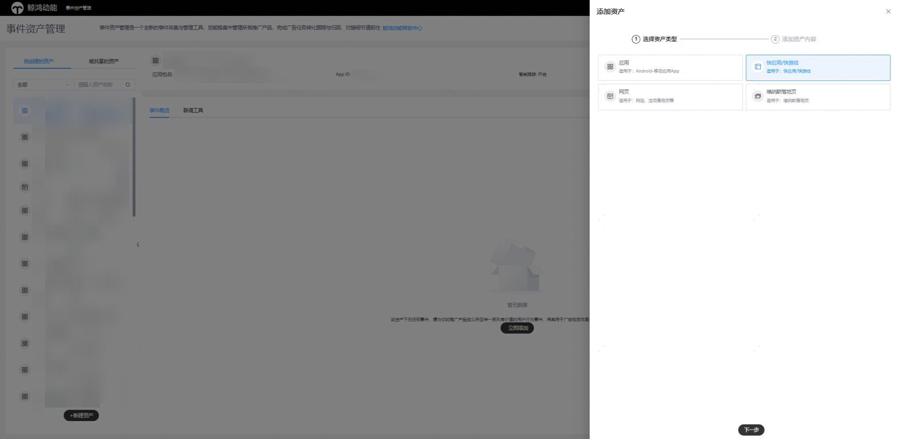
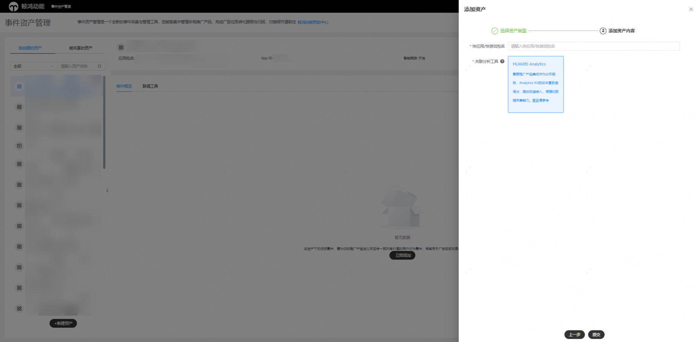
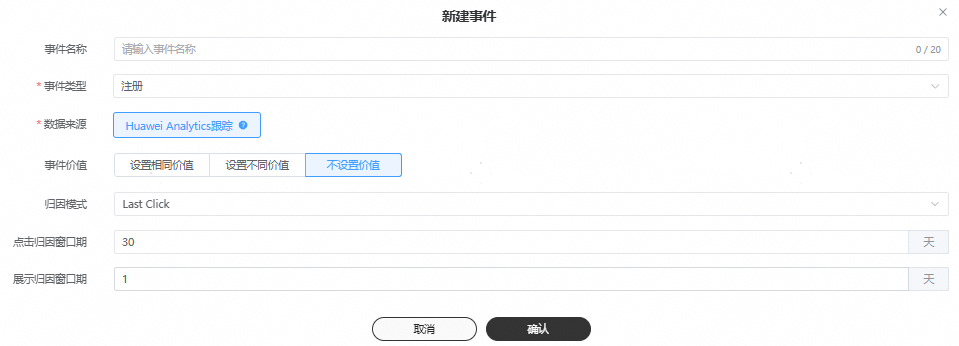
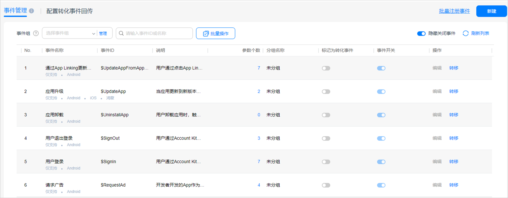
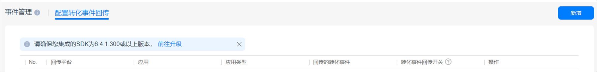
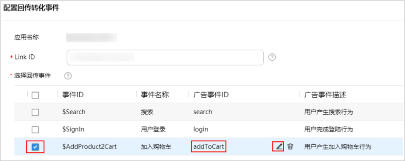

# Huawei Analytics跟踪

## 概述

您可以将快应用/快游戏通过华为分析的接口，将数据回传给鲸鸿动能广告平台，实现广告效果的监测，帮助您实现广告优化。

## 操作流程

## 操作步骤

1. 集成华为分析SDK。

   请确保已集成Analytics Kit 6.3.2.300或以上版本，集成方法请参见[集成SDK](https://developer.huawei.com/consumer/cn/doc/development/HMSCore-Guides/quickapp-integrating-sdk-0000001090944199)。
2. 在鲸鸿动能广告平台新建资产并完成关联操作。

   需要为您希望跟踪的每一个快应用/快游戏使用指定的监测工具（Huawei Analytics）。

   
   1. 在鲸鸿动能广告平台新建关联：单击"工具”-&gt;“事件资产管理”-&gt;”新建资产”。
   2. 推广产品：选择“快应用/快游戏”。
   3. 分析工具提供商：选择“Huawei Analytics”。
   4. 快应用/快游戏包名：填写您要跟踪的快应用包名，例如：com.huawei.appmarket。
   5. 单击提交后，在<strong>已有关联</strong>列表中单击“”查看秘钥并单击“”，保存备用。
3. 在鲸鸿动能广告平台新建转化事件。

   对每一个您希望回传和统计的转化事件，需要都在此创建事件，只有成功添加的转化，鲸鸿动能广告平台在收到转化数据后才会统计到报表里。

   1. 单击“工具”-&gt;”事件资产管理”,选择具体"快应用/快游戏”-&gt;”新建事件"并单击“继续”。
   2. 设置事件信息。

      
      - <strong>事件名称：</strong>设置一个清晰易懂的计划名称，转化名称仅用于转化列表管理且唯一，例如：应用+转化类别，设置完成后转化名称可编辑修改
      - <strong>事件类型：</strong>指的是您可以跟踪的转化动作，支持多选，详情可参考[数据指标](https://developer.huawei.com/consumer/cn/doc/promotion/tracking-shu-0000001139892541#ZH-CN_TOPIC_0000001139892541__table10838115914391)。
      - <strong>点击归因窗口期：</strong>点击归因时间7-30天（默认30天），指的是广告点击发生后，最长可以在多长时间内统计转化次数。初始归因时间为默认值，归因时间支持编辑，提交后不可修改。
4. 在华为分析配置转化事件回传鲸鸿动能广告平台。

   如果您希望在鲸鸿动能广告报表中查看您想要的转化数据，您需要使用您广告账户的华为账号登录[AppGallery Connect](https://developer.huawei.com/consumer/cn/service/josp/agc/index.html#)，配置转化事件回传到鲸鸿动能广告平台。
   1. 上报广告标识符开关默认关闭，如果您的数据处理地为“德国”，需要开启“上报广告标识符”开关。
      1. 如果您还未开通分析服务，在AppGallery Connect首页最底部，找到“华为分析”，进入“项目概览”，单击“启动分析服务”，将“上报广告标识符”开关设置为开启状态。

         
      2. 如果您已经开通过分析服务，但是您未开启上报广告标识开关，您可以选择“华为分析 ”-&gt;“ 管理” -&gt;”分析设置”，进入分析设置页面，将“上报广告标识符”开关设置为开启状态。

         
   2. 标记转化事件。

      选择“华为分析 ”-&gt;“管理”-&gt;“事件管理”进入事件管理页面。在“事件管理”页签中，将想要回传的事件标记为转化事件。

      
   3. 打开转化事件回传开关。

      选择“配置转化事件回传”页签，页面展示当前项目下所有的快应用。单击需要配置的应用所在行的“转化事件回传开关”，开启该应用下转化事件回传功能。

      
   4. 配置回传转化事件。
      1. 选择“配置转化事件回传”页签。
      2. 单击操作列需要配置的应用中的“配置回传转化事件”链接，弹出配置回传转化事件页面。
      3. 配置回传转化事件相关信息。
         - 应用名称：当前选择的应用名，不可修改。
         - Link ID：填写从 鲸鸿动能广告平台获得的[秘钥](https://developer.huawei.com/consumer/cn/doc/promotion/tracking-quick-app-0000001246071189#ZH-CN_TOPIC_0000001246071189__zh-cn_topic_0000001198167202_zh-cn_topic_0000001092895300_li477911392113)，Link ID填入后需要一个小时进行生效。
         - 选择回传事件：展示该应用下所有的转化事件列表，以及对应的广告事件ID和描述。勾选需要回传至鲸鸿动能广告平台的事件前面的复选框，如$AddProduct2Cart，单击“”，选择对应的广告事件ID。

           
      4. 单击“确定”，完成配置。
5. 在鲸鸿动能广告平台创建任务。

   当鲸鸿动能广告平台收到您的分析工具回传的转化数据后，转化事件会自动激活。
6. 在鲸鸿动能广告平台[查看转化数据](https://developer.huawei.com/consumer/cn/doc/promotion/tracking-shu-0000001139892541)。

   如果您在鲸鸿动能广告平台没有看到相应的转化数据，您需要检查应用跟踪回传配置是否正确。
