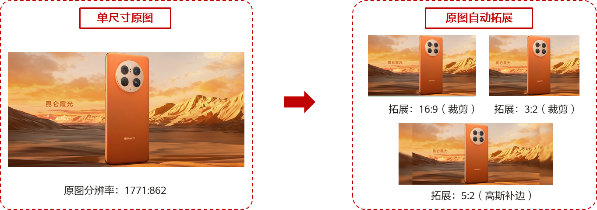
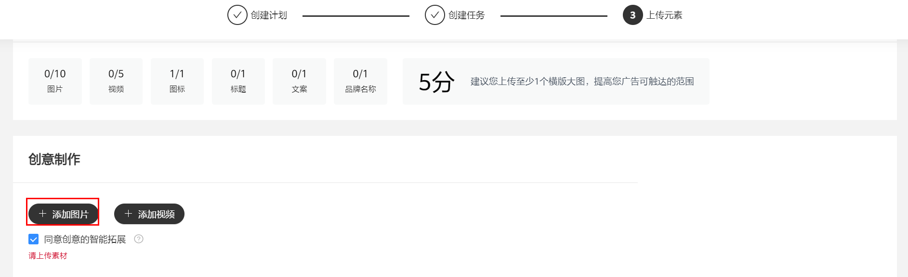
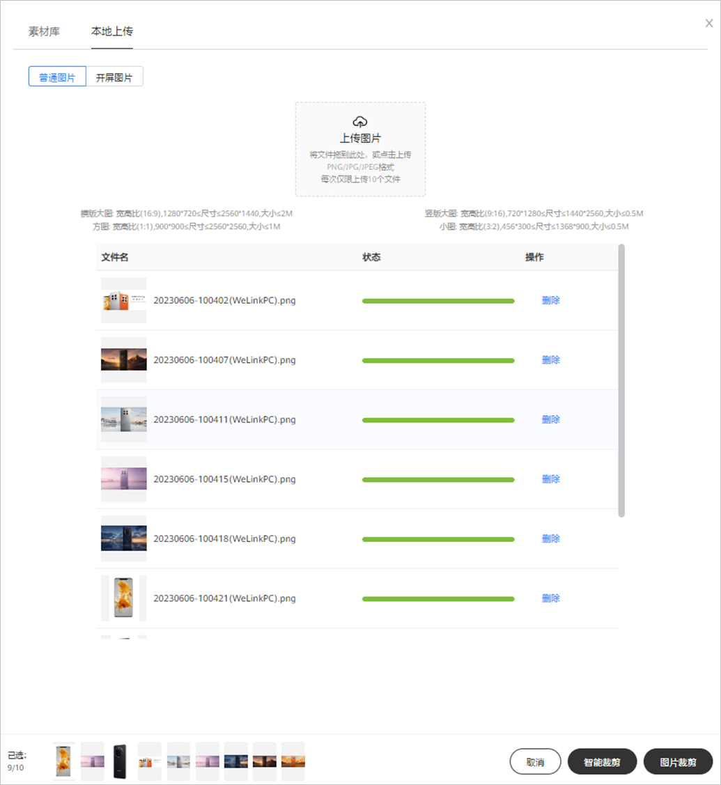
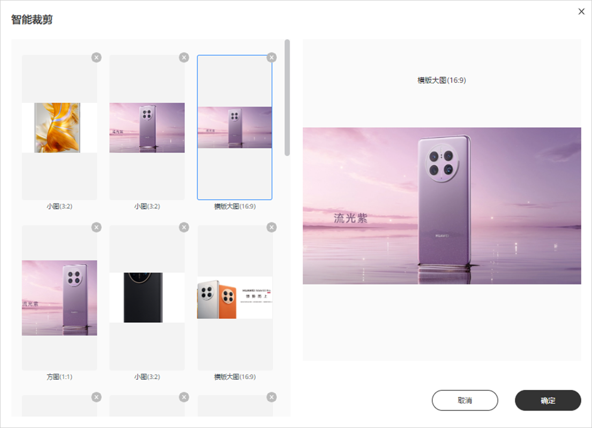
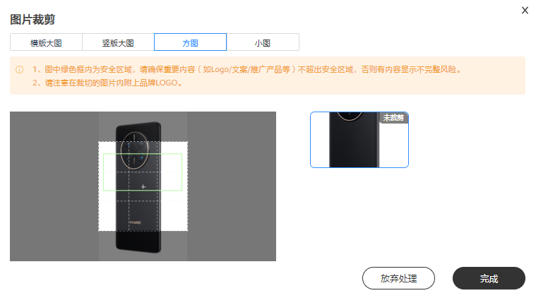
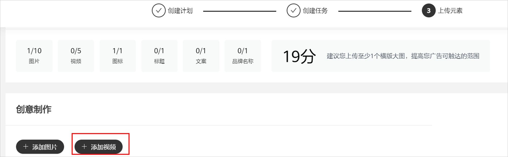
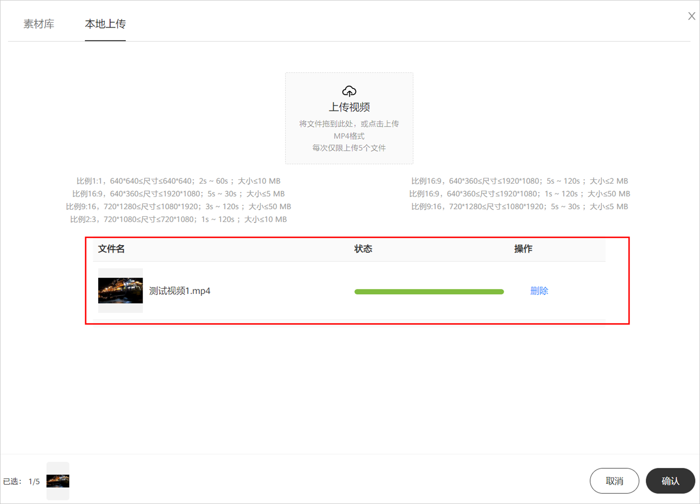
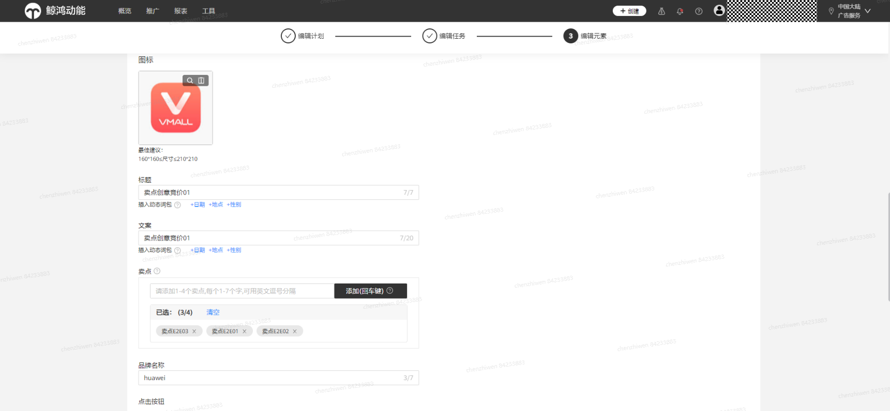

# 上传广告元素

## 概述

全新的创意上传界面，支持批量上传、创意智能裁剪、创意智能拓展、创意修改标题和名称；仅需上传创意元素，系统会根据您上传的创意元素计算广告效力。广告效力：用来衡量您的广告的多样性。在添加素材资源时，您可以参考广告效力，丰富广告样式及相关性，提高您的转化效果。您可基于广告效力优化创意元素。

预览广告创意：创意制作页面右侧支持所有创意智能预览；此处显示的预览效果仅为示例，并不包含所有可能展示的广告样式。

创意智能拓展：系统支持创意智能拓展，创意智能拓展是在您上传的原素材基础上，系统基于模板自动生成新创意的能力，增加创意多样性，有助于提升任务曝光和消耗，在成本不上升的前提可以增量50%~300%+，因此建议您打开该功能（数据来源：华为业务数据统计，2023年7月，仅供参考）。

## 操作步骤

1. 单击“<strong>+</strong>添加图片”（根据投放需求选择），可直接从素材库中选择图片，也可本地批量上传。

   

   - 【图片】支持上传多种不同尺寸的图片，图片最多可选择10张作为创意投放：

   1）横版大图: 宽高比(16:9),1280\*720&lt;=尺寸&lt;=2560\*1440,大小&lt;=2M。

   2）竖版大图:

   宽高比(9:16),720\*1280&lt;=尺寸&lt;=1440\*2560,大小&lt;=0.5M。

   宽高比(3:4),720\*960&lt;=尺寸&lt;=1440\*1920,大小&lt;=0.5M。

   3）方图: 宽高比(1:1),900\*900&lt;=尺寸&lt;=2560\*2560,大小&lt;=1M。

   4）小图: 宽高比(3:2),456\*300&lt;=尺寸&lt;=1368\*900,大小&lt;=0.5M。

   5）开屏横版大图: 宽高比(16:9),1280\*720&lt;=尺寸&lt;=2560\*1440,大小&lt;=2M。

   6）开屏竖版大图: 宽高比(9:16),720\*1280&lt;=尺寸&lt;=1440\*2560,大小&lt;=0.5M。

   7）横幅: 宽高比(19:3),1080\*170&lt;=尺寸&lt;=2160\*340,大小&lt;=1M。

    

   宽高比（3:4）竖版大图需要选择“信息流资讯“或”智能优选”版位。

   - 本地批量上传：区分普通图片与开屏图片，支持一次选择10个图片文件上传，支持上传多种不同尺寸的图片；图片上传页面可预览图片与查看上传进度。

     1
   - 图片素材库：区分普通图片与开屏图片；普通图片支持筛选标准图，如横版大图、竖版大图、方图与小图；同时支持一次选择10张图片。
   - 创意智能裁剪：基于算法的智能裁剪功能，帮您智能裁剪成符合美学与适合投放的素材。当您本地上传的图片满足智能裁剪需求时，就会出现智能裁剪按钮。单击“智能裁剪”系统裁剪完成后可预览裁剪后的图片，自主决定是否使用裁剪结果图片。使用点“确定”，不使用点“取消”按钮。

     
   - 手动裁剪：图片比例与平台要求不一致时您也可手动裁剪图片，支持根据横版大图、竖版大图、方图、小图比例裁剪，裁剪框支持等比例缩小放大，同时支持拖动裁剪框位置；方图及开屏图片显示绿色安全框，要确保重要内容（如Logo/文案/推广产品等）不超出安全区域，否则有内容显示不完整风险。

     
2. 单击“<strong>+</strong>添加视频”（根据投放需求选择），可直接从素材库中选择视频，也可本地批量上传。

   

   - 【视频】支持上传多个不同比例尺寸的视频，MP4格式，最多可选择5个；同时支持智能生成视频封面，并支持自定义更改。

   1）比例1:1，640\*640&lt;=尺寸&lt;=640\*640；2s ~ 60s ；大小&lt;=10 MB。

   2）比例16:9，640\*360&lt;=尺寸&lt;=1920\*1080；5s ~ 120s ；大小&lt;=2 MB。

   3）比例16:9，640\*360&lt;=尺寸&lt;=1920\*1080；5s ~ 30s ；大小&lt;=5 MB。

   4）比例16:9，640\*360&lt;=尺寸&lt;=1920\*1080；1s ~ 120s ；大小&lt;=50 MB。

   5）比例9:16，720\*1280&lt;=尺寸&lt;=1080\*1920；3s ~ 120s ；大小&lt;=50 MB。

   6）比例9:16，720\*1280&lt;=尺寸&lt;=1080\*1920；5s ~ 30s ；大小&lt;=5 MB。

   7）比例2:3，720\*1080&lt;=尺寸&lt;=720\*1080；1s ~ 120s ；大小&lt;=10 MB。

   8）比例2:3，640\*960&lt;=尺寸&lt;=1080\*1620；5s ~ 30s ；大小&lt;=5 MB。

   - 本地批量上传视频：支持一次选择5个MP4文件上传，支持上传多种不同尺寸的视频；图片上传页面可预览图片与查看上传进度。
   - 在上传元素界面本地上传视频封面时，如视频封面图片与视频比例不符，您可按照视频比例对封面图片进行手动裁剪。
3. 填写<strong>“</strong>标题<strong>”</strong>与“广告文案<strong>”</strong>，支持添加<strong>动态词包</strong>功能，可以实现智能替换广告文案，广告展现千人千面，提高点击率。

    

   当前支持以下类型动态词包，更多智能文案创意正在筹备中。

   地点：支持精确到市级别动态替换，如市级定位偏差则用省级代替。

   日期：支持X月X日形式替换当前日期。

   性别：支持男生、女生替换
4. 填写“卖点”，您可以通过添加卖点可直观地展示推广产品的特点和优势信息，辅助提升转化效果。

   每个卖点支持输入1-7个字（不建议输入低于4个），以英文逗号分隔，支持回车键快捷添加，展示当前已选的卖点数量，支持删除和清空已添加的卖点，具体见下图：

   
5. 填写“品牌名称”。
6. 设置“创意行业”以及“创意标签”。您所选择的标签将用于广告推荐，请按实际情况填写；若您选择的标签与实际情况不符，系统将无法精准推荐。
7. 设置<strong>“</strong>落地页链接”，可使用自定义落地页或维纳斯落地页。

    

   Webview在安全方面加入了以下限制：禁止使用Dom存储即localStorage、混合内容和非法证书，请您注意。
8. 设置“应用直达链接”（可选，投放App时可填写）。用户单击后可直接跳转至应用内的落地页，支持拼接宏变量 \_\_HWCID\_\_，\_\_HWPPSLOGID\_\_，\_\_PRODUCTID\_\_，例如xxx\_\_HWCID\_\_xxx，xxx\_\_HWPPSLOGID\_\_xxx，xxx\_\_PRODUCTID\_\_xxx，我们会将真实创意ID、日志ID、商品ID替换在此处。
9. 设置“监测地址”（可选）。“第三方监测”相关功能请参见：广告优化-&gt;[第三方监测](https://developer.huawei.com/consumer/cn/doc/promotion/ads_sanfangjiance-0000001055414456)。
10. 设置“元素组名称”。
11. <strong>单击</strong> <strong>提交</strong>，一条完整的广告创建完成。
