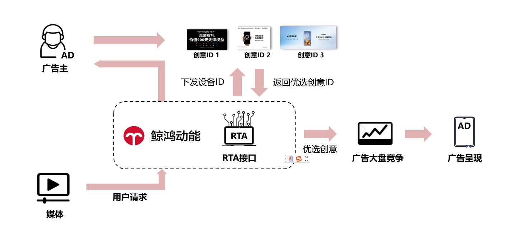
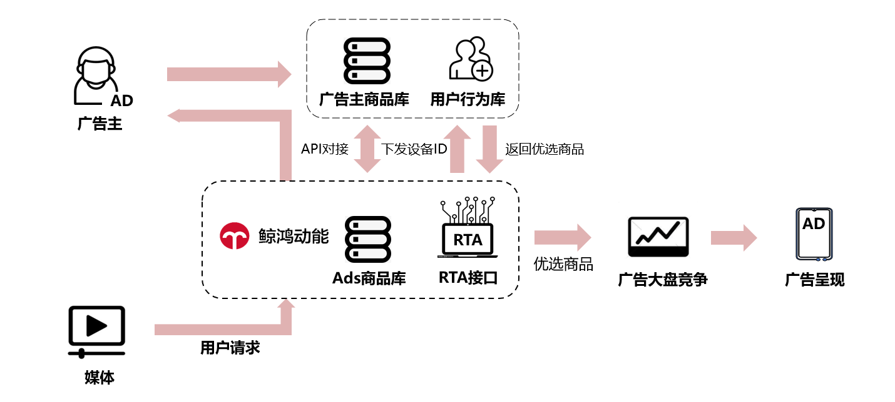
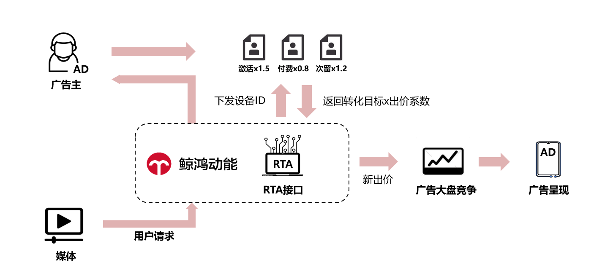

# 功能介绍

## RTA策略能力预览

| <strong>鲸鸿动能</strong> <strong>——RTA</strong> <strong>策略能力</strong> | | | | |
| --- | --- | --- | --- | --- |
| <strong>序号</strong> | <strong>RTA</strong> <strong>类型</strong> | <strong>RTA</strong> <strong>策略</strong> | <strong>策略描述</strong> | <strong>是否支持</strong> <strong>oCPX</strong> <strong>出价类型</strong> |
| 1 | 一次请求 | 基础挑量 | 广告主可决定是否参竞当次请求 | √ |
| 2 | 创意推荐 | 在参竞前提下，广告主可指定该账户下的创意ID进行参竞； | √ |
| 3 | 商品推荐 | 在参竞前提下，广告主可指定该账户下的商品库ID和商品ID进行参竞； | √ |
| 4 | 修改出价 | 在参竞前提下，广告主可直接修改出价进行参竞； | X |
| 5 | 调整出价系数 | 在参竞前提下，广告主可按照不同转化目标类型，返回出价系数进行参竞； | √ |
| 6 | 二次请求 | 以创意挑量 | 以创意维度进行挑量 | √ |
| 7 | 以商品挑量 | 以商品维度进行挑量 | √ |

## RTA策略场景一：创意推荐

基于广告主侧数据，判断用户对于APP的兴趣点优选素材，提高用户CVR及后端转化。

## RTA策略场景二：商品推荐DPA

基于广告主侧数据，判断用户对于APP的兴趣点优选素材，提高用户CVR及后端转化。

## RTA策略场景三：调整出价系数

基于广告主侧数据，判断用户对于APP的兴趣点优选素材，提高用户CVR及后端转化。

