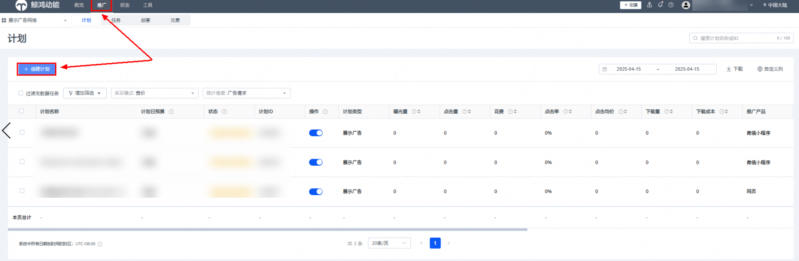
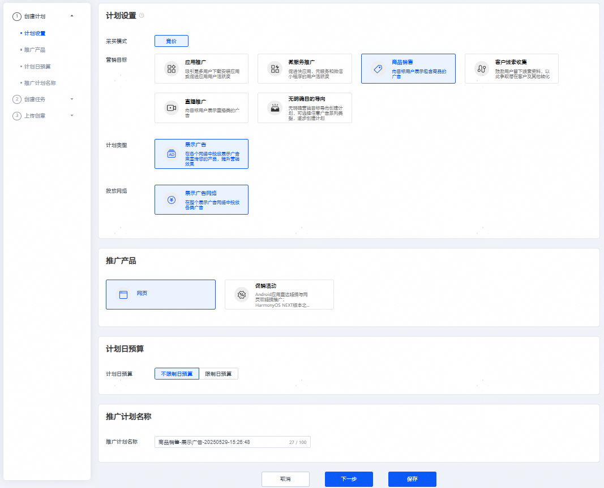
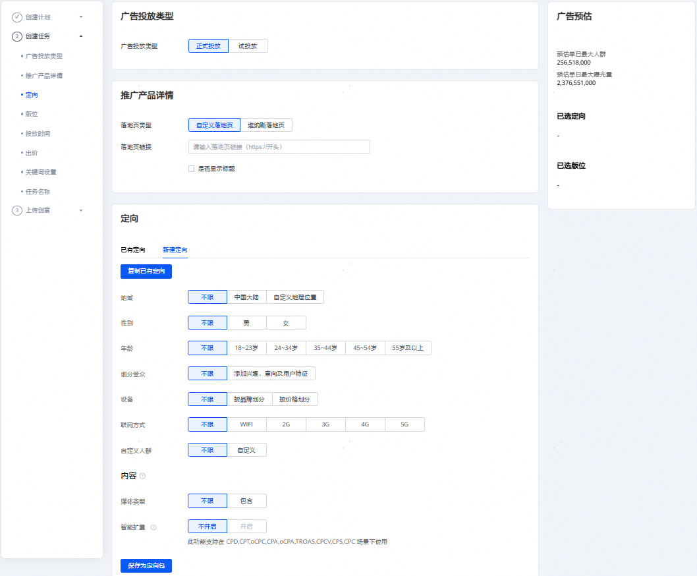
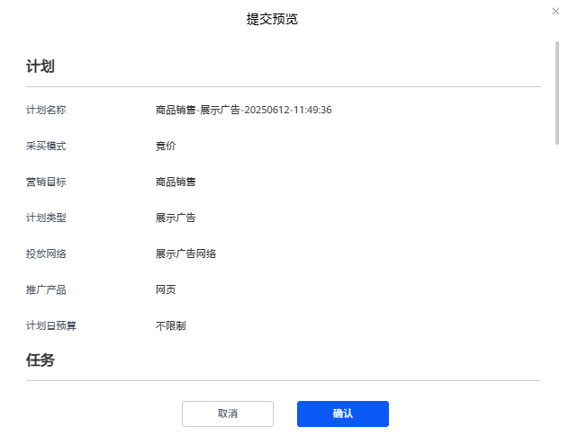

# 网页推广

## 概述

如果您希望推广自己的零售商品，可以在展示广告网络上投放商品广告来增加流量，触达更多优质潜在用户。

## 操作步骤

1. 创建广告计划。

   方式一：可以在投放端概览页面，单击红框任一“创建”按钮，选择“创建计划”。

   

   方式二：也可以单击“推广”按钮进入推广页面，然后选择“创建计划”。

   

   

   - <strong>营销目标：</strong>选择“商品销售”，详情参考[营销目标](/docs/monetize/promotion/ads_toufang01-0000001057732432#ZH-CN_TOPIC_0000001057732432__zh-cn_topic_0000001205953939_zh-cn_topic_0000001105216776_li07111843183611)。
   - <strong>计划类型：</strong>选择“展示广告”，详情参考[计划类型](/docs/monetize/promotion/ads_toufang01-0000001057732432#ZH-CN_TOPIC_0000001057732432__zh-cn_topic_0000001205953939_zh-cn_topic_0000001105216776_li234211653411)。
   - <strong>投放网络：</strong>选择<strong>“</strong>展示广告网络”，详情参考[投放网络](/docs/monetize/promotion/ads_toufang01-0000001057732432#ZH-CN_TOPIC_0000001057732432__zh-cn_topic_0000001205953939_zh-cn_topic_0000001105216776_li93421166342)<strong>。</strong>
   - <strong>推广产品：</strong>选择“网页”，详情参考[推广产品](/docs/monetize/promotion/ads_toufang01-0000001057732432#ZH-CN_TOPIC_0000001057732432__zh-cn_topic_0000001205953939_zh-cn_topic_0000001105216776_li8342416193416)<strong>。</strong>
   - <strong>计划日预算：</strong>您可以选择不限制日预算或者限制日预算，若选择“指定日预算”，则需不低于500元/天，账户日预算最多修改20次。
   - <strong>推广计划名称：</strong>详情参考[推广计划名称](/docs/monetize/promotion/ads_toufang01-0000001057732432#ZH-CN_TOPIC_0000001057732432__zh-cn_topic_0000001205953939_zh-cn_topic_0000001105216776_li1434211615342)。
2. 创建广告任务。

   

   如果您希望在已有的计划下增加新的任务，请参考[已有计划下创建任务](/docs/monetize/promotion/ads_toufang01-0000001057732432#ZH-CN_TOPIC_0000001057732432__zh-cn_topic_0000001205953939_li5851143183912)。
   - <strong>广告投放类型</strong>：选择“正式投放”。如果您希望在正式投放之前对投放进行测试，您可以创建[试投放](/docs/monetize/promotion/afs-stfgg-0000002347483153)任务。
   - <strong>推广产品详情：</strong>请填写您所需投放的网页落地页类型以及链接，您还可以选择是否展示标题。
   - <strong>定向：</strong>详情参考[定向设置](/docs/monetize/promotion/ads_dingxiang-0000001532239189)。
   - <strong>版位</strong>：支持选择通用版位或自动版位。

     
     - 通用版位：您可以自由选择在哪些展示广告网络版位上推广您的应用，您可以控制各个广告素材的组合方式和定向条件等，详情参考[版位](/docs/monetize/promotion/ads_toufang01-0000001057732432#ZH-CN_TOPIC_0000001057732432__zh-cn_topic_0000001205953939_zh-cn_topic_0000001105216776_li1776203594114)。
     - 自动版位：自动版位表示系统自动为您选择效果较佳的位置进行展示广告，您只需要添加元素，系统会根据您提供的图片、视频等素材，为您自动生成多个版位的创意。

        

       自动版位需要添加白名单，如需要开通请联系相关运营，自动版位不支持使用已有定向包功能。
   - <strong>投放日期：</strong>详情参考[投放日期](/docs/monetize/promotion/ads_toufang01-0000001057732432#ZH-CN_TOPIC_0000001057732432__zh-cn_topic_0000001205953939_li73789433254)。
   - <strong>投放时间：</strong>详情参考[投放时间](/docs/monetize/promotion/ads_toufang01-0000001057732432#ZH-CN_TOPIC_0000001057732432__zh-cn_topic_0000001205953939_li1237874310252)。
   - <strong>投放频次设置：</strong>您可以设置广告任务对用户的展示次数。例如：时长设置5，展示频次设置为10，则在5天的周期内此任务向一个用户展示不超过10次。
   - <strong>竞价目标：</strong>详情参考竞价目标。
   - <strong>设置出价</strong>：版位不同，计费方式可能不同。
   - <strong>关键词设置：</strong>不限，用户根据搜索、浏览等行为的内容关键词进行匹配。
   - <strong>任务名称：</strong>详情参考[任务名称](/docs/monetize/promotion/ads_toufang01-0000001057732432#ZH-CN_TOPIC_0000001057732432__zh-cn_topic_0000001205953939_li8378164313256)。
3. 添加广告创意。

   当您版位选择通用版位时，根据您需求可以创建元素组，最多创建10个。

   - <strong>广告效力：</strong>广告效力用来衡量您的广告的多样性。在添加素材资源时，您可以参考广告效力分数，添加更多的广告样式，广告效力分数越高，广告触达的范围就越大，建议您上传至少一个横版大图，提高您广告的可触达范围。
   - <strong>创意制作：</strong>您需要先选择创意样式及尺寸，并添加对应的创意图片或视频、设置品牌名称和描述信息等，详情参见[版位规则](https://developer.huawei.com/consumer/cn/doc/promotion/ads-bwgz-0000002505500133)。

     同意创意的智能拓展：如果您勾选了该选项，创意智能拓展会在您上传的原素材基础上，系统基于模板自动生成新创意的能力，增加创意多样性，有助于提升任务曝光和消耗。

     

     您可以通过素材库或本地上传素材，请确保您上传的图片或视频素材符合以下要求：

     - <strong>普通图片</strong>：图片类型：（图片类型：JPG, PNG, JPEG）
       - 横版大图: 宽高比(16:9)，1280\*720px&lt;=尺寸&lt;=2560\*1440px；大小&lt;=512KB
       - 竖版大图: 宽高比(2:3)，720\*1080px&lt;=尺寸&lt;=1440\*2160px；大小&lt;=1MB
       - 竖版大图: 宽高比(9:16)，720\*1280px&lt;=尺寸&lt;=1440\*2560px；大小&lt;=512KB
       - 竖版大图: 宽高比(3:4)，720\*960px&lt;=尺寸&lt;=1440\*1920px；大小&lt;=500KB
       - 方图: 宽高比(1:1)，900\*900px&lt;=尺寸&lt;=2560\*2560px；大小&lt;=1MB
       - 小图: 宽高比(3:2)，456\*300px&lt;=尺寸&lt;=1368\*900px；大小&lt;=500KB
       - 横幅: 宽高比(6.35:1)，1080\*170px&lt;=尺寸&lt;=2160\*340px；大小&lt;=1MB
     - <strong>开屏图片</strong>：图片类型：（图片类型：JPG, PNG, JPEG）
       - 横版大图: 宽高比(16:9)，1280\*720px&lt;=尺寸&lt;=2560\*1440px；大小&lt;=512KB
       - 竖版大图: 宽高比(2:3)，720\*1080px&lt;=尺寸&lt;=1440\*2160px；大小&lt;=1MB
       - 竖版大图: 宽高比(9:16)，720\*1280px&lt;=尺寸&lt;=1440\*2560px；大小&lt;=512KB
     - <strong>视频：</strong>为了保证您的广告覆盖率以及广告美观度，建议您上传的视频素材包含下表尺寸。

       视频类型：MP4

       - 比例2:3，640\*960&lt;=尺寸&lt;=1080\*1620；5s ~ 30s ；大小&lt;=5MB
       - 比例1:1，640\*640&lt;=尺寸&lt;=640\*640；2s ~ 60s ；大小&lt;=10MB
       - 比例16:9，640\*360&lt;=尺寸&lt;=1920\*1080；5s ~ 120s ；大小&lt;=2MB
       - 比例16:9，640\*360&lt;=尺寸&lt;=1920\*1080；5s ~ 30s ；大小&lt;=5MB
       - 比例16:9，640\*360&lt;=尺寸&lt;=1920\*1080；1s ~ 120s ；大小&lt;=50MB
       - 比例9:16，720\*1280&lt;=尺寸&lt;=1080\*1920；3s ~ 120s ；大小&lt;=50MB
       - 比例9:16，720\*1280&lt;=尺寸&lt;=1080\*1920；5s ~ 30s ；大小&lt;=5MB
       - 比例2:3，720\*1080&lt;=尺寸&lt;=720\*1080；1s ~ 120s ；大小&lt;=10MB
   - <strong>图标：</strong>最佳建议尺寸为160\*160&lt;=尺寸&lt;=512\*512，上传比例：1:1 JPEG/PNG/JPG/GIF不超过150KB。
   - <strong>标题：</strong>标题是最关键的广告文字信息，将与其他素材资源组合以投放广告，最多可以填写22个字。
   - <strong>文案：</strong>文案是对标题的补充，可提供更多背景信息或详情，最多可以填写24个字。
   - <strong>动态词包</strong>：动态词包支持插入以下元素，词包内的内容可以根据所投放的用户实际情况进行动态替换。

     |  |
     | --- |
     | 地点：目前仅支持精确到市级别动态替换，如市级定位偏差则用省级代替。 |
     | 日期：目前仅支持X月X日形式，替换当前日期。 |
     | 性别：目前支持男生、女生文案替换。 |

     其他更多智能文案创意正在筹备中。
   - <strong>卖点：</strong>直观在投放端展示的产品优势信息，辅助提升转化效果，可添加1-3个卖点，每个1-7个字，可用英文逗号隔开。
   - <strong>品牌名称：</strong>必填，请如实填写您所投放应用的品牌名称。
   - <strong>点击按钮：</strong>您可以根据实际情况选择您所需展示的按钮名称。
   - <strong>创意行业：</strong>您所选择的行业将用于广告推荐，请按实际情况填写；若您选择的行业与实际情况不符，系统将无法精准推荐。
   - <strong>创意标签：</strong>您所选择的标签将用于广告推荐，请按实际情况填写；若您选择的标签与实际情况不符，系统将无法精准推荐。
   - <strong>监测配置（非必填）：</strong>在广告推广过程中，通过第三方监测（需手动拼接宏参数），客户可获得由客观公正的第三方监测公司提供认证的广告数据，监测目标广告的曝光、点击等关键指标。更多详情可查看[第三方监测](https://developer.huawei.com/consumer/cn/doc/promotion/ads_sanfangjiance-0000001055414456)。
   - <strong>元素组名称：</strong>您可以编辑方便区分不同元素组的名称，如版位+序号等。
4. 提交预览，如确认无误单击确认即可完成创意创建。

   
