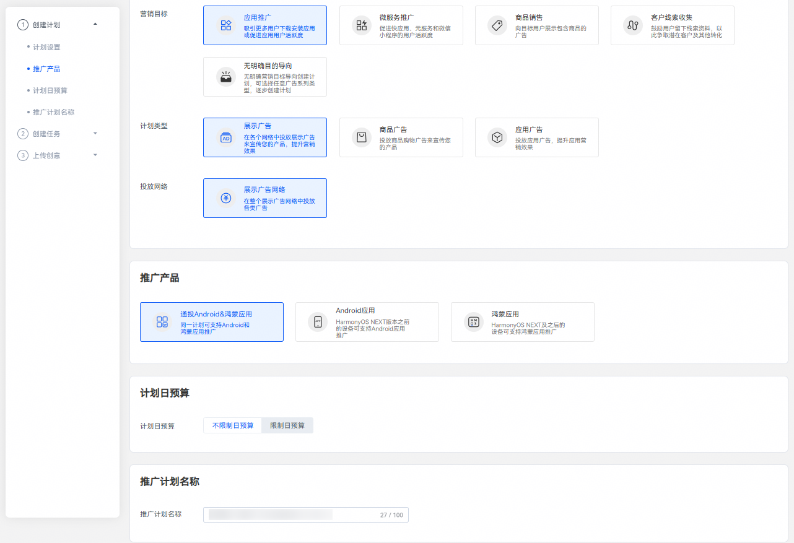
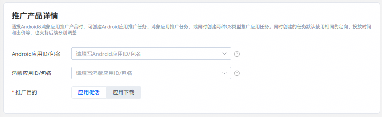
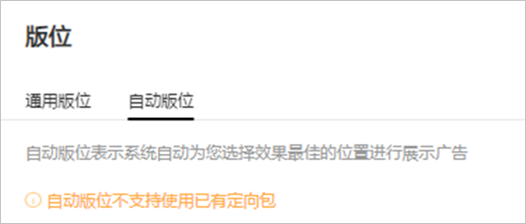
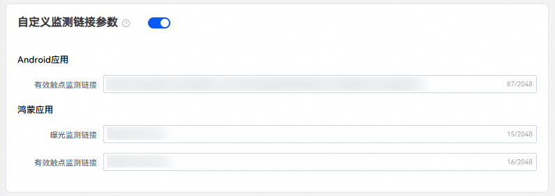
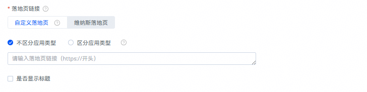
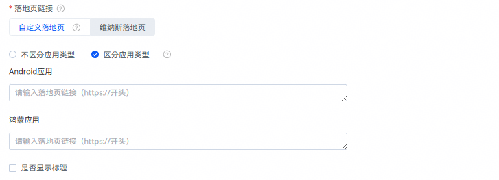
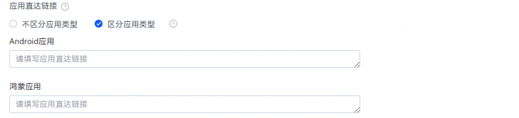
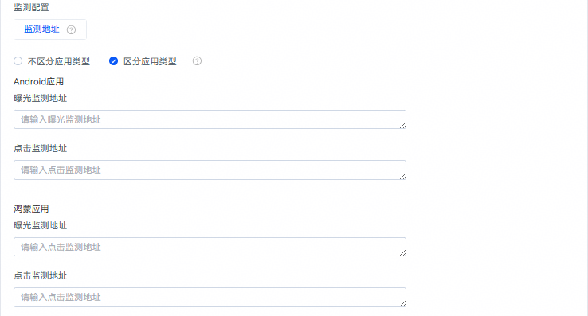
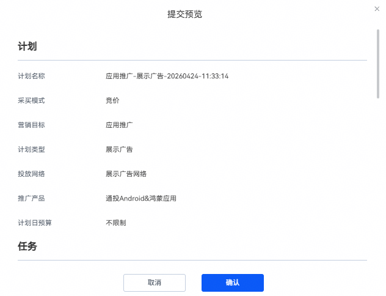

# 通投Android&鸿蒙应用

## 概述

通投Android&鸿蒙应用指的是同一广告计划内可创建 Android 应用、鸿蒙应用两种推广产品类型的任务，同时创建的任务都默认共享相同的定向设置、投放时间与出价策略。

## 操作步骤

1. 创建广告计划。

   方式一：可以在投放端概览页面，单击红框任一“创建”按钮，选择“创建计划”。

   

   方式二：也可以单击“推广”按钮进入推广页面，然后选择“创建计划”。

   

   

   - <strong>营销目标：</strong>选择“应用推广”，详情参考[营销目标](/docs/monetize/promotion/ads_toufang01-0000001057732432#ZH-CN_TOPIC_0000001057732432__zh-cn_topic_0000001205953939_zh-cn_topic_0000001105216776_li07111843183611)。
   - <strong>计划类型：</strong>选择“展示广告”，详情参考[计划类型](/docs/monetize/promotion/ads_toufang01-0000001057732432#ZH-CN_TOPIC_0000001057732432__zh-cn_topic_0000001205953939_zh-cn_topic_0000001105216776_li234211653411)。
   - <strong>投放网络：</strong>选择<strong>“</strong>展示广告网络”，详情参考[投放网络](/docs/monetize/promotion/ads_toufang01-0000001057732432#ZH-CN_TOPIC_0000001057732432__zh-cn_topic_0000001205953939_zh-cn_topic_0000001105216776_li93421166342)<strong>。</strong>
   - <strong>推广产品：</strong>选择“通投Android&鸿蒙应用”，详情参考[推广产品](/docs/monetize/promotion/ads_toufang01-0000001057732432#ZH-CN_TOPIC_0000001057732432__zh-cn_topic_0000001205953939_zh-cn_topic_0000001105216776_li8342416193416)<strong>。</strong>
   - <strong>计划日预算：</strong>您可以选择不限制日预算或者限制日预算，若选择“指定日预算”，则需不低于500元/天，账户日预算最多修改20次。
   - <strong>推广计划名称：</strong>详情参考[推广计划名称](/docs/monetize/promotion/ads_toufang01-0000001057732432#ZH-CN_TOPIC_0000001057732432__zh-cn_topic_0000001205953939_zh-cn_topic_0000001105216776_li1434211615342)。
2. 创建广告任务。

   如果您希望在已有的计划下增加新的任务，请参考[已有计划下创建任务](/docs/monetize/promotion/ads_toufang01-0000001057732432#ZH-CN_TOPIC_0000001057732432__zh-cn_topic_0000001205953939_li5851143183912)。
   - <strong>广告投放类型</strong>：选择“正式投放”（通投Android和鸿蒙应用” 任务，仅支持正式投放，不支持试投放）。
   - <strong>推广产品详情：</strong>分别填写Android应用ID/包名和鸿蒙应用ID/包名以及选择推广目的；通投Android&鸿蒙应用推广产品时，可创建Android应用推广任务、鸿蒙应用推广任务，或同时创建两种OS类型推广应用任务。同时创建的任务默认使用相同的定向、投放时间和出价等，也支持后续分别调整。

      

     Android应用ID格式：Cxxxxxxxx，请前往华为应用市场页面查看。例如：应用地址为&lt;https://appgallery.huawei.com/&gt;app/C12345678，则其ID为“C12345678”。应用包名例如：com.huawei.xxxxx。

     鸿蒙应用ID格式：Cxxxxxxxxxxxxxxxxxxx，请联系应用开发者通过AppGallery Connect平台获取鸿蒙原生应用APP ID（例如：1234567890987654321），然后加上字母“C”前缀（例如：C1234567890987654321）

     
   - <strong>定向：</strong>详情参考[定向设置](/docs/monetize/promotion/ads_dingxiang-0000001532239189)。

      

     定向设置中“APP安装”选项，如需提升应用的下载量，请选择“未安装”，如需提升应用活跃用户数，请选择“已安装”。
   - <strong>版位</strong>：支持选择通用版位或自动版位。

     
     - 通用版位：您可以自由选择在哪些展示广告网络版位上推广您的应用，您可以控制各个广告素材的组合方式和定向条件等，详情参考[版位](/docs/monetize/promotion/ads_toufang01-0000001057732432#ZH-CN_TOPIC_0000001057732432__zh-cn_topic_0000001205953939_zh-cn_topic_0000001105216776_li1776203594114)。
     - 自动版位：自动版位表示系统自动为您选择效果较佳的位置进行展示广告，您只需要添加元素，系统会根据您提供的图片、视频等素材，为您自动生成多个版位的创意。

        

       自动版位需要添加白名单，如需要开通请联系相关运营，自动版位不支持使用已有定向包功能。
   - <strong>投放日期：</strong>详情参考[投放日期](/docs/monetize/promotion/ads_toufang01-0000001057732432#ZH-CN_TOPIC_0000001057732432__zh-cn_topic_0000001205953939_li73789433254)。
   - <strong>投放时间：</strong>详情参考[投放时间](/docs/monetize/promotion/ads_toufang01-0000001057732432#ZH-CN_TOPIC_0000001057732432__zh-cn_topic_0000001205953939_li1237874310252)。
   - <strong>竞价目标：</strong>详情参考竞价目标。
   - <strong>设置出价</strong>：版位不同，计费方式可能不同。

     

      

     仅当 Android应用与鸿蒙应用对应转化类型的事件资产均已完成定义并启用，方可选中该转化目标进行出价。
   - <strong>关键词设置：</strong>不限，用户根据搜索、浏览等行为的内容关键词进行匹配。
   - <strong>自定义监测链接参数：</strong>您可在任务上的自定义监测链接参数模块修改该推广产品在转化跟踪使用的曝光、有效触点等监测链接。示例： 该推广产品下转化跟踪使用的默认曝光监测链接的域名为： ``https://example.hwads.com/impression?``，您可输入：channel=huawei来进行曝光监测链接修改，最终该曝光监测链接为： https://example.hwads.com/impression? channel=huawei 该推广产品下转化跟踪使用的默认有效触点监测链接的域名为： ``https://example.hwads.com/click?``，您可输入：channel=hw来进行有效触点监测链接修改，最终该有效触点监测链接为： https://example.hwads.com/click?channel=hw

     
   - <strong>任务名称：</strong>详情参考[任务名称](/docs/monetize/promotion/ads_toufang01-0000001057732432#ZH-CN_TOPIC_0000001057732432__zh-cn_topic_0000001205953939_li8378164313256)。
3. 添加广告创意。

   当您版位选择通用版位时，根据您需求可以创建元素组，最多创建10个。

   - <strong>广告效力：</strong>广告效力用来衡量您的广告的多样性。在添加素材资源时，您可以参考广告效力分数，添加更多的广告样式，广告效力分数越高，广告触达的范围就越大，建议您上传至少一个横版大图，提高您广告的可触达范围。
   - <strong>创意制作：</strong>您需要先选择创意样式及尺寸，并添加对应的创意图片或视频、设置品牌名称和描述信息等，详情参见[版位规则](https://developer.huawei.com/consumer/cn/doc/promotion/ads-bwgz-0000002505500133)。

     同意创意的智能拓展：如果您勾选了该选项，创意智能拓展会在您上传的原素材基础上，系统基于模板自动生成新创意的能力，增加创意多样性，有助于提升任务曝光和消耗。

     您可以通过素材库或本地上传素材，请确保您上传的图片或视频素材符合以下要求：

     - <strong>普通图片</strong>：（图片类型：JPG, PNG, JPEG）
       - 横版大图: 宽高比(16:9)，1280\*720px&lt;=尺寸&lt;=2560\*1440px；大小&lt;=512KB
       - 竖版大图: 宽高比(2:3)，720\*1080px&lt;=尺寸&lt;=1440\*2160px；大小&lt;=1MB
       - 竖版大图: 宽高比(9:16)，720\*1280px&lt;=尺寸&lt;=1440\*2560px；大小&lt;=512KB
       - 竖版大图: 宽高比(3:4)，720\*960px&lt;=尺寸&lt;=1440\*1920px；大小&lt;=500KB
       - 方图: 宽高比(1:1)，900\*900px&lt;=尺寸&lt;=2560\*2560px；大小&lt;=1MB
       - 小图: 宽高比(3:2)，456\*300px&lt;=尺寸&lt;=1368\*900px；大小&lt;=500KB
       - 横幅: 宽高比(6.35:1)，1080\*170px&lt;=尺寸&lt;=2160\*340px；大小&lt;=1MB
     - <strong>开屏图片</strong>：（图片类型：JPG, PNG, JPEG）
       - 横版大图: 宽高比(16:9)，1280\*720px&lt;=尺寸&lt;=2560\*1440px；大小&lt;=512KB
       - 竖版大图: 宽高比(2:3)，720\*1080px&lt;=尺寸&lt;=1440\*2160px；大小&lt;=1MB
       - 竖版大图: 宽高比(9:16)，720\*1280px&lt;=尺寸&lt;=1440\*2560px；大小&lt;=512KB
     - <strong>视频：</strong>为了保证您的广告覆盖率以及广告美观度，建议您上传的视频素材包含下表尺寸。

       视频类型：MP4

       - 比例2:3，640\*960&lt;=尺寸&lt;=1080\*1620；5s ~ 30s ；大小&lt;=5MB
       - 比例1:1，640\*640&lt;=尺寸&lt;=640\*640；2s ~ 60s ；大小&lt;=10MB
       - 比例16:9，640\*360&lt;=尺寸&lt;=1920\*1080；5s ~ 120s ；大小&lt;=2MB
       - 比例16:9，640\*360&lt;=尺寸&lt;=1920\*1080；5s ~ 30s ；大小&lt;=5MB
       - 比例16:9，640\*360&lt;=尺寸&lt;=1920\*1080；1s ~ 120s ；大小&lt;=50MB
       - 比例9:16，720\*1280&lt;=尺寸&lt;=1080\*1920；3s ~ 120s ；大小&lt;=50MB
       - 比例9:16，720\*1280&lt;=尺寸&lt;=1080\*1920；5s ~ 30s ；大小&lt;=5MB
       - 比例2:3，720\*1080&lt;=尺寸&lt;=720\*1080；1s ~ 120s ；大小&lt;=10MB
   - <strong>图标：</strong>分别上传Android应用和鸿蒙应用图标，最佳建议尺寸为160\*160&lt;=尺寸&lt;=512\*512，上传比例：1:1 JPEG/PNG/JPG/GIF不超过150KB。
   - <strong>标题：</strong>标题是最关键的广告文字信息，将与其他素材资源组合以投放广告，输入长度不能大于6。
   - <strong>文案：</strong>文案是对标题的补充，可提供更多背景信息或详情，输入长度不能大于6。
   - <strong>动态词包</strong>：动态词包支持插入以下元素，词包内的内容可以根据所投放的用户实际情况进行动态替换。

     |  |
     | --- |
     | 地点：目前仅支持精确到市级别动态替换，如市级定位偏差则用省级代替。 |
     | 日期：目前仅支持X月X日形式，替换当前日期。 |
     | 性别：目前支持男生、女生文案替换。 |

     其他更多智能文案创意正在筹备中。
   - <strong>品牌名称：</strong>必填，请如实填写您所投放应用的品牌名称，最长不超过8个字。
   - <strong>创意行业：</strong>您所选择的行业将用于广告推荐，请按实际情况填写；若您选择的行业与实际情况不符，系统将无法精准推荐。
   - <strong>创意标签：</strong>您所选择的标签将用于广告推荐，请按实际情况填写；若您选择的标签与实际情况不符，系统将无法精准推荐。
   - <strong>落地页链接：</strong>落地页链接是您想要推广内容的信息承载页面，用户点击广告创意时，会优先打开落地页，再进行下载安装。如果您可以选择自定义落地页或者维纳斯落地页，以及选择区分或不区分应用类型。

     若您选择“不区分应用类型”则平台将使用同一个落地页链接推广您的Android应用和鸿蒙应用；若您选择“区分应用类型”，则平台将使用不同的落地页链接分别推广您的Android应用和鸿蒙应用。

     

     

     | 类型 | 解释 |
     | --- | --- |
     | 系统默认落地页 | 默认展示系统生成的落地页，您可修改为自定义落地页或通过维纳斯工具制作的落地页。 |
     | 自定义落地页 | Webview在安全方面加入了以下限制：禁止使用Dom存储即localStorage、混合内容和非法证书，请您注意。自定义落地页支持拼接宏变量 \_\_ HWCID \_\_，\_\_HWPPSLOGID\_\_，\_\_PRODUCTID\_\_，\_\_CALLBACK\_\_，系统会将真实创意ID、日志ID、商品ID、转化回传参数替换在此处。 |
     | 维纳斯落地页 | 可以前往维纳斯创作所需要的落地页，进行选择。 |
   - <strong>应用直达链接：</strong>请按实际填写应用直达链接，用户点击后可直接跳转至应用内的落地页，支持拼接宏变量 \_\_ HWCID \_\_，\_\_HWPPSLOGID\_\_，\_\_PRODUCTID\_\_，\_\_CALLBACK\_\_，系统会将真实创意ID、日志ID、商品ID、转化回传参数替换在此处，同样您可以选择区分或不区分应用类型。

     若您选择“不区分应用类型”则平台将使用同一个应用直达链接推广您的Android应用和鸿蒙应用（如何创建跨平台聚合应用直达链接，可参考AppGallery Connect提供的AppLinking方案）---此处增加超链接跳转AGC页面：https://developer.huawei.com/consumer/cn/doc/AppGallery-connect-Guides/agc-applinking-createlinks-byagc-0000001058988077---

     若您选择“区分应用类型”，则平台将使用不同的应用直达链接分别推广您的Android应用和鸿蒙应用。

     

     
   - <strong>监测配置（非必填）：</strong>在广告推广过程中，通过第三方监测（需手动拼接宏参数），客户可获得由客观公正的第三方监测公司提供认证的广告数据，监测目标广告的曝光、点击等关键指标。更多详情可查看[第三方监测](https://developer.huawei.com/consumer/cn/doc/promotion/ads_sanfangjiance-0000001055414456)。

     您可以选择“不区分应用类型”、使用同一套监测地址用于平台上报您的Android应用和鸿蒙应用推广的曝光点击数据；也可以选择“区分应用类型”，使用两套监测地址分别接收Android应用和鸿蒙应用数据上报。

     

     
   - <strong>元素组名称：</strong>您可以编辑方便区分不同元素组的名称，如版位+序号等。
4. 提交预览，如确认无误单击确认即可完成创意创建。

   
