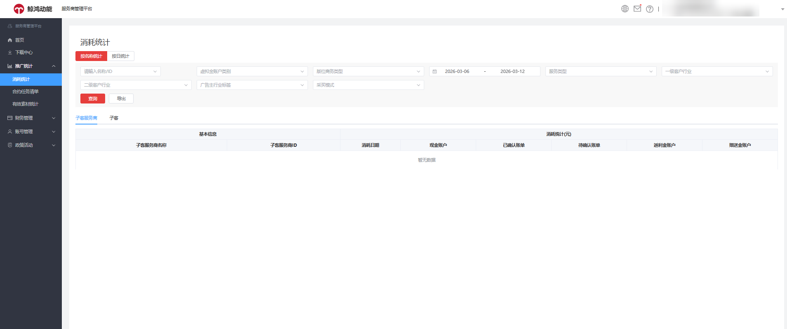
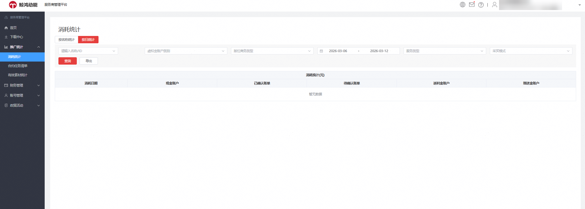
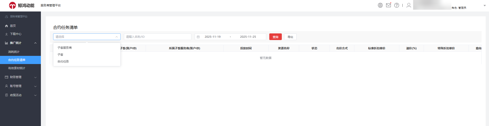
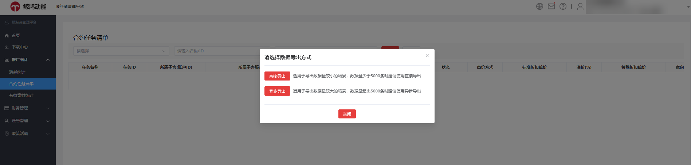
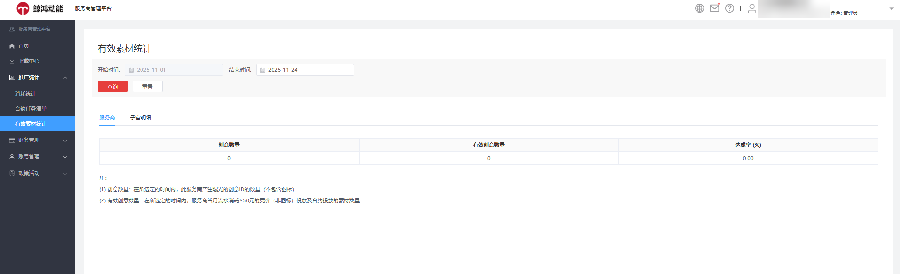
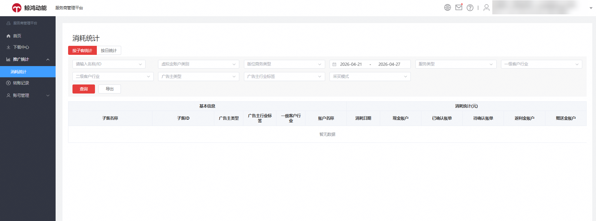
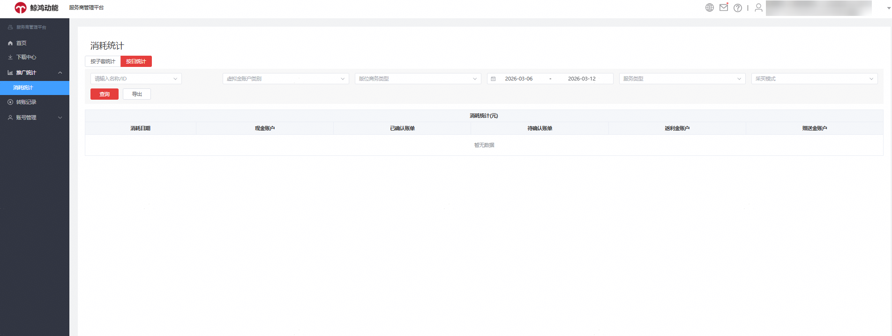

# 推广统计

## 一级服务商账户

登录的账户类型为一级服务商账户时，可在推广统计中查看“消耗统计”、“合约任务清单”和“有效消耗统计”。

### 消耗统计

您可单击“推广统计”-&gt;“消耗统计”中按名称统计和按日统计查看消耗数据。

<strong>按名称</strong> <strong>消耗统计</strong>

<strong>按日统计</strong>

### 合约任务清单

您可以通过合约任务清单查看投放的合约任务详情。

- 您可选择子客服务商、子客或合约任务，输入名称/ID进行数据查询，可以选择时间段进行相应任务数据查询和导出。支持直接导出与异步导出两种模式<strong>，</strong>您可根据数据量灵活选择，当数据量少于5000条时使用<strong>直接导出</strong>以快速获取；当处理超出5000条数据时，请选用异步导出，有效避免任务超时。导出成功后可在下载中心统一查看并下载结果，全面保障数据调取的效率。

- 合约任务清单报表指标如下：

  <strong>表1</strong>

  | 指标 | 定义 |
  | --- | --- |
  | 任务名称 | 合约任务名称 |
  | 任务ID | 合约任务ID |
  | 所属子客(账户ID) | 投放该合约任务的子客账户ID |
  | 所属子客服务商(账户ID) | 投放该合约任务的子客所属子客服务商账户ID |
  | 投放时间 | 合约任务的投放时间 |
  | 资源名称 | 投放的资源名称 |
  | 状态 | 合约任务投放状态 |
  | 出价方式 | 合约任务的出价方式，包括CPT/CPM/CPD |
  | 标准折扣单价 | 标准折扣单价计算公式=当前版位刊例单价\*（1+溢价比例）\*广告主标准折扣比例 |
  | 溢价(%) | 表示当前选择的定向、频次需要产生额外的溢价 |
  | 特殊折扣单价 | 特殊折扣单价计算公式=当前版位刊例单价\*（1+溢价比例）\*广告主特殊折扣比例 |
  | 意向日采购量(千次曝光) | 合约任务单日意向采购的曝光量，单位为千次曝光 |
  | 意向总采购量(千次曝光) | 整个合约任务意向采购的总曝光量，单位为千次曝光 |
  | 实收到达量 | 有效且计费的推送到达次数。 |
  | 曝光量 | 选定时间段内累计的客户端用户实际看到广告的展示量。 |
  | 点击量 | 选定时间段内累计的广告点击量 |
  | 合约现金消耗 | 选定时间段内累计的合约任务产生的现金消耗金额。 |

### 有效素材统计

您可以通过有效素材统计选定对应的时间查询服务商及子客下的创意数量，有效创意数量和达成率等。

## 子客服务商账户

### 消耗统计

您可单击“推广统计”-&gt;“消耗统计”按照子客统计或按日统计查看消耗数据。

<strong>按子客统计</strong>

<strong>按日统计</strong>

