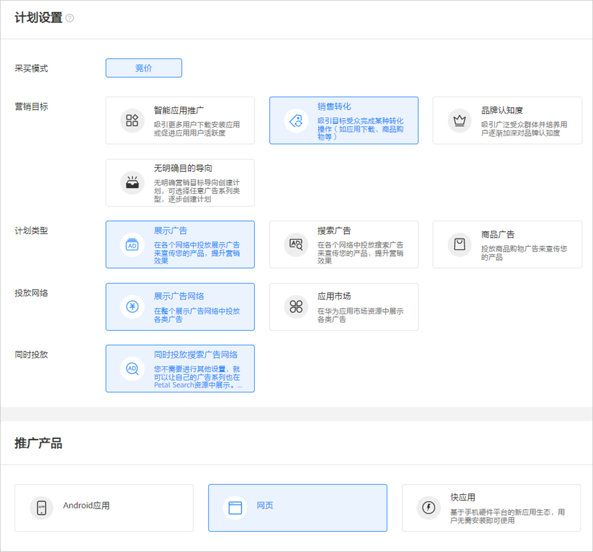
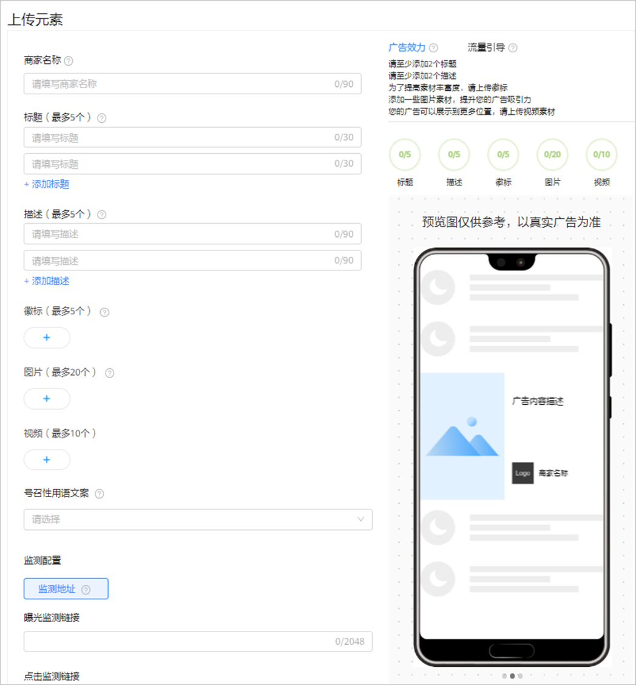

# 创建智能网页广告

## 概述

智能网页广告（又称“自适应展示广告”）是指在[展示广告网络资源](/docs/monetize/promotion/display-0000001057113500)上对您的网页进行推广。您只需要添加元素，系统会根据您提供的图片、视频等素材，为您自动生成适合Banner、Native、Splash、Interstitial、Rewarded等多个版位的创意，覆盖多个版位，增加元素丰富度，可提高广告优化空间。请确保您的标题和描述能够与任意素材搭配使用。

## 操作流程

## 操作步骤

1. 创建广告计划。

   单击“创建”，选择“创建计划”。

   

   - <strong>营销目标</strong>：选择“<strong>销售转化</strong>”、“<strong>无明确目的导向</strong>”或者“<strong>品牌认知度</strong>”，详情参考[营销目标](/docs/monetize/promotion/overview-cjjjgg-0000001182873508#ZH-CN_TOPIC_0000001182873508__zh-cn_topic_0000001205953939_zh-cn_topic_0000001105216776_li07111843183611)。
   - <strong>计划类型</strong>：选择“<strong>展示广告</strong>”，详情参考[计划类型](/docs/monetize/promotion/overview-cjjjgg-0000001182873508#ZH-CN_TOPIC_0000001182873508__zh-cn_topic_0000001205953939_zh-cn_topic_0000001105216776_li234211653411)。
   - <strong>投放网络</strong>：选择“<strong>展示广告网络</strong>”，详情参考[投放网络](/docs/monetize/promotion/overview-cjjjgg-0000001182873508#ZH-CN_TOPIC_0000001182873508__zh-cn_topic_0000001205953939_zh-cn_topic_0000001105216776_li93421166342)<strong>。</strong>
   - <strong>推广产品</strong>：选择“<strong>网页</strong>”，详情参考[推广产品](/docs/monetize/promotion/overview-cjjjgg-0000001182873508#ZH-CN_TOPIC_0000001182873508__zh-cn_topic_0000001205953939_zh-cn_topic_0000001105216776_li8342416193416)。
   - <strong>计划日预算</strong>：详情参考[计划日预算](/docs/monetize/promotion/overview-cjjjgg-0000001182873508#ZH-CN_TOPIC_0000001182873508__zh-cn_topic_0000001205953939_zh-cn_topic_0000001105216776_li14342141615342)。
   - <strong>推广计划名称</strong>：详情参考[推广计划名称](/docs/monetize/promotion/overview-cjjjgg-0000001182873508#ZH-CN_TOPIC_0000001182873508__zh-cn_topic_0000001205953939_zh-cn_topic_0000001105216776_li1434211615342)。
2. 创建广告任务。

   如果您希望在已有的计划下增加新的任务，请参考[已有计划下创建任务](/docs/monetize/promotion/overview-cjjjgg-0000001182873508#ZH-CN_TOPIC_0000001182873508__zh-cn_topic_0000001205953939_li5851143183912)。
   - <strong>广告投放类型</strong>：选择“<strong>正式投放</strong>”。如果您希望在正式投放之前对投放进行测试，您们可以创建[试投放](/docs/monetize/promotion/ads-adtest-0000001190031279)任务。
   - <strong>落地页类型</strong>：落地页链接是您想要推广内容的信息承载页面。输入您需要推广的落地页，用户单击广告后，即可进入落地页，落地页默认使用webview打开。在使用落地页正式投放之前，建议先用落地页创建一个试投放任务，测试落地页跳转、数据跟踪都正常之后再创建正式投放的广告任务，避免落地页异常导致广告投放费用的损失。

     落地页的内容要保证合规，审核人员会进行落地页审核并在投放过程中进行抽检。

     - <strong>自定义落地页：</strong>填写自定义的HTTPS访问地址。例如：``https://ads.huawei.com/usermgtportal/home/index.html#/``。
     - <strong>维纳斯落地页：</strong>您也可以选择维纳斯落地页，用户点击您的广告后，进入您在维纳斯创建的落地页，进行填写表单等操作，具体请查看[落地页工具](/docs/monetize/promotion/venus-0000001063299665)。您也可以对维纳斯落地页进行数据跟踪，详情请参考[维纳斯网页跟踪](/docs/monetize/promotion/tracking-venus-0000001202117526)。

   - <strong>定向：</strong>详情参考[定向](/docs/monetize/promotion/targeting-0000001180547094)（自动版位不支持选择已有定向包）。
   - <strong>版位</strong>：选择“自动版位”，系统自动为您选择效果较好的位置进行展示广告。
   - <strong>投放日期：</strong>详情参考[投放日期](/docs/monetize/promotion/overview-cjjjgg-0000001182873508#ZH-CN_TOPIC_0000001182873508__zh-cn_topic_0000001205953939_li73789433254)。
   - <strong>投放时间：</strong>详情参考[投放时间](/docs/monetize/promotion/overview-cjjjgg-0000001182873508#ZH-CN_TOPIC_0000001182873508__zh-cn_topic_0000001205953939_li1237874310252)。
   - <strong>频次设置</strong>：支持广告主设置广告任务对用户的展示频率。例如：时长设置5， 展示频次上限为10，则在5天的周期内此任务向一个用户展示不超过10次。
   - <strong>出价</strong>：版位不同，出价方式可能不同。目前展示网页广告支持的出价方式包括<strong>CPM、CPC</strong> <strong>、CPA</strong>。如果您投放的落地页类型为“维纳斯落地页”，那么您可以使用CPA的出价方式，此功能需要开通[特性通行名单](/docs/monetize/promotion/addtongxing-0000001128278195)。
   - <strong>任务名称</strong>：详情参考[任务名称](/docs/monetize/promotion/overview-cjjjgg-0000001182873508#ZH-CN_TOPIC_0000001182873508__zh-cn_topic_0000001205953939_li237864312259)。
3. 添加元素。

   此处您需要设置<strong>标题和描述等</strong>，系统会根据您提供的图片、视频等素材，为您自动生成合适的创意。

   

   - <strong>商家名称</strong>：您可以填写您的商家名称或者品牌名称，在部分广告样式中，会展示您的商家名称。
   - <strong>标题</strong>：可以设置2-5条，标题可以提升您的广告的吸引力，请确保您的标题能够独立成文，可与任何其他素材资源搭配使用。
   - <strong>描述：</strong>可以设置2-5条，描述可以增加用户与您的广告的互动，请确保您的描述能够独立成文，可与任何其他素材资源搭配使用。
   - <strong>徽标：</strong>您可以在此处添加与您网页相关的logo，可以上传5个，如果您上传多个，系统将会择优展示。
   - <strong>图片</strong>：为了保证效果，图片素材建议不要加文字，同时为了广告能够获取更多展示机会，建议您上传尽可能多的尺寸图片，可以添加20张，同时您也可以从商品库中获取图片。

     图片类型：JPG, PNG, JPEG。

     图片文件大小：500 KB以内。

     图片尺寸：为了保证您的广告覆盖率以及广告美观度，建议您上传的图片素材包含如下尺寸：160\*160、225\*150（单图）、225\*150（多图）、320\*50、728\*90、720\*1280、1080\*1620、1080\*1920、1920\*1080。

      

     225 \* 150（多图）需要同时添加 3 张 225 \* 150 图片。
   - <strong>视频：</strong>为了保证您的广告覆盖率以及广告美观度，建议您上传的视频素材包含如下尺寸，可以添加10个：

     视频类型：MP4

     视频文件大小：30MB以内

     视频尺寸（对应时长）：

     | <strong>广告样式</strong> | 视频尺寸 | 视频对应时长s（自己制作的视频） |
     | --- | --- | --- |
     | 开屏 | 1280\*720 | 3-5s |
     | 720\*1280 | 5s |
     | 激励视频 | 720\*1280 | 15-30s |
     | 640\*360 | 15-30s |
     | 插屏 | 720\*1080 | 15s |
     | 640\*360 | 15s |
     | 1280\*720 | 15-60s |
     | 720\*1280 | 15s |
     | 原生 | 640\*360 | 6-60s |
     | 1280\*720 | 5-60s |
     | 视频贴片 | 640\*360 | 30s |

     - <strong>监测地址</strong>：网页暂不支持使用监测地址，更多转化跟踪方式请参考[线索跟踪](/docs/monetize/promotion/manual-conversion-testing-0000001221434335)。
     - <strong>广告效力</strong>：广告效力用来衡量您的广告的多样性。在添加素材资源时，您可以参考广告效力，丰富广告样式及相关性，提高您的转化效果。
     - <strong>号召性按钮文案</strong>：下拉选择按钮文案，例如：去购买、立即体验等，按照您所需选择相应的按钮文案。用户看到您的广告后，点击按钮即可进入您设置的网页内容的链接。
     - <strong>流量引导：</strong>您可以重点添加/优化如下尺寸素材，系统会为您带来更好的投放效果：

       图片：640\*360、1080\*432、1080\*607、720\*1280、1080\*1620、1080\*1920、1920\*1080、160\*160、225\*150（3张）、225\*150（1张）

       视频：640\*360、720\*1280、720×1080。
     - <strong>预览：</strong>创意支持实时预览，此处显示的预览效果仅为示例，并不包含所有可能展示的广告样式。请确保您提供的元素资源无论单独使用，还是组合使用均不违反[审核要求](/docs/monetize/promotion/review-0000001052064324)。
4. 提交审核。

   单击“提交”，审核通过后即可推广。审核时间、审核结果通知、审核结果查看请参考[广告审核](/docs/monetize/promotion/review-0000001052064324)。
