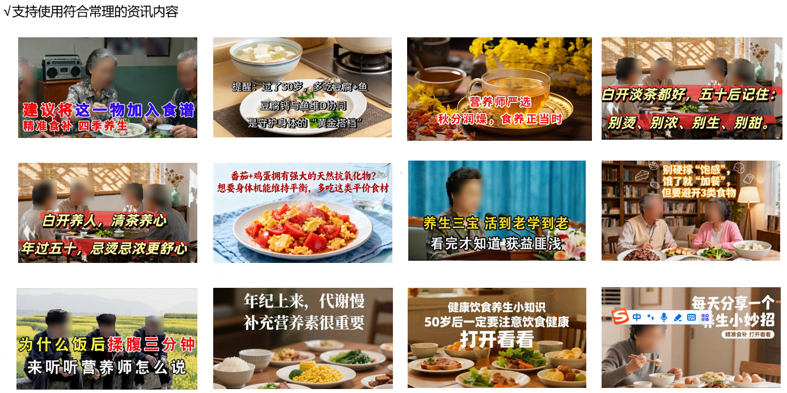

# 伪科学专题解读

<strong>聚焦伪科学营销乱象，本专题围绕广告法中虚假宣传认定与合规红线展开，明确伪科学相关广告的监管定义、高频违规场景及整改指引，助力企业识别伪科学话术风险，规范科普背书与功效宣称，有效规避合规陷阱，保障投放流程平稳有序。</strong>

<strong>一、规则指引：</strong> <strong>全行业禁止投放伪科学资讯内容</strong>

1. <strong>伪科学定义</strong>

将虚构事迹和缺乏依据的养生知识/方法、生活建议包装成科学的科普信息，“妖魔化”常见食物或夸大日常行为的健康风险来制造焦虑，进而暗示或承诺其产品与服务的医疗效果。

2. <strong>规则描述&尺度</strong>

| <strong>一、禁止使用无科学依据的营养、养生、护肤知识、生活窍门/建议，通过噱头、未经证实的知识吸引人关注</strong> | | |
| --- | --- | --- |
| <strong>序号</strong> | <strong>类型</strong> | <strong>案例</strong> |
| 1 | “妖魔化”常见食物或日常行为直接与疾病划等号 | 1、睡前、早起喝白开水的人，肾脏可能都烂成渣了  2、这3种食物别再吃了，血管变硬变脆都是因为它 |
| 2 | 将普通食物或日常行为“神话”包装有医疗保健效果 | 1、血压稳如泰山，认准1块钱蔬菜，一吃安神、二吃利尿、三吃调血脂  2、西蓝花富含胆碱和叶酸，协同健脑，让你拥有年轻体态 |
| 3 | 通过分裂正常的健康行为和饮食，来创造耸人听闻的“知识点”，制造虚假健康对立与夸大风险 | 1、早上喝水和晚上喝水对身体效果那可不一样  2、晨起空腹喝水和饭后喝水，效果差别太大了！  3、大蒜尽量少吃，最好不吃？看完才明白 |
| 4 | 将复杂的健康问题简单归因于单一食物或行为，将其塑造为“万能钥匙”或“绝对禁忌”，使用绝对化指令且缺乏依据，来诱导受众群体类要不要吃某类食品、做某个动作 | 1、想要好身体，少吃鸡蛋/牛奶，多吃三果 |
| 5 | 无科学依据的中老年养生知识类，来制造健康焦虑/渴望，提供不现实的解决方案，去诱导用户使用广告所推广的商品 | 1、人老了，真正需要的是XX |

| <strong>二、禁止利用虚构事迹（尤其是高龄老人）推广产品或服务</strong> | | <strong>三、禁止无科学依据的商品功效分析/建议/介绍</strong> | |
| --- | --- | --- | --- |
| <strong>类型</strong> | <strong>案例</strong> | <strong>类型</strong> | <strong>案例</strong> |
| 通过虚构事迹（利用高龄老人来作为信任背书），制造健康焦虑/渴望，提供神化单一方案/食物，进行推广产品或服务 | 1、84岁悬崖跳水第一人，能做到这样的壮举全靠这一点  2、105岁老人的长寿窍门，不靠顿顿补品，竟是这常见好物 | 通过推荐常规健康认知中不被提倡（甚至被认为有健康风险）或无依据的饮食、行为和神化未知物品，来针对受众群体进行营销推广商品 | 1、年龄大了，建议多喝隔夜茶，现在知道也不晚  2、人过50，多喝过夜水，多亏知道的早 |

<strong>二、保健功效描述（详细说明官方定义）</strong>

1. <strong>保健食品核心定义</strong>（GB 16740-2014）

保健食品：声称并具有特定保健功能或以补充维生素、矿物质为目的的食品；适用于特定人群，调节机体功能、不以治疗疾病为目的，且安全无害。

2. <strong>官方允许的保健功能目录</strong>（2020 版，共 24 项）

仅蓝帽子保健食品可使用以下标准表述：

| <strong>保健功能目录</strong> | | | |
| --- | --- | --- | --- |
| 1.有助于增强免疫力功能 | 7.缓解体力疲劳功能 | 13.有助于改善黄褐斑功能 | 19.有助于维持血脂健康水平（胆固醇/甘油三酯）功能 |
| 2.有助于抗氧化功能 | 8.耐缺氧功能 | 14.有助于改善皮肤水份状况功能 | 20.有助于维持血糖健康水平功能 |
| 3.辅助改善记忆功能 | 9.有助于调节体内脂肪功能、减肥 | 15.有助于调节肠道菌群功能 | 21.有助于维持血压健康水平功能 |
| 4.缓解视觉疲劳功能 | 10.有助于改善骨密度功能 | 16.有助于消化功能 | 22.对化学性肝损伤有辅助保护功能 |
| 5.清咽润喉功能 | 11.改善缺铁性贫血功能 | 17.有助于润肠通便功能 | 23.对电离辐射危害有辅助保护功能 |
| 6.有助于改善睡眠功 | 12.有助于改善痤疮功能 | 18.辅助保护胃粘膜功能 | 24.有助于排铅功能 |
| <strong>TIP：</strong>   - 非医疗 / 非保健食品：只能说“营养、护理、舒适、日常保养”，绝对不能说“保健功能”。 - 保健食品：仅限使用官方24项标准表述，不得超范围、不得暗示治疗。 - 可作为判断标准，但不局限于以上描述；根据相关法律法规及保健功能目录更新情况动态调整。 | | | |

3. <strong>法律依据</strong>

普通商品（非健字号、非药械）禁止明示或暗示具有保健功能、疾病预防或治疗作用。

a.《中华人民共和国广告法》第十七条 除医疗、药品、医疗器械广告外，禁止其他任何广告涉及疾病治疗功能，并不得使用医疗用语或者易使推销的商品与药品、医疗器械相混淆的用语。

b.《中华人民共和国食品安全法实施条例》第三十八条 对保健食品之外的其他食品，不得声称具有保健功能。

c.《中华人民共和国食品安全法》第七十三条 食品广告的内容应当真实合法，不得含有虚假内容，不得涉及疾病预防、治疗功能。

<strong>三、规则拆解&案例解析</strong>

<strong>规则1：禁止使用无科学依据的营养、养生、护肤知识、生活窍门/建议，通过噱头、未经证实的知识吸引人关注</strong>

① “妖魔化”常见食物或日常行为直接与疾病划等号；如“睡前、早起喝白开水的人，肾脏可能都烂成渣了”“3种食物别再吃了，血管变硬变脆都是因为它”

<strong>案例解析：</strong>以下内容都将正常食物与疾病划等号，且属于无科学依据科普描述，利用噱头夸大手法制造健康焦虑

|  |  |  |  |
| --- | --- | --- | --- |
| <strong>违规素材</strong> | <strong>违规解读</strong> | <strong>违规素材</strong> | <strong>违规解读</strong> |
|  | 1、【3种食物不能再吃了，不然三高问题频发】将正常食物与疾病划等号；2、图片涉及负面情绪 |  | 【3种食物别再吃了，血管变硬变脆因为它】将正常食物与疾病划等号 |
|  | 【4种植物不懂吃等于服毒】将正常食物与疾病划等号，制造健康焦虑 |  | 【睡前、早起喝白开水的人，肾脏可能都烂成渣了】将正常食物与疾病划等号 |
|  | 【50岁后要少吃1种肉，否则就是在喂大癌细胞】将正常食物与疾病划等号 |  | 【马上停止吃这三种食物，不然高血糖更严重】将正常食物与疾病划等号 |
| <strong>合规示例</strong> | <strong>案例解析</strong> | <strong>合规示例</strong> | <strong>案例解析</strong> |
|  | 素材图文导向正常，属于常规的生活常识，允许使用食物常规具备的食用效果，但不得涉及夸大效果/功效和医疗保健效果类描述；同时未有制造焦虑、噱头夸大、虚假宣传相关描述。 |  | 素材图文导向正常，属于常规的生活常识，允许使用食物常规具备的食用效果，但不得涉及夸大效果/功效和医疗保健效果类描述；同时未有制造焦虑、噱头夸大、虚假宣传相关描述。 |

② 将普通食物或日常行为“神话”包装有医疗保健效果；如“血压稳如泰山，认准1块钱蔬菜，一吃安神、二吃利尿、三吃调血脂““西蓝花富含胆碱和叶酸，协同健脑，让你拥有年轻体态”

<strong>案例解析：</strong>以下内容均为无科学依据科普描述，将普通食物“神话”包装有医疗保健效果，使用噱头夸大手法来吸引用户关注

|  |  |  |  |
| --- | --- | --- | --- |
| <strong>违规素材</strong> | <strong>违规解读</strong> | <strong>违规素材</strong> | <strong>违规解读</strong> |
|  | 【吃对了是“补药”，吃错了是“浪费”】将普通食物“神话”包装有医疗保健效果，使用噱头夸大手法来吸引用户关注 |  | 【协同健脑，让你拥有年轻体态】将普通食物“神话”包装有医疗保健效果，使用噱头夸大手法来吸引用户关注 |
|  | 【90岁血压稳如泰山，认准1块钱蔬菜，一吃安神、二吃利尿、三吃调血脂】将普通食物“神话”包装有医疗保健效果，使用噱头夸大手法来吸引用户关注 |  | 【三高问题频发，原因竟是体内缺乏这种东西！后悔没有多补充！】将普通食物“神话”包装有医疗保健效果，使用噱头夸大手法来吸引用户关注 |
|  | 【90岁老人有血压妙方，一块钱蔬菜配它吃，靠谱不踩雷】将普通食物“神话”包装有医疗保健效果，使用噱头夸大手法来吸引用户关注 |  | 【50岁后记性变差别着急，建议多吃这类青菜】将普通食物“神话”包装有医疗保健效果，使用噱头夸大手法来吸引用户关注 |
| <strong>合规示例</strong> | <strong>案例解析</strong> | <strong>合规示例</strong> | <strong>案例解析</strong> |
|  | 素材图文导向正常，有合理的科学依据证实的生活、养生知识/建议，整体为科普导向，未制造噱头夸大、医疗用语及虚假宣传相关描述。 |  | 素材图文导向正常，属于有科学依据证实的生活、养生知识/建议，“加油站”属于中立形容描述，未带有医疗保健效果含义；同时未有制造焦虑、噱头夸大、虚假宣传相关描述。 |

③ 通过分裂正常的健康行为和饮食，来创造耸人听闻的“知识点”，制造虚假健康对立与夸大风险；如“早上喝水和晚上喝水对身体效果那可不一样”“晨起空腹喝水和饭后喝水，效果差别太大了！”“大蒜尽量少吃，最好不吃？看完才明白”

|  |  |  |  |
| --- | --- | --- | --- |
| <strong>违规素材</strong> | <strong>违规解读</strong> | <strong>违规素材</strong> | <strong>违规解读</strong> |
|  | 【早上喝水和晚上喝水】将日常行为对立比较+【对身体效果那可不一样】声称存在巨大的未知差异效果 |  | 【晨起空腹喝水和饭后喝水】将日常行为对立比较+【效果差别太大了！】声称存在巨大的未知差异效果 |
|  | 【鸡蛋坚决不能和他们一起吃，转告家人别大意】利用正常饮食制造耸人听闻的“知识点”，刻意夸大风险 |  | 【生姜这么吃如砒霜，别不信！你家厨房可能就有，这类人要注意】利用正常饮食制造耸人听闻的“知识点”，刻意夸大风险 |
|  | 【大蒜尽量少吃，最好不吃？看完才明白！】利用正常饮食制造耸人听闻的“知识点”，刻意夸大风险 |  | 【吃饭七分饱？错了！】断章取义的否定公认的健康常识来吸引眼球，刻意夸大风险+【提醒：过了50岁，吃饭要尽量做到这3点】提出缺乏依据的模糊指令，诱导用户做某事 |
| <strong>合规示例</strong> | <strong>案例解析</strong> | <strong>合规示例</strong> | <strong>案例解析</strong> |
|  | 【早上喝水和晚上喝水哪里不一样？】为疑问句式，属于引导式科普类型，未制造虚假健康对立与夸大健康风险的结论。 |  | 【早上喝水和晚上喝水，早喝为身体“开机”，晚喝为身体“续航”】内容属于合理常规的生活知识描述，未涉及巨大的行为差异效果，或制造耸人听闻的结论，来刻意夸大健康风险。 |

④ 将复杂的健康问题简单归因于单一食物或行为，将其塑造为“万能钥匙”或“绝对禁忌”，使用绝对化指令且缺乏依据，来诱导受众群体类要不要吃某类食品、做某个动作；如“想要好身体，少吃鸡蛋/牛奶，多吃三果”

|  |  |  |  |
| --- | --- | --- | --- |
| <strong>违规素材</strong> | <strong>违规解读</strong> | <strong>违规素材</strong> | <strong>违规解读</strong> |
|  | 【中老年入伏，不吃“鸡蛋”有讲究，多吃“三果”少吃这“四物”】特定人群+无科学依据的绝对化指令，将正常食物包装成健康禁忌，制造健康焦虑 |  | 【55岁以后这样吃更健康，营养师建议三吃三不吃】特定人群+无科学依据的指令建议，将复杂的健康问题简单归因于单一食物或行为，制造健康焦虑 |
|  | 【提醒：过了50岁，尽量避免4种行为】特定人群+无科学依据的要求指令，将健康问题简单归因于单一行为，且包装为健康禁忌，制造健康焦虑 |  | 【生命科学新发现】无科学依据的噱头描述+【饭后一习惯，远离中老年断崖式衰老】将衰老问题简单归因于单一行为习惯，制造夸大噱头来吸引眼球，诱导用户点击使用 |
|  | 【人到中年要忌嘴，建议少吃豆芽和红薯，多吃这4样，越吃越健康】特定人群+无科学依据的绝对化指令，将正常食物包装成健康禁忌，和把健康问题简单归因于单一食物，制造健康焦虑 |  | 【黄瓜是血脂的“加速剂”？】将普通食物与疾病挂钩，制造耸人听闻的“知识点”，刻意夸大风险+【想要血脂正常，忌3果，多吃4物】无科学依据的绝对化指令，同时将普通食物“神话”包装有医疗保健效果或是健康禁忌 |
| <strong>合规示例</strong> | <strong>案例解析</strong> | <strong>合规示例</strong> | <strong>案例解析</strong> |
|  | 素材图文导向正常，有合理的科学依据证实的生活、养生知识/建议，整体为科普导向，未制造噱头夸大、健康焦虑、医疗用语及虚假宣传相关描述。 |  | 素材图文导向正常，有合理的科学依据证实的生活、养生知识/建议，整体为科普导向，未制造噱头夸大、健康焦虑、医疗用语及虚假宣传相关描述。 |

⑤ 无科学依据的中老年养生知识类，来制造健康焦虑/渴望，提供不现实的解决方案，去诱导用户使用广告所推广的商品；如“人老了，真正需要的是XX”

|  |  |  |  |
| --- | --- | --- | --- |
| <strong>违规素材</strong> | <strong>违规解读</strong> | <strong>违规素材</strong> | <strong>违规解读</strong> |
|  | 【生吃洋葱+“它”，中老年软化血管的“加速剂”】提供虚假的解决方案，目的是推广自身商品，同时承诺医疗保健效果，+【切记忌4果】无科学依据的绝对化指令，制造健康焦虑 |  | 【老年营养物质被发现，高营养不是肉，而是“它”】制造健康利诱，提供无科学依据科普描述，目的是推广自身商品 |
|  | 【人越老，血越稠！这种东西泡水喝】制造健康焦虑，提供无科学依据科普描述，目的是推广自身商品，+【清洁血管，缓解三高！】承诺医疗保健效果 |  | 【血糖高根本不是一个严重的问题，只需要睡前补一物】提供无科学依据科普描述，目的是推广自身商品，同时承诺医疗保健效果 |
|  | 【人老了“命短”的3大真相，牛奶、鸡蛋要少食】无科学依据的指令建议，将正常食物包装成健康禁忌，制造健康焦虑，【你真正需要的是“它”】目的是推广自身商品 |  | 【人老后，少吃豆腐和大虾，掌握寿命的“窍门”】无科学依据的指令建议，将正常食物包装成健康禁忌，制造健康焦虑，【建议看完】目的是推广自身商品 |
| <strong>合规示例</strong> | <strong>案例解析</strong> | <strong>合规示例</strong> | <strong>案例解析</strong> |
|  | 素材图文导向正常，属于常规的生活常识，允许使用食物常规具备的食用效果，但不得涉及夸大效果/功效和医疗保健效果类描述；同时未有制造焦虑、噱头夸大、虚假宣传相关描述 |  | 素材图文导向正常，属于常规的生活常识，允许使用食物常规具备的食用效果，但不得涉及夸大效果/功效和医疗保健效果类描述；同时未有制造焦虑、噱头夸大、虚假宣传相关描述 |

<strong>规则2：禁止利用虚构事迹（尤其是高龄老人）来推广产品或服务</strong>

① 通过虚构事迹（利用高龄老人来作为信任背书），制造健康焦虑/渴望，提供神化单一方案/食物，进行推广产品或服务

|  |  |  |  |
| --- | --- | --- | --- |
| <strong>违规素材</strong> | <strong>违规解读</strong> | <strong>违规素材</strong> | <strong>违规解读</strong> |
|  | 虚构事迹描述【105岁老人的长寿窍门】使用夸大描述【不靠顿顿补品，竟是这常见好物】推广商品 |  | 虚构事迹描述【百岁老人器官年龄仅45岁】，使用夸大描述【不是少油少盐，每天一杯它】推广商品 |
|  | 虚构事迹描述【土家百岁翁传养生方】，使用夸大承诺描述【吃这物能稳血压、通气血，别等吃亏才知道】推广商品 |  | 虚构事迹描述【93岁老人，脉龄仅60岁】，使用夸大描述【鸡蛋与它同吃，不出三天你会感谢我】推广商品 |
|  | 虚构事迹描述【103岁老人死守的秘密】使用夸大描述【晨起空腹喝一口，过段时间，你会泪谢我】推广商品 |  | 虚构事迹描述【百岁老人养生新发现】使用夸大描述【不是天天喝牛奶，而是它】推广商品 |
| <strong>合规示例</strong> | <strong>案例解析</strong> | <strong>合规示例</strong> | <strong>案例解析</strong> |
|  | 广告素材文案描述与图片未涉及利用虚构事迹来推广产品或服务，且无其他违规问题 |  | 广告素材文案描述与图片未涉及利用虚构事迹来推广产品或服务，且无其他违规问题 |

<strong>规则3：禁止无科学依据的商品功效分析/建议/介绍</strong>

① 通过推荐常规健康认知中不被提倡（甚至被认为有健康风险）或无依据的饮食、行为和神化未知物品，来针对受众群体进行营销推广商品；

|  |  |  |  |
| --- | --- | --- | --- |
| <strong>违规素材</strong> | <strong>违规解读</strong> | <strong>违规素材</strong> | <strong>违规解读</strong> |
|  | 【人过50，多喝过夜水，多亏知道的早】特定人群+反常识/存在争议的行为推荐，缺乏科学依据的饮食建议 |  | 【过了40岁，建议多喝隔夜“三七”，后悔才看到】特定人群+反常识/存在争议的行为推荐，缺乏科学依据的饮食建议 |
|  | 【45岁以上的人建议多喝“隔夜莓茶”】特定人群+反常识/存在争议的行为推荐，缺乏科学依据的饮食建议 |  | 【45岁以上要多喝老人都在喝的神仙茶】特定人群+推荐神化未知物品（神仙茶），缺乏科学依据的饮食建议，目的是针对受众群体推广自身商品 |
|  | 【睡前一个习惯，1种叶子泡水喝，很多人蒙在鼓里】缺乏科学依据的饮食习惯建议，推荐神化未知物品（1种叶子），目的是针对受众群体推广自身商品 |  | 【人到中年，不管退休金多少，要舍得吃一物：1种叶子泡水喝】缺乏科学依据的饮食建议，推荐神化未知物品（1种叶子），目的是针对受众群体推广自身商品 |
| <strong>合规示例</strong> | <strong>案例解析</strong> | <strong>合规示例</strong> | <strong>案例解析</strong> |
|  | 属于常规的生活知识，喝茶会受茶多酚等抗氧化物带来的影响，不命中伪科学商品功效类分析等相关；且为疑问句式，属于引导式科普类型，未制造虚假健康对立与夸大健康风险的结论。 |  | 茶叶中含有咖啡因、茶多酚等抗氧化物，因此会产生一定的影响效果，属于常规的生活常识，允许使用食物常规具备的食用效果，但不得涉及夸大效果/功效和医疗保健效果类描述；同时未有制造焦虑、噱头夸大、虚假宣传相关描述 |

<strong>四、违规案例修改指引</strong>

| <strong>违规素材（前）</strong> | <strong>素材修改（后）</strong> | <strong>违规素材（前）</strong> | <strong>素材修改（后）</strong> |
| --- | --- | --- | --- |
|  |  |  |  |
| ×问题解析：不支持将普通食物“神话”包装有医疗保健效果 | √修改指引：将“帮你调节血压血糖”删除，可支持投放 | ×问题解析：不支持分裂正常的健康饮食，来创造耸人听闻的“知识点”，制造虚假健康对立与夸大风险 | √修改指引：将“一个差别很明显！”删除，可支持投放 |

| <strong>违规素材（前）</strong> | <strong>素材修改（后）</strong> | <strong>违规素材（前）</strong> | <strong>素材修改（后）</strong> |
| --- | --- | --- | --- |
|  |  |  |  |
| ×问题解析：不支持使用无科学依据的中老年养生知识 | √修改指引：将“东方健康模式公开后一夜火了”修改为“科学健康养生理念备受关注”，可支持投放 | ×问题解析：不支持将复杂的健康问题简单归因于单一食物或行为 | √修改指引：将“晨起空腹切记三不吃”修改为“晨起空腹谨慎食用生冷、高糖、辛辣三类食物”，可支持投放 |

<strong>五、养生资讯合规原则与合规宣传模板</strong>

1. <strong>养生资讯行业・通用合规原则（必看）</strong>

a. 只围绕生活方式、习惯、科普知识；

b. 不指向任何疾病、症状、调理、改善、效果；

c. 不承诺功效、不暗示保健或替代药物、不替代医生建议；

d. 不得以健康科普形式进行“导流导诊”（即引导到特定医院或医生处就诊），或通过直播带货等形式推销医药产品、保健食品等牟利；

e. 不得以介绍健康、养生知识等形式，变相发布医疗、药品、医疗器械、保健食品、特殊医学用途配方食品广告；

f. 素材不得出现负面情绪文案/图片，如：表情痛苦狰狞、抱头哭、展示抑郁、躁怒等人物情绪；

g. 素材不得展示引起用户不适的画面，如：注射针头、病变人体器官、刻意放大的人体部位等；

h. 涉及身体不适必须加提示：请遵医嘱；

2. <strong>可参考使用的合规宣传模板</strong>

a. 开篇 / 定位类

- 分享健康生活方式，传递日常养生知识。
- 普及科学养生理念，助力大家养成好习惯。
- 日常养生小知识，让生活更舒适、更有品质。

b. 饮食养生类

- 日常饮食搭配小知识，让三餐更均衡。
- 了解食材特点，合理安排日常饮食。
- 分享家常饮食思路，吃出舒适状态。
- 注重饮食规律，保持良好生活节奏。
- 不同季节的饮食小建议，适合日常参考。

<strong>禁止写</strong> <strong>：</strong>祛湿、降火、补肾、养胃、降三高、增强免疫力、排毒、调理肠胃。

c. 作息 / 运动类

- 规律作息，让身体保持轻松舒适。
- 适度活动，提升日常活力感。
- 简单日常动作，适合放松身体。
- 养成良好作息习惯，享受舒适生活。
- 久坐人群可尝试这些放松小方法。

d. 情绪 / 心态养生类

- 平和心态，舒适生活。
- 日常减压小技巧，放松心情。
- 养好情绪，也是一种养生。
- 舒缓身心，享受慢生活。

e. 季节养生类

- 春季日常起居小建议。
- 夏季生活舒适小贴士。
- 秋冬季节，注意日常保暖与补水。
- 根据季节变化，调整生活习。

f. 微习惯养生类

- 晨起睡前简易舒缓动作参考。
- 利用碎片时间活动肩颈，缓解僵硬感。
- 温水泡脚、晒背等日常小习惯分享。
- 日常护眼小动作，缓解视疲劳。
- 轻柔拍打与拉伸，促进身体循环通畅。

<strong>六、合规案例</strong>

