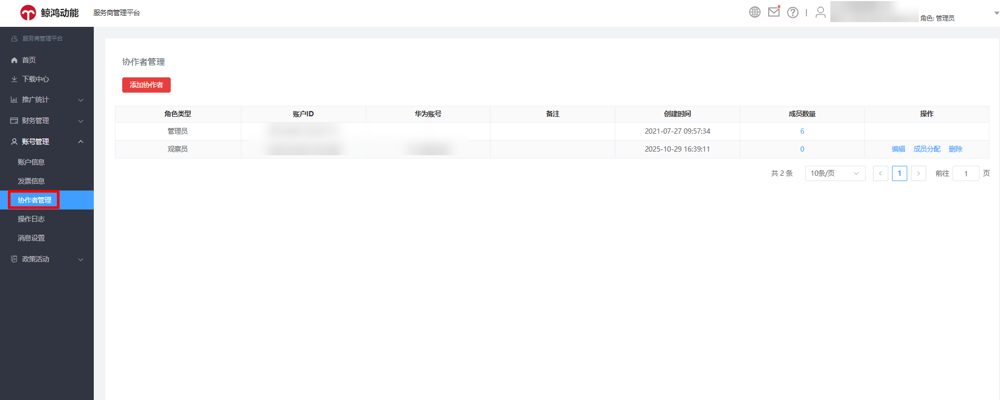
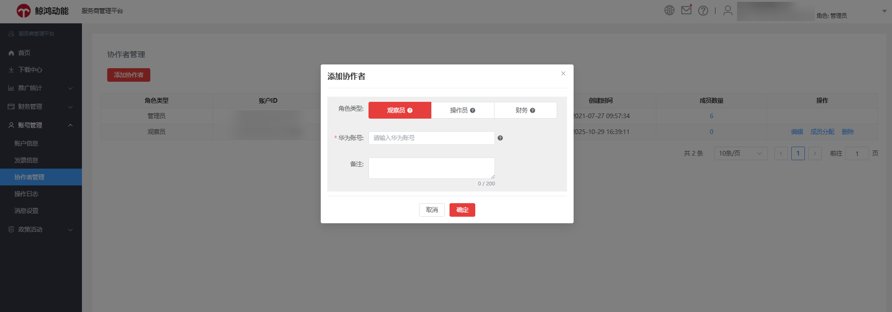

# 协作者管理

鲸鸿动能服务商管理平台协作者功能支持通过添加协作者，帮助服务商便捷、高效管理多个账号，目前仅支持服务商使用该功能。

协作者角色分为观察员、操作员、财务，不同角色权限如下表所示：

| 服务商界面操作权限 | 观察员 | | 操作员 | | 财务 | |
| --- | --- | --- | --- | --- | --- | --- |
| 服务商类别 | 一级 | 二级 | 一级 | 二级 | 一级 | 二级 |
| 首页新增（邀请）按钮 | - | - | √ | √ | - | - |
| 转账 | - | - | - | - | √ | √ |
| 编辑下级账户信息 | - | - | √ | √ | - | - |
| 进入下级账户 | - | - | √ | √ | - | - |
| 查看下级账户列表 | √ | √ | √ | √ | √ | √ |
| 查看子客服务商消耗统计 | √ | - | √ | - | √ | - |
| 查看子客消耗统计 | √ | √ | √ | √ | √ | √ |
| 充值 | - | - | - | - | √ | - |
| 查看充值记录 | √ | - | √ | - | √ | - |
| 查看转账记录 | √ | √ | √ | √ | √ | √ |
| 查看账户信息 | √ | √ | √ | √ | √ | √ |
| 查看操作日志 | - | - | √ | √ | - | - |

 

（1）每个操作员之间数据独立，A操作员无法操作B操作员账户内新添加的账户；

（2）子客服务商管理员分配的操作员角色可管理的账户，为未开户的广告账户，并不是管理员账户内已开户的广告账户；

（3）同一个华为账号只能被一个服务商账户添加为协作者，且只能指定一种角色。

## 添加协作者

使用管理员账号，登录鲸鸿动能服务商管理平台，单击“账号管理”-&gt;“协作者管理”-&gt;“添加协作者”，选择角色类型和输入华为账号后单击确定即可。

 

此处的华为账号必须未注册过其它账户类型（包括直客、服务商、子客服务商、子客、协作者、团队账号、经理账户）。

如您还没注册华为账号，注册流程可参考：[华为账号](/docs/monetize/promotion/ads-hwzh-0000002188054913)。
