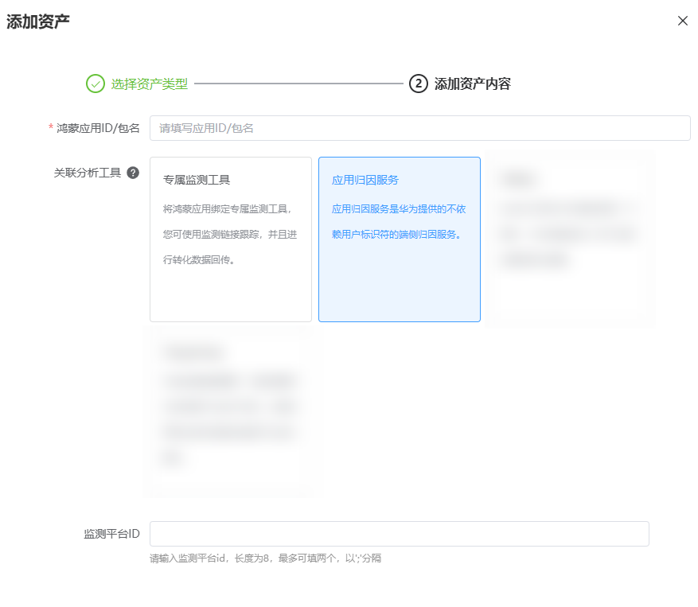
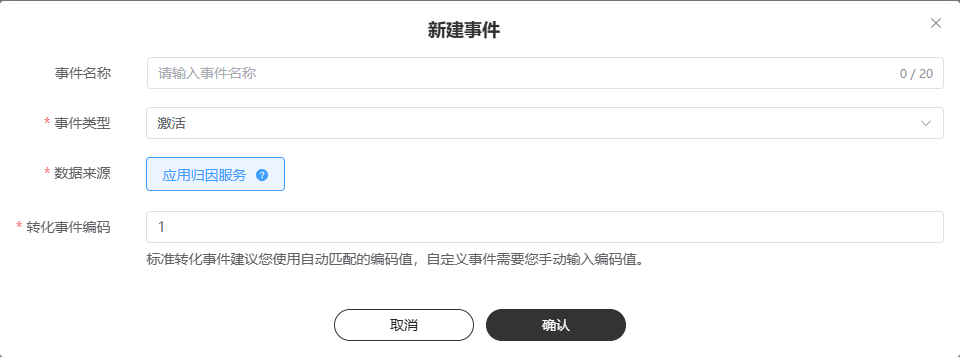

# 应用归因服务

## 基本原理

应用归因服务是华为提供的不依赖用户标识符的端侧归因能力。

当用户完成应用安装或在已安装应用内完成转化时，应用归因服务通过匹配用户在转化前的行为数据，分析用户的来源渠道以及转化的原因，并将归因结果回传给分发平台、开发者、归因监测平台。开发者可以通过归因结果数据分析投放效果、评估渠道质量，进而优化投放策略，分发平台可以评估渠道商业价值，优化营销效果。

<strong>准备工作</strong>

| <strong>序号</strong> | <strong>任务</strong> | <strong>详情</strong> |
| --- | --- | --- |
| 1 | [注册归因角色](/docs/dev/app-dev/application-services/store-kit-guide/store-attribution/store-attribution-preparations/store-attribution-register#section11218192952612) | 广告主或归因监测平台通过应用归因服务云侧注册归因角色并完成其信息的配置，包括：名称、回传地址（用于接收归因结果回传的URL）、公钥。注册成功后平台生成归因角色ID。 |
| 2 | [登记归因转化](/docs/dev/app-dev/application-services/store-kit-guide/store-attribution/store-attribution-developmentguide#section191112563619) | 开发者App、归因监测平台通过调用[registerTrigger](https://developer.huawei.com/consumer/cn/doc/harmonyos-references/store-attributionmanager#section13414543616)接口登记归因转化事件。 |
| 3 | [归因结果回传](/docs/dev/app-dev/application-services/store-kit-guide/store-attribution/store-attribution-receive) | 应用归因服务将归因结果通过回传地址回传至广告主或归因监测平台。 |
| 4 | [接入调试](/docs/dev/app-dev/application-services/store-kit-guide/store-attribution/store-attribution-test) | 应用归因服务提供接入调试功能，开发者通过调用调试接口验证接入的准确性及归因结果回传等基础能力。 |

## 操作步骤

在完成接入开发者后在鲸鸿动能新建应用归因服务。

（1）操作入口：“工具”-&gt;“事件资产管理”-&gt;“新建资产”-&gt;“鸿蒙应用”

- 关联分析工具：转化跟踪工具，此处请选择‘应用归因服务’。
- 监测平台ID：输入你需要使用的三方归因角色ID，最多可填两个。

（2）操作入口：“选择资产”-&gt;“新建事件”-&gt;“选择事件”-&gt;“应用归因服务”

标准转化事件编码建议保持默认映射，自定义转化事件编码自行匹配合适的事件类型

## 数据回传

“应用归因服务”所归因给鲸鸿动能的转化数据会根据转化事件编码默认呈现在投放报表上，无需广告主额外进行回传。
