# 自动盯盘

## 功能简介

自动盯盘是一项可以帮助您从时刻盯盘的紧张压力中解放出来的智能广告管理工具，允许您基于自定义的条件，对广告账户、广告计划和广告任务进行自动化监控和优化操作。当您设置特定的规则后，系统都能帮您盯紧账户，一旦投放计划和账户有异常情况，系统将自动进行相关调整，并在第一时间发送通知提示您，可大幅减少人工干预，提高广告投放效率！

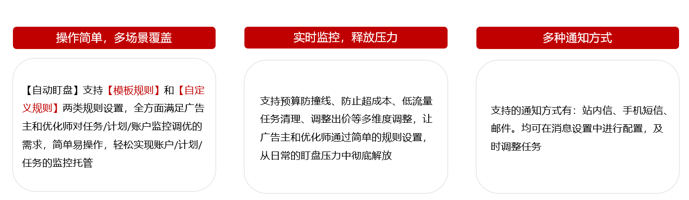

当您进入“自动盯盘”页面后，您可根据需求新建规则和管理规则，已创建的规则可支持编辑、删除、状态启停、查看详情和运行记录。

### 规则模板

自动盯盘当前有四大推荐规则模板：此功能基于海量行业投放数据，提炼出四大高频投放场景的“最佳实践”策略，无需手动配置规则逻辑，只需根据目标选择模板，即可自动生成匹配的“规则”。

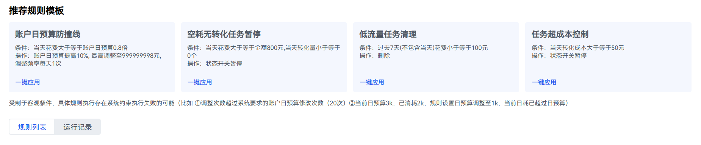

- <strong>模板一、账户日预算防止撞线</strong>

  条件：当天花费大于等于账户日预算0.8倍

  操作：账户日预算提高10%, 最高调整至999999998元, 调整频率每天1次

  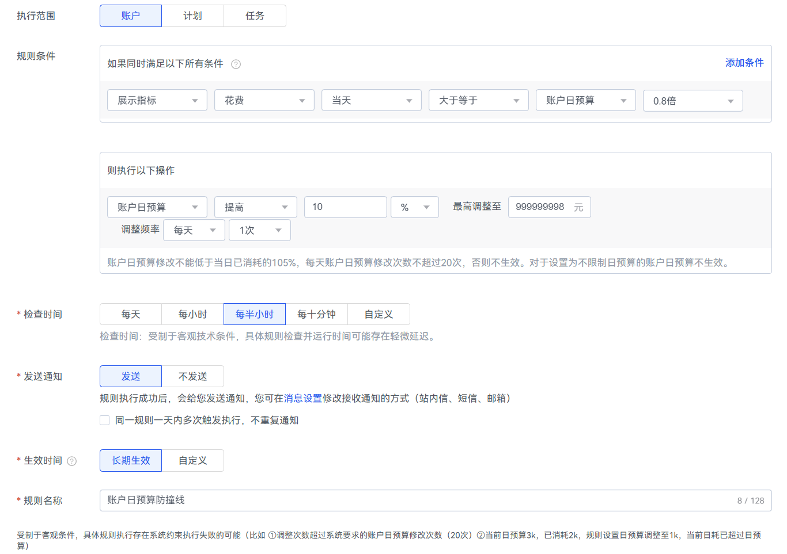
- <strong>模板二、空耗无转化任务暂停</strong>

  条件：当天花费大于等于金额800元,当天转化量小于等于0个

  操作：状态开关暂停

  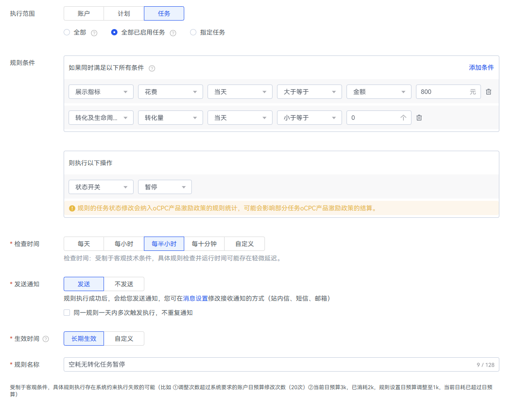
- <strong>模板三、低流量任务清理</strong>

  条件：过去7天(不包含当天)花费小于等于100元

  操作：删除

  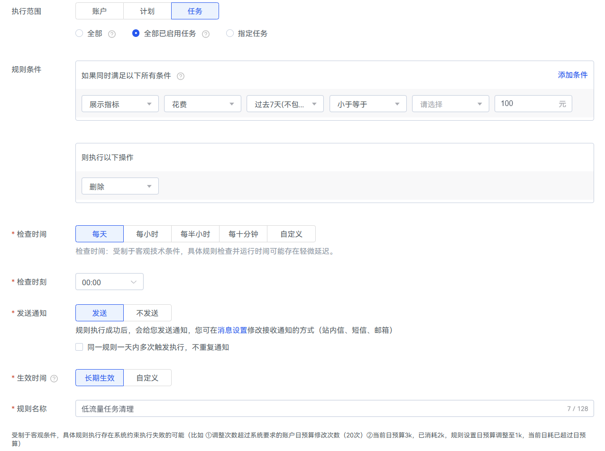
- <strong>模板四、任务超成本控制</strong>

  条件：当天转化成本大于等于50元

  操作：状态开关暂停

  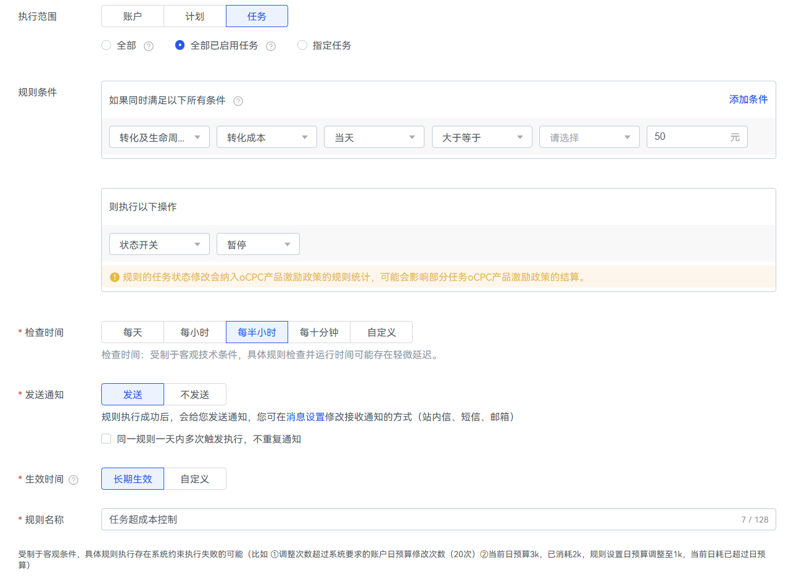

## 规则列表和运行记录

### 规则列表

<strong>自建规则</strong>

1. “投放平台”-&gt;“计划”/“任务”和“工具”-&gt;“投放辅助”-&gt;“自动盯盘”
   - 推广计划入口

   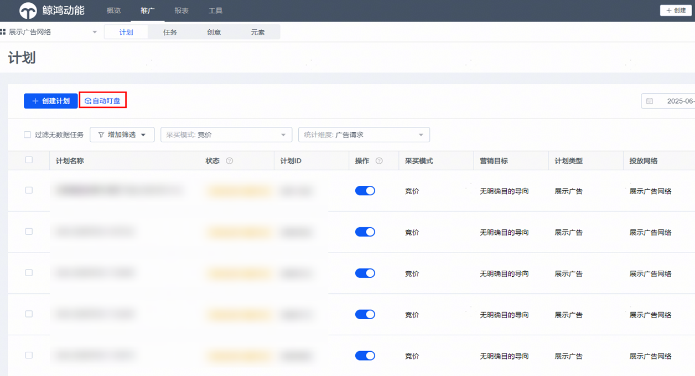

   - 工具入口

   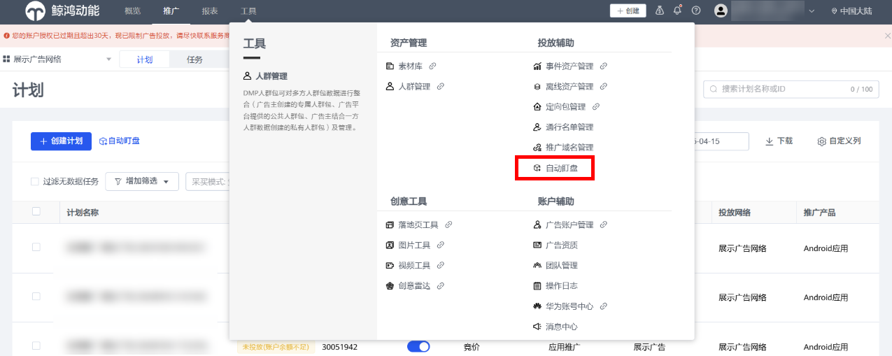
2. 单击“新建规则”创建自动化规则。

   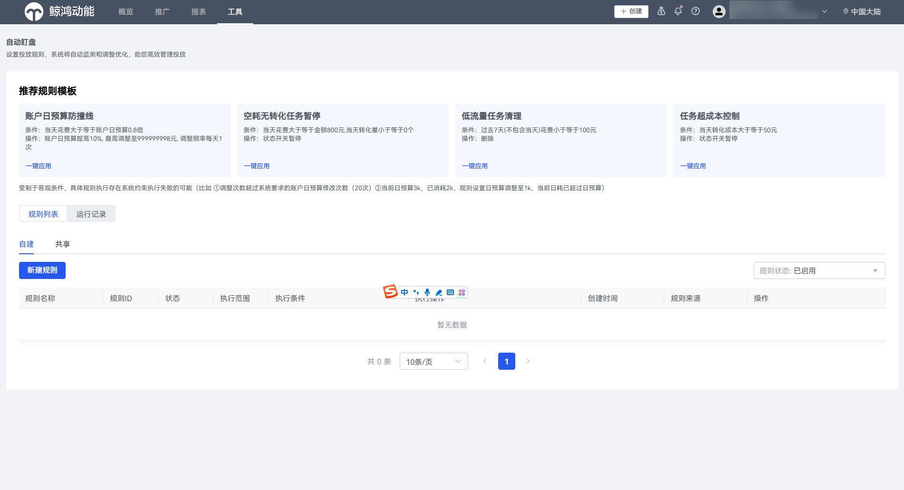

   自动化规则的创建包括设置执行范围，规则条件，执行操作、检查时间/时刻、发送通知、生效时间以及规则名称。

   系统将监控设置的满足条件，根据检查时间进行扫描。当达到条件时，对设置的执行范围，根据设置的执行操作进行调整。

   可支持设置三个级别的规则。

   - <strong>新建账户级规则</strong>

   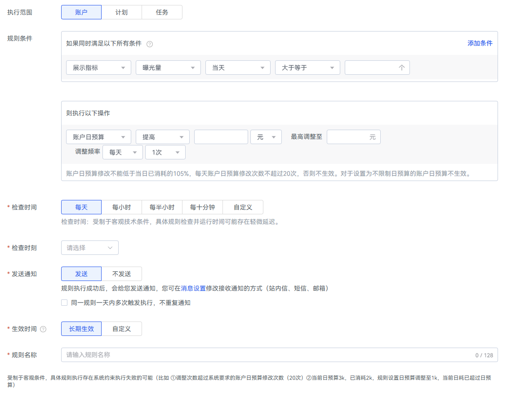

   <strong>执行范围：</strong>账户

   <strong>规则条件：</strong>

   1.多个规则条件取交集，同时满足所有自定义规则，操作调整生效

   2.单个指标只能被规则选中一次

   当天/过去3天/过去5天/过去7天；(不包含当天)

   <strong>执行操作：</strong>

   1.账户日预算（提高/预算降低/预算调整至）

   2.仅发送通知 (默认系统不操作)

   <strong>调整频率：</strong>每天/每周（1次/2次/3次/4次/5次/不限）

   <strong>检查时间：</strong>每天/每小时/每半小时/每十分钟/自定义

   <strong>检查时刻：</strong>00:00~23:30(每半小时可选)

   <strong>发送通知：</strong>发送/不发送 (规则执行成功后，会给您发送通知，您可在消息设置修改接收通知的方式（站内信、短信、邮箱)

   <strong>生效时间：</strong>规则生效期限 (长期生效/自定义日期范围)

   - <strong>新建计划级自动规则</strong>

   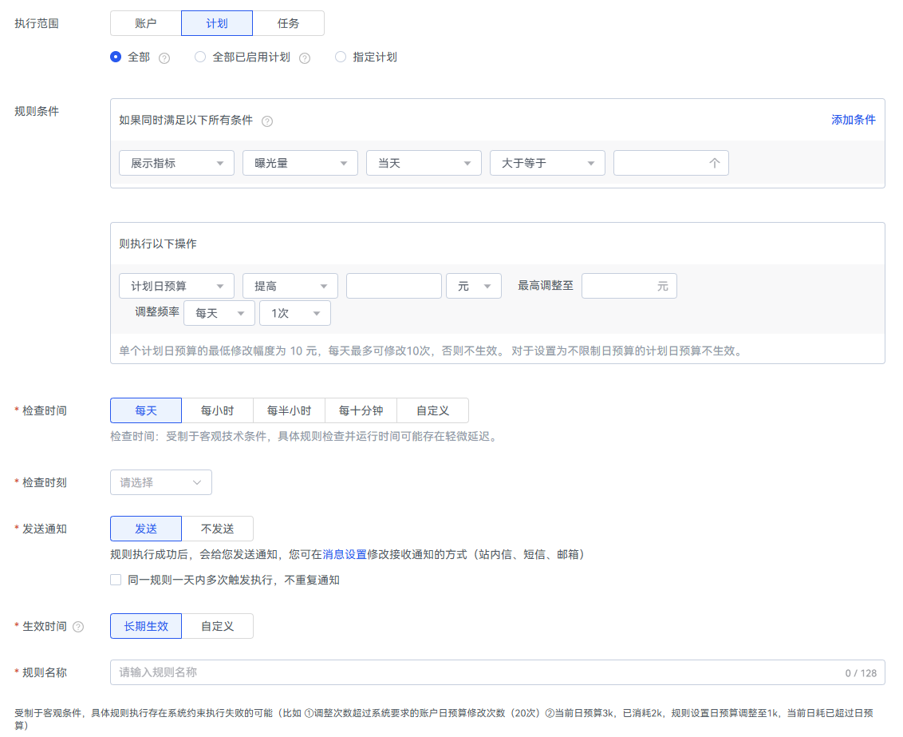

   <strong>执行范围：</strong>计划(可选全部、全部已启用计划和指定计划）

   <strong>规则条件：</strong>

   1.多个规则条件取交集，同时满足所有自定义规则，操作调整生效

   2.单个指标只能被规则选中一次

   当天/过去3天/过去5天/过去7天；(不包含当天)

   <strong>执行操作：</strong>

   1.计划日预算（提高/预算降低/预算调整至）

   2.状态开关（启用/暂停/暂停后次日开启）

   3.仅发送通知 (默认系统不操作)

   4.删除

   <strong>调整频率：</strong>每天/每周（1次/2次/3次/4次/5次/不限）

   <strong>检查时间：</strong>每天/每小时/每半小时/每十分钟/自定义

   <strong>检查时刻：</strong>00:00~23:30(每半小时可选)

   <strong>发送通知：</strong>发送/不发送 (规则执行成功后，会给您发送通知，您可在消息设置修改接收通知的方式（站内信、短信、邮箱)

   <strong>生效时间：</strong>规则生效期限 (长期生效/自定义日期范围)

   - <strong>新建任务级自动规则</strong>

   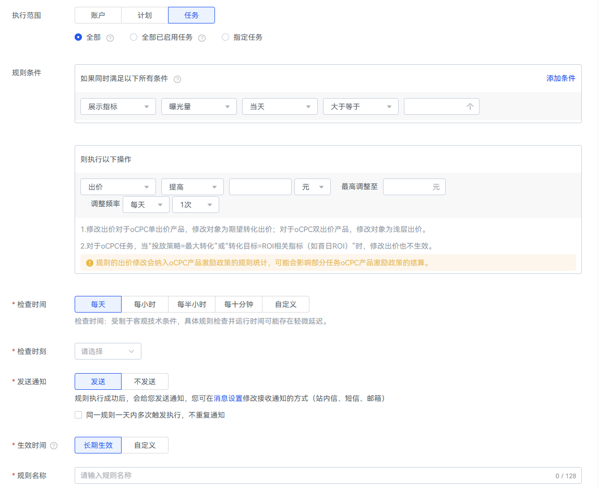

   <strong>执行范围：</strong>任务(全部、全部已启用任务和指定任务）

   <strong>规则条件：</strong>

   1.多个规则条件取交集，同时满足所有自定义规则，操作调整生效

   2.单个指标只能被规则选中一次

   当天/过去3天/过去5天/过去7天；(不包含当天)

   <strong>执行操作：</strong>

   1.出价（提高/降低/调整至）

   2.状态开关（启用/暂停/暂停后次日开启）

   3.仅发送通知 (默认系统不操作)

   4.删除

   <strong>调整频率：</strong>每天/每周（1次/2次/3次/4次/5次）

   <strong>检查时间：</strong>每天/每小时/每半小时/每十分钟/自定义

   <strong>检查时刻：</strong>00:00~23:30(每半小时可选)

   <strong>发送通知：</strong>发送/不发送 (规则执行成功后，会给您发送通知，您可在消息设置修改接收通知的方式（站内信、短信、邮箱)

   <strong>生效时间：</strong>规则生效期限 (长期生效/自定义日期范围)

    

   1.修改出价仅对CPC、CPM、oCPC任务生效，对于oCPC单出价产品，修改对象为期望转化出价；对于oCPC双出价产品，修改对象为浅层出价。

   2.对于oCPC任务，当“投放策略=最大转化”或“转化目标=ROI相关指标（如首日ROI）”时，修改出价也不生效。

   规则的出价修改会纳入oCPC产品激励政策的规则统计，可能会影响部分任务oCPC产品激励政策的结算。

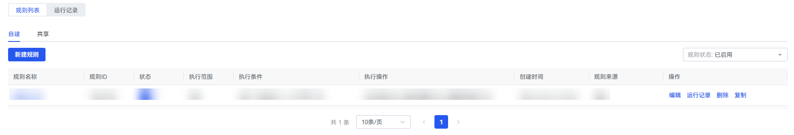规则列表中可查看已创建的规则规则ID，状态，执行范围、执行条件、执行操作操作、创建时间和规则来源，并且支持编辑，运行记录查看、删除和复制（非删除的任务只有100条，如超过100条，无法自建和共享规则，需进行删除。）

<strong>共享规则</strong>

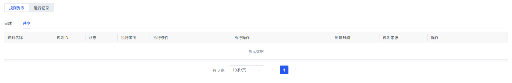单击规则列表中“共享”，您可以查看由经理账户共享给您的全部规则。

1.对于共享的规则，您享有使用权，但无法编辑其内容或状态； 2.每个共享规则均明确标注其“规则来源”，方便您快速了解该规则由哪位共享者提供； 3.支持复制共享规则; 4.若某条共享规则后续被来源账户删除，您仍可通过历史运行记录查询其过往的执行详情。

### 运行记录

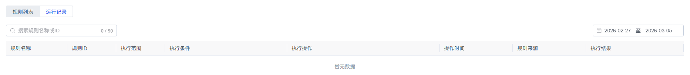查询运行记录，点击“运行记录”。

运行记录列表包含规则名称、规则ID、执行范围、执行操作、操作时间、执行结果。所有运行结果均可在运行记录中查询（搜索框可以输入要查询的规则ID，对该规则在查询日期范围内的运行记录进行查询），支持查看规则的执行结果详情（查看具体规则执行操作前后对比）。

 

1.规则条件的数据统计维度：转化回传。

2.自动规则的出价修改会纳入oCPC产品激励政策的规则统计，可能会影响部分任务oCPC产品激励政策的结算。

3.受客观技术条件的限制，规则检查和生效的具体时间可能存在一定延迟。

4.删除对应规则后，所有广告将不再应用该规则，且删除操作不可撤回。受制于客观条件，具体规则执行存在系统约束执行失败的可能（比如 ①调整次数超过系统要求的账户日预算修改次数（20次）②当前日预算3k，已消耗2k，规则设置日预算调整至1k，当前日耗已超过日预算）
