# 账号管理

## 一级服务商账户

如您登录一级服务商账户，可在“账号管理”中查看账户信息、发票信息、操作日志，还可以进行协作者管理和消息设置。

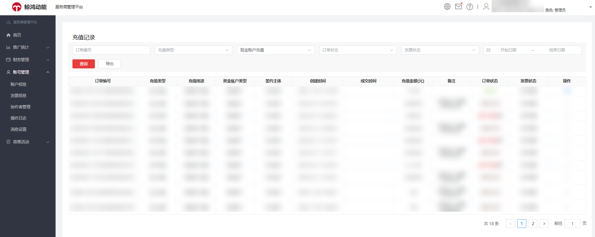

### 账户信息

您可点击“账号管理”-&gt;“账户信息”查看账户信息，包括企业信息、近一年财报、联系人信息、协议签署记录等内容。您可修改编辑，修改完成后点击提交。

- 若您进行企业信息认证时认证方式选择“对公银行打款认证”，当您修改法定代表人姓名和法定代表人身份证号码时会触发账户审核。
- 若您进行企业信息认证时认证方式选择“企业资料人工审核认证”，当您修改证件、统一社会信用代码、法定代表人身份证时会触发账户审核。

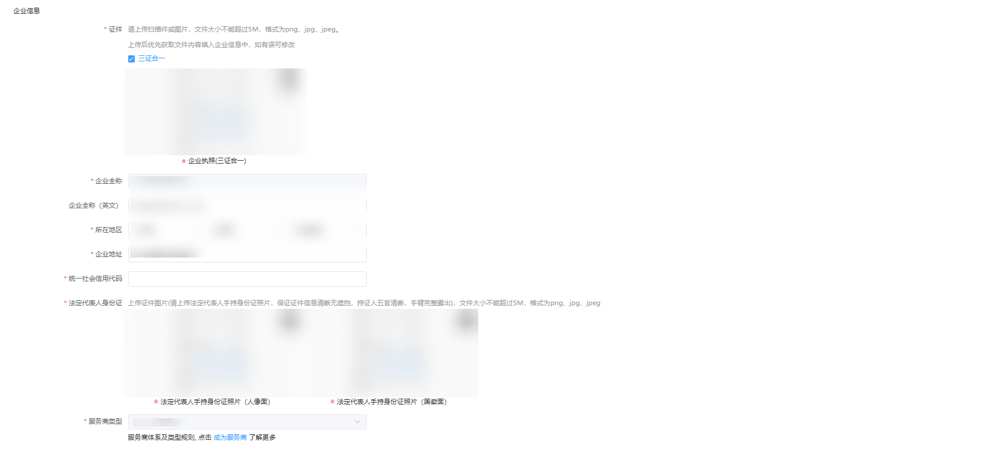

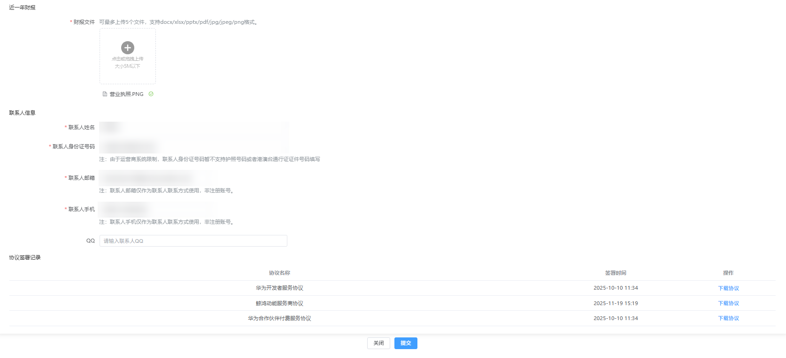

### 发票信息

您可点击“账号管理”-&gt;“发票信息”进入发票信息页面，如您需修改发票信息，点击“修改信息”进入编辑页面，修改完成后保存修改即可。

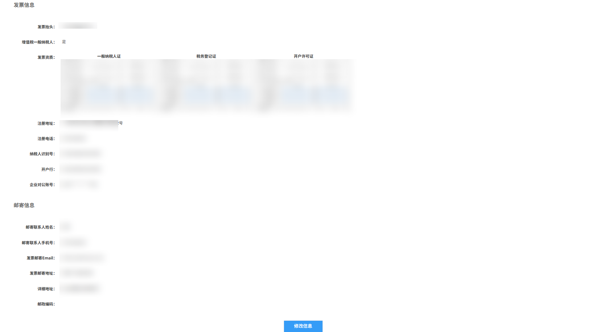

### 协作者管理

您可通过“账号管理”-&gt;“协作者管理”管理协作者，一级服务商可以添加多个协作者，协助进行账户管理。

协作者角色分为观察员、操作员、财务，不同角色权限如下表所示：

| 服务商界面操作权限 | 观察员 | | 操作员 | | 财务 | |
| --- | --- | --- | --- | --- | --- | --- |
| 服务商类别 | 一级 | 二级 | 一级 | 二级 | 一级 | 二级 |
| 首页新增（邀请）按钮 | - | - | √ | √ | - | - |
| 转账 | - | - | - | - | √ | √ |
| 编辑下级账户信息 | - | - | √ | √ | - | - |
| 进入下级账户 | - | - | √ | √ | - | - |
| 查看下级账户列表 | √ | √ | √ | √ | √ | √ |
| 查看子客服务商消耗统计 | √ | - | √ | - | √ | - |
| 查看子客消耗统计 | √ | √ | √ | √ | √ | √ |
| 充值 | - | - | - | - | √ | - |
| 查看充值记录 | √ | - | √ | - | √ | - |
| 查看转账记录 | √ | √ | √ | √ | √ | √ |
| 查看账户信息 | √ | √ | √ | √ | √ | √ |
| 查看操作日志 | - | - | √ | √ | - | - |

 

（1）每个操作员之间数据独立，A操作员无法操作B操作员账户内新添加的账户。

（2）子客服务商管理员分配的操作员角色可管理的账户，为已开户的广告账户。

（3）同一个华为账号只能被一个服务商账户添加为协作者，且只能指定一种角色。

<strong>添加协作者</strong>

使用管理员账号，登录鲸鸿动能服务商管理平台，单击“账号管理”-&gt;“协作者管理”-&gt;“添加协作者”，选择角色类型和输入华为账号后单击确定即可。

 

此处的华为账号必须未注册过其它账户类型（包括直客、服务商、子客服务商、子客、协作者、团队账号、经理账户）。

如您还没注册华为账号，注册流程可参考：[华为账号](/docs/monetize/promotion/ads-hwzh-0000002188054913)。

账户持有者可以查看协作者列表，对协作者进行成员分配、查看、编辑、删除等操作。

- 成员分配：服务商可以将下一级的账户进行角色（观察员、财务、操作员）分配，每个角色拥有账户的不同权限。
- 查看成员：单击每个协作者的成员数量列，您可以看到该协作者管理的账户ID和企业名称。
- 编辑：单击“编辑”时，管理员可以修改该协作者的角色类型，即从当前角色类型修改为其他角色类型。
- 删除：支持删除协作者，删除后如果该成员想重新成为协作者，需要使用新的手机号或邮箱注册华为账号。

### 操作日志

您可单击“账号管理”-&gt;“操作日志”查看历史操作记录，准确记录您账户及协作者账户、子客服务商账户的每次操作。

- 您可查看到操作对象、操作内容、操作形式、变更项、变更前、变更后、操作时间、操作者账号等信息。
- 您可以通过操作对象、形式和具体日期筛选查询。

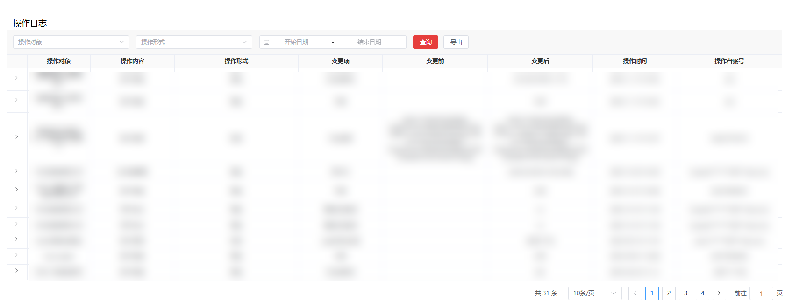

### 消息设置

您可单击“账号管理”-&gt;“消息设置”进入消息设置页面，在这您可以修改账户绑定手机号码及邮箱，可根据需要针对不同消息类别勾选站内信、邮箱、手机短信三种消息通知渠道。

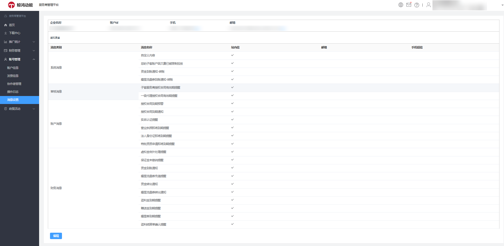

## 子客服务商账户

### 账号管理

您可单击“账号管理”-&gt;“账户信息”查看账户信息，包括企业信息、联系人信息、协议签署记录等内容。

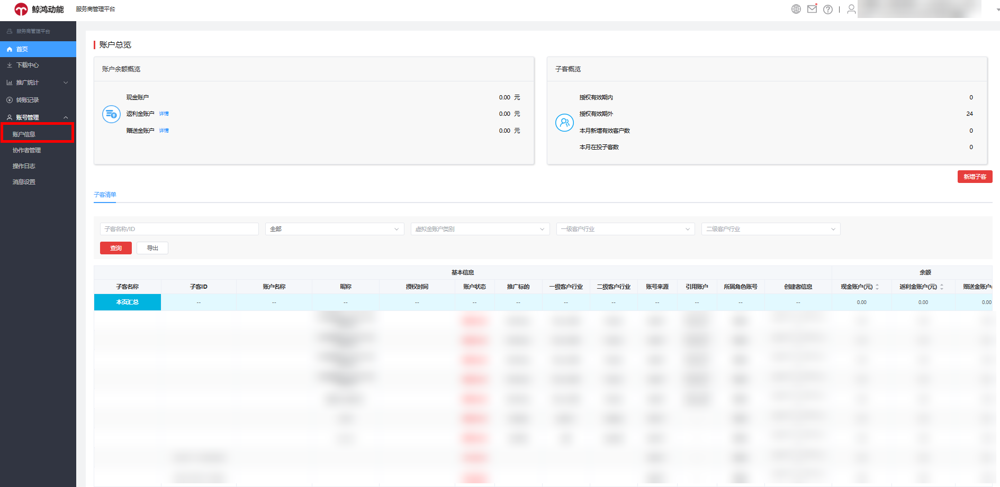

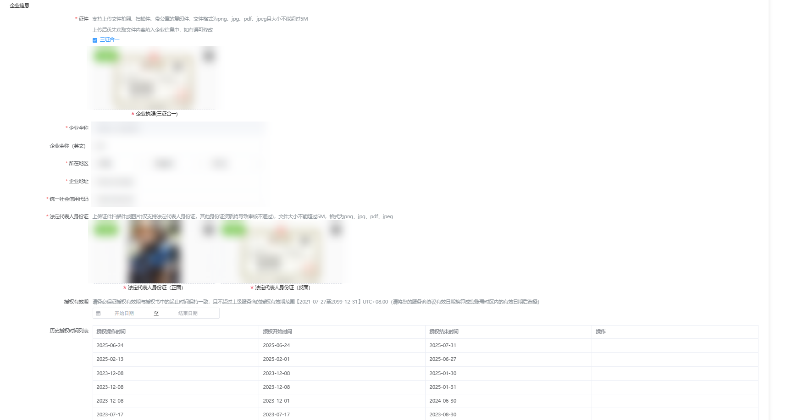

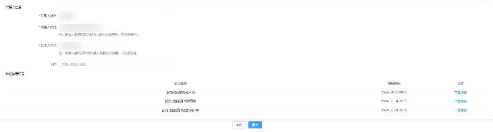

### 协作者管理

<strong>添加协作者</strong>

使用管理员账号，登录鲸鸿动能服务商管理平台，单击“账号管理”-&gt;“协作者管理”-&gt;“添加协作者”，选择角色类型和输入华为账号后单击确定即可。

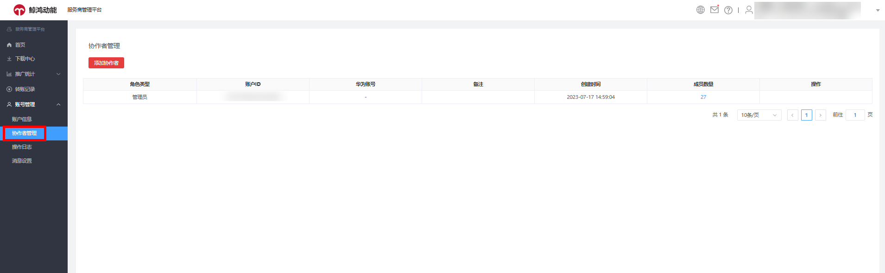

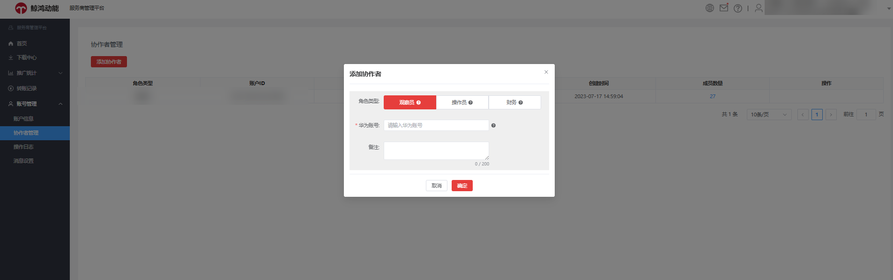

 

此处的华为账号必须未注册过其它账户类型（包括直客、服务商、子客服务商、子客、协作者、团队账号、经理账户）。

如您还没注册华为账号，注册流程可参考：[华为账号](/docs/monetize/promotion/ads-hwzh-0000002188054913)。

账户持有者可以查看协作者列表，对协作者进行成员分配、查看、编辑、删除等操作。

- 成员分配：服务商可以将下一级的账户进行角色（观察员、财务、操作员）分配，每个角色拥有账户的不同权限。
- 查看成员：单击每个协作者的成员数量列，您可以看到该协作者管理的账户ID和企业名称。
- 编辑：单击“编辑”时，管理员可以修改该协作者的角色类型，即从当前角色类型修改为其他角色类型。
- 删除：支持删除协作者，删除后如果该成员想重新成为协作者，需要使用新的手机号或邮箱注册华为账号。

### 操作日志

您可单击“账号管理”-&gt;“操作日志”查看历史操作记录，准确记录您账户及协作者账户等每次操作。

- 您可查看到操作对象、操作内容、操作形式、变更项、变更前、变更后、操作时间、操作者账号等信息。
- 您可以通过操作对象、形式和具体日期筛选查询。

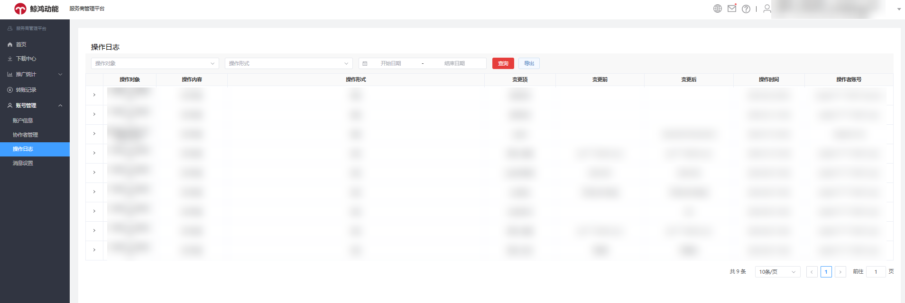

### 消息设置

您可单击“账号管理”-&gt;“消息设置”进入消息设置页面，在这您可以修改账户绑定手机号码及邮箱，可根据需要针对不同消息类别勾选站内信、邮箱、手机短信三种消息通知渠道。

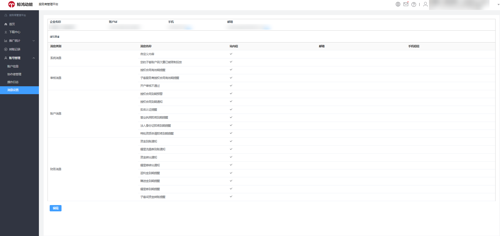
