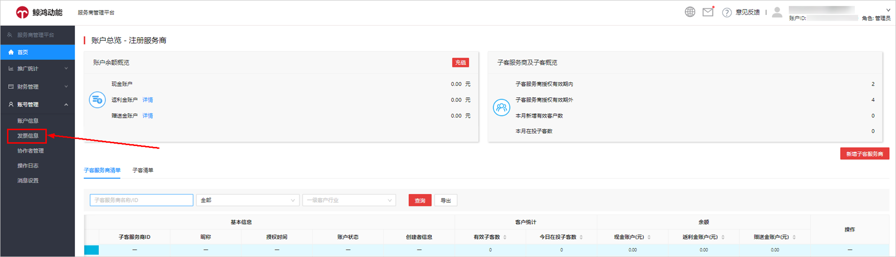
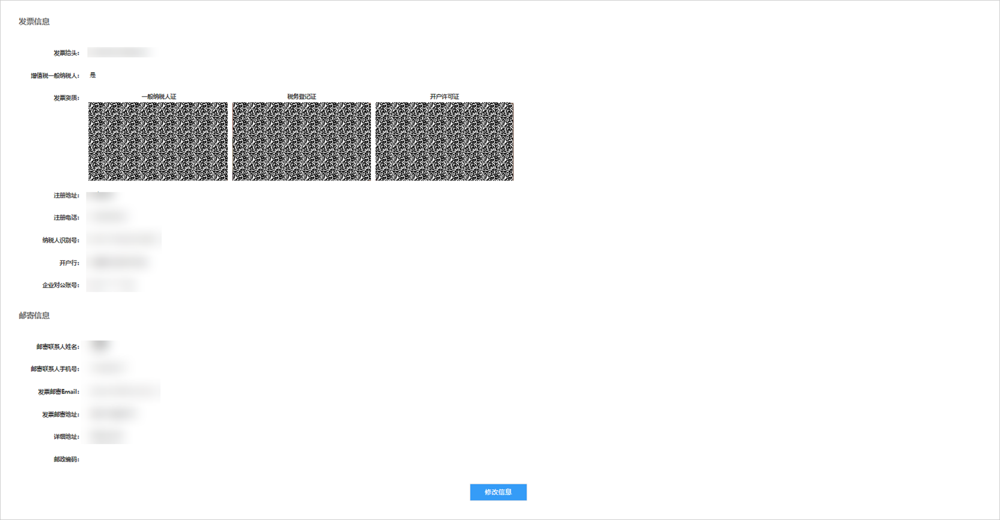
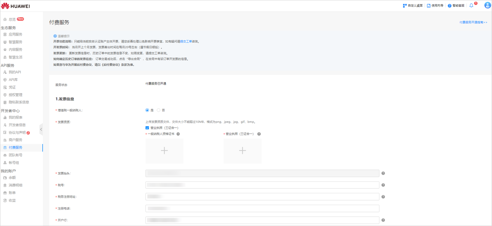
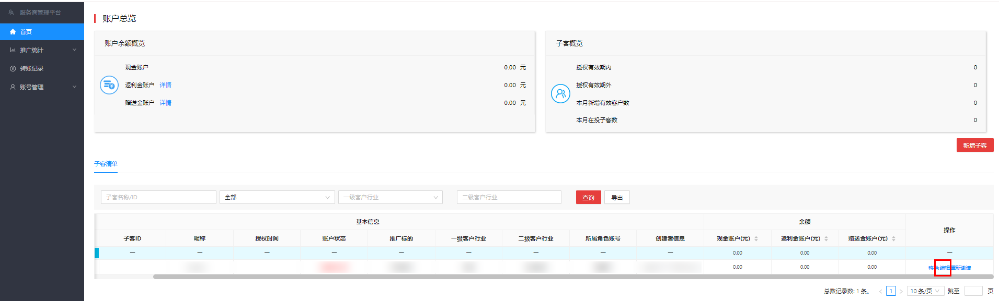
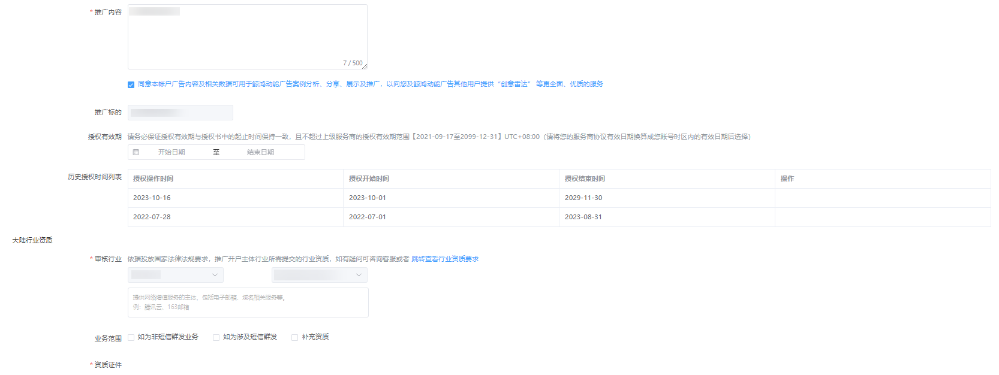
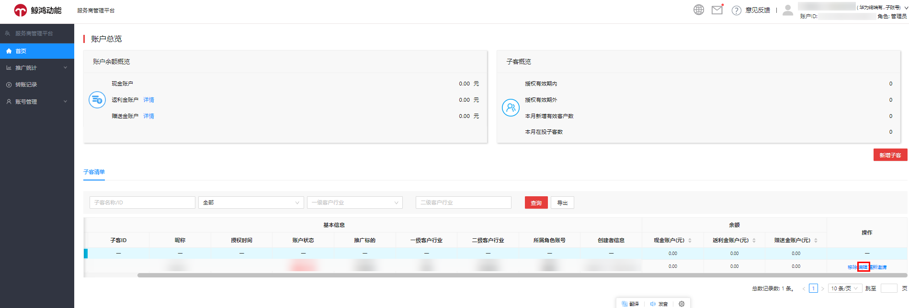
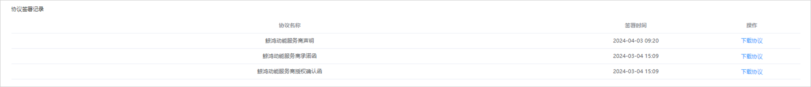
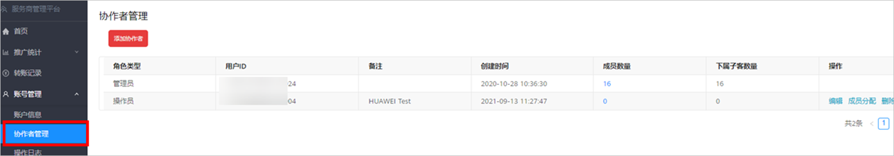

# FAQ

## 服务商账户注册

<strong>Q1：</strong> <strong>注册鲸鸿动能服务商的资质要求中“具有广告代理资质”是指什么？</strong>

<strong>A：</strong>“具有广告代理资质”指的是营业执照中包含广告代理业务。

<strong>Q2：</strong> <strong>如果公司主体之前注册过鲸鸿动能其他账户类型或接入过开发者联盟业务，该如何注册鲸鸿动能服务商账户？</strong>

<strong>A：</strong>若公司主体在注册鲸鸿动能服务商之前，曾注册过鲸鸿动能其他账户或接入过开发者联盟业务（如：开发者业务、应用市场业务、流量变现业务等），请您务必先联系[鲸鸿动能客服](https://smartrobot-drcn.platform.dbankcloud.cn/?appId=31000)或者BD人员，在其指导下进行后续注册流程。

<strong>Q3：极速开户账户如何销户？</strong>

<strong>A：</strong>当被复制账户的资质已被使用进行快速开户，需要将复制出来的账户进行销户后才能将被复制账户进行销户处理。

## 服务商充值与开票

<strong>Q1：</strong> <strong>服务商充值后如何开发票？</strong>

<strong>A：</strong>在[联盟后台](https://developer.huawei.com/consumer/cn/console#/serviceCards/AppService)充值成功后，如您单击“申请开票”，系统将于30个工作日内寄出发票，如您未单击“申请开票”，系统将于15个工作日后自动触发开票申请，于开票申请触发后30个工作日内寄出发票。

<strong>Q2：</strong> <strong>是否可以按消耗开发票？</strong>

<strong>A</strong>：不可以，目前仅支持按充值金额开发票。

<strong>Q3：</strong> <strong>服务商如何为子客转账？</strong>

<strong>A</strong>：在服务商管理平台首页“子客清单”中找到对应客户，单击“转账”进行操作。

<strong>Q4：如何修改发票信息或联系人寄送地址？</strong>

<strong>A：</strong>有两个路径可以修改

<strong>路径一：</strong>登录一级服务商账户，单击“账号管理”-&gt;"发票信息”<strong>，</strong>在修改信息页面处可以修改发票信息和联系人寄送地址。

<strong>路径二:在华为开发者联盟管理中心查看&修改发票信息，</strong>使用鲸鸿动能广告一级服务商账户的华为账号登录[华为开发者联盟管理中心](https://developer.huawei.com/consumer/cn/console)，在“<strong>开发者中心</strong>”-&gt;“<strong>付费服务</strong>”中维护税务信息，鲸鸿动能广告平台将根据此处的税务信息为您开具发票。

## 服务商后台管理

<strong>Q1：</strong> <strong>怎么判断一个客户在不在某服务商服务范围内？</strong>

<strong>A：</strong>各领域的行业划分参考如下：

- <strong>N1行业分类</strong>：电商、影音、阅读、房产家居、生活服务、社交、在线教育、工具、汽车出行服务、旅游、在线金融、新闻资讯、游戏。
- <strong>N2行业分类</strong>：日化美妆、食品饮料、服饰箱包、电子电器、母婴用品、运动户外、玩具乐器、汽车出行、教育培训、地产家居家装、金融、便民生活、其它。
- <strong>N3行业分类</strong>：直投电商、招商加盟、美容植发、本地服务、本地房产、本地婚纱、本地餐饮、本地教育。

以上行业仅供参考，以官网[服务商页面](https://ads.huawei.com/usermgtportal/home/index.html#/agent)公布的行业为准，若有疑问请联系[在线客服](https://smartrobot-drcn.platform.dbankcloud.cn/?appId=31000)。

<strong>Q2：子客服务商后台的推广标的如何填写？</strong>

<strong>A：</strong>KA客户支持直接下拉选择“推广标的”。非KA客户可手动填写“推广标的”，如推广APP，则填写APP的名称；推广网页，则填写具体推广内容，如XX品牌宣传等。详细开户指导，可查看官网信息“客户开户流程”&lt;https://developer.huawei.com/consumer/cn/doc/distribution/promotion/ads_kaihu01-0000001185834834&gt;。

<strong>Q3：子客账户的推广标的/客户行业/审核行业在哪里修改？</strong>

<strong>A：</strong>登录子客服务商后台，选择相应的子客账户，单击“编辑”页面，可以进行推广标的、客户行业、审核行业的修改。

 

子客清单中，“推广标的”为蓝色支持修改。

<strong>Q4：</strong> <strong>子客服务商后台中，在子客清单界面修改子客账户的 推广标的或一级客户行业之后，为什么账户状态没有呈现审核中？？</strong>

<strong>A：</strong>在子客清单修改之后，还需要单击账户的“编辑”，进入账户信息页面修改完并提交才会触发审核。

<strong>Q5：邀请邮箱和华为账号必须同一个吗？</strong>

<strong>A：</strong>不需要，邀请邮箱仅作为接收华为邮件用途，可多次使用。

<strong>Q6：服务商账户签署的协议在哪里查看？</strong>

<strong>A：</strong>单击“账号管理”-&gt;"账号信息”，在账号信息页面底部可以看到协议签署记录，在此处可以下载《华为开发者服务协议》、《鲸鸿动能服务商协议》、《华为合作伙伴付费服务协议》以及业务合作协议等。

<strong>Q7：保证金条款在哪里查看？</strong>

<strong>A：</strong>如该业务存在需缴纳的保证金，对应保证金条款可在服务商合作协议信用管理条款处查看，具体以实际签署的协议内容为准。

<strong>Q8：如何缴纳保证金？</strong>

<strong>A：</strong>服务商需按照合作协议中约定的金额和付款期限，由所开账户同企业主体的对公银行账户，以线下对公打款的方式，向华为账户（账户信息请查看合作协议付费条款）打款。注意：打款时需在打款备注中填写【保证金】等相关内容，以便系统校验打款用途。

<strong>Q9：</strong> <strong>保证金是否可以开票？</strong>

<strong>A：</strong>保证金不开具发票，仅可开具收据。服务商可通过线下邮件申请的形式向华为申请收据。注意：收据收到后需妥善保管，后续保证金退款时需收回。

申请邮箱：mspadmin@huawei.com 邮件中需体现，企业名称、需要的收据正文文案以及保证金打款凭证。

<strong>Q10：已过审的账户能不能再次修改推广标的？</strong>

<strong>A：</strong>子客服务商后中，“推广标的”置灰不可修改，呈蓝色字体才能修改。

<strong>Q11：如何编辑、管理协作者</strong>？

<strong>A</strong>：账户持有者可以查看协作者列表，对协作者进行成员分配、查看、编辑、删除等操作。

- 成员分配：服务商可以将下一级的账户进行角色（观察员、财务、操作员）分配，每个角色拥有账户的不同权限。
- 查看成员：单击每个协作者的成员数量列，您可以看到该协作者管理的账户ID和企业名称。
- 编辑：单击“编辑”时，管理员可以修改该协作者的角色类型，即从当前角色类型修改为其他角色类型。
- 删除：支持删除协作者，删除后如果该成员想重新成为协作者，需要使用新的手机号或邮箱注册华为账号。

  
