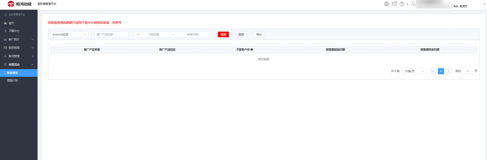
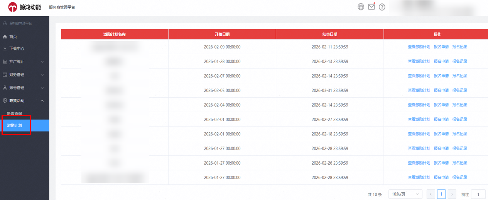
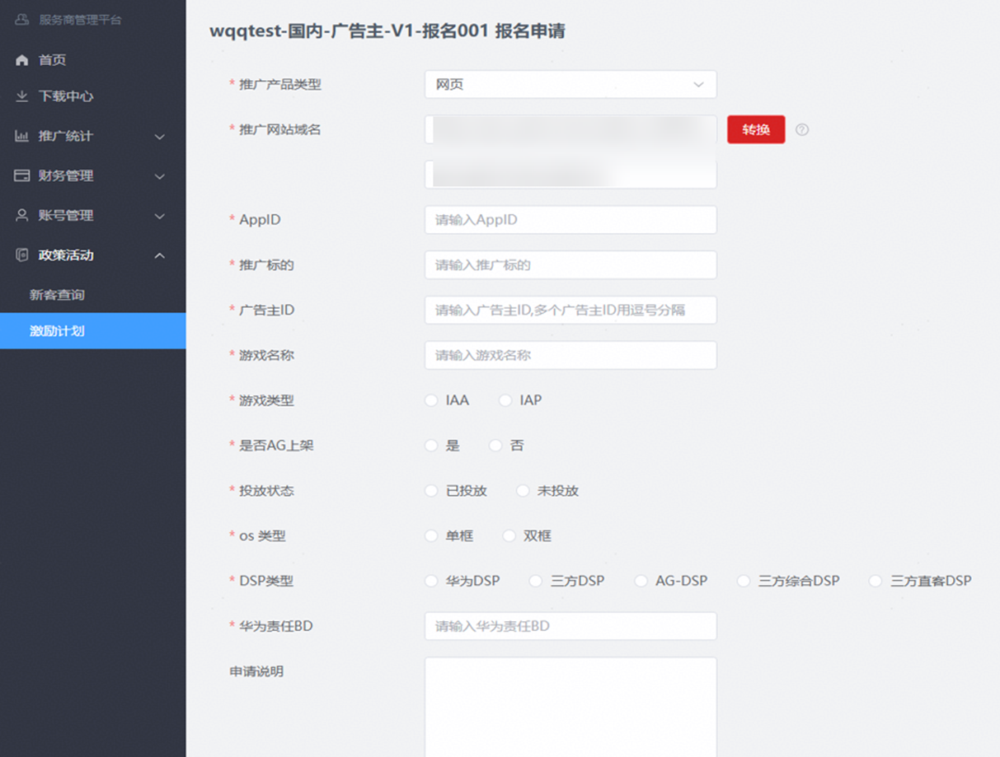
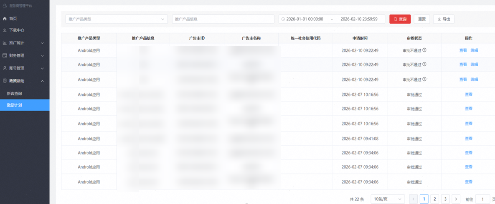

# 政策活动

## 新客查询

为推动激励政策全面线上化，提升新客管理效率与数据准确性，服务商管理平台现已支持新客自动报名及消耗数据精细化统计功能，实现系统化自动计算，降低人工操作风险。具体说明如下：

星火计划新客自动报名逻辑：

1)新客判定：校验N1服务商（普通）、N2服务商的全局消耗，当一个推广产品当日产生竞价消耗时，系统将校验其过去180天内是否有历史消耗。若无消耗记录，则自动判定为新客。

2)生效周期：首次被判定为新客后，该产品将进入为期90天的“新客期”。在此后的180天内，系统不再对其进行重复校验

3)约束限制：

①广告平台：鲸鸿动能DSP

②广告主类型：商业广告主

③推广产品类型：安卓应用、快应用、鸿蒙原生应用、元服务、网页（不含维纳斯落地页）

④地区与主体：仅限中国大陆，且签约主体为华为软件技术有限公司

⑤服务商类型：仅限于FSD N1普通服务商与FSD N2服务商

⑥新客期截止：新客权益有效期截止日不超过2026年12月31日

<strong>操作路径如下：</strong>

- 新客数据查询路径（适用于星火计划）：服务商可前往：“服务商管理平台”&gt;“政策活动”&gt;“新客查询”，即可便捷直达功能页面，查看名下新客相关数据。

## 激励计划

服务商现可通过服务商平台“政策活动”-&gt;“激励计划”模块，在线查看激励计划、提交报名申请并查看报名记录。

<strong>服务商线上报名申请激励政策活动操作指导：</strong>

①线上报名入口：服务商登录管理平台后，可通过“政策活动 ”&gt;“激励计划”&gt;“报名申请”路径提交报名。

②信息填写：报名表字段根据具体政策动态生成，均为必填项；选择不同推广产品类型时，系统将提示填写对应的产品信息。

③便捷录入：推广网页链接可输入长链接，系统自动提取域名，不支持维纳斯落地页报名；推广标的支持自动查询与带出，若无法查询则需手动输入。

④报名主体校验：服务商报名时需填写广告主ID，系统将验证该广告主必须为其名下子客。

⑤报名限制：同一推广产品或同一统一社会信用代码，在成功报名后即被锁定，不可重复报名。

⑥客群限制：暂不支持新客报名（备注：满足新主体+第一个推广的应用/域名，两个条件均满足即可判定为新客）。

<strong>服务商查询激励政策活动报名记录：</strong>

①快速查询与筛选：登录服务商平台后依次进入“政策活动”&gt;“激励计划”&gt;“ 报名记录”，可根据产品类型、产品信息及报名时间快速筛选查询报名记录。

②审核状态：审核不通过的记录可查看具体驳回原因，并支持编辑。

③详情查看：点击“查看”可浏览报名详情。

④数据导出：支持导出报名记录。

<strong>服务商报名激励政策活动审核通知：</strong>

①审核通过后，系统自动发送站内信通知，可第一时间确认报名成功状态。

②若报名未通过，站内信将清晰说明具体驳回原因。
