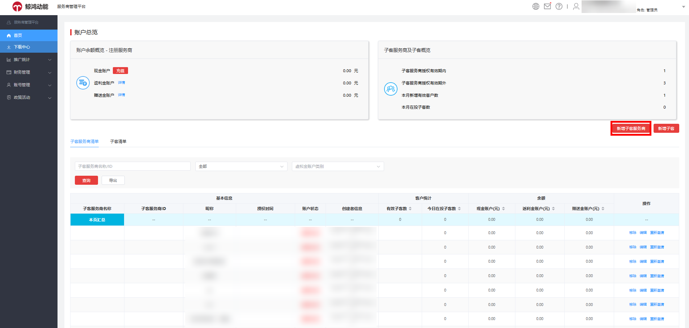
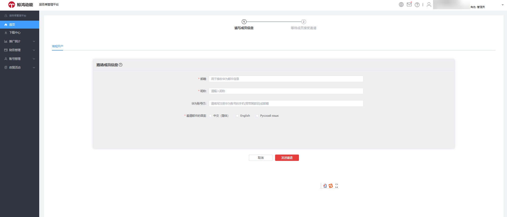
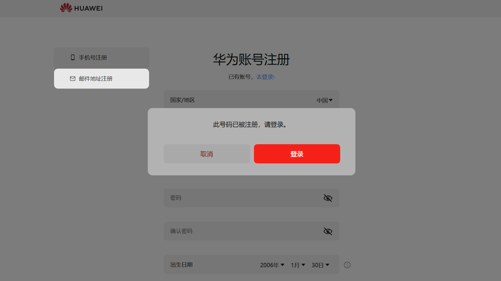
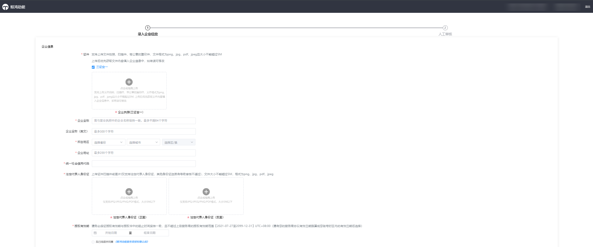
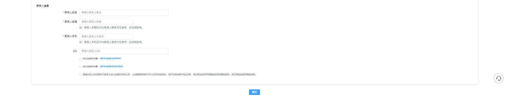

# 子客服务商注册

## 子客服务商账户开通步骤

1. <strong>一级服务商发送开户邀请</strong>

   您可以通过[鲸鸿动能官网](https://ads.huawei.com)登录一级服务商账户后，在首页单击<strong>“新增子客服务商”</strong>，进入邀请界面。

   

   依次输入邀请信息后单击发送邀请，平台会向被邀请对象的邮箱发送一封开户邀请邮件。

   - 邮箱：用于接收华为邮件信息
   - 昵称：请输入昵称
   - 华为账号：请填写注册华为账号的手机（需带国家码）或邮箱
   - 邀请邮件的语言：选择所需语言，中/英/俄。

   
2. <strong>子客服务商</strong> <strong>注册华为账号</strong>

   子客服务商收到开户邀请邮件后，单击邮件中的注册链接，即可开始注册华为账号，支持邮箱注册和手机注册两种方式。

   若您的手机号此前已经注册过华为账号，输入验证码之后将会弹出“<strong>此号码已被注册，请登录</strong>”弹窗，此时请单击弹窗中的<strong>“登录”</strong>。

   
3. <strong>子客服务商进行企业信息认证</strong>：

   认证方式为“企业资料人工审核认证”，按页面内容提示填写，提交审核，审核结果将会通过邮件发送至您的邮箱。

   

   
