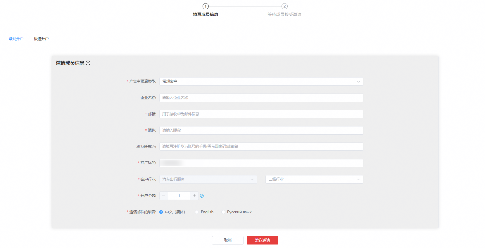
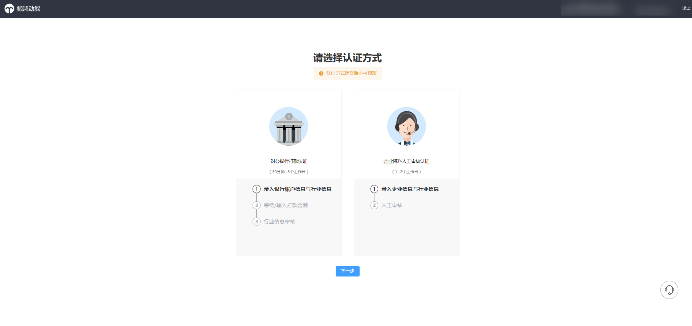
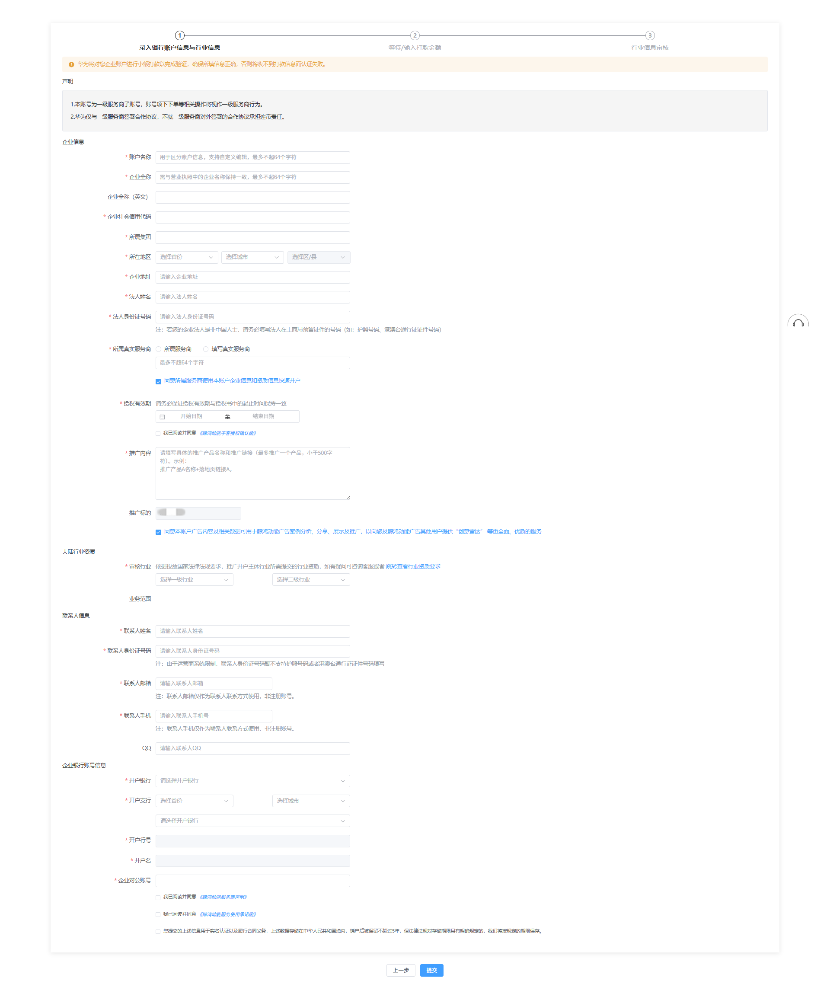
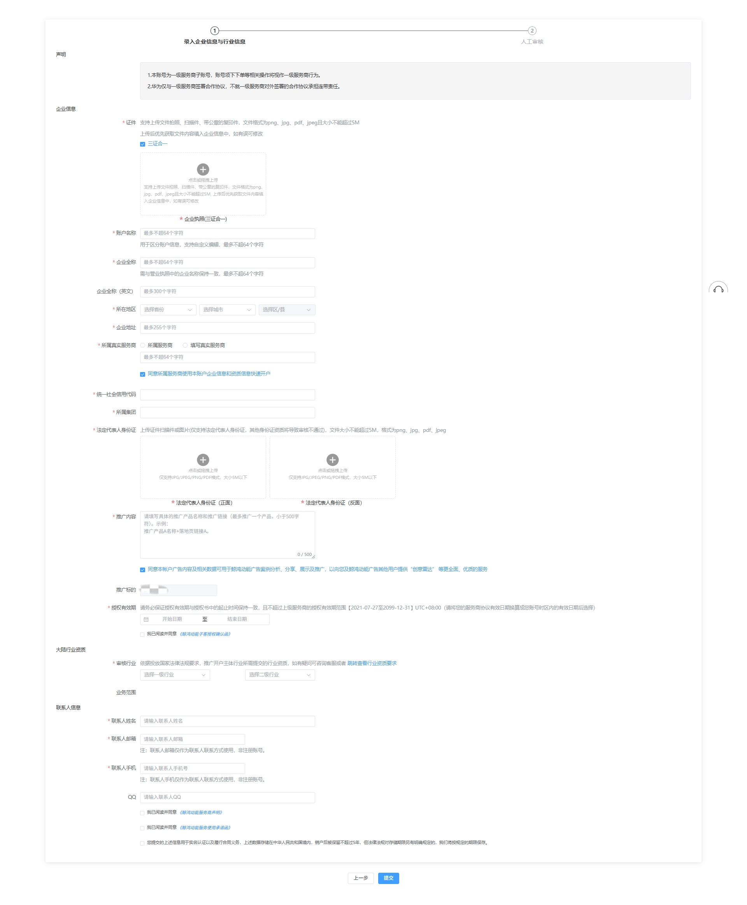
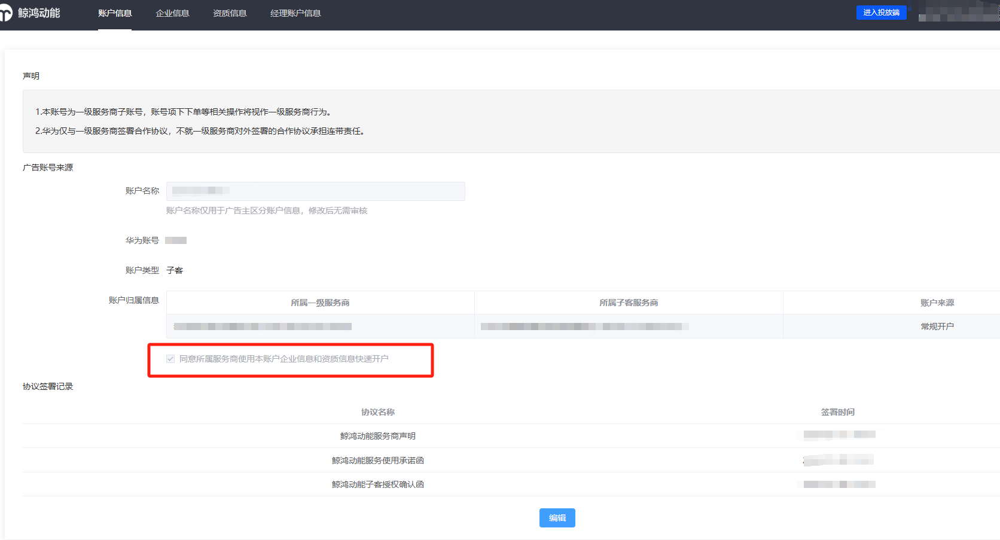
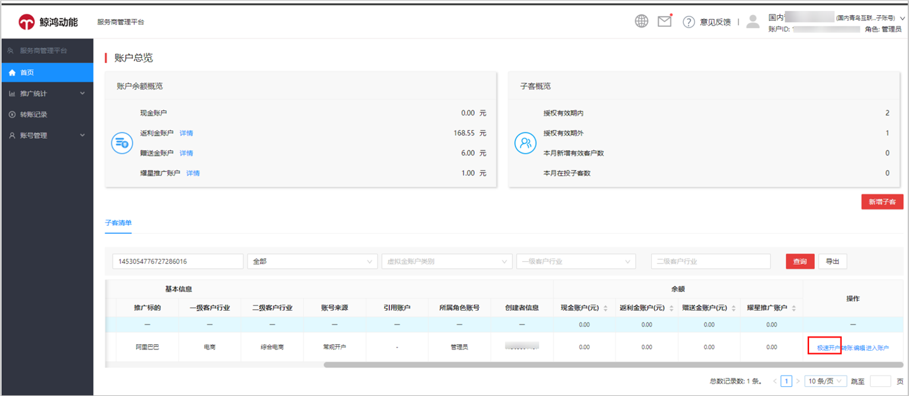
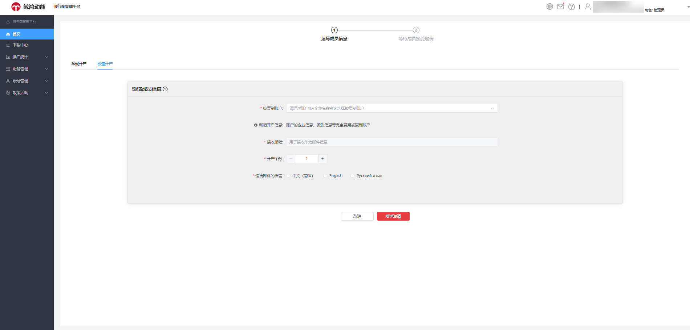
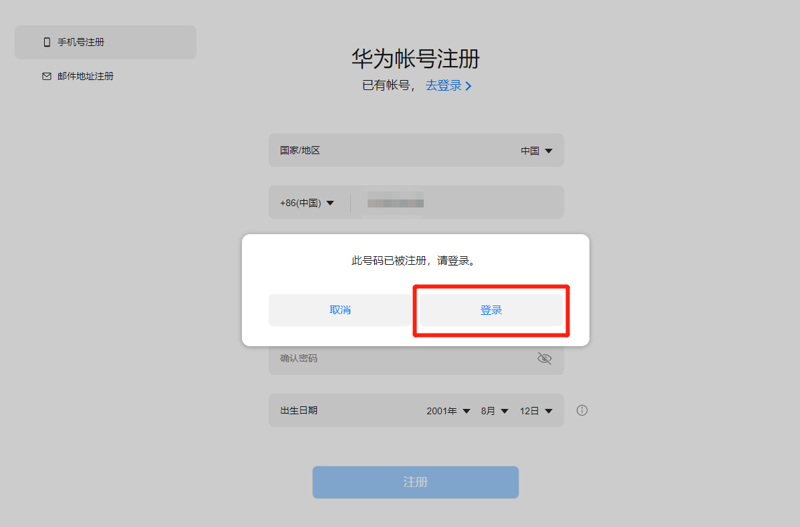
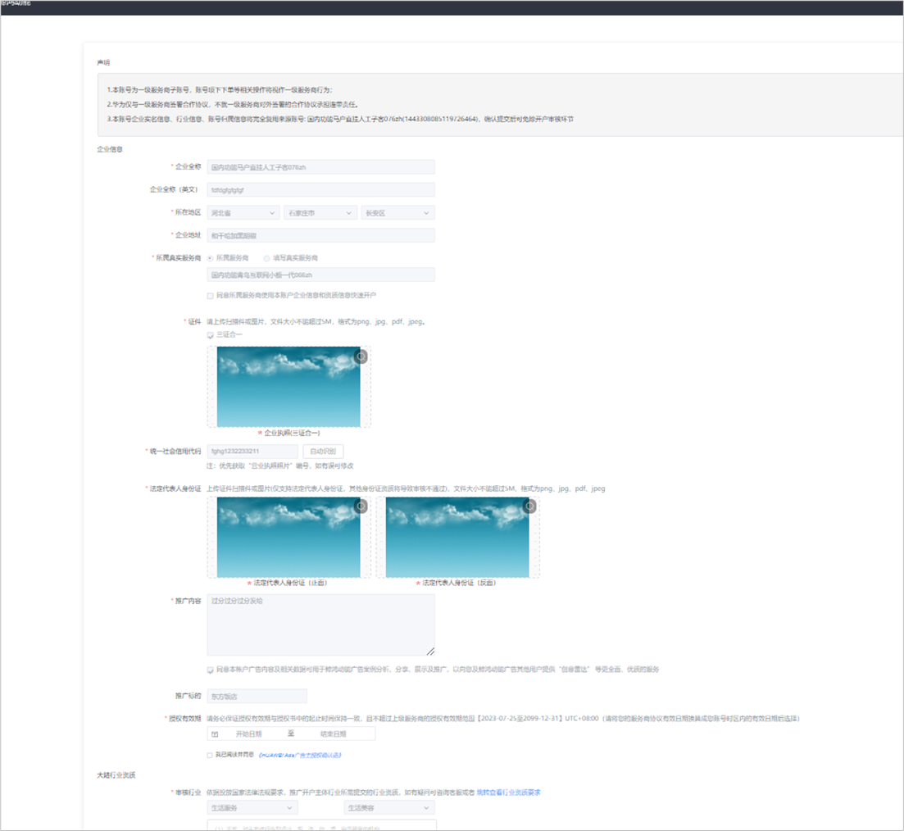
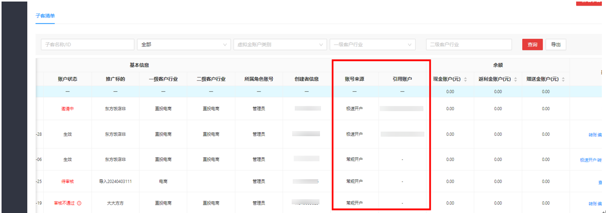

# 子客账户注册

## 子客账户常规注册流程

 

子客即广告主。

服务商在发起子客开户邀请时，支持单个华为账号一次性注册多个广告账户。只需在注册页面指定推广标的并设置开户个数，系统即可自动生成多条结构相同的广告账户信息，统一关联至同一华为账号下。（备注：本功能适用于单华为账号开通多个同企业主体、同推广标的账户的场景；若需使用不同华为账号开户，需单独发起开户邀请。）

### 开户步骤

1. <strong>服务商发送开户邀请</strong>

   服务商工作人员使用服务商账户和子客服务商账户的华为账号登录平台：&lt;https://ads.huawei.com/&gt;，单击<strong>“新增子客”</strong>，进入邀请界面。

   依次输入邀请信息后单击发送邀请，系统将会向广告主邮箱发送一封开户邀请邮件。

   

    

   “推广标的”填写：如推广App，则填写App的名称；如推广网页，则填写品牌名称。

   批量开户时支持一个华为账号最多绑定5个广告账户，支持通过一个邀请链接登录一个华为账号快速注册最多5个广告账户（常规开户信息填写页面，必须选“推广标的”后才会出现“开户个数”）
2. <strong>广告主</strong> <strong>注册华为账号</strong>

   广告主收到开户邀请邮件后，单击邮件中的注册链接，即可开始注册华为账号，支持邮箱注册和手机注册两种方式。

   若您的手机号此前已经注册过华为账号，输入验证码之后将会弹出“<strong>此号码已被注册，请登录</strong>”弹窗，此时请单击弹窗中的<strong>“登录”</strong>。

   
3. <strong>广告主进行企业信息认证</strong>

   完成华为账号注册之后，需要进行企业信息认证，认证方式可选“对公银行打款认证”或“企业资料人工审核认证”。

   

   <strong>A. 若您选择“对公银行打款认证”方式</strong>

   1）录入银行账户信息与行业信息：您需要填写企业信息，选择审核行业，上传行业资质，填写联系人信息及企业对公银行账号，并勾选相关协议。

   

    

   所属服务商：对应开户的时候给子客发送开户邀请的服务商；

   填写真实服务商：如客户确认自己合作的服务商和发送开户邀请的服务商不一致，可以自行填写真实服务商名称（用于后续建联的）

   2） 校验打款金额：等待/输入打款金额和填写打款附言（随机码）。华为开发者联盟会向您的对公银行账户进行小额打款，收到款项后请登录鲸鸿动能平台，输入收到的打款金额进行校验。

    

   1.对公打款认证仅有两次验证机会，请准确输入金额进行验证，如两次机会均验证失败可重新选择使用人工认证方式。

   2.打款附言（随机码）：请见银行汇款单备注、附言、用途、说明、附加信息、摘要出6位随机码。

   3.对公银行打款认证环节，打款账户主体名称为银联商务支付股份有限公司，以实际打款情况为准，打款账号随机，还请注意查收验证。

   3）提交审核，审核结果将会通过邮件发送至您的邮箱。

   <strong>B. 若您选择“企业资料人工审核认证”方式</strong>

   1）录入企业信息与行业信息：您需要填写企业信息，选择审核行业，上传行业资质，填写联系人信息，并勾选相关协议。

   2）提交审核，审核结果将会通过邮件发送至您的邮箱。

   

## 子客极速开户

### 概述

服务商可通过服务商管理平台自主发起极速开户，一键复制开户，令新账户免除提交资质和审核步骤，帮助提升老客户的重复开户效率。

 

- 子客引用账户与复制新账户的注册地必须一致。
- 当复制新账户的华为账号已经在开发者联盟进行开户注册时，不支持复制开户。

### 开户步骤

1. 子客引用账户（即授权账户）在注册时勾选“同意所属服务商使用本账户企业信息和资质信息快速开户”授权；或由已开通账户的子客账户通过华为账号密码登录鲸鸿动能平台，在账户信息页面勾选“同意所属服务商使用本账户企业信息和资质信息快速开户”授权。同时子客账户可在账户信息页面取消授权，取消授权则不允许服务商继续使用当前账户进行复制开户，历史已开通的账户不受影响，可继续使用投放广告。

   
2. 服务商登录服务商管理平台，在子客清单中选择可被复制的账户，在操作栏单击“极速开户”进入极速开户邀请页面。服务商管理平台的极速开户功能仅开放给管理员，操作员只能查看极速开户生成的广告账户。
3. 依次填写邀请信息后单击发送邀请，系统将会向接收邮箱发送一封极速开户邀请邮件。通过极速开户邀请邮件注册的广告账户信息将复用被复制账户。
   - 被复制账户：已开启极速开户授权且账户状态生效。
   - 接收邮箱：默认等于被复制账户的联系人邮箱。
   - 开户个数：支持单次发起最多5个账户的批量开户邀请，所有账户统一绑定至同一个华为账号；批量邀请仅需发送1封邀请邮件。
   - 邀请邮件的语言：中文（简体）、英文、俄文。

   
4. 您收到极速开户邀请邮件后，单击邮件中的注册链接，即可开始注册华为账号，支持邮箱注册和手机注册两种方式。

   若您的手机号此前已经注册过华为账号，输入验证码之后将会弹出“此号码已被注册，请登录”弹窗，此时请单击弹窗中的“登录”。

   
5. 完成华为账号注册之后，需要进行企业信息认证，认证方式可选“对公银行打款认证”或“企业资料人工审核认证”两种方式，详细步骤可参考子客常规注册流程中的企业信息认证。企业信息认证界面的信息除账户授权信息、广告资质和协议信息外，完全复用被复制账户信息，复用范围如下。
   - 企业营业执照、法定代表人、联系人信息。
   - 行业归属、行业资质信息。
   - 客户行业、服务商归属信息。
   - 风险等级、广告主角色、广告主账户等级。

   
6. 确认信息并提交，免除开户审核流程直接开户成功，您可在子客清单列表中查看到该账户。

   

    

   子客清单列表中的账户来源和引用账户，记录了当前子客账户的来源和所引用的账户，用于区分账户是常规开户还是极速开户生成。
