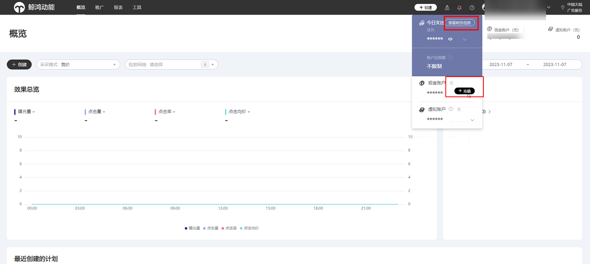
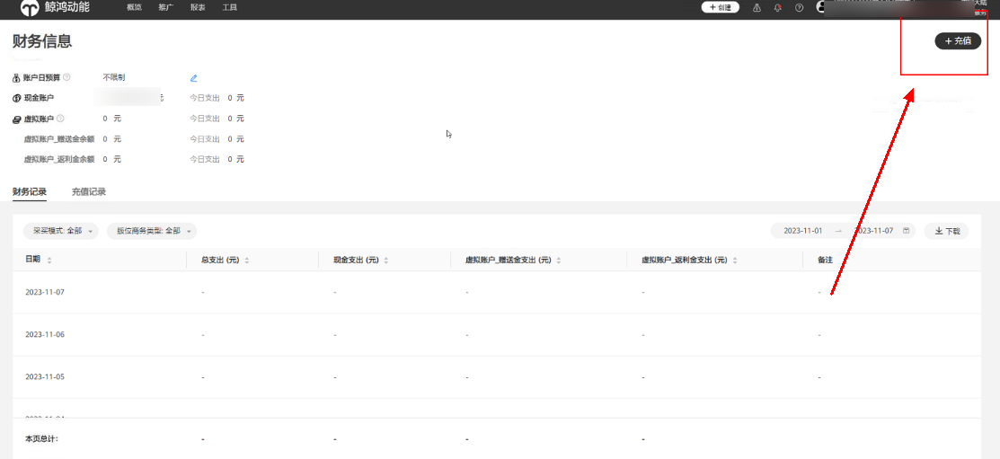
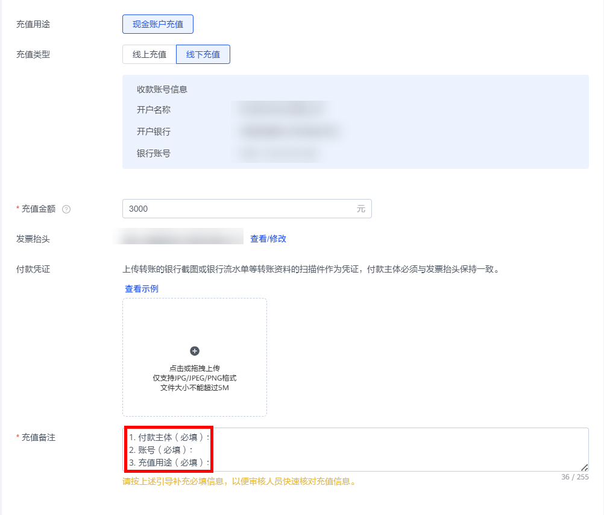
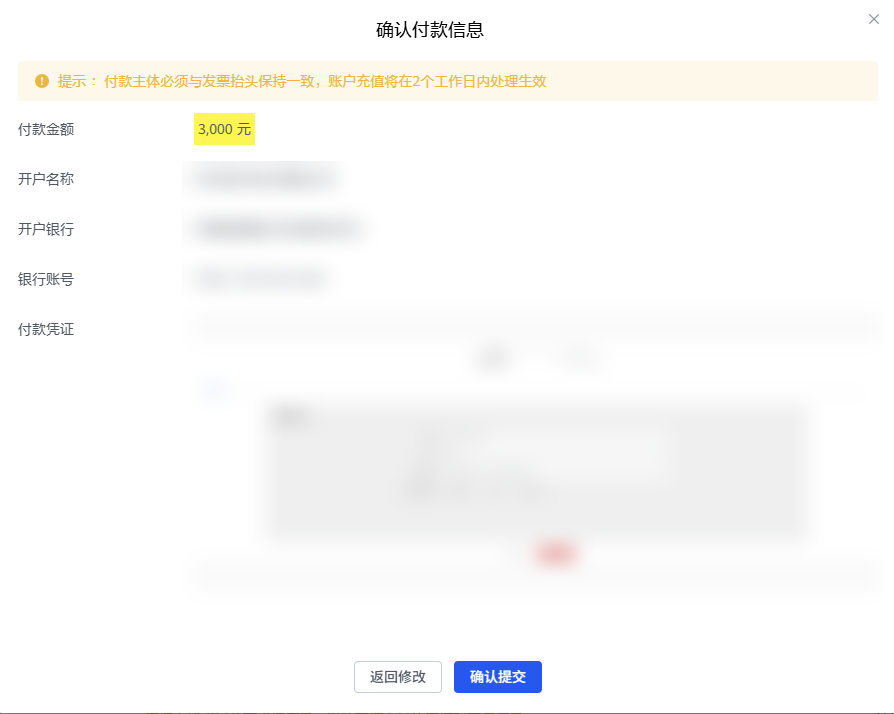
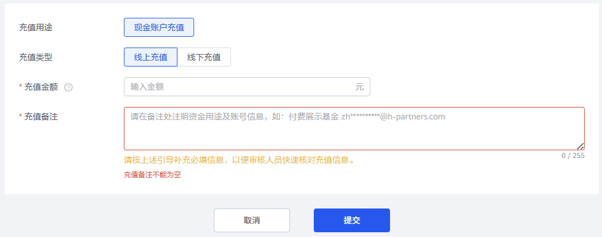

# 直客账户充值流程

## 概述

直客可直接在鲸鸿动能平台进行充值操作。

## 操作步骤

<strong>直客充值</strong>：直接登录投放端界面进线充值操作。

1. <strong>进入充值页面：</strong> 可以从投放端界面选择“查看财务信息”或“充值”，进入充值界面。

   
2. 单击“充值”，即可开始充值流程。

   

   直客充值方式支持线上和线下两种，若您选择<strong>线下充值</strong>方式：

   1. 输入充值金额；
   2. 上传付款凭证，确认付款信息；
   3. 填写充值备注：其中填写框内的引导信息为必填项；
   4. 单击提交。

   

    

   付款主体：即开户主体

   账号：鲸鸿动能直客广告账号

   充值用途：鲸鸿动能业务充值

   

   若您选择<strong>线上充值</strong>方式：

   1. 输入充值金额；
   2. 填写充值备注；（注明资金用途及账号信息，如：鲸鸿动能推广基金 98\*\*\*\*\*\*\*@qq.com）
   3. 单击提交，跳转至企业网银支付页面<strong>，</strong>选择支付银行并确认付款，付款金额实时到账。

   

    

   单笔最大充值金额为20亿元，最小充值金额为1元。

   线下银行转账请提前与银行确认转账时效（公对公跨行转账到账时间一般为1-3个工作日）。

   充值成功后，如您单击“申请开票”，系统将于30个工作日内寄出发票，如您未单击“申请开票”，系统将于15个工作日后自动触发开票申请，于开票申请触发后30个工作日内寄出发票。

   如线下付款2笔，需分别建立2个订单对应2笔充值金额，每笔订单充值金额应与实际打款金额相同。

   不支持代付款，付款主体需与发票抬头保持一致。
