# 直客账户注册

## 概述

鲸鸿动能广告账户分直客账户和服务商账户两种类型：

- <strong>直客：</strong>如果您只推广自己企业的产品和服务，请选择直客账户类型。
- <strong>服务商：</strong>如果您是广告代理商，代理其他企业投放广告，请注册服务商账户类型，具体请参考[服务商账户注册](/docs/monetize/promotion/partnerregister-0000001058922348)。

 

如果您的企业注册地为中国大陆地区，且广告投放区域为非中国大陆地区时，需要进行实名认证，实名认证方式分为“<strong>对公银行打款认证</strong>”或“[企业资料人工审核认证](https://developer.huawei.com/consumer/cn/doc/start/mracoei-0000001062678404)”，建议您优先选择“<strong>企业资料人工审核认证</strong>”方式。

## 企业注册地为中国大陆区域时的直客注册步骤

1. 注册/登录华为账号。
   - 登录鲸鸿动能官网[https://ads.huawei.com](https://ads.huawei.com/)（建议您使用Chrome浏览器），单击页面右上角“<strong>立即开始</strong>”。

   
   - 进入华为账号注册界面，可选择手机号注册或者邮箱地址注册方式，注册完成后跳转至登录界面，登录该账号。

     若您的手机号此前已经注册过华为账号，输入验证码之后将会弹出“<strong>此号码已被注册，请登录</strong>”弹窗，此时请单击弹窗中的<strong>“登录”</strong>，若忘记密码，可通过<strong>‘找回密码’</strong>功能重置后登录。

     如果您想灵活使用手机号或邮箱登录，需要在[华为账号管理界面](https://id7.cloud.huawei.com/AMW/portal/userCenter/index.html?themeName=red&loginChannel=7000000&countryCode=de&loginUrl=https://id7.cloud.huawei.com/CAS/commonLogin.html&reqClientType=7&lang=zh-cn#/security)完成邮箱或手机号关联。

     

     - 请注意以下参数，如果配置不正确<strong>，</strong>否则会导致鲸鸿动能广告账户注册失败。
       - <strong>国家/地区</strong>：请选择“中国“，需要和您企业注册国家/地区保持一致。
       - <strong>出生日期</strong>：需要填写您的出生年月。

    

   如果您的华为账号在华为开发者联盟开通了团队账号，那么您需要使用<strong>华为开发者联盟的主账号</strong>登录并完成注册流程。
2. 选择投放区域。

   选择<strong>全球（除中国大陆外）</strong>。如果您想要向投放中国大陆地区广告，请联系[中国大陆地区服务商](https://ads.huawei.com/usermgtportal/home/index.html#/agent)。

   
3. 选择企业类型。

   如果您只推广自己企业的产品和服务，请选择<strong>直客</strong> <strong>广告主</strong>。

   
4. 选择认证方式。

   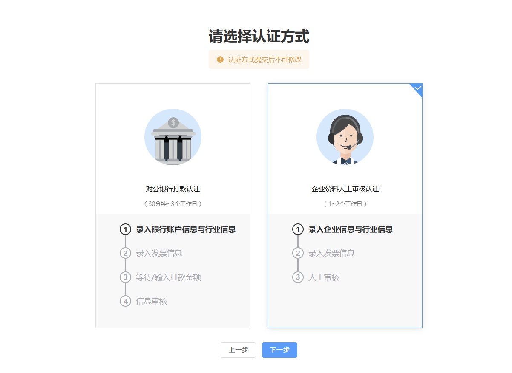

   您完成华为账号注册之后，需要进行实名认证，认证方式可选“[对公银行打款认证](https://developer.huawei.com/consumer/cn/doc/promotion/register-0000001052264353#ZH-CN_TOPIC_0000001052264353__section579210538220)”或“[企业资料人工审核认证](https://developer.huawei.com/consumer/cn/doc/promotion/register-0000001052264353#ZH-CN_TOPIC_0000001052264353__section53595332114)”，建议您优先选择“<strong>企业资料人工审核认证</strong>”方式。认证方式提交后不可修改。
5. 提交审核<strong>。</strong>

## 企业资料人工审核认证

- 企业信息：

  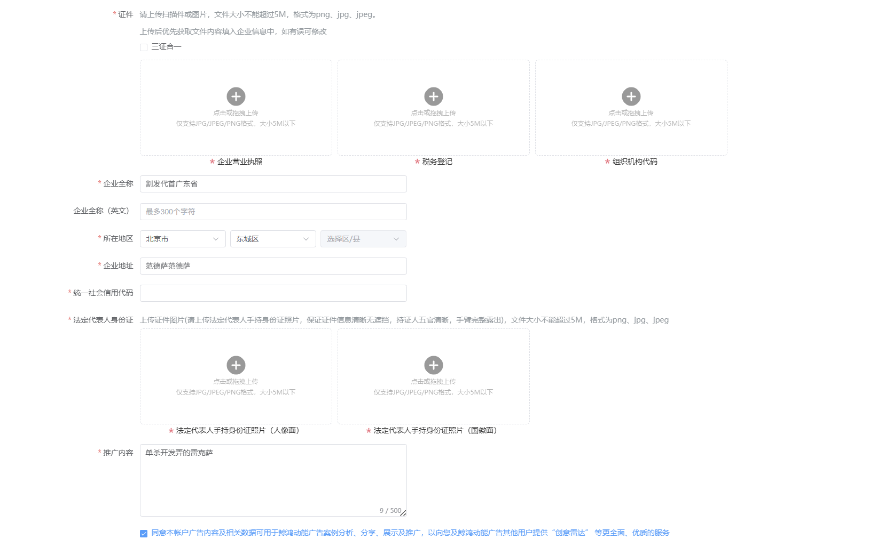

  - <strong>企业全称：</strong>请确保与营业执照上的企业名称保持一致。
  - <strong>企业全称（English）:</strong>请填写您的企业英文名称，若无可不写。
  - <strong>所在地区</strong>：请填写与营业执照一致的省和城市。
  - <strong>企业地址：</strong>详细地址信息请按照您营业执照上的注册地址填写，两者不一致可能导致账户注册失败。
  - <strong>统一社会信用代码：</strong>请填写您的企业统一社会信用代码。
  - <strong>证件：</strong>请上传营业执照的扫描件或者图片，文件大小不能超过5M，格式为png、jpg、jpeg。如果您是三证合一，请勾选，仅补充三证和一的营业执照即可。
  - <strong>法人代表人身份证</strong>：请上传营业执照中法人的身份证正反面，文件大小不能超过5M，格式为png、jpg、jpeg。
  - <strong>推广内容</strong>：填写您即将做广告的产品/服务。为了让审核更清楚地知道推广内容，您需要提供链接。
  - <strong>域名：</strong>如果您的产品有域名，请补充，如果没有请忽略。
- 海外行业资质：

  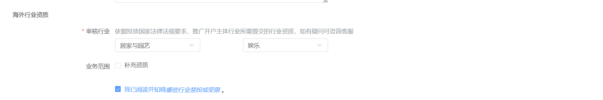

  - <strong>审核行业：</strong>请选择与您产品/服务相关的一级行业与二级行业（依据投放国家法律法规要求，推广开户主体行业所需提交的行业资质，如有疑问可咨询客服或者跳转查看行业资质要求）
  - <strong>业务范围：</strong>根据实际情况填写您的业务范围。
  - <strong>资质证件：</strong>请根据实际情况上传您的资质证件。
- 联系人信息：

  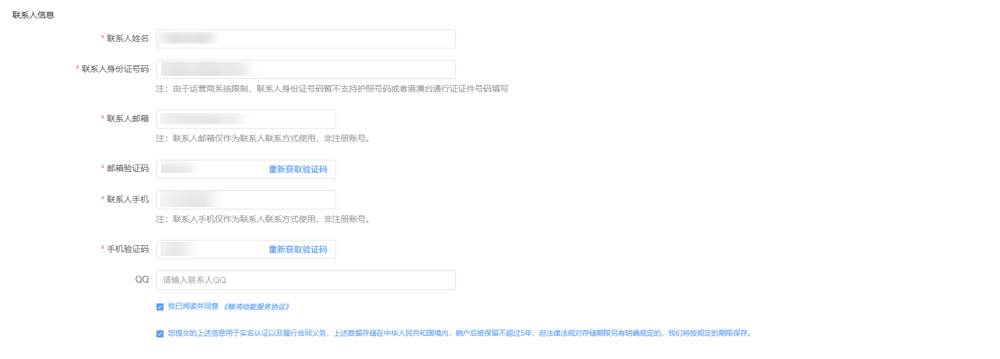

  - <strong>联系人姓名：</strong>请填写联系人姓名<strong>。</strong>
  - <strong>联系人身份证号码：</strong>请填写联系人身份证号码。
  - <strong>联系人邮箱：</strong>请填写联系人的邮箱，系统的通知邮件会发送到此邮箱，请确保邮箱可以正常接收邮件。此处的邮箱不作为鲸鸿动能广告账户登录凭证。
  - <strong>联系人手机：</strong>请填写联系人的手机号，系统的通知短信会发送到此电话，请确保号码可以正常接收短信。此处的电话不作为鲸鸿动能广告账户登录凭证。
  - <strong>QQ：</strong>此项为选填，您可以补充QQ号。
  - 勾选我已阅读并同意《鲸鸿动能广告服务协议》。
- 发票信息：发票信息用来判断缴税事宜，请如实填写。

  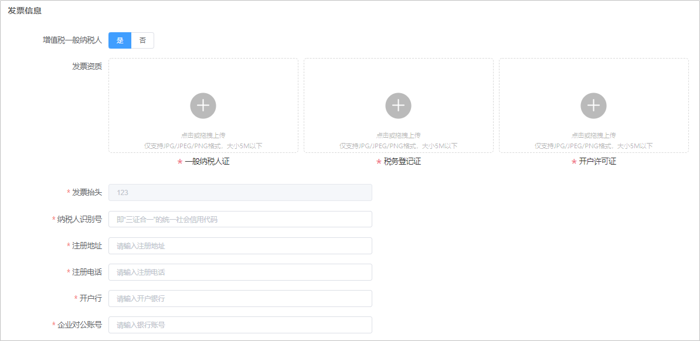
  - <strong>增值税一般纳税人</strong>：
    - 如果您是<strong>增值税一般纳税人</strong>，请补充一般纳税人证、税务登记证、开户许可证。
    - 如果您不是<strong>增值税一般纳税人</strong>，请补充税务登记证、开户许可证。
  - <strong>发票抬头：</strong>默认填充您填写的企业名称，不允许修改。
  - <strong>纳税人识别号：</strong>请填写“三证合一“的统一社会信用代码。
  - <strong>注册地址</strong>：请填写您的发票地址，建议与企业地址保持一致。
  - <strong>注册电话</strong>：请填写您的注册电话。
  - <strong>开户行：</strong>请填写您的开户行。
  - <strong>企业对公账号：</strong>请正确填写您的对公账号。
- 邮寄信息：如果您投放非中国大陆区域，您可以线上获取发票，详情请参考[获取发票](/docs/monetize/promotion/invoice-0000001051704326)。

  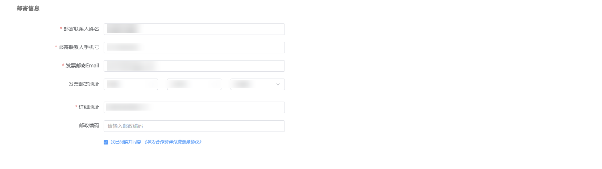

## 对公银行打款认证

华为将对您企业账户进行小额打款以完成验证，请确保信息正确，否则将收不到打款信息而认证失败。

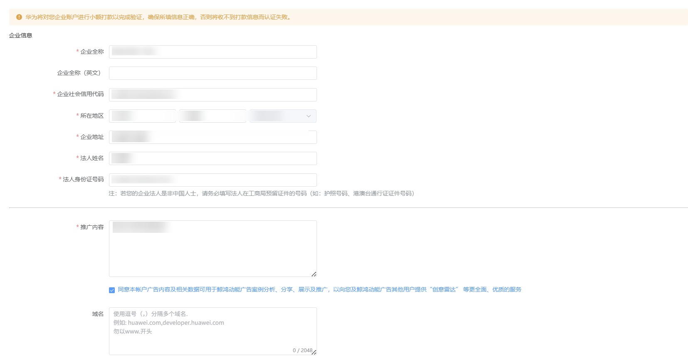

- 企业信息：
  - <strong>企业全称：</strong>请确保与营业执照上的企业名称保持一致。
  - <strong>企业全称（English）:</strong>请填写您的企业英文名称，若无可不写。
  - <strong>企业社会信用代码</strong>：请填写营业执照的统一社会信用代码。
  - <strong>所在地区</strong>：请填写与营业执照一致的省和城市。
  - <strong>企业地址：</strong>详细地址信息请按照您营业执照上的注册地址填写，两者不一致可能导致账户注册失败。
  - <strong>法人姓名：</strong>请填写您企业法人的真实姓名。
  - <strong>法人身份证号码：</strong>请填写您企业法人的身份证号码。
  - <strong>推广内容</strong>：填写您即将做广告的产品/服务。为了让审核更清楚地知道推广内容，您需要提供链接。
  - <strong>域名：</strong>如果您的产品有域名，请补充，如果没有请忽略。
- 海外行业资质：

  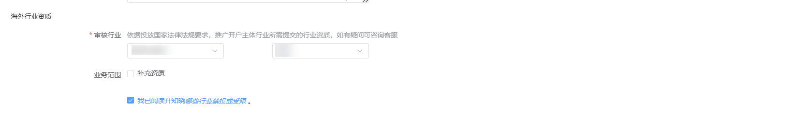
  - <strong>审核行业：</strong>请选择与您产品/服务相关的一级行业与二级行业（依据投放国家法律法规要求，推广开户主体行业所需提交的行业资质，如有疑问可咨询客服或者跳转查看行业资质要求）
  - <strong>业务范围：</strong>根据实际情况填写您的业务范围。
  - <strong>资质证件：</strong>请根据实际情况上传您的资质证件。

- 联系人信息：详情请参考[联系人信息](https://developer.huawei.com/consumer/cn/doc/promotion/register-0000001052264353#ZH-CN_TOPIC_0000001052264353__li18271430011)。
- 企业银行账号信息：

  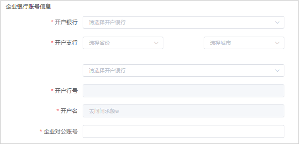
  - <strong>开户银行：</strong>填写您企业银行的开户银行。
  - <strong>开户支行</strong>：选择银行账号开户支行的省份、城市，并选择开户银行的具体分行。
  - <strong>开户行号</strong>：由开户行号自动带出，无法更改。
  - <strong>开户名：</strong>由开户行号自动带出，无法更改。
  - <strong>企业对公账号：</strong>请正确填写您的对公账号，以便华为向您打款。
  - 勾选我已阅读并同意《鲸鸿动能广告服务协议》。
- 发票信息：发票信息用来判断缴税事宜，请如实填写。详情参考[发票信息](https://developer.huawei.com/consumer/cn/doc/promotion/register-0000001052264353#ZH-CN_TOPIC_0000001052264353__li165934312593)。
- 邮寄信息：详情参考[邮寄信息](https://developer.huawei.com/consumer/cn/doc/promotion/register-0000001052264353#ZH-CN_TOPIC_0000001052264353__li7397847175911)。
- 等待/输入打款金额：每人认证仅有两次机会验证打款金额，请与您的财务确认金额。

  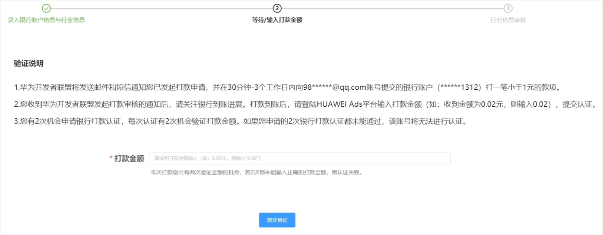

## 企业注册地为非中国大陆区域时的直客注册步骤

1. 注册/登录华为账号。
   - 登录鲸鸿动能官网[https://ads.huawei.com](https://ads.huawei.com/)（建议您使用Chrome浏览器），单击页面右上角“<strong>立即开始</strong>”。

   
   - 进入华为账号注册界面，可选择手机号注册或者邮箱地址注册方式，注册完成后跳转至登录界面，登录该账号。

     若您的手机号此前已经注册过华为账号，输入验证码之后将会弹出“<strong>此号码已被注册，请登录</strong>”弹窗，此时请单击弹窗中的<strong>“登录”</strong>，若忘记密码，可通过<strong>‘找回密码’</strong>功能重置后登录。

     如果您想灵活使用手机号或邮箱登录，需要在[华为账号管理界面](https://id7.cloud.huawei.com/AMW/portal/userCenter/index.html?themeName=red&loginChannel=7000000&countryCode=de&loginUrl=https://id7.cloud.huawei.com/CAS/commonLogin.html&reqClientType=7&lang=zh-cn#/security)完成邮箱或手机号关联。

     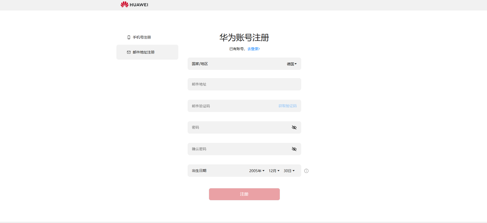

    

   当前广告开户将无需实名认证，若您的广告任务在审核时被鲸鸿动能广告平台判定为涉及[受限内容](/docs/monetize/promotion/industry-admission-rules-0000001189244454#鲸鸿动能广告受限内容)，或者您要使用企业信用卡、线上充值功能，您必须完成实名认证再进行广告投放，如何完成实名认证请参考[实名认证](/docs/monetize/promotion/basic-account-information-0000001224473383#ZH-CN_TOPIC_0000001224473383__zh-cn_topic_0000001160593954_li10577143072315)。

   - 请注意以下参数，如果配置不正确<strong>，</strong>否则会导致鲸鸿动能广告账户注册失败。
     - <strong>国家/地区</strong>：需要和您企业注册国家/地区保持一致。
     - <strong>出生日期</strong>：需要填写您的出生年月。

   - 如果您<strong>有华为账号</strong>，单击<strong>登录</strong>：
     - 如果您的华为账号已通过华为开发者联盟实名认证，广告开户将无需审核，按照开户流程完成注册后，即可进入鲸鸿动能广告账户进行广告投放，需要实名认证的场景请参考[实名认证](/docs/monetize/promotion/basic-account-information-0000001224473383#ZH-CN_TOPIC_0000001224473383__zh-cn_topic_0000001160593954_li10577143072315)。
     - 如果您的华为账号在华为开发者联盟的实名认证状态是“实名审核失败”，您需要根据审核驳回理由，在广告开户时<strong>重新修改实名信息</strong>，并提交审核，此时您可以进入广告账户试用，但审核通过后即可进行充值投放等操作，详情请参考[实名认证](/docs/monetize/promotion/basic-account-information-0000001224473383#ZH-CN_TOPIC_0000001224473383__zh-cn_topic_0000001160593954_li10577143072315)。
     - 如果您的华为账号在华为开发者联盟的实名认证状态是“实名审核中”，您需要等待实名通过后，才能开通鲸鸿动能广告账户。
     - 如果您已有华为账号，并未在华为开发者联盟发起实名认证，直接登录华为账号，完成鲸鸿动能广告账户的注册流程，若任务审核被判定为涉及敏感行业，需要完成实名认证再进行广告投放。

    

   如果您的华为账号在华为开发者联盟开通了团队账号，那么您需要使用<strong>华为开发者联盟的主账号</strong>登录并完成注册流程。
2. 选择投放区域。

   选择<strong>全球（除中国大陆外）</strong>。如果您想要向投放中国大陆地区广告，请联系[中国大陆地区服务商](https://ads.huawei.com/usermgtportal/home/index.html#/agent)。

   
3. 选择企业类型。

   如果您只推广自己企业的产品和服务，请选择<strong>直客</strong> <strong>广告主</strong>。

   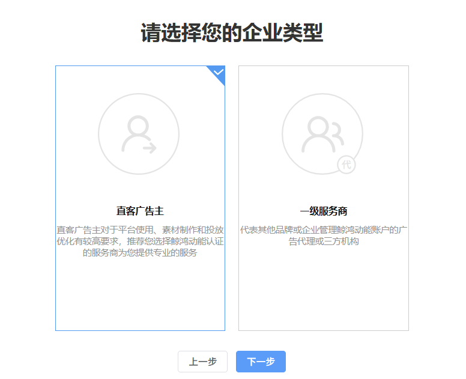
4. 填写企业信息。
   - <strong>企业信息：</strong>

     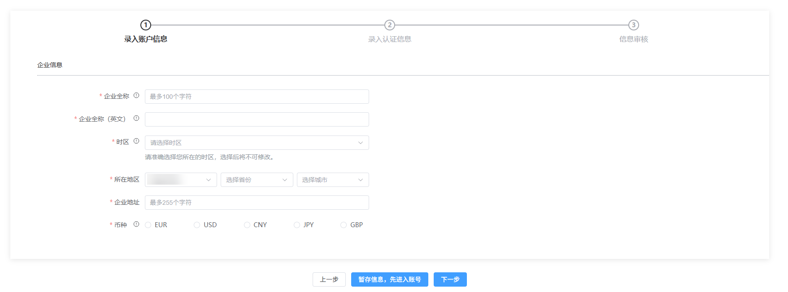

     - <strong>企业全称：</strong>请确保与营业执照上的企业名称保持一致。
     - <strong>企业全称（英文）:</strong>英文名称会用于发票开具，请准确填写，确保与营业资质上的英文名称一致，企业名称内不允许包含除26个英文字母、英文标点符号及阿拉伯数字之外的其他字符。
     - <strong>时区：</strong> <strong>账号注册后时区不能更改</strong>，请慎重选择。系统会按照您在此处选择的时区进行任务投放时间控制、预算控制、报表统计（不包含财务报表，财务报表时区为：UTC+08:00）和展示等。
     - <strong>所在地区</strong>：国家/地区默认使用您华为账号的注册地，同时需要与您企业营业执照的注册国家/地区一致，另外需要配置省和城市。
     - <strong>企业地址：</strong>详细地址信息请按照您营业执照上的注册地址填写，两者不一致可能导致账户注册失败。
     - <strong>币种：</strong>您选择的币种应当是您希望用以交易的货币种类，注册完成将无法再修改，请谨慎选择。

       例如：如果币种选择美元，那么建议使用美元充值，同时我们将使用美元金额开具发票，您的账户余额和投放消耗也将按照美元统计。

        

       当您完成填写后，可以先暂存信息进入鲸鸿动能广告账户查看，但是无法进行充值、广告投放、被邀请为团队成员等操作；如果您需要投放广告，请继续完成注册流程。
   - <strong>发票信息</strong>：发票信息用来判断缴税事宜，请如实填写。

     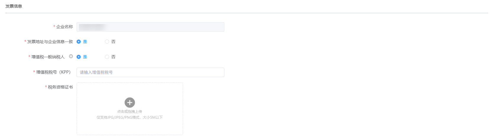
     - <strong>企业名称：</strong>默认填充您填写的企业名称，不允许修改。
     - <strong>发票地址是否与企业地址一致：</strong>
       - 如果您的发票地址与您的企业地址一致，请选择是；
       - 如果您的发票地址与您的企业地址不一致，请填写您的发票详细地址。
     - <strong>是否为增值税一般纳税人</strong>：
       - 如果您的企业是增值税一般纳税人，请选择是，此时需要补充<strong>纳税人识别号</strong>，<strong>部分国家/地区需要上传税务资质</strong>，具体的税务登记证请与您的财务确认；
       - 如果您的企业不是增值税一般纳税人，请选择否，此时不需要提交税号和税务资质。
   - <strong>联系人信息</strong>：

     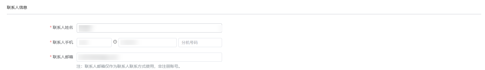

     - <strong>联系人姓名：</strong>请填写联系人姓名<strong>。</strong>
     - <strong>联系人电话：</strong>请填写联系人的手机号，系统的通知短信会发送到此电话，请确保号码可以正常接收短信。此处的电话不作为鲸鸿动能广告账户登录凭证。
     - <strong>联系人邮箱：</strong>请填写联系人的邮箱，系统的通知邮件会发送到此邮箱，请确保邮箱可以正常接收邮件。此处的邮箱不作为鲸鸿动能广告账户登录凭证。
   - 主营业务：

     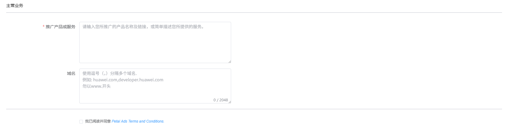

     - <strong>推广产品或服务：</strong>推广产品填写您即将做广告的产品/服务。为了让审核更清楚地知道推广内容，您需要提供链接。
     - <strong>域名：</strong>如果您的产品有域名，请补充，如果没有请忽略。
5. 签署《华为合作伙伴付费服务协议》并进入鲸鸿动能广告账户，您可根据需要切换界面语言，支持中英俄三个语种<strong>。</strong>
