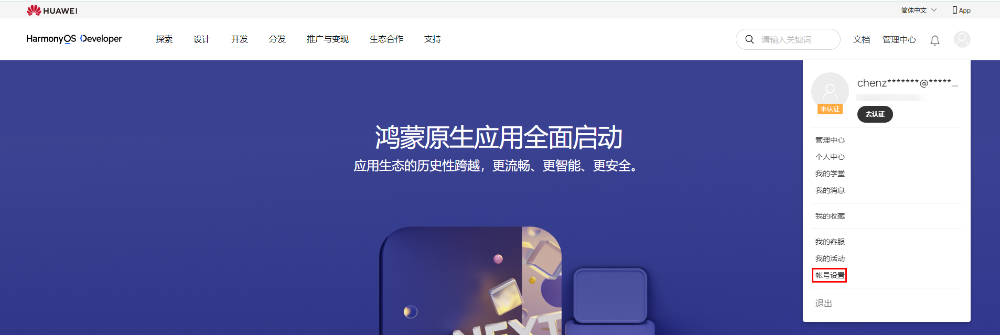
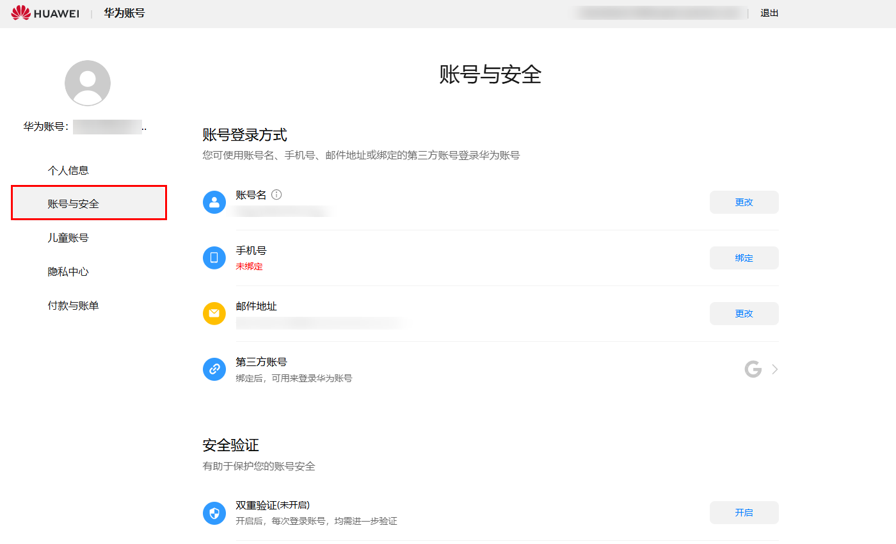
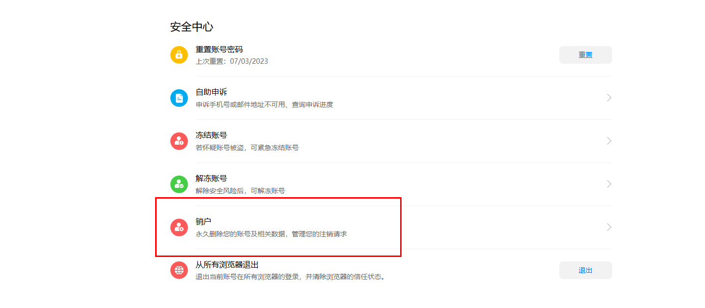
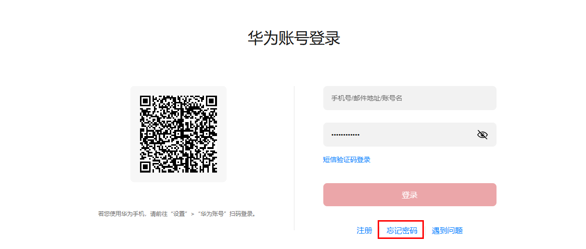
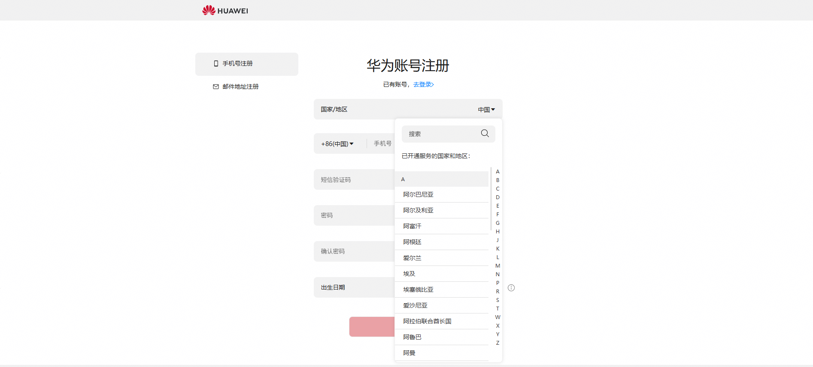

# 常见问题

1. <strong>个人是否可以注册鲸鸿动能广告账户？</strong>

   目前鲸鸿动能广告暂不支持个人注册鲸鸿动能广告账户。若您需要推广您的产品服务，可考虑通过华为[服务商](https://developer.huawei.com/consumer/cn/doc/promotion/partnerinformation-0000001058393913)推广投放。
2. <strong>注册的时候选择直客还是服务商？</strong>

   如果您希望成为服务商，代理您的客户投放广告，请选择[注册服务商](https://developer.huawei.com/consumer/cn/doc/promotion/partnerregister-0000001058922348)；

   如果您是广告主只需要推广自己的产品，可以选择：A：[注册直客](https://developer.huawei.com/consumer/cn/doc/promotion/register-0000001052264353)，使用直客账户进行广告投放；B：选择一个[服务商](https://developer.huawei.com/consumer/cn/doc/promotion/partnerinformation-0000001058393913)，由服务商注册子客账户代为投放。
3. <strong>企业注册地为非中国大陆地区时，如何投放广告至中国大陆地区？</strong>

   投放中国大陆地区需联系中国大陆地区的服务商，可以通过[在线提单](https://developer.huawei.com/consumer/cn/support/feedback/#/)发送合作信息。
4. <strong>想注册直客的，但是注册成了服务商怎么办？</strong>
   - 重新注册一个华为账号，重新注册为直客；
   - 若您的华为账号不存在其他关键业务，可删除华为账号重新注册为直客，此种情况下会删除此华为账号关联的所有信息；
   - 若存在其他情况，请通过[在线提单](https://developer.huawei.com/consumer/cn/support/feedback/#/)解决。
5. <strong>华为账户注册国家/地区是否需要与企业注册地一致？</strong>

   需要保持一致。
6. <strong>在哪里查看鲸鸿动能广告协议？</strong>

   若您尚未注册广告账户，请单击以下链接查看广告协议：[广告协议](https://developer.huawei.com/consumer/cn/doc/promotion/ad-agreements-0000001169499170)

   若您已注册鲸鸿动能直客或子客广告账户，可登录鲸鸿动能广告平台，<strong>单击“工具”-&gt;“广告账号管理”</strong>在页面底部查看或下载已签署的鲸鸿动能广告服务协议。

   若您已注册鲸鸿动能服务商广告账户，可登录服务商账户，在<strong>“账号管理”-&gt;“账户信息”-&gt;“协议签署“</strong>在页面底部查看或下载已签署的鲸鸿动能广告服务协议。
7. <strong>直客账户注册时，账户币种该如何选择？</strong>

   注册时选择的账户币种将作为您账户的充值币种及出价计费币种。如果您充值币种和账户的币种不一致，可能会产生换汇费用。<strong>账户币种一经选择后无法更改</strong>。鲸鸿动能广告平台目前支持的币种为：人民币、欧元、美元、日元和英镑。

   若您是注册地在德国、英国、爱尔兰、以色列、法国、意大利、西班牙、波兰、罗马尼亚、捷克、芬兰、土耳其、乌克兰，新加坡、马来西亚、泰国、印度尼西亚、中国香港、菲律宾、沙特阿拉伯、埃及、南非、墨西哥、智利、秘鲁和哥伦比亚的客户，币种的选择会影响您是否能使用线上充值功能。

   详情请参考：[线上充值](https://developer.huawei.com/consumer/cn/doc/promotion/online-top-up-0000001148173308)
8. <strong>页面提示需要签署协议，但找不到签署的入口？</strong>

   如果登录出现了请签署协议的提示，意味着广告协议已经更新，需要重新签署。此时您必须使用主账号（以账号持有者的身份登录，而不是管理员、优化师、数据分析师这些团队成员角色）登录，签署协议。

   进入[鲸鸿动能广告平台](https://ads.huawei.com/usermgtportal/home/index.html#/)后，系统会弹出协议更新页面，您可以查看协议的更新内容以及完整的协议，您可以选择“立即签署”或“延期签署”。

   立即签署：如果您选择立即签署，协议将于xxxx年xx月x生效，签署后进入鲸鸿动能广告平台。

   延期签署：如果您选择延期签署，您必须在协议生效前完成签署，否则您将无法使用鲸鸿动能广告平台。鲸鸿动能广告平台会在协议生效前30天提醒您协议更新时间，您可以在鲸鸿动能广告平台的页面的上端查看协议生效时间，单击“查看详情”，可查看协议具体的更新点并签署协议，签署后协议将于xxxx年xx月x生效，您也可以单击协议名称，下载整个协议。

   此外，账户持有者也可以授权管理员签署协议。授权后，若协议更新，管理员可以代替您签署协议。详情请参考：[广告协议](https://developer.huawei.com/consumer/cn/doc/promotion/ad-agreements-0000001169499170)
9. <strong>如何注销广告账户？</strong>

   目前如果您需要注销鲸鸿动能广告账号，只能选择注销注册此鲸鸿动能广告账户的华为账号。

    

   - 此操作会同步删除您华为账号下关联的所有其他信息，如华为开发者联盟华为账号、应用市场华为账号、云空间存储的信息等等，请谨慎操作。
   - 注销广告账户前请务必确认账户没有余额，否则会出现注销后账户余额无法取出的情况。

   第一步：请先通过&lt;https://developer.huawei.com/consumer/cn/&gt;登录华为开发者联盟，鼠标置于右上角头像处，在下拉框内单击“账号设置”，进入 “账号中心” 页面。

   

   第二步：单击“账号与安全”，进入账号与安全中心。

   

   第三步：单击“销户”按钮，根据系统提示，完成销户操作。

   

   详情请参考：&lt;https://developer.huawei.com/consumer/cn/doc/start/account-management-0000001052865467&gt;
10. <strong>广告平台无法登录、登录报错怎么办？</strong>

    您的问题可能是因为浏览器的广告屏蔽功能屏蔽了鲸鸿动能广告的页面，请使用谷歌/火狐浏览器并确认所有广告屏蔽插件已经关闭并尝试使用网页无痕模式登录。 若仍登录异常，请及时通过[在线提单](https://developer.huawei.com/consumer/cn/support/feedback/#/)处理，并附上账户信息及报错截图和网页日志，日志获取方式：

    1. F12调出开发者工具；
    2. 找到网络（network）；
    3. 重复报错之前的操作复现报错页面；
    4. 单击网络（network）右下方的下载按钮，下载并保存日志。

       
11. <strong>广告账户登录密码忘记，无法登录怎么办？</strong>

    可以在登录页面选择“[账号常见问题](https://id1.cloud.huawei.com/AMW/portal/faq/zh-cn_faq.html?version=china&regionCode=cn&lang=zh-cn&reqClientType=90&loginChannel=90000300#ZH-CN_TOPIC_0288934784__li2016074917112)忘记密码”，利用注册的邮箱/手机号进行密码重置，详情请查看[账号常见问题](https://developer.huawei.com/consumer/cn/doc/help/accountmanagementfaqs-0000001053452580#section12854165792312)。

    
12. <strong>用户华为账号如何变更？</strong>

    更改账号流程如下：登录“[华为开发者联盟官网](https://developer.huawei.com/consumer/cn/)” -&gt; 鼠标放在账号图标上-&gt; 选择下拉框中的“账号设置”进入“账号中心”-&gt; 单击手机号或邮箱后的“更改”。
13. <strong>广告账户登录时提示登录频繁？</strong>

    由于过多验证码获取，受到系统限制，请通过[在线提单](https://developer.huawei.com/consumer/cn/support/feedback/#/)提供报错信息给鲸鸿动能广告平台获取帮助。
14. <strong>注册时收不到验证码，怎么办？</strong>

    请检查是否被屏蔽，可以到屏蔽短信或邮箱垃圾箱中查询；若仍然无法获取，请通过[在线提单](https://developer.huawei.com/consumer/cn/support/feedback/#/)处理。
15. <strong>想注册为服务商，但是注册成了直客怎么办？</strong>

    重新注册一个华为账号，重新注册为服务商；

    若您的华为账号不存在其他关键业务，可删除华为账号重新注册为服务商，此种情况下会删除此华为账号关联的所有信息；

    若存在其他情况，请通过[在线提单](https://developer.huawei.com/consumer/cn/support/feedback/#/)解决。
16. <strong>广告账户注册时填写的国家无法选择怎么办？</strong>

    请检查您注册的华为账户关于国家/地区的信息选择是否正确，因为华为账户注册时选择的国家/地区一旦确认，无法修改，将影响后续广告注册时企业地址的设置，请务必确认准确。如信息有误，建议注销账户或更换设备/邮箱重新注册。

    
17. <strong>需要先考试通过才可开通鲸鸿动能广告账户吗?</strong>

    不需要，只需按照注册流程，上传所需文件，然后提交账户进行审核。如果申请通过，就可以使用鲸鸿动能广告账户。

    直客账户注册详情请参考：[直客账户注册](https://developer.huawei.com/consumer/cn/doc/promotion/ads-zkzhzc-0000002561738607)

    子客账户注册详情请参考：[子客账户注册](https://developer.huawei.com/consumer/cn/doc/promotion/addadvertiser-0000001059081952)
18. <strong>注册完成直客广告账户后可以变换账户币种吗？</strong>

    不可以，直客广告账户审核通过后，不可变更账户类型、币种、地址、时区；服务商（L1）、子客服务商（L2）和子客（L3）账户可修改所在地区和地址，账户类型、币种、时区不可变更。
19. <strong>可以用开发者账户登录广告账户吗？</strong>

    不可以，两者是分开的。若同一华为账号（手机/邮箱）在联盟和广告都开通过户，才可共用。
20. <strong>注册广告账户时提示不在此服务区域怎么办？</strong>

    请检查其注册的地址是否在服务区域，详情请参考：[服务区域](https://developer.huawei.com/consumer/cn/doc/promotion/area-0000001054313507)
21. <strong>在进行广告账户点击注册或登录或获取手机验证码时就一直提示“您的操作可能存在风险，建议您不要进行此操作或稍后再试。”“Too many attempts. Try again later”的情况要怎么办？</strong>

    注册或登录广告账户时建议您的手机号码、地址、网络设置都必须一致，如果其中存在不一致的情况，系统会进行风险提示导致您无法注册或登录广告账户。
