# 直客账户注册

 

以下内容为同时开通推广范围为“展示广告网络”和“应用市场应用推广”双权限的直客账户，如只需开通单一权限直客账户根据页面提示自行选择即可。

## 直客账户开通步骤

1. <strong>注册华为账号</strong>

   1）登录鲸鸿动能官网[https://ads.huawei.com](https://ads.huawei.com/)（建议您使用Chrome浏览器），单击页面右上角“<strong>立即开始</strong>”。

   

   2）进入华为账号注册界面，可选择手机号注册或者邮箱地址注册方式，注册完成后跳转至登录界面，登录该账号。

   若您的手机号此前已经注册过华为账号，输入验证码之后将会弹出“<strong>此号码已被注册，请登录</strong>”弹窗，此时请单击弹窗中的<strong>“登录”</strong>，若忘记密码，可通过<strong>‘找回密码’</strong>功能重置后登录。

   

   3）账号登录成功后，跳转至“<strong>选择投放区域</strong>”界面，请选择“<strong>中国大陆</strong>”区域 。

   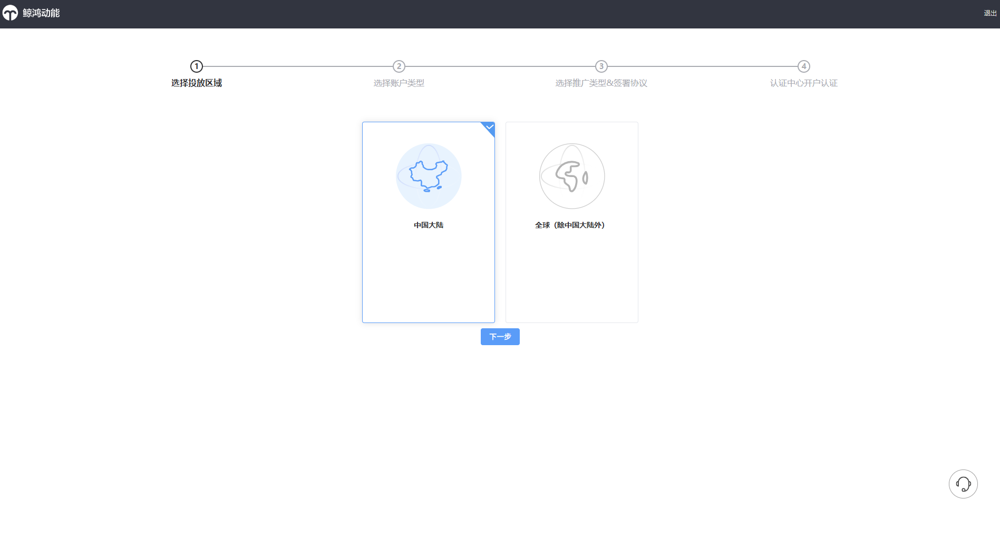

   4）区域选择完成后，跳转至“<strong>请选择您的企业类</strong> <strong>型</strong>”界面，请选择“<strong>直客广告主</strong>”账户类型。

   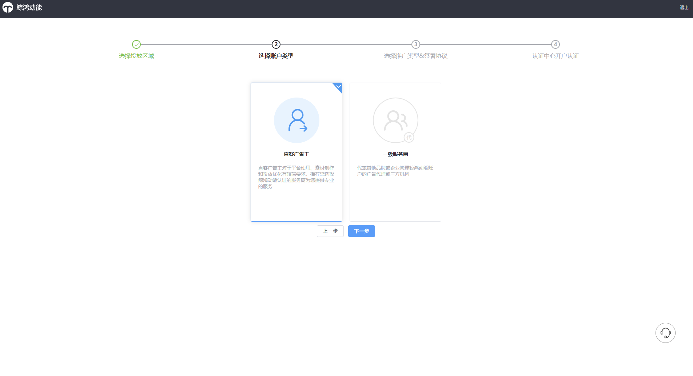

   5）账户类型选择完之后，需要您选择推广类型和签署协议，勾选完协议之后请单击“确定并进入认证中心”进行推广类型勾选。

   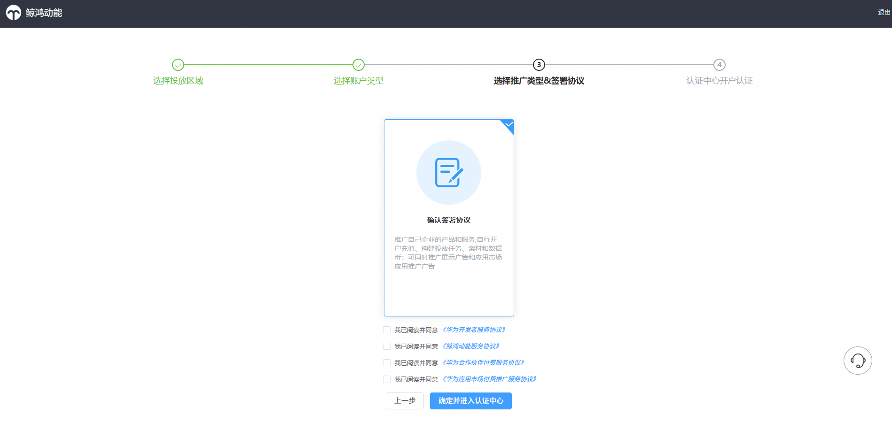

   推广类型可以选择“应用市场应用推广”和“展示广告网络”。

   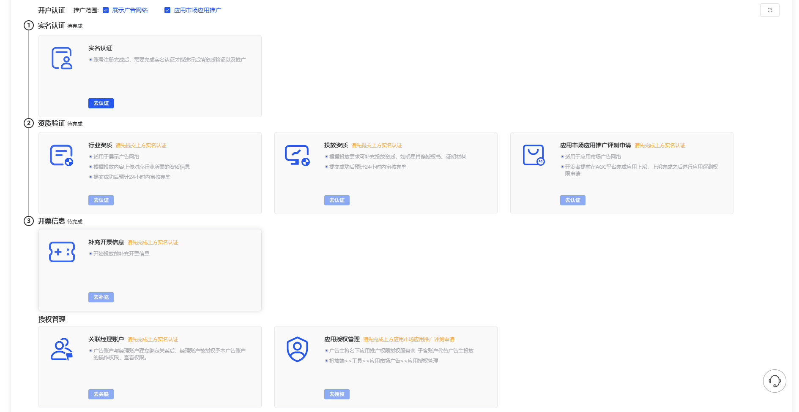
2. <strong>实名认证</strong>

   完成华为账号注册之后，需要进行实名认证，请根据实际情况，认证方式选择“<strong>个人开发者</strong>”或“<strong>企业开发者</strong>”，认证方式提交后不可修改。

   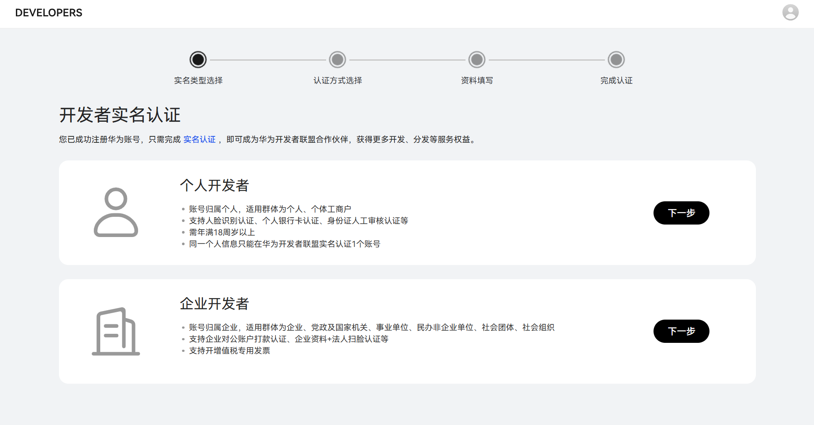

    

   <strong>个人开发者：</strong>

   账号归属个人，适用群体为个人、个体工商户

   支持人脸识别认证、个人银行卡认证、身份证人工审核认证等

   需年满18周岁以上

   同一个人信息只能在华为开发者联盟实名认证1个账号

   <strong>企业开发者：</strong>

   账号归属企业，适用群体为企业、党政及国家机关、事业单位、民办非企业单位、社会团体、社会组织

   支持企业对公账户打款认证、企业资料+法人扫脸认证等

   支持开增值税专用发票

   <strong>如果您是“个人开发者认证”</strong>

   您可以选择两种认证方式：人脸识别认证（即时完成）或个人银行卡认证（即时完成）。

   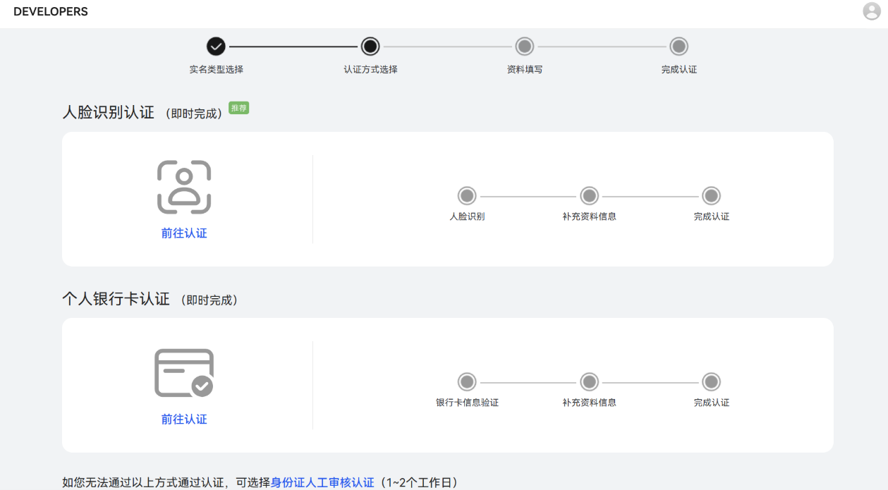

   - 方式一：人脸识别认证，您需要完善个人实名认证信息，首先需要通过微信或华为浏览器扫描二维码进行人脸识别，人脸识别完成之后，根据实际情况填写联系人邮箱，联系人手机，所在地区等页面信息，勾选相关协议单击“下一步”等待审核通过即可。

   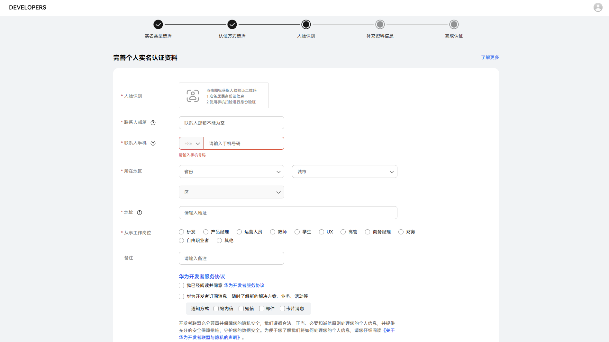

   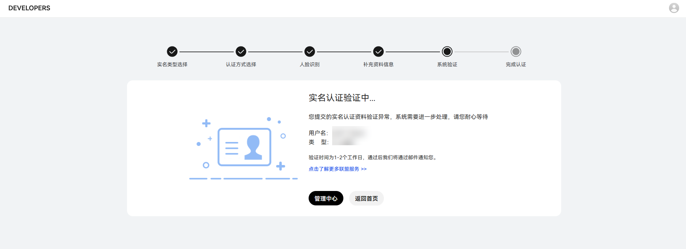

   - 方式二：个人银行卡认证，如您选择的是个人银行卡实名认证，您需要填写真实姓名，身份证号码，银行卡号以及联系人手机，然后单击“下一步”补充资料。

   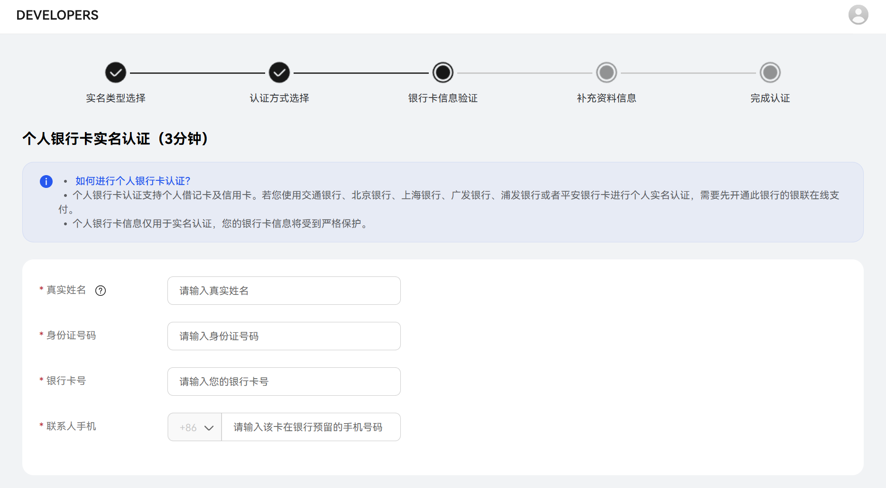

   根据页面提示补充完资料单击“下一步”等待审核通过即可。

   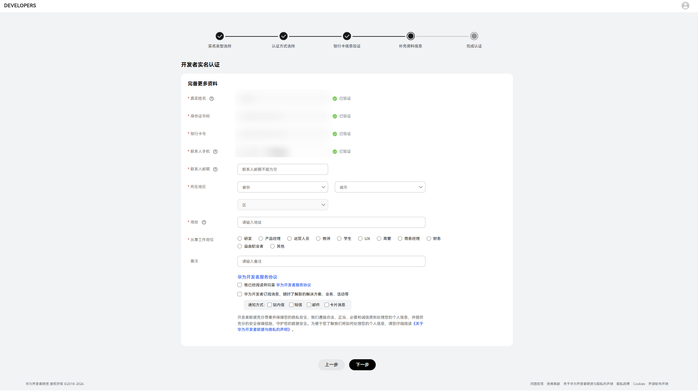

   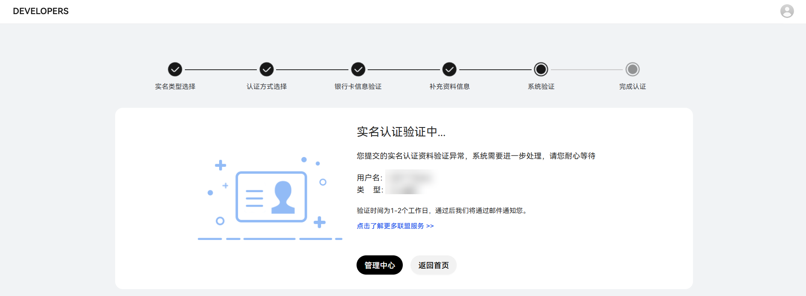

   <strong>如果您是“企业开发者”</strong>

   您可以选择“对公银行打款认证”和“企业人工审核认证”

   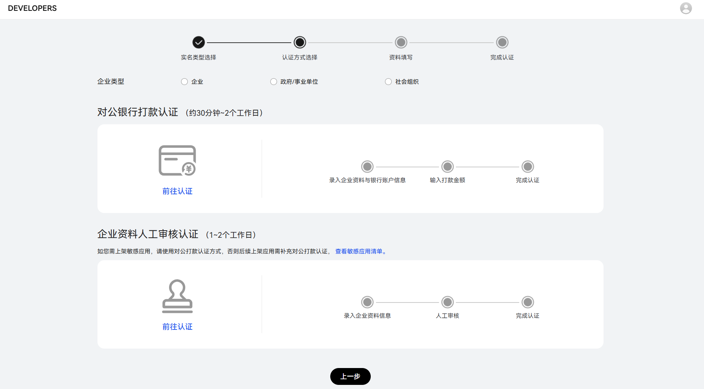

   - 方式一：对公银行打款认证

   <strong>企业基本信息：</strong>请先选择您的企业类型，华为将对您企业账户进行小额打款以完成验证，请确保信息正确，否则将收不到打款信息而认证失败。

   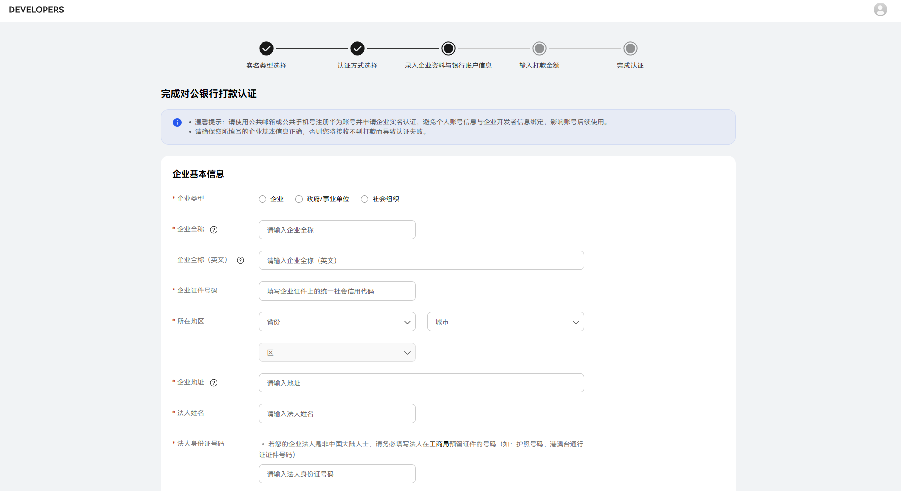

   企业全称：须与企业证件保持一致。该名称会显示在您的应用名称下，如您需开通商户服务，您的银行账户名称需要与此保持一致。

   企业全称（英文）：请填写您的企业英文名称，若无可不写。（英文名称只能包含英文字母、英文空格和-/()+'，请勿输入其他语言或字符，跨境银行开户名同此一致。）

   企业证件号码：请填写营业执照的统一社会信用代码。

   所在地区：请填写与营业执照一致的省和城市。

   企业地址：详细地址信息请按照您营业执照上的注册地址填写，所在地区、企业地址须与企业证件上保持一致。

   法人姓名（填写中文汉字）：填写法定代表人的真实姓名。

   法定身份证号码：填写法定代表人的真实身份证号。（若您的企业法人是非中国大陆人士，请务必填写法人在工商局预留证件的号码（如：护照号码、港澳台通行证证件号码）

   <strong>企业银行账户信息：</strong>

   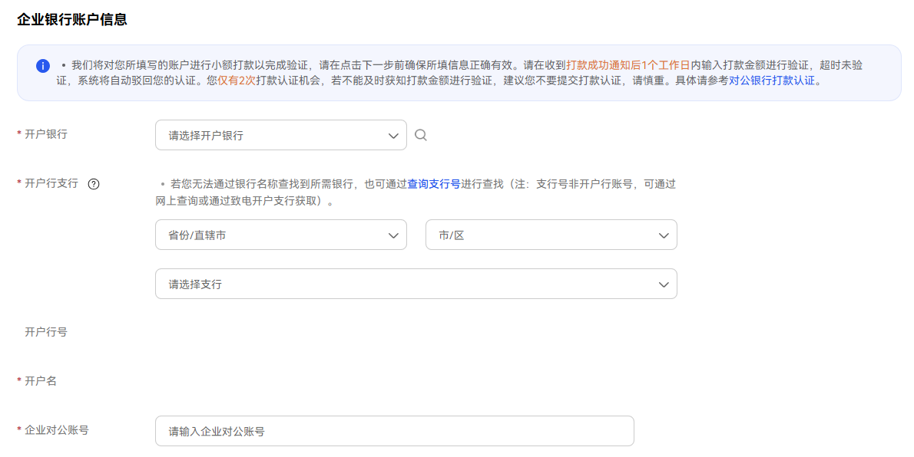

   开户银行：填写您企业银行的开户银行。（开户银行可支持联想输入，动态匹配。如您无法选择所需要的银行信息，请您提供开户银行、开户行支行和开户行号，通过devconnect@huawei.com邮箱联系客服人员处理。）

   开户行支行：选择银行账号开户支行的省份、城市，并选择开户银行的具体分行。（开户银行可支持联想输入，动态匹配。如您无法选择所需要的银行信息，请您提供开户银行、开户行支行和开户行号，通过devconnect@huawei.com邮箱联系客服人员处理。）

   开户行号：由开户行号自动带出，无法更改。

   开户名：由开户行号自动带出，无法更改。

   企业对公账号：请正确填写您的对公账号，以便华为向您打款。

   <strong>联系人信息：</strong>

   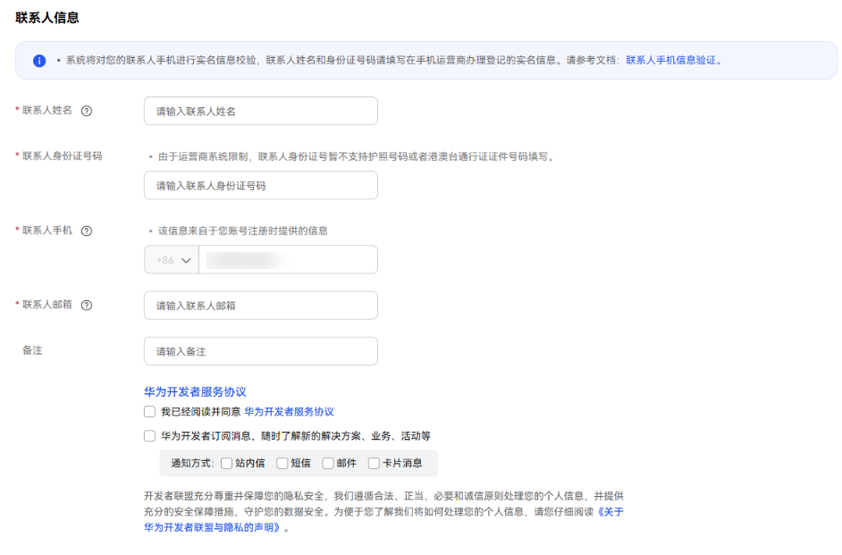

   联系人姓名：请填写联系人姓名<strong>。</strong>

   联系人身份证号码：请填写联系人身份证号码。

   联系人手机：请填写联系人的手机号，系统的通知短信会发送到此电话，请确保号码可以正常接收短信。<strong>此处的电话不作为鲸鸿动能广告账户登录凭证</strong>。（该手机号码将用于账号管理、消息接收等。）

   联系人邮箱：请填写联系人的邮箱，系统的通知邮件会发送到此邮箱，请确保邮箱可以正常接收邮件。<strong>此处的邮箱不作为鲸鸿动能广告账户登录凭证</strong>。

   备注：您可以在此处填写您的备注信息。

   勾选我已经阅读并同意《华为开发者服务协议》。

   勾选华为开发者订阅消息，随时了解新的解决方案、业务、活动等。

   开发者联盟充分尊重并保障您的隐私安全，我们遵循合法、正当、必要和诚信原则处理您的个人信息，并提供充分的安全保障措施，守护您的数据安全。为便于您了解我们将如何处理您的个人信息，请您仔细阅读[《关于华为开发者联盟与隐私的声明》](https://privacy.consumer.huawei.com/legal/huawei-developer-app/privacy-statement.htm?&code=CN&language=zh-CN&branchid=0&contenttag=default)。

   <strong>提交信息后等待审核</strong>

   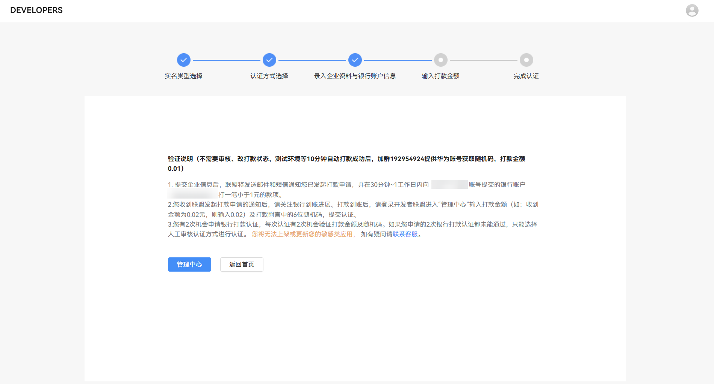

   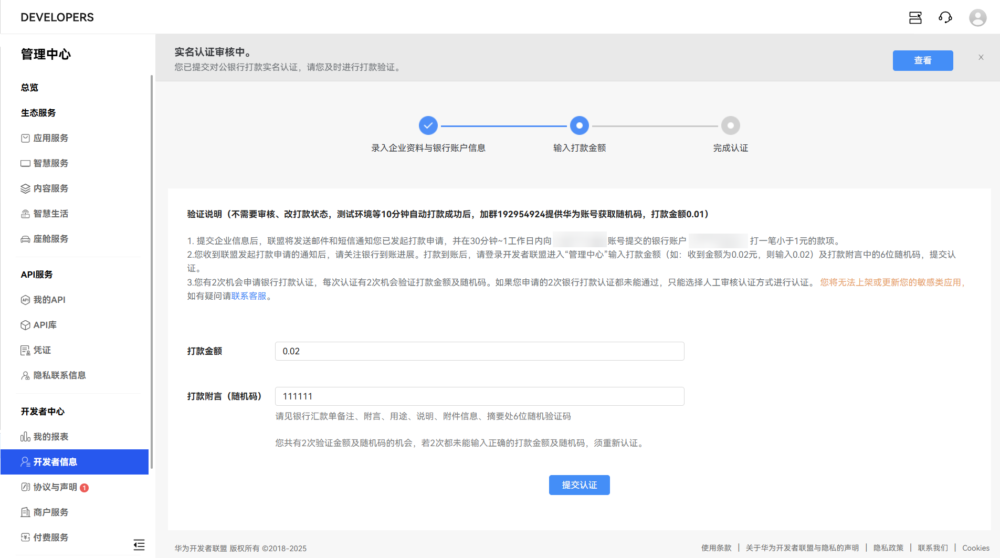

    

   - 您收到联盟发起打款申请的通知后，请关注银行到账进展。打款到账后，请登录开发者联盟进入“管理中心”输入打款金额（如：收到金额为0.02元，则输入0.02）及打款附言中的6位随机码，提交认证。
   - 您有2次机会申请银行打款认证，每次认证有2次机会验证打款金额及随机码。如果您申请的2次银行打款认证都未能通过，只能选择人工审核认证方式进行认证。 您将无法上架或更新您的敏感类应用， 如有疑问请[联系客服](https://developer.huawei.com/consumer/cn/doc/promotion/ads_lxwm01-0000001192387242)。
   - 对公银行打款认证环节，打款账户主体名称为银联商务支付股份有限公司，以实际打款情况为准，打款账号随机，还请注意查收验证。

   - 方式二：企业资料人工审核认证

   <strong>企业信息：</strong>请您先选择您的企业类型

   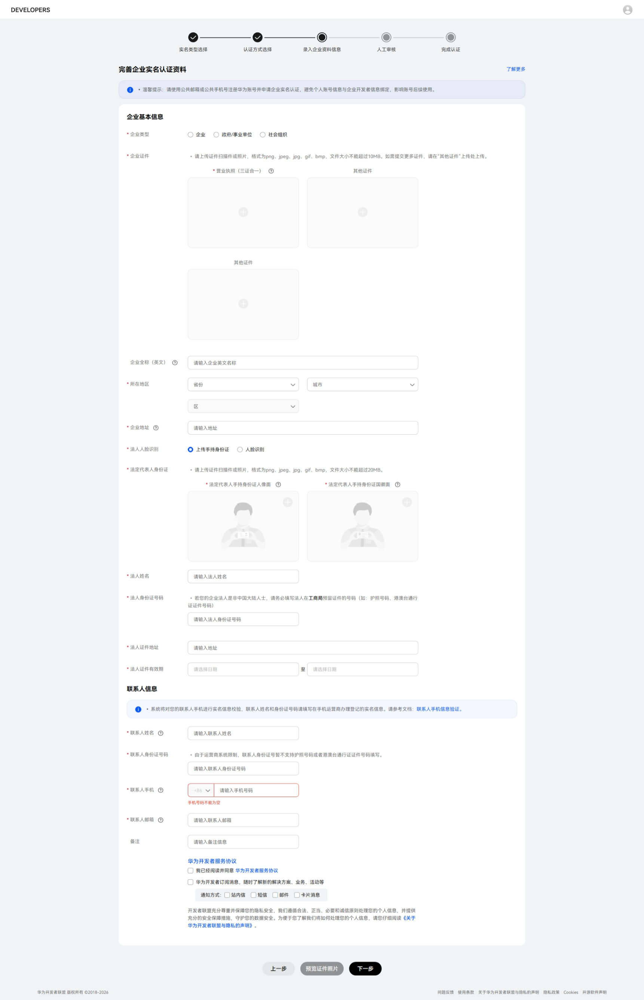

   企业证件：请上传证件扫描件或照片，格式为png、jpeg、jpg、gif、bmp。如需提交更多证件，请在“其他证件”上传处上传。

    

   - 请提供最新的三证合一的营业执照，确保营业执照上的企业信息和国家企业信用信息公示系统公布的信息一致。请参见[实名认证介绍](https://developer.huawei.com/consumer/cn/doc/start/itrna-0000001076878172)。
   - 确保证件信息清晰可辨别，营业执照二维码可扫出企业信息（为确保证件信息清晰，建议上传高清原图）
   - 请上传证件扫描件或照片，请勿裁剪，确保边角完整，证件信息清晰可见。
   - 拍照注意事项，请参见[拍照指导](https://developer.huawei.com/consumer/cn/forum/topic/0201593982484970423?fid=23)。

   企业全称：须与企业证件保持一致。该名称会显示在您的应用名称下，如您需开通商户服务，您的银行账户名称需要与此保持一致。。

   企业全称（英文）：请填写您的企业英文名称，若无可不写。（英文名称只能包含英文字母、英文空格和-/()+'，请勿输入其他语言或字符，跨境银行开户名同此一致。）

   企业证件号码：请填写营业执照的统一社会信用代码。

   所在地区：请填写与营业执照一致的省和城市。

   企业地址：详细地址信息请按照您营业执照上的注册地址填写，所在地区、企业地址须与企业证件上保持一致。

   法人代表验证方式：您可以选择上传手持身份证或人脸识别。

   法人姓名（填写中文汉字）：填写法定代表人的真实姓名。

   法定身份证号码：填写法定代表人的真实身份证号。（若您的企业法人是非中国大陆人士，请务必填写法人在工商局预留证件的号码（如：护照号码、港澳台通行证证件号码）

   法人证件地址：请您如实填写法人的证件地址。

   法人证件有效期：请您如实选择证件有效期。

   <strong>联系人信息：</strong>

   联系人姓名：请填写联系人姓名<strong>。</strong>

   联系人身份证号码：请填写联系人身份证号码。（由于运营商系统限制，联系人身份证号暂不支持护照号码或者港澳台通行证证件号码填写。）

   联系人手机：请填写联系人的手机号，系统的通知短信会发送到此电话，请确保号码可以正常接收短信。<strong>此处的电话不作为鲸鸿动能广告账户登录凭证</strong>。

   联系人邮箱：请填写联系人的邮箱，系统的通知邮件会发送到此邮箱，请确保邮箱可以正常接收邮件。<strong>此处的邮箱不作为鲸鸿动能广告账户登录凭证</strong>。

   备注：您可以填写备注。

   勾选我已阅读并同意《华为开发者服务协议》。

   勾选华为开发者订阅消息，随时了解新的解决方案、业务、活动等。

   开发者联盟充分尊重并保障您的隐私安全，我们遵循合法、正当、必要和诚信原则处理您的个人信息，并提供充分的安全保障措施，守护您的数据安全。为便于您了解我们将如何处理您的个人信息，请您仔细阅读[《关于华为开发者联盟与隐私的声明》](https://privacy.consumer.huawei.com/legal/huawei-developer-app/privacy-statement.htm?&code=CN&language=zh-CN&branchid=0&contenttag=default)。

   <strong>单击“下一步，”提交信息后等待审核</strong>

   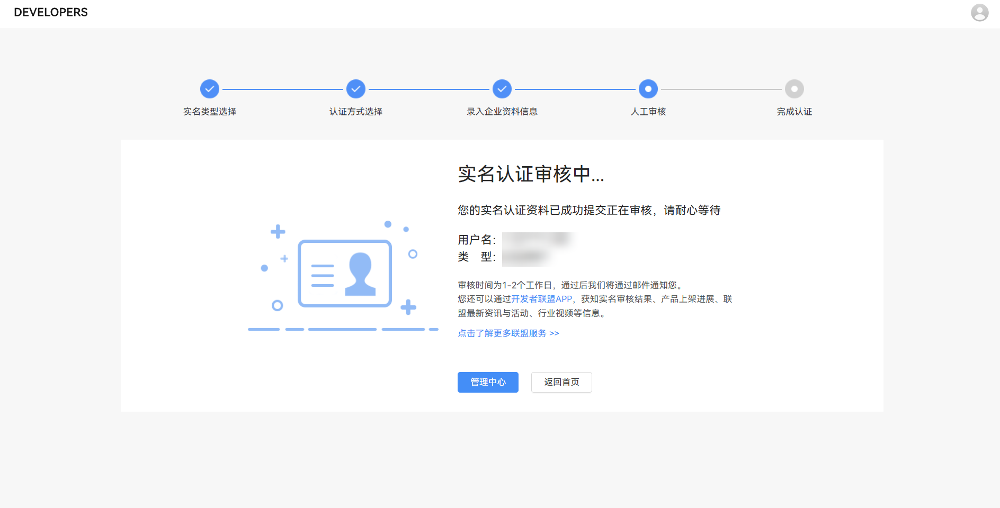

   审核时间为1-2个工作日，通过后我们将通过邮件通知您。您还可以通过开发者联盟，获知实名审核结果、产品上架进展、联盟最新资讯与活动、行业视频等信息。

   <strong>需注意：鲸鸿动能账户为专户专投，即一个账户投放一个产品，如有多个产品，需多开账户投放。</strong>
3. <strong>行业资质，</strong> <strong>实名认证完成后，您需要根据选择的推广范围要求上传“行业资质”、“投放资质”和“Ag应用推广评测申请”</strong>

   行业资质

   - 适用于展示广告网络，当选择推广范围“展示广告网络”时，必须完成行业资质补充审核之后方可进行广告任务创建推广
   - 根据投放内容上传对应行业所需的资质信息
   - 提交成功后预计24小时内审核完毕

   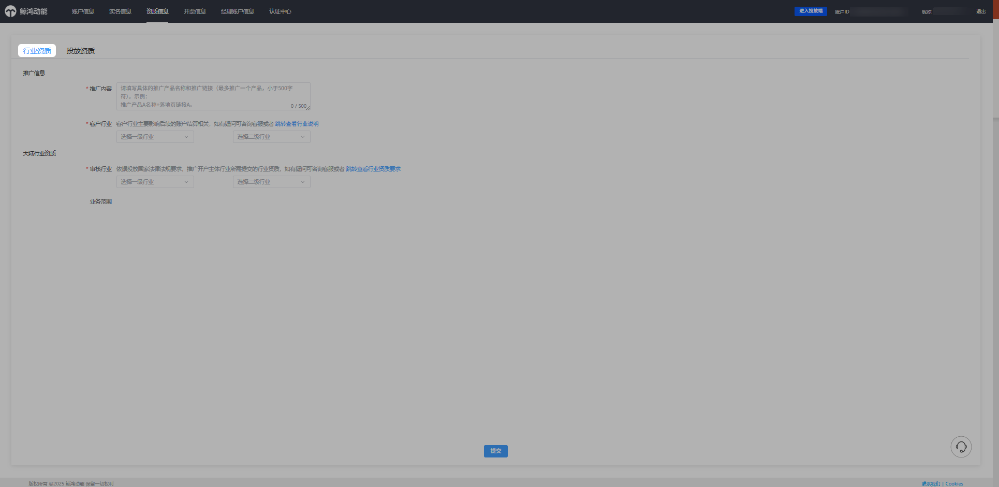

   投放资质

   - 根据投放需求可补充投放资质，如明星肖像授权书、证明材料
   - 提交成功后预计24小时内审核完毕

   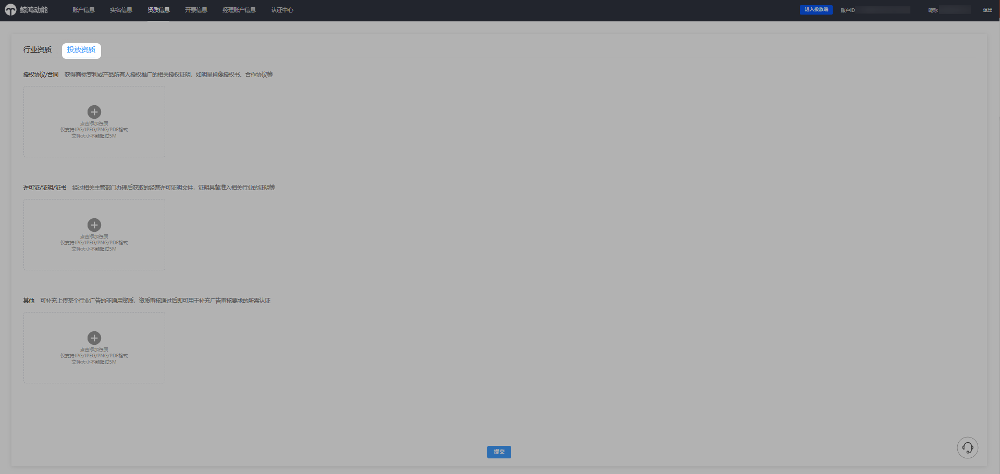

   Ag应用推广评测申请

   - 适用于应用市场广告网络
   - 开发者提前在AGC平台完成应用上架，上架完成之后进行应用评测权限申请

   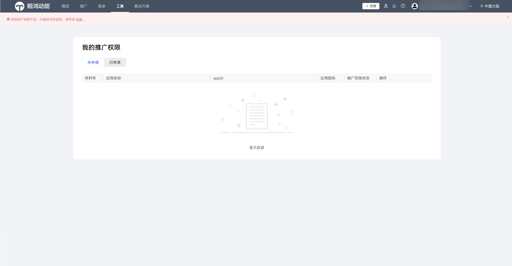
4. <strong>开票信息，开始投放期需要补充开票信息。</strong>
   - <strong>发票信息</strong>

   发票抬头：发票抬头需与“企业全称”保持一致

   - <strong>邮寄信息</strong>

   邮寄联系人姓名：请输入邮寄联系人姓名

   邮寄联系人手机号：请输入邮寄联系人手机号

   发票邮寄Email：请输入发票邮寄Email

   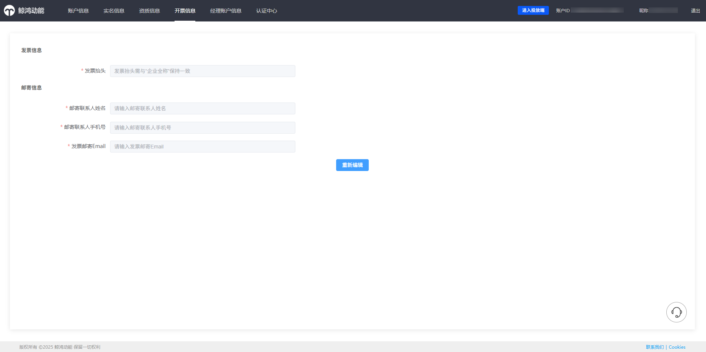
5. <strong>授权管理</strong>

   关联经理账户：您可以关联经理账户，广告账户与经理账户建立绑定关系后，经理账户被授权予本广告账户的操作权限、查看权限。

   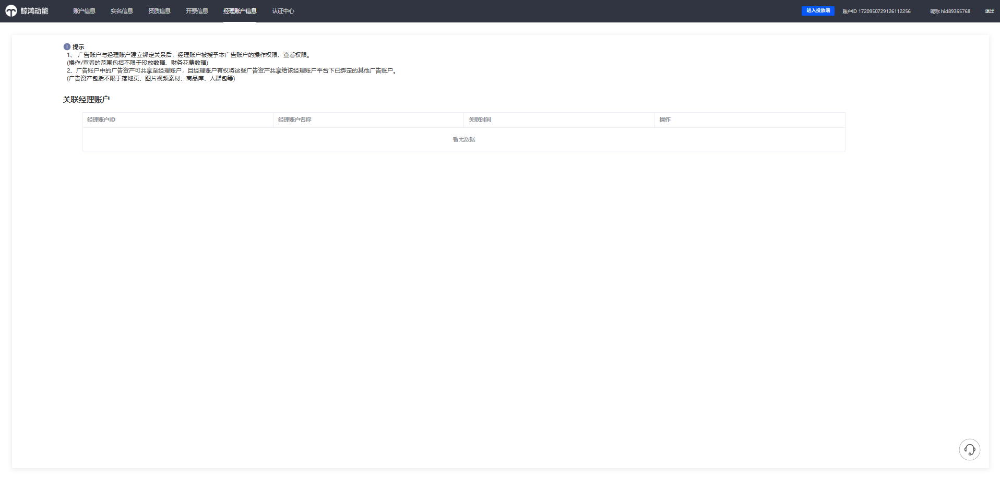

   应用授权账户管理：

   广告主将名下应用推广权限授权服务商-子客账户代替广告主投放，单击“申请授权”，根据页面提示填写，提交审核完成授权。

   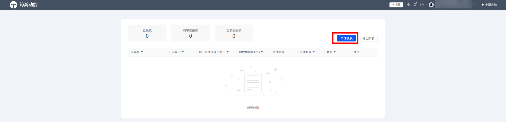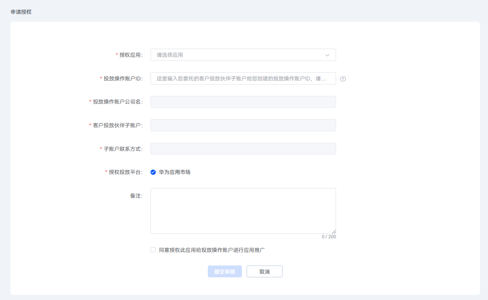
