# 杂志锁屏

## 杂志锁屏-品牌广告设计规范

<strong>1.1 UX</strong> <strong>架构定义</strong>

杂志锁屏的UX架构，包括两个部分：

<strong>（</strong> <strong>1</strong> <strong>）</strong> <strong>UX</strong> <strong>部分</strong>

a. 标题；

b. 文案描述；

c. 其他：包括状态栏/解锁提示/时间日期/相机快捷操作/快捷功能等；

- 展示逻辑：广告素材与原生素材混合推荐给用户。
- 商业广告在文案描述后会标明“(广告)”。

<strong>（</strong> <strong>2</strong> <strong>）图片部分：</strong>

a. 原生素材

b. 商业广告图片

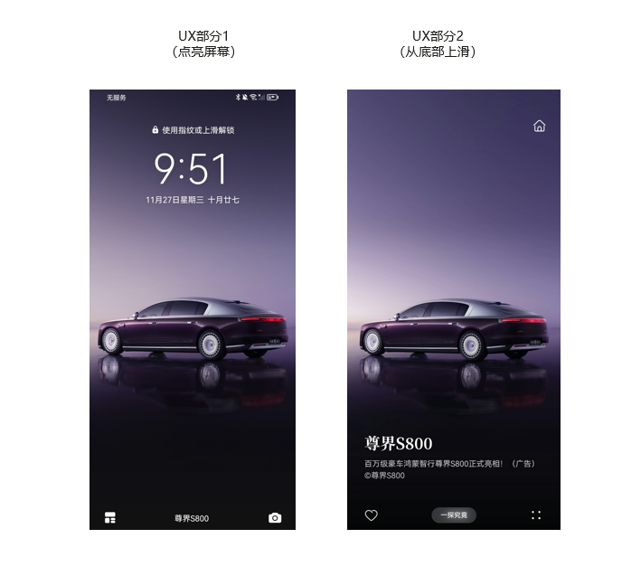

<strong>架构定义</strong>

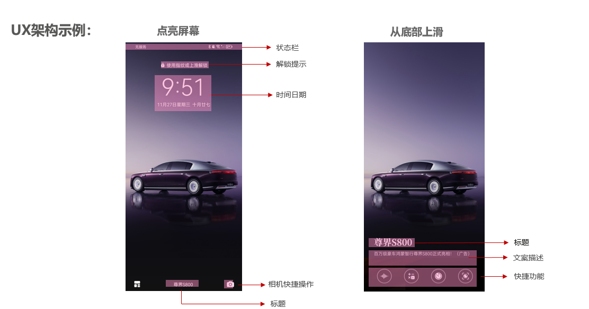

<strong>2.1 版权：</strong>

确保设计用图的版权、人物肖像权、字体版权。

<strong>2.2 性质</strong>

必须符合国家相关的法律标准；

不得含有意识形态以及色情元素。

<strong>2.3 质量：</strong>

保证图片清晰度，分辨率150dpi以上。

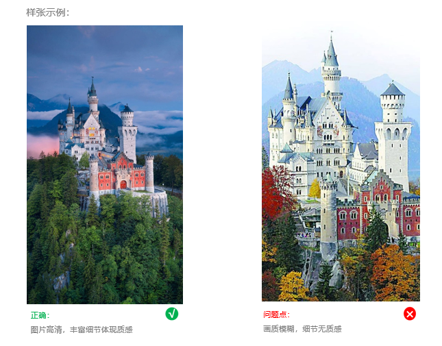

<strong>3.1</strong> <strong>色相</strong>

画面要有明确突出的主色调，切合营销表达的主题与品牌格调。

<strong>3.2</strong> <strong>饱和度</strong> <strong>/</strong> <strong>明度</strong>

饱和度和明度是为了体现色彩的层次和舒适度；

色彩自然舒适，层次生动，避免出现灰脏质感。

要根据品牌格调及营销主题，来选择合适的色彩表达，比如：

纯色调的色彩饱和度高、穿透力强，常用于大促营销设计中；

而低明度的色调，常用于轻奢、品质、质感的设计中。

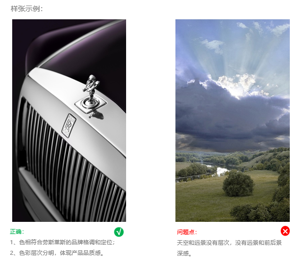

<strong>3.3</strong> <strong>对比度</strong>

配色须充分考虑视觉舒适度，不能过于使用色环上的对比色，尽量使用色环上不超过15°~30°以内的颜色，对比色作为点缀色使用。

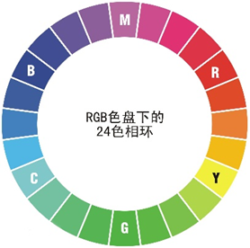

备注：

（1）减少使用强对比的色彩，不可使用高饱和撞色的配色（如亮红搭配亮黄)；

（2）不可包含大面积的、引起视觉不适的醒目颜色；

（3）不可只考虑吸引用户眼球，以突兀的颜色、元素搭配；

（4）色彩构成合理，避免出现单一、杂乱或搭配不当等。

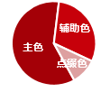

主色： 画面的基调，建议占画面约50%-60%；

辅助色：辅助衬托主色，建议占画面约30%-40%；

点缀色：画龙点睛，建议占画面小于15%；

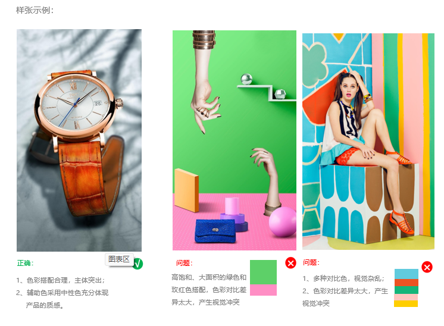

<strong>4.1</strong> <strong>元素</strong>：

（1）版面主体元素的数量：画面要简洁美观，整体元素控制在3个以内，主次搭配合理，与背景协调，避免主体太单调、太杂乱；

（2）不得使用任何影响用户体验的元素，如变形的元素、马赛克、缺乏修饰的图片等；

（3）不允许出现引导操作的按钮、二维码、条形码图、水印，不得为图片增加边框；

（4） 图片中的动物形象，不作为画面主视觉出现。

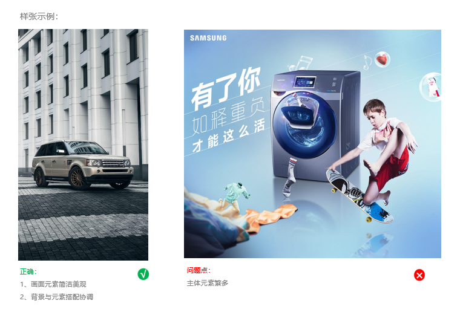

<strong>4.2</strong> <strong>人物</strong>：

（1）含人物肖像的图片，必须无肖像权争议，人物五官端正、气质优美，与品牌调性相符；

（2）图片中人物表情和姿态自然真实，不得出现怪异、夸张地表现；

（3）不以儿童作为主视觉，不露出儿童正面肖像；

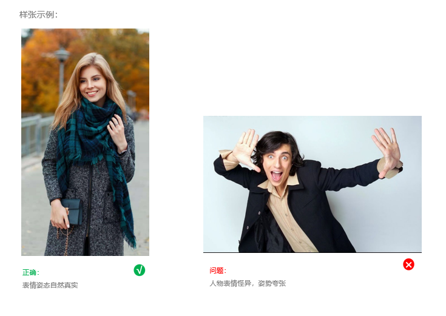

<strong>4.3</strong> <strong>风格</strong>：

简洁美观大方，符合真实感与合理性：

（1）创意逻辑合理，不得出现简单拼凑、无美感、渲染过度、元素搭配比例不真实等；

（2）画面光线自然、柔和、清晰，无过度的明暗对比；

（3）插画、二次元风格的图片暂不支持。

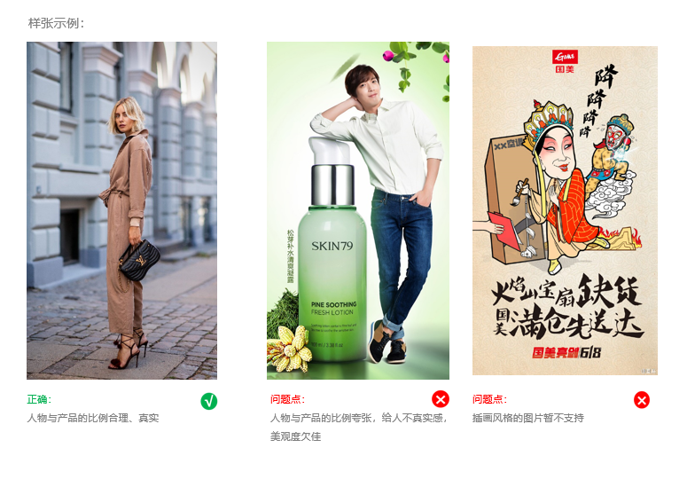

<strong>4.4</strong> <strong>视觉动线</strong>：

画面要有清晰地正确地视觉引导，突出营销的主题。

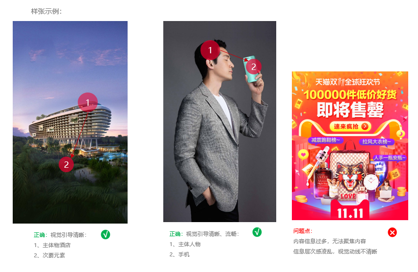

<strong>5.1</strong> <strong>图片规格</strong>：

格式：JPG/JPEG；

尺寸：1440\*2560px

大小：500KB以内

<strong>5.2</strong> <strong>安全区域：</strong>

图片在终端屏幕上的最终显现要符合：

（1）画面元素不得干扰手机本身内容的显示；

（2） 在不同尺寸的终端屏幕上，图片信息显示要保证完整清晰。

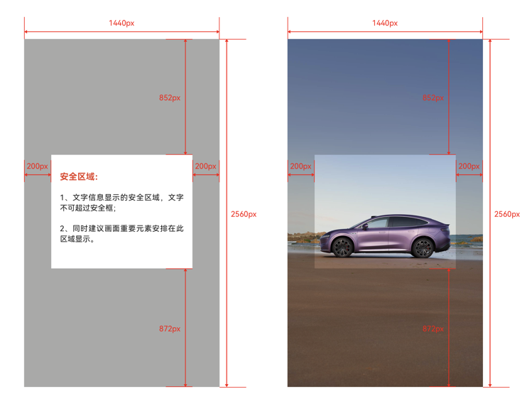

<strong>5.3</strong> <strong>版式建议</strong>：

<strong>融合型：</strong>

画面重要的主体集中在安全区域显示；

Logo 不作为单独元素表现，而是与产品或者画面其他元素巧妙融合。

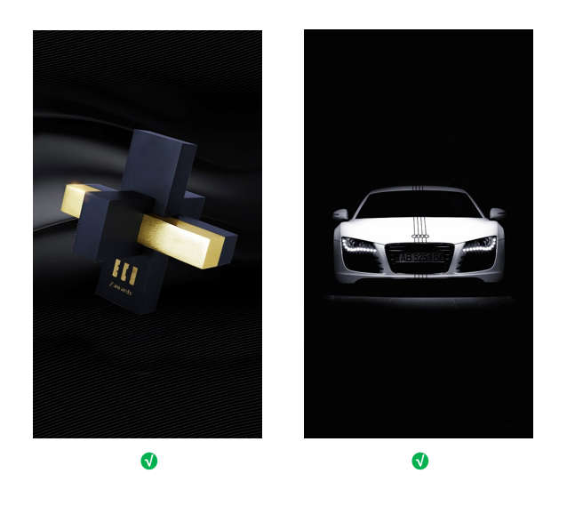

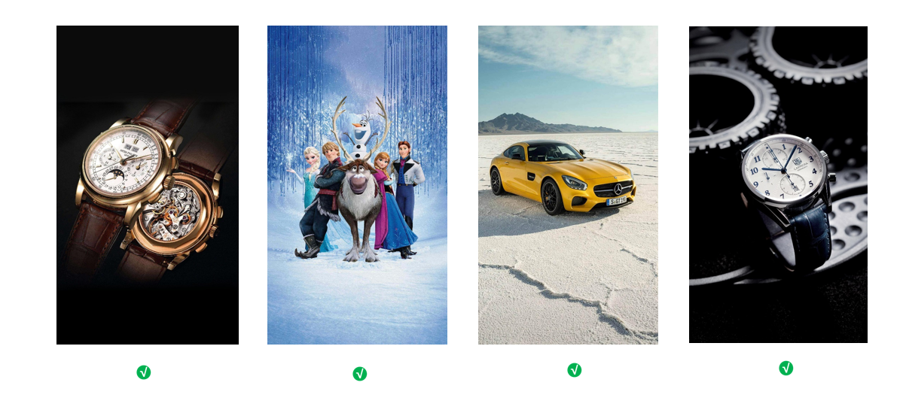

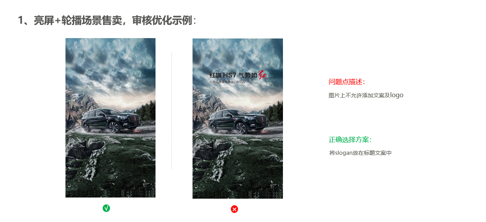

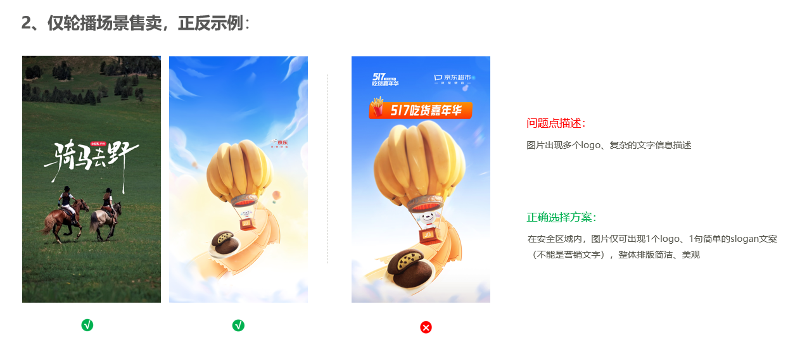

<strong>6.1</strong> <strong>图片规格</strong>：

格式：JPG/JPEG；

尺寸：2934\*3306

大小：500KB以内

<strong>6.2</strong> <strong>安全区域：</strong>

图片在终端屏幕上的最终显现要符合：

(1) 画面元素不得干扰手机本身内容的显示，重要元素需在安全区域内展示；

(2)安全区内需放非杂乱元素。

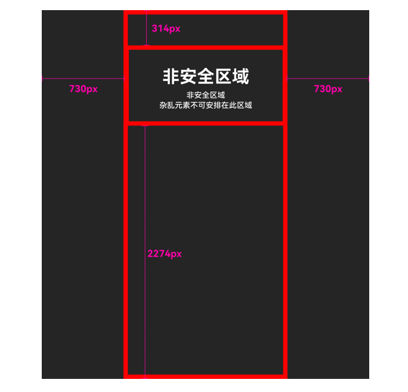

<strong>6.3</strong> <strong>版式建议</strong>：

<strong>融合型：</strong>

画面重要的主体集中在安全区域显示；

Logo 不作为单独元素表现，而是与产品或者画面其他元素巧妙融合。

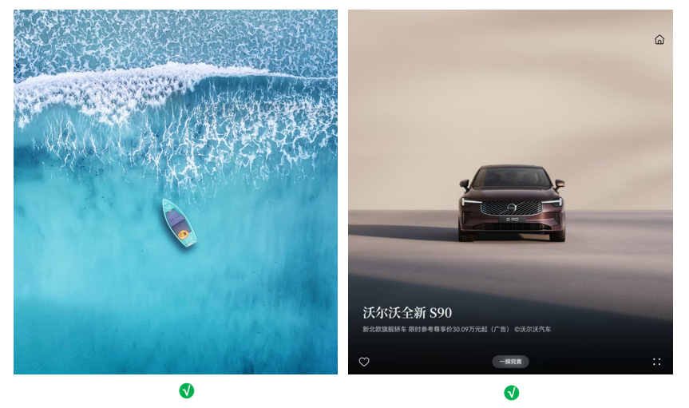
