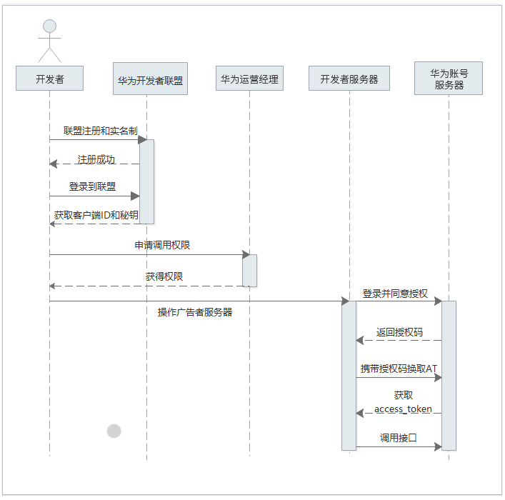

# API接入全流程

1. 开发者到[联盟完成实名认证](https://developer.huawei.com/consumer/cn/doc/start/rna-0000001062530373)。
2. OAuth2.0认证：Marketing API 采用OAuth2.0授权码模式（authorization code）模式进行授权认证，所有接口均通过请求头中传递的access\_token（授权令牌）来进行身份认证和鉴权。
3. 申请应用权限：获取到客户端ID和密钥后，需要为客户端ID申请调用权限。
4. 登录并获取access\_token。
5. 调用业务接口。

