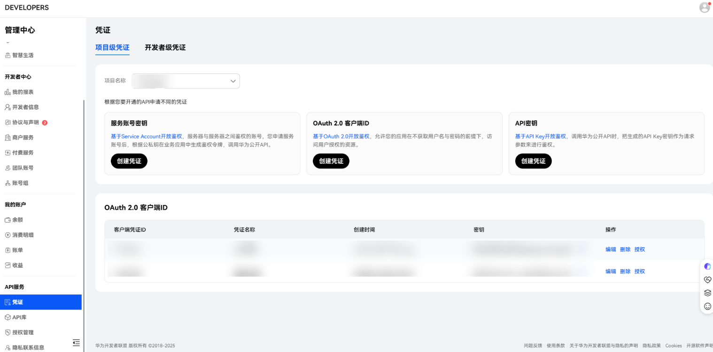
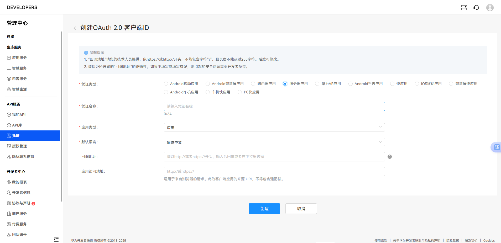
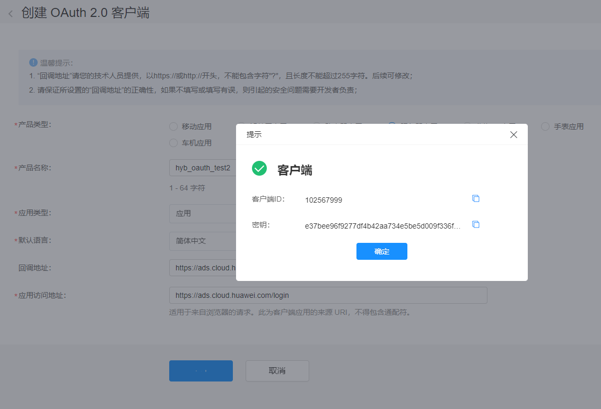

# OAuth2.0认证

Marketing API 采用OAuth2.0授权码模式（authorization code）模式进行授权认证，所有接口均通过请求头中传递的access\_token（授权令牌）来进行身份认证和鉴权。

1. 使用实名认证账号登录[联盟](https://developer.huawei.com/consumer/cn/console)
2. 选择“管理中心”-&gt;“API服务”-&gt;“凭证”-&gt;“OAuth2.0 客户端ID”

   
3. 各字段填写方式如下：
   - 凭证类型：服务器应用（只能选这个，其他MAPI不可用，默认值）
   - 凭证名称：客户端名称
   - 应用类型：应用
   - 默认语言： 简体中文
   - 回调地址："回调地址"请您的技术人员提供，以https//或```http://开`头``，不能包含字符"?，且长度不能超过255字符。后续可修改。
   - 应用访问地址：客户端原地址，格式https://\{ServerRoot\}



注：<strong>回调地址必填</strong>且与应用访问地址完全一样，且必须是https协议类型网址。

4. 单击“创建”，创建凭证成功，复制“客户端ID”和“密钥”即可


