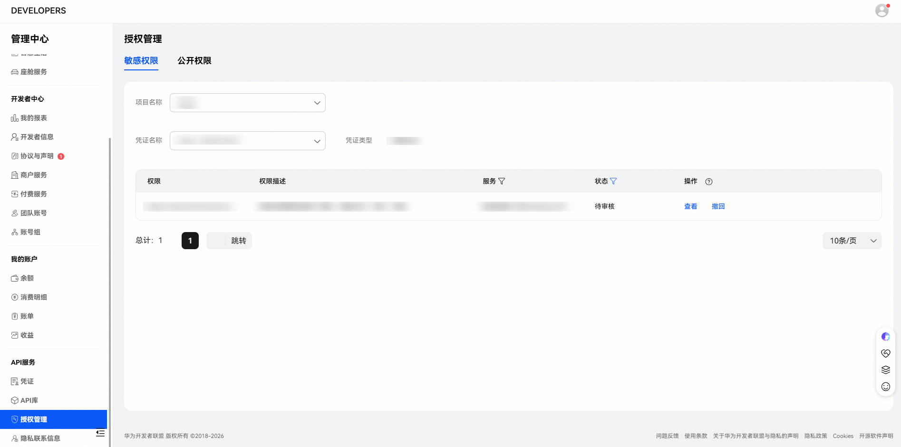
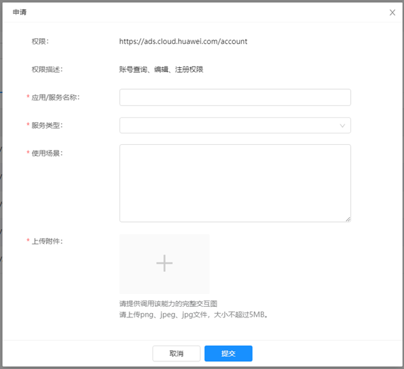
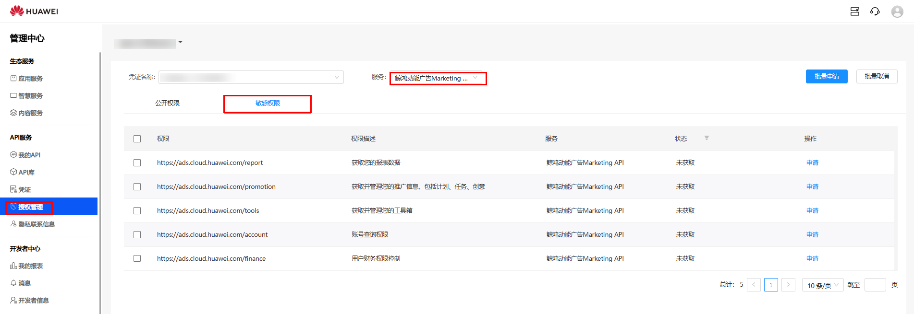

# 申请应用权限

## 申请方式

1. 使用通过[实名认证](https://developer.huawei.com/consumer/cn/doc/start/itrna-0000001076878172)的华为团队主账号登录[华为开发者联盟](https://developer.huawei.com/consumer/en/console#/serviceCards/)，请不要使用团队账号。
2. 选择“API服务”-&gt;“授权管理”，选择需要申请的权限内容，单击“申请”，状态变更为“待审核”状态，完成提交申请。如果存在多个凭证，选择自己需要的授权的对应项目下的凭证名称、公开权限非鲸鸿动能业务，无需关注。
3. 申请需要调用的scope权限

   应用/服务名称：创建凭证的名称

   服务类型：(固定填写)鲸鸿动能

   使用场景：(固定填写) 进行广告推广的创编查，包括广告计划、任务、创意的创建、编辑查询，广告工具的使用，广告账户信息查询，广告财务信息查询，以及详细的推广数据报表等。

   上传附件：[能力图.png](https://alliance-communityfile-drcn.dbankcdn.com/FileServer/getFile/cmtyPub/011/111/111/0000000000011111111.20260529160119.96383717917541064614435190689603:20260531101338:2800:613A872FCAAB279F5A859D6CCAB11F6057E6400904F852C2770F369128C113E9.zip?needInitFileName=true)

   
4. 请通过邮箱申请权限，主送对应行业运营邮箱。

## 邮件模板

<strong>邮件标题：</strong>申请开通鲸鸿动能Marketing API服务

<strong>邮件正文：</strong>申请开通如下应用的推广服务权限

登录开发者联盟的华为账号：\\{开发者联盟平台账号\\}

开发者企业名称：\\{在开发者联盟实名认证的企业名称\\}

客户端ID：\\{1.2节获取的客户端ID \\}

登录广告平台的华为账号：\\{鲸鸿动能投放平台账号\\}

广告主企业名称：\\{在广告平台实名认证的企业名称\\}

投放平台账户ID：\\{账户ID\\}

回调地址：\\{获取授权码和token时的跳转地址\\}

认证方式：\\{授权码模式或客户端模式\\}

邮件中需提供以下截图，截图中客户端ID与申请ID保持一致:

