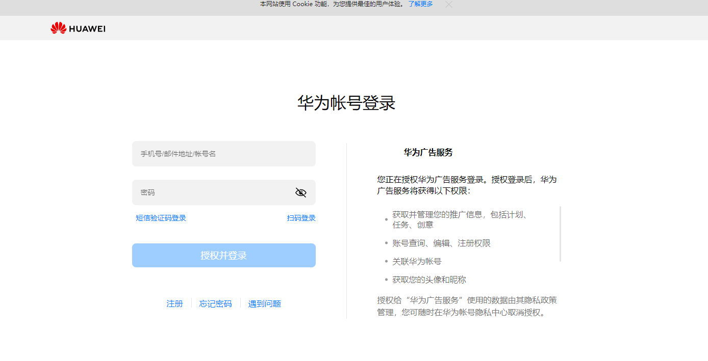
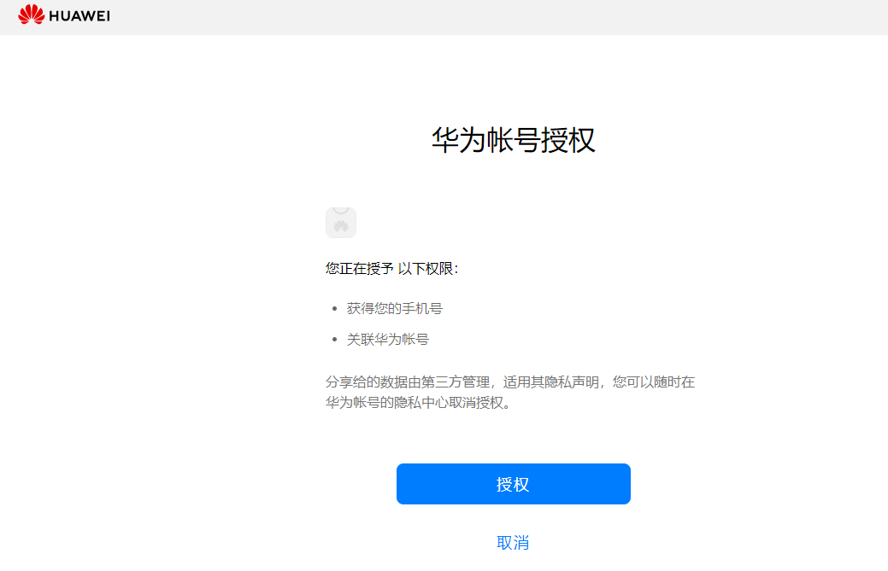
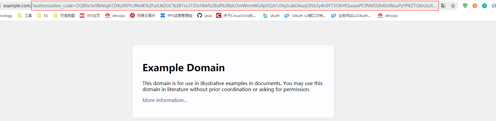

# 登录并获取access\_token

1. 通过API获取授权码拼接地址

<strong>请求消息</strong>

客户端：开发者服务器

服务端： HUAWEI账号服务器https://oauth-login.cloud.huawei.com/oauth2/v2/authorize

请求协议：HTTPS

请求方式：GET

接口URL：<strong>https://oauth-login.cloud.huawei.com/oauth2/v2/authorize</strong>

<strong>请求参数</strong>

|  |  |  |  |
| --- | --- | --- | --- |
| 参数名称 | 类型 | 是否必选 | 描述 |
| response\_type | string | 是 | 固定为“code” |
| client\_id | int | 是 | 客户端ID |
| scope | string | 是 | 功能scope，多个值使用空格分隔。固定填写：  https://www.huawei.com/auth/account/base.profile https://ads.cloud.huawei.com/report https://ads.cloud.huawei.com/promotion https://ads.cloud.huawei.com/tools https://ads.cloud.huawei.com/account  https://ads.cloud.huawei.com/finance |
| redirect\_uri | string | 是 | 授权后回调的URI，用于接收Authorization Code。需要进行URLEncode编码，参考请求示例。  注意：如果应用接收回调请求的redirect\_uri渲染一个HTML页面，那么该页面下的任何资源都将能够访问到URL中的authorization code。脚本可以直接读取URL，URL还会出现在HTTP头中的Referer字段，这个头部会被发送到该页面下的任何资源。  为了避免这个问题，建议应用服务器先处理这个请求，然后重定向到另一个不会包含authorization code参数的URL。 |
| access\_type | string | 否 | 是否需要返回refresh\_token。需要时填写offline，不需要时不填写 |
| state | string | 否 | 用于保持请求和回调的状态，授权服务器在回调时（重定向用户浏览器到“redirect\_uri”时），会在Query Parameter中原样回传该参数。OAuth2.0标准协议建议，利用state参数来防止CSRF攻击。 |

<strong>请求示例</strong>

GET https://oauth-login.cloud.huawei.com/oauth2/v2/authorize?response\_type=code&client\_id=123456&redirect\_uri=https%3A%2F%2Fwww.example.com&scope=https%3A%2F%2Fads.cloud.huawei.com%2Fpromotion&t&

HTTP/1.1

Content-Type: application/x-www-form-urlencoded

<strong>也可手动拼接鲸鸿动能的令牌登录获取地址：</strong>

<strong>[https://oauth-login.cloud.huawei.com/oauth2/v2/authorize?response\_type=code&client\_id=10380742&redirect\_uri=https%3A%2F%2Fe.hicloud.com&scope=https%3A%2F%2Fwww.huawei.com%2Fauth%2Faccount%2Fbase.profile%20https%3A%2F%2Fads.cloud.huawei.com%2Freport%20https%3A%2F%2Fads.cloud.huawei.com%2Fpromotion%20https%3A%2F%2Fads.cloud.huawei.com%2Ftools%20https%3A%2F%2Fads.cloud.huawei.com%2Faccount&access\_type=offline](https://oauth-login.cloud.huawei.com/oauth2/v2/authorize?response_type=code&client_id=10380742&redirect_uri=https://e.hicloud.com&scope=https://www.huawei.com/auth/account/base.profile https://ads.cloud.huawei.com/report https://ads.cloud.huawei.com/promotion https://ads.cloud.huawei.com/tools https://ads.cloud.huawei.com/account&access_type=offline)</strong>

请将client\_id替换为申请到的客户端ID，将redirect\_uri替换为业务的回调地址。

随后，跳转至登录界面，输入您想要访问的广告账户密码，OAuth 2.0服务器会把响应值通过redirect\_uri反馈给应用，如果您同意授权，则回调请求中带有授权码authorization code。







 

<strong>所需注意易错点：</strong>

<strong>1.如果您是直客/子客账户，使用您广告团队主账户进行登录授权，请不要使用成员账号进行登录。</strong>

<strong>2.浏览器可能会默认填充您上次登录其他业务使用的华为账号，请在登录页面再次确认您进行授权的是您在鲸鸿动能进行广告账户开户（按您授权身份的不同，可以是广告主账户、经理账户或服务商账户）时使用的华为账号。</strong>

<strong>3.如果您是服务商/子客服务商角色，可参考经理账户授权调用方式。</strong>

<strong>4.如果是测试接入，建议使用浏览器无痕授权，确保要输入广告的账号密码实际授权。</strong>

<strong>5.登录授权页只能输入一个账号。</strong>

<strong>带授权码的回调：</strong>

[https://www.example.com/?authorization\_code=DQB6e3x9BA6qhTZtKy9iPYcJNvtK%2FuILikDUC%2B1ss372SvVbk%2Bs8%2BdU3mWvmWGAjx5QA1z9njJcakOAuqOlS63y4n0YT35XHfQuojwPC9VkISSRrKinWzuPyYPKZTGKn2oJtZtbnODhsB8LTc26RIcWqIIO7%2BCYR9kYCNa9USzM87hy8lwAJdDXiQCf3qJnyTwvqbt6LJg%3D%3D](https://www.example.com/?authorization_code=DQB6e3x9BA6qhTZtKy9iPYcJNvtK/uILikDUC%2B1ss372SvVbk%2Bs8%2BdU3mWvmWGAjx5QA1z9njJcakOAuqOlS63y4n0YT35XHfQuojwPC9VkISSRrKinWzuPyYPKZTGKn2oJtZtbnODhsB8LTc26RIcWqIIO7%2BCYR9kYCNa9USzM87hy8lwAJdDXiQCf3qJnyTwvqbt6LJg==)

2. 用授权码换取AT

<strong>请求消息</strong>

客户端：开发者服务器

服务端：HUAWEI账号服务器

请求协议：HTTPS

请求方式：POST

接口URL：<strong>https://oauth-login.cloud.huawei.com/oauth2/v2/token</strong>

<strong>请求参数</strong>

|  |  |  |  |
| --- | --- | --- | --- |
| 参数名称 | 类型 | 是否必选 | 描述 |
| grant\_type | string | 是 | 固定为“authorization\_code” |
| code | string | 是 | 通过/oauth2/v2/authorize接口获取到的Authorization Code，注意code是一次性的，且只有5分钟有效期，5分钟之前获取的code或者已经使用过的code，是不能再使用的  使用之前需要将code decode解码 |
| client\_id | int | 是 | 必须和调用/oauth2/v2/authorize接口时传递的client\_id一样 |
| client\_secret | string | 是 | client\_id的密码 |
| redirect\_uri | string | 是 | 必须和调用/oauth2/v2/authorize接口时传递的未加密之前的redirect\_uri参数完全一致 |

<strong>请求</strong> <strong>示例</strong>

POST https://oauth-login.cloud.huawei.com/oauth2/v2/token

HTTP/1.1

Content-Type: application/x-www-form-urlencoded

grant\_type=authorization\_code&code=DQB6e3x9VcE1p6TbMpZYACkHZ1S6%2Bk%2FXqls2JAhlQhLhBcJRxopxVv8qwajzIowWBVUH2dytzy57S0ix14mohbjzL5kBeOT5m6noOqUqIeHoZ6aZalxTCVF%2BVSHSnZsTBUjR%2FWz7C5e3XHMSvxtqYsUjiXkq4f5MeRRjA8vnpyI%2Fub45ukyGPXXPdy0QKGKWwZQvGp4L6Q%3D%3D&client\_id=123456&client\_secret=xxxxxx&redirect\_uri=https://e.hicloud.com

<strong>响应参数</strong>

|  |  |  |  |
| --- | --- | --- | --- |
| 参数名称 | 类型 | 是否必选 | 描述 |
| access\_token | string | 是 | 应用access\_token。  json字符串中存在转义符。如果用curl命令或者postman工具手工获取access\_token，把“\/”还原为“/”才是正确的access\_token，否则在使用access\_token的过程中会报access\_token非法。如果是写代码，采用任意的第三方库，都能正确解析json串，获取到正确的值 |
| expires\_in | string | 是 | 应用access\_token过期时间，单位（秒） |
| refresh\_token | string | 否 | 用于刷新Access Token 的 Refresh Token，有效期半年（华为OAuth可能会调整这个配置）。需要在调用/oauth2/v2/authorize接口获取code时传递参数access\_type=offline才会返回refresh\_token |
| scope | string | 是 | Access Token最终的访问范围 |
| token\_type | string | 是 | token类型 |

<strong>应答示例</strong>

HTTP/1.1 200 OK

Content-Type: application/json

Cache-Control: no-store

```
{"access_token":"CgB6e3x9WivoFhhdEA9nppR\/Tl1eye1OC0c\/a8VH17m\/AYq0yFfgaY6KRbpMmFAq+pg\/YngjAC+p16prtz\/YThC** ** **zKv2bY\/ZNYWtbpHMOSjJw==", "expires_in":3600, "refresh_token": "CF13G0sRaGybtYt7SIyeUILNORtTFwMgz4ao5C7j7vtgLPt6ogmXKjdI8RS\/YlyS71z4** ** **MnOrRlmNK0KhdOUNWd+qVLLRsEEHkqRIKpuAkPvL8=", "scope":"https:\/\/ads.cloud.huawei.com\/promotion openid","token_type":"Bearer"}
```
