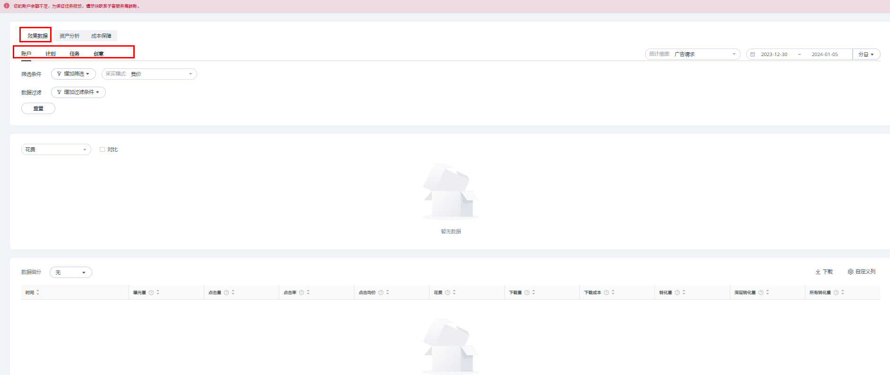
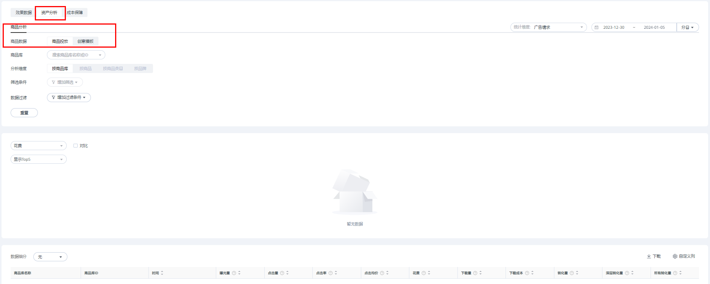
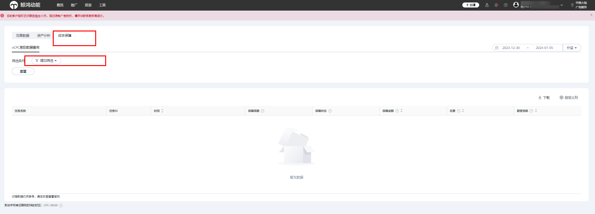
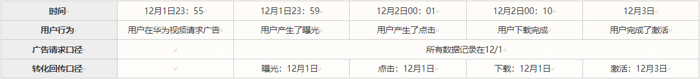

# 查看广告效果（报表）

## 功能简介

鲸鸿动能投放平台提供详细的广告效果报表，您可以在“报表”界面，通过“效果数据”、“资产分析”、“成本保障”三个模块内容进行详细的数据分析。

<strong>效果数据</strong>

您可以查看和下载选定时间范围内账户、计划、任务、创意的曝光、点击、点击均价等多个指标详细数据，也可以在“推广”界面查看广告任务各项指标的详细数据，并基于指标数据对广告进行管理。

<strong>资产分析</strong>

您可以按照商品库、商品、商品类目和品牌维度，勾选不同的筛选条件查看不同商品的数据。

<strong>成本保障</strong>

您可以通过成本保障报表查看账户的oCPC广告任务激励金额。该数据每日刷新一次，当日数据不显示，次日可查看。您可基于此数据完善考核管理，并支持查看分日或整个保障周期的oCPC激励数据。

分日：可查看保障周期内任务每日的预计激励金额，数据仅用于参考。

保障周期整体：可查看保障周期整体的激励数据，数据仅用于参考。

<strong>自定义指标</strong>：

解释如下表所示：

|  |  |  |
| --- | --- | --- |
| <strong>指标属性</strong> | <strong>指标名称</strong> | <strong>指标定义</strong> |
| 属性指标 | 任务名称 | 您创建的oCPC广告任务名称。 |
| 任务ID | 您创建的oCPC广告任务ID。 |
| 时间 | 您创建某个oCPC广告任务的时间。 |
| 保障周期 | oCPC广告任务的保障周期，10天为一个周期，共两个周期，若周期内无数据则不显示该周期数据。 |
| 转化目标 | 您的oCPC广告任务设置的转化目标，如激活、表单提交等。 |
| 深度转化目标 | 您的oCPC广告任务设置的深度转化目标，如激活-次留双出价、表单提交（Venus）-有效线索双出价等。 |
| 保障开始时间 | 保障周期的第一天。 |
| 保障结束时间 | 保障周期的最后一天。 |
| 保障状态 | 当前任务的保障情况，分为成本保障中、不满足保障、保障已结束无需赔付、保障金额统计完成、保障核实中、保障结束但欠费、欠费已补齐保障金额统计完成和不涉及等8种状态。  成本保障中：广告正在成本保障周期内，且广告满足成本保障评估标准，可以放心投放 。  不满足保障：在成本保障周期内，因广告使用RTA修改出价、或者修改次数、修改出价幅度等不满足成本保障标准，不再适配成本保障政策。  保障已结束无需赔付：在成本保障周期后，广告因转化数或超成本偏差范围不满足成本保障标准，无需发放超成本保障金。  保障金额统计完成：成本保障周期已结束，系统已统计完成保障金额，即将发放，请耐心等候 。  保障核实中：成本保障周期已结束，系统等待转化数据回传，请耐心等候。  保障结束但欠费：保障金额统计完成，但账户有欠费，该账户的成本保障金将暂停发放，待该账户欠费补缴后系统再补发。  欠费已补齐保障金额统计完成：保障金额统计完成，账户历史上曾存在“保障结束但欠费”的状态，但当前欠费金额已补齐， 即将发放，请耐心等候。  不涉及：账户不参与超成本保障。 |
| 展示指标 | 保障金额 | oCPC广告任务的赔付金额，过程数据可能为负，随转化回传，金额会发生变化。 |
| 花费 | 广告主为投放付出的费用成本，实际扣费以财务记录为准。 |
| 期望消耗 | 目标成本\*转化数 |
| 转化数 | 转化数是指由广告投放带来的与投放计划的转化目标一致的转化事件量的加和。如您选择了“激活”事件为您广告任务的oCPC转化目标，则转化量为注册广告任务归因到的“激活”事件的量。 |
| 深层转化数 | 深层转化数指由广告投放带来的与投放计划的深层转化目标一致的深层转化事件量的加和。如您在双出价情况下，选择“激活”事件为您的转化目标，“次留”事件为您的深层转化目标，则深层转化量为广告任务归因到的“次留”事件的量。 |
| 转化成本 | 花费/转化数 |
| 深层转化成本 | 花费/深层转化数 |
| 目标转化成本 | 您的oCPC广告任务设置的目标转化成本。 |
| 深层目标转化成本 | 您的oCPC广告任务设置的深层目标转化成本 |
| 保障后转化成本 | 考虑保障金额后的实际转化成本。 |

 

- 报表日期最大跨度可以选择近一年（365天）。
- 分时数据仅支持查看最近7天的数据。
- <strong>账户容量</strong>：（目前配置计划10万、任务10万、创意25万），若广告主账户中未删除任务量达到上限，可删除历史无效任务后继续使用。
- 为避免频繁创建或删除造成账户历史数据量过大，数据查询异常，后台增加“每月创建计划/任务/创意数量”上限，（目前配置计划5万，任务5万，创意25万）。
- 查询全部/已删除的计划任务创意：
  1. 查询已删除任务时，历史数据超过最大值（目前配置10万条），需分段查看，每次最多2个自然月内数据。

     例如：查询1月1日-3月30日已删除任务，符合条件的任务数有15万，则需要分“1月1日-2月28日”/“3月1-3月30”查两次。
  2. 查询账户全部计划任务创意时，如超过最大值，查询方式同上。
- 统计维度：您可以通过统计维度对投放数据进行筛选，快速找到您关注的广告数据。
  1. 广告请求： 所有指标都按照该次广告请求发生的时间统计。
  2. 转化回传：转化跟踪的指标（激活、表单提交）按照实际回传转化的时间进行统计，非转化跟踪指标（曝光、点击、下载）仍按照请求发生的时间统计。

  <strong>示例：</strong>

  
