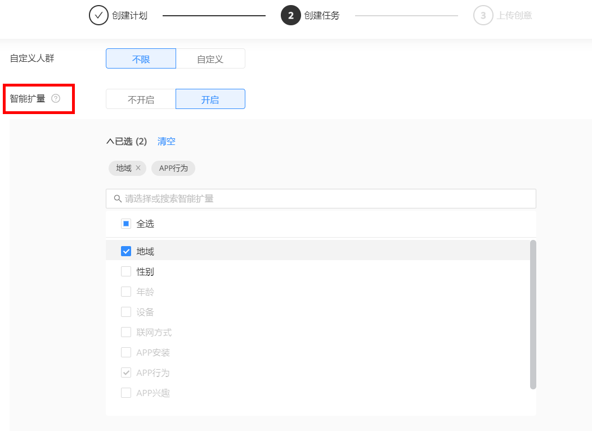

# 广告定向

## 概述

鲸鸿动能广告目前支持的定向条件包括地域、性别、年龄、App安装、细分受众、设备、联网方式、自定义人群等。您可以自由选择、组合这些特征或行为，精准刻画和锁定您的目标用户进行广告投放。

## 定向设置

<strong>地域：</strong>支持按照地理位置或发展等级设置地域定向。

- 地理位置：支持定位至省、市或自治区、自治州。
- 发展等级：一线、新一线、二线、三线、四五线城市。
- 当前在这里的人：当前位置在该区域的人。
- 常住在这里的人：最近90天内居住在该区域的人。

<strong>性别：</strong>支持选择“男、女”性别定向。

<strong>年龄：</strong>可选年龄段分别为“18岁以下、18-23岁、24-34岁、35-44岁、45-54岁、55岁以上”。

<strong>App安装：</strong>若您的推广产品为应用，您的广告可以选择对“已安装”和“未安装”该应用的用户进行投放。

- 如果您想投放给未安装您应用的用户提升下载量，请选择“未安装”。
- 如果您想对已安装您应用的用户进行应用促活，请选择“已安装”。

<strong>细分受众：</strong>细分受众定向可以选择“不限”或者“自定义”，“自定义”细分定向可选以下维度：

- 用户属性：根据用户的基础信息圈选人群。
- 用户行为：用户的APP行为（活跃、安装）。
- 行业兴趣：根据用户对某些行业、应用、商品的兴趣进行定向。
- 购买意向：近期可能有购买商品、服务的人群。

<strong>设备：</strong>您可以根据用户使用的设备品牌、机型或设备价格进行定向，其中设备品牌支持选择HUAWEI或HONOR。

<strong>联网方式：</strong>您可以根据用户设备的联网方式进行定向，可以投放给WIFI、2G、3G、4G、5G网络状态下的用户。

<strong>自定义人群：</strong>您可以通过人群包指定投放给某个人群或者排除某个人群，详情查看[人群管理](https://developer.huawei.com/consumer/cn/doc/promotion/ads_gongju04-0000001458996605)。

<strong>媒体类型：</strong>您希望自己的广告在什么内容上展示，利用主题或媒体类型定位如游戏或应用，更有针对性地覆盖受众群体。

<strong>智能扩量：</strong>达到一定转化量后，系统会根据历史数据在广告原有定向人群外主动帮您触达更多目标人群。

### 操作步骤

1. <strong>设置基础定向</strong>：创建任务时，设置性别、年龄、地域等常规定向。
2. <strong>开启智能扩量</strong>：打开智能扩量开关，并选择可突破的定向。

    

   （1）若您设置了App行为、App兴趣，开启智能扩量后则默认勾选突破。

   （2）若您设置了自定义人群，自定义人群中的定向包默认突破，排除包不会被突破。

   
3. 广告创建完成后，系统会根据转化人群进行学习，逐渐扩充相似人群进行投放。

### 操作说明

若您在定向中选择江苏省、男性人群，打开智能扩量开关后勾选“地域”为“可放开定向“，则系统会在控制成本的前提下逐步探索江苏省以外的男性用户。

- 修改：如果在广告投放之前，您修改了定向条件，则智能扩量自动随之修改。如果在广告投放之后，您中途修改了任务的定向或修改了智能扩量的定向，广告已经建立起来的人群将会受到影响，广告需要重新跑量，请您谨慎修改。
- 暂停：如果您中途暂停了智能扩量，广告无需重新审核。
- 复制：如果您复制已启用智能扩量的广告计划，则智能扩量功能也会复制成功。

详情请查看[国内智能扩量介绍及使用指导视频课程](https://ads.shixizhi.huawei.com/course/1502116313077112833/application-learn?status=&courseId=1671537427307143170&id=544723103759261696&appId=544723103742484480&classId=544723103742484481&courseType=1&sxz-lang=zh_CN&headershow=false)。
