# 管理式华为账号

## 简介

管理式华为账号是华为账号面向组织提供的账号生命周期管理服务，组织管理员可以创建多个成员账号，对成员账号进行管理、冻结等操作，组织负责成员账号生命周期管理。

成员账号可用于注册鲸鸿动能广告账户，以此突破1个安全手机号只能绑定5个华为账号的限制。

使用管理式华为账号之前，您需要先使用华为账号创建一个组织。

## 组织创建步骤

1. 使用已实名认证的华为账号，登录[管理式华为账号平台](https://id.cloud.huawei.com/EAMPortal/portal/eam/index.html#/organization/orgList)。

   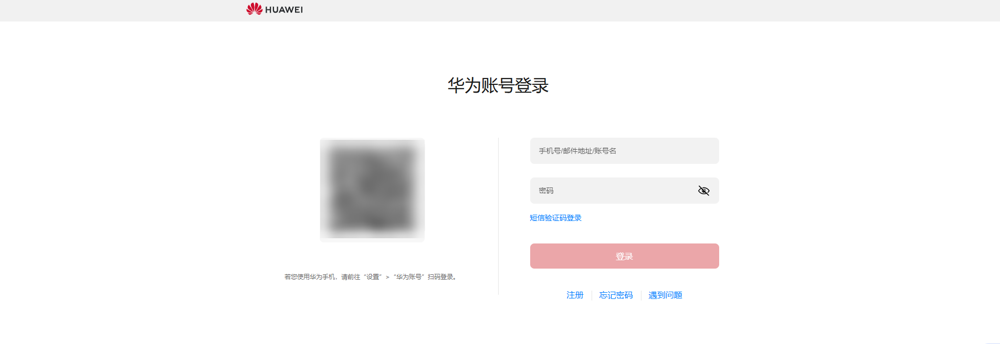
2. 单击“+”创建新组织，设置组织名称。

   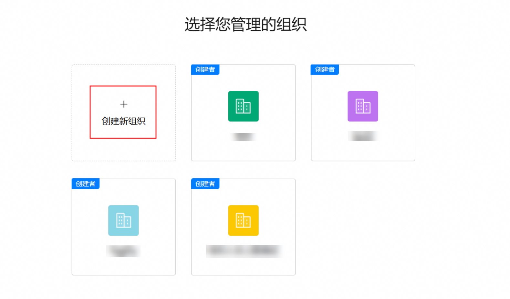

   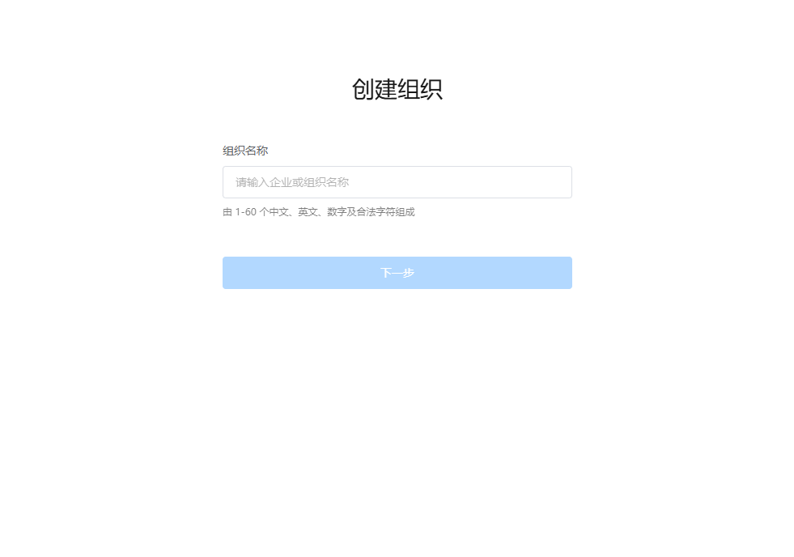
3. 设置组织域名：可选择使用默认免费域名或自有域名。（域名是指网址如: www.example.com中“www”之后的内容，以及电子邮件地址如: 用户名@example.com中“@”之后的内容。）
   - 若您使用华为提供的免费域名，该组织最多容纳账户数量上限为200个；
   - 若您使用自有域名，该组织最多容纳账户数量上限为200个。

   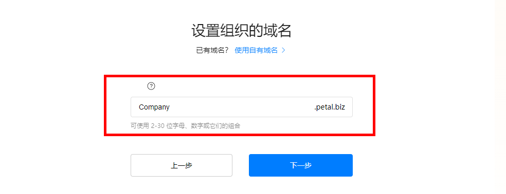
4. 填写管理员信息，创建管理员账号。

   
5. 同意服务协议，组织创建成功。

   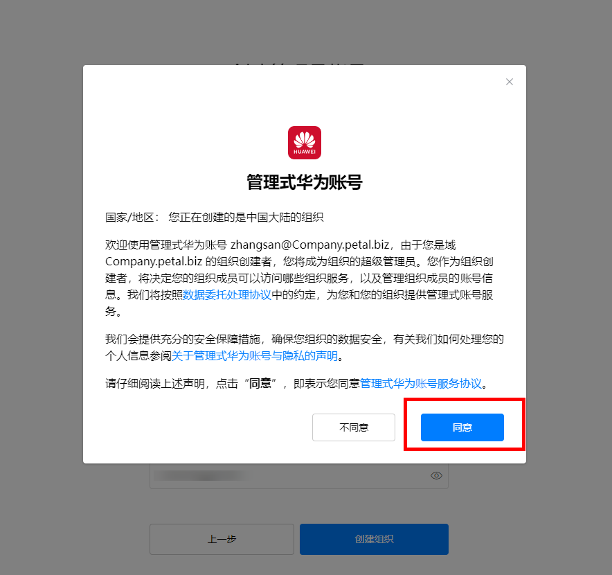

   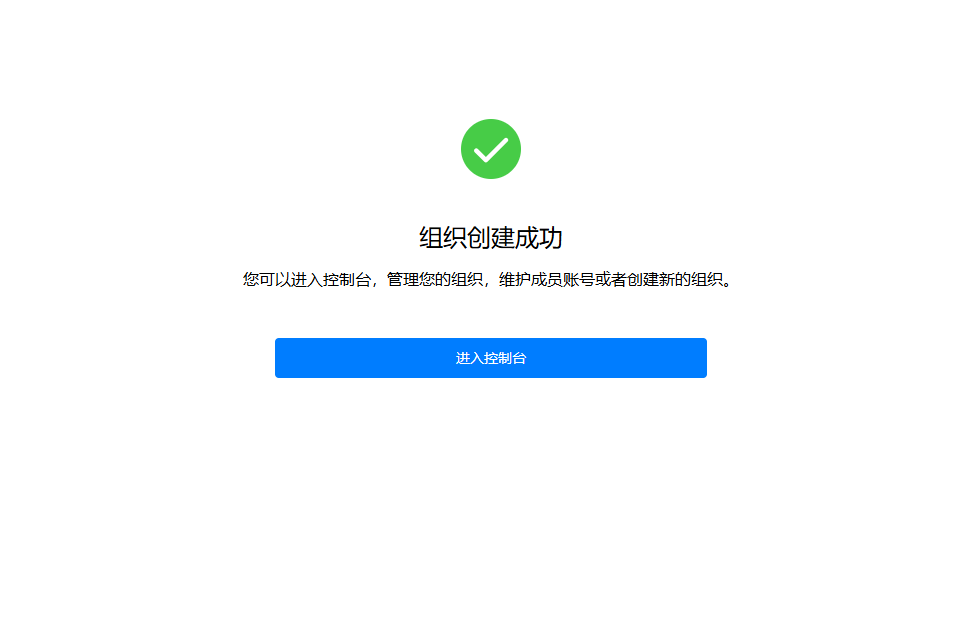

## 管理式华为账号的界面与功能介绍

通过已实名认证的华为账号，登录[管理式华为账号平台](https://id.cloud.huawei.com/EAMPortal/portal/eam/index.html#/organization/orgList)后，单击您创建的“组织”即可进入管理式华为账号平台操作界面。

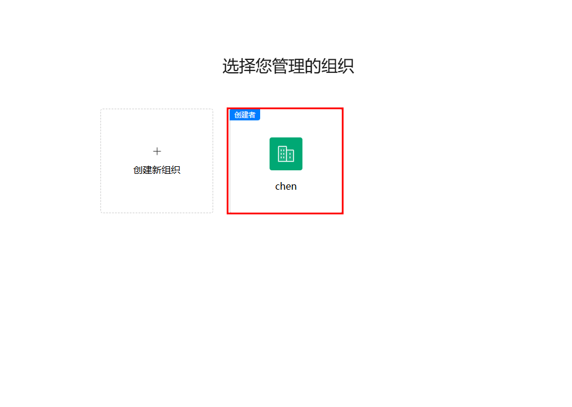

### 首页

支持查看组织信息、成员与部门信息、未激活成员。

### 成员与部门

可以对成员和部门进行查看和管理的模块，支持添加部门、创建成员、邀请成员加入以及批量导入和导出成员。

<strong>添加部门步骤</strong>

1. 管理员在“成员与部门”中选择“添加部门”

   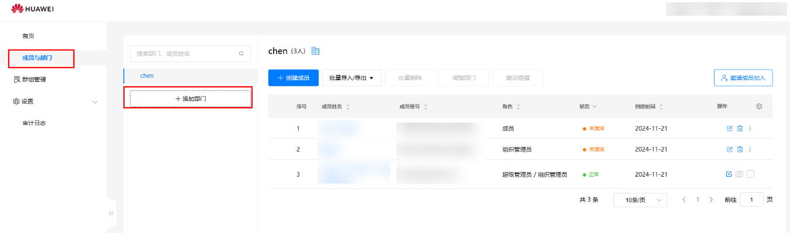
2. 填写部门名称、选择上级部门以及可以添加备注即可完成部门添加。

   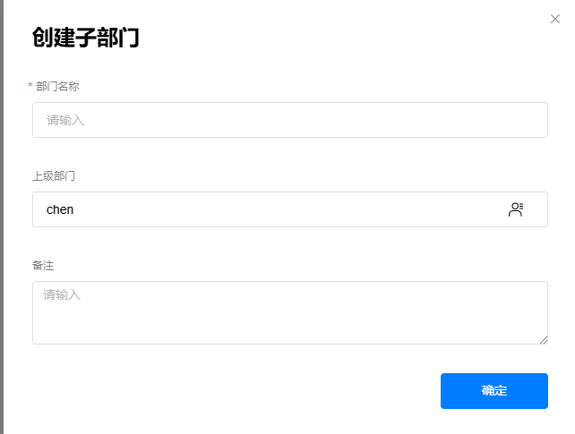

<strong>创建成员步骤</strong>

1. 管理员在“成员与部门”中选择“创建成员”，添加成员账号信息。

   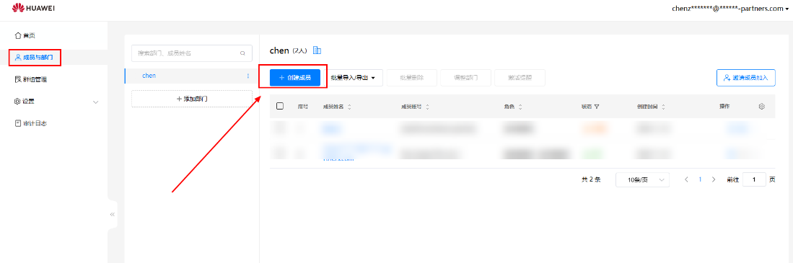
2. 按照页面提示进行以下信息填写：

   默认成员账号格式为：XXX.组织名.petal.biz，可选择自动生成密码或手动输入密码。

   手机号和邮箱地址择一必填，仅用于接收成员账号与密码，以及登录验证码。

   角色选择“成员”。

   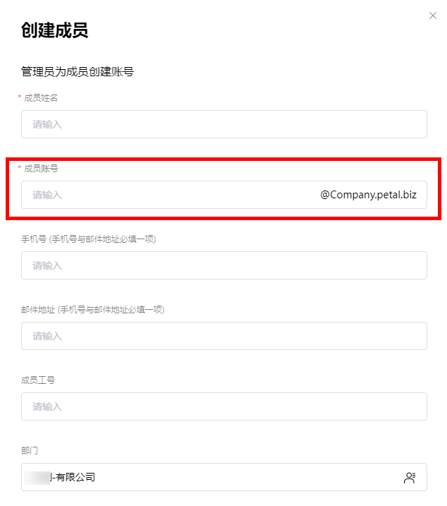
3. 创建成功后，成员将在手机短信或邮箱中收到账号信息。

   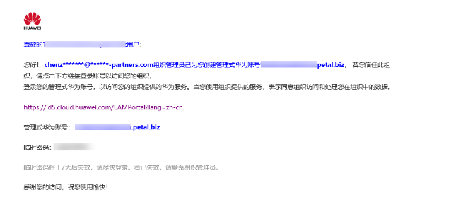

 

创建成功的成员账号不能用于一级服务商、直客等需要进行开票、充值的角色，可用于开通鲸鸿动能子客账户、子客服务商账户、经理账户、团队账号以及协作者账号。

管理员支持批量添加、删除成员账号，支持修改成员账号信息，支持重置密码、修改成员角色权限。

<strong>管理员删除成员账号时，会导致该成员账号对应注册的鲸鸿动能账户注销，注销后无法找回，请谨慎操作。</strong>

管理式华为账号的成员账号开通的子客账户，常规开户时不支持使用对公打款认证方式。

### 群组管理

管理员可创建群组，用于跨部门权限管理。

<strong>群组创建步骤</strong>

1. 管理员在“群组管理”中，单击“添加群组”。

   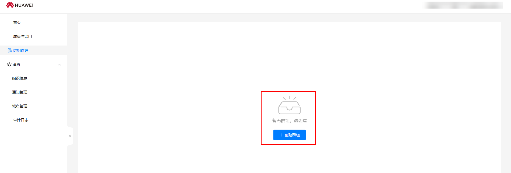
2. 按提示填写群组信息，单击“结束”即可创建成功。

   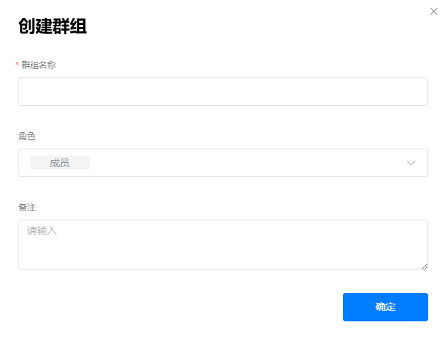

### 设置

提供组织信息查看、通知管理、域名管理服务。

- <strong>组织信息查看</strong>：您可以在组织信息处查看到组织的名称域名规模等信息，也可以选择解散当前组织。

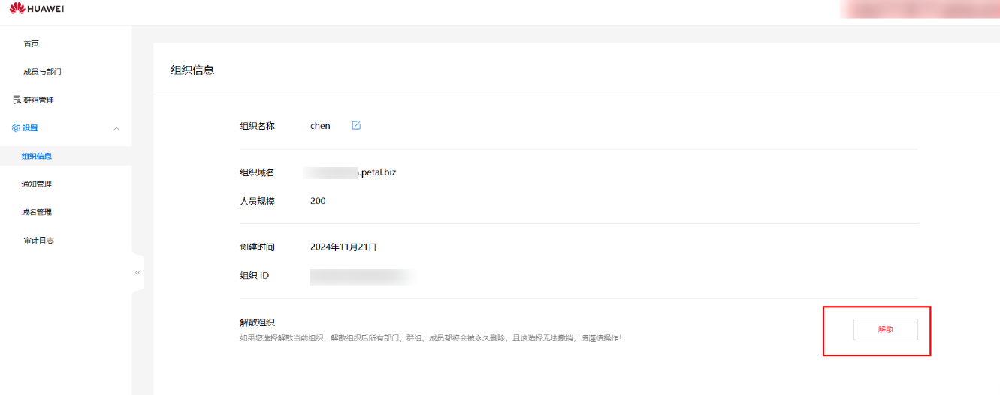

- <strong>通知管理：</strong>您可以在通知管理处针对成员的创建和邀请通知短信进行编辑。

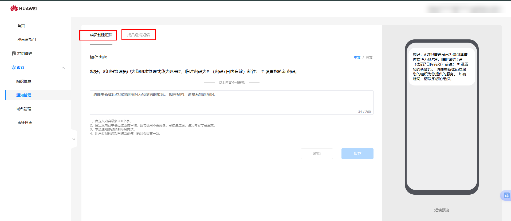

- <strong>域名管理</strong>：您可以管理查看当前的域名相关信息，单击“新增域名”可以进行组织域名的添加。

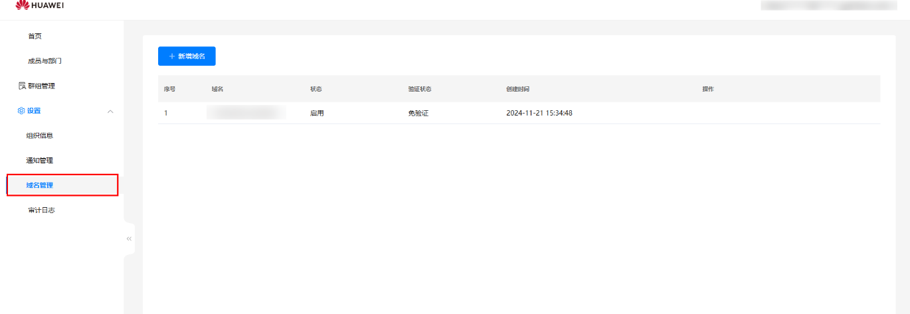

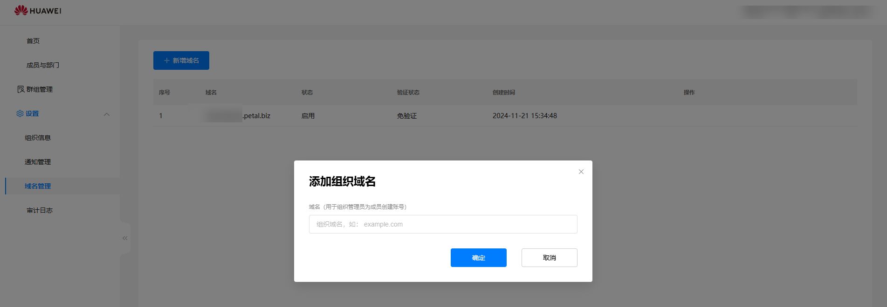

- <strong>审计日志</strong>：组织的超级管理员可查看跟组织相关的操作记录。

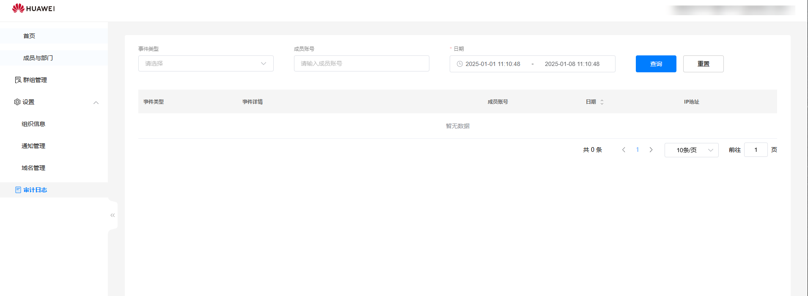

 

成员与部门：可查看/编辑部门及成员

操作删除“成员账号”会导致该成员账号对应注册的鲸鸿动能账户销户，销户后无法找回，请谨慎操作。

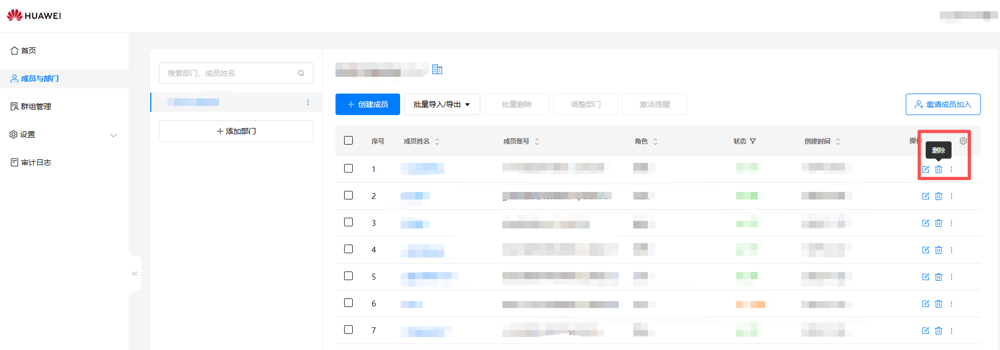

### 成员账号开通广告账户

 

1.建议使用无痕浏览器操作，可将邀请链接复制进无痕浏览器。

2.成员号建议先激活再开始注册广告账户。

1. 成员账号可用于开通鲸鸿动能广告账户，需由服务商先发送开户邀请邮件，成员单击邮件中的邀请链接开始注册广告账户。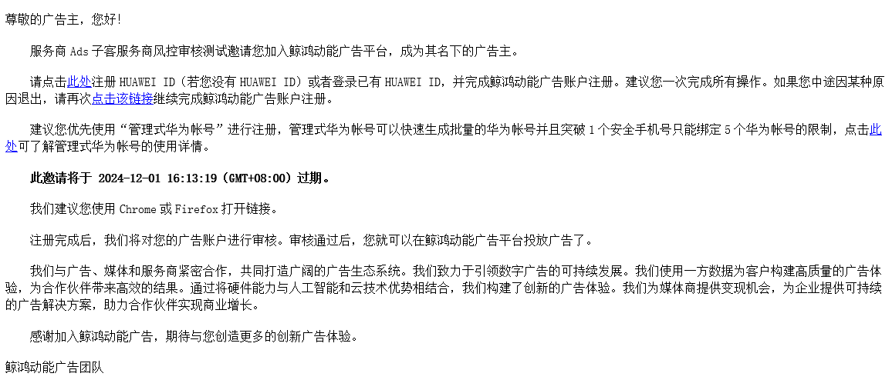
2. 选择<strong>邮件地址注册</strong>，单击上方“已有账号，去登录”。

   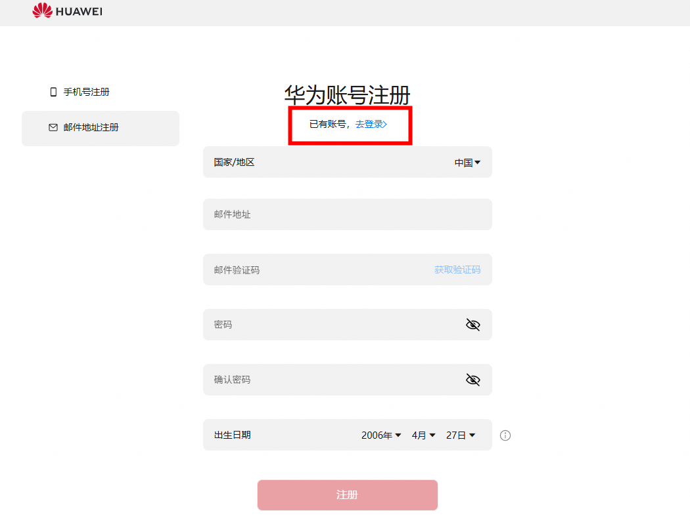
3. 登录后需要进行企业信息认证，等待审核通过即可。

   认证方式可选“对公银行打款认证”或“企业资料人工审核认证”，两种认证方式的流程分别如下：

   <strong>A.</strong> <strong>若您选择“对公银行打款认证”方式</strong>

   <strong>企业基本信息：</strong>请先选择您的企业类型，华为将对您企业账户进行小额打款以完成验证，请确保信息正确，否则将收不到打款信息而认证失败。

   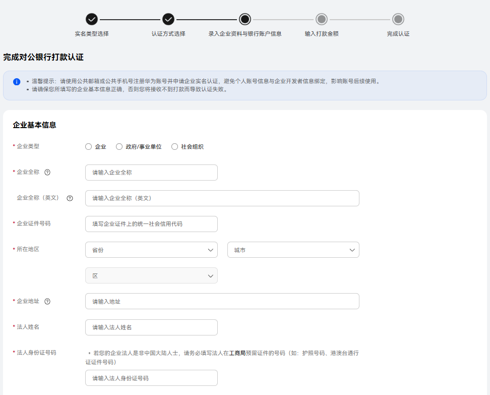

   企业全称：须与企业证件保持一致。该名称会显示在您的应用名称下，如您需开通商户服务，您的银行账户名称需要与此保持一致。。

   企业全称（英文）：请填写您的企业英文名称，若无可不写。（英文名称只能包含英文字母、英文空格和-/()+'，请勿输入其他语言或字符，跨境银行开户名同此一致。）

   企业证件号码：请填写营业执照的统一社会信用代码。

   所在地区：请填写与营业执照一致的省和城市。

   企业地址：详细地址信息请按照您营业执照上的注册地址填写，所在地区、企业地址须与企业证件上保持一致。

   法人姓名（填写中文汉字）：填写法定代表人的真实姓名。

   法定身份证号码：填写法定代表人的真实身份证号。（若您的企业法人是非中国大陆人士，请务必填写法人在工商局预留证件的号码（如：护照号码、港澳台通行证证件号码）

   <strong>企业银行账户信息：</strong>

   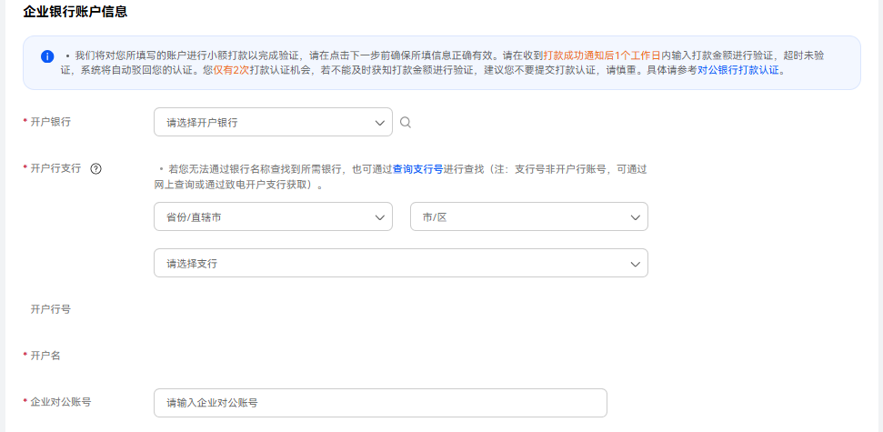

   开户银行：填写您企业银行的开户银行。（开户银行可支持联想输入，动态匹配。如您无法选择所需要的银行信息，请您提供开户银行、开户行支行和开户行号，通过devconnect@huawei.com邮箱联系客服人员处理。）

   开户行支行：选择银行账号开户支行的省份、城市，并选择开户银行的具体分行。（开户银行可支持联想输入，动态匹配。如您无法选择所需要的银行信息，请您提供开户银行、开户行支行和开户行号，通过devconnect@huawei.com邮箱联系客服人员处理。）

   开户行号：由开户行号自动带出，无法更改。

   开户名：由开户行号自动带出，无法更改。

   企业对公账号：请正确填写您的对公账号，以便华为向您打款。

   <strong>联系人信息：</strong>

   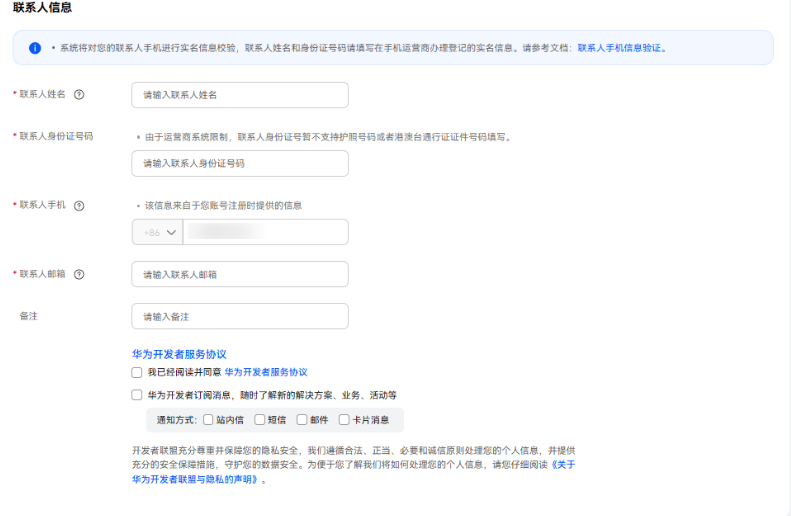

   联系人姓名：请填写联系人姓名<strong>。</strong>

   联系人身份证号码：请填写联系人身份证号码。

   联系人手机：请填写联系人的手机号，系统的通知短信会发送到此电话，请确保号码可以正常接收短信。<strong>此处的电话不作为鲸鸿动能广告账户登录凭证</strong>。（该手机号码将用于账号管理、消息接收等。）

   联系人邮箱：请填写联系人的邮箱，系统的通知邮件会发送到此邮箱，请确保邮箱可以正常接收邮件。<strong>此处的邮箱不作为鲸鸿动能广告账户登录凭证</strong>。

   备注：您可以在此处填写您的备注信息。

   勾选我已经阅读并同意《华为开发者服务协议》。

   勾选华为开发者订阅消息，随时了解新的解决方案、业务、活动等。通知方式可以选择；站内信、短信、邮件和卡片消息。

   开发者联盟充分尊重并保障您的隐私安全，我们遵循合法、正当、必要和诚信原则处理您的个人信息，并提供充分的安全保障措施，守护您的数据安全。为便于您了解我们将如何处理您的个人信息，请您仔细阅读[《关于华为开发者联盟与隐私的声明》](https://privacy.consumer.huawei.com/legal/huawei-developer-app/privacy-statement.htm?&code=CN&language=zh-CN&branchid=0&contenttag=default)。

    

   我们将对您所填写的账户进行小额打款以完成验证，请在点击下一步前确保所填信息正确有效。请在收到打款成功通知后1个工作日内输入打款金额进行验证，超时未验证，系统将自动驳回您的认证。您仅有2次打款认证机会，若不能及时获知打款金额进行验证，建议您不要提交打款认证，请慎重。具体请参考[对公银行打款认证](https://developer.huawei.com/consumer/cn/doc/start/identityverfication-0000001953723286#section36375094610)。

   <strong>提交信息后等待审核</strong>

   

   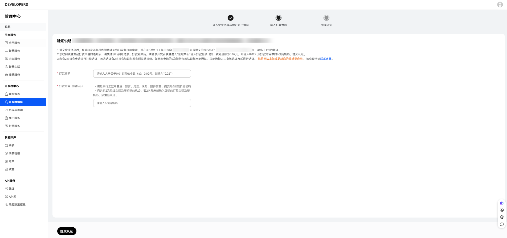

   1. 提交企业信息后，联盟将发送邮件和短信通知您已发起打款申请，并在30分钟~1工作日内向您所注册的账号提交的银行账户打一笔小于1元的款项。

   2.您收到联盟发起打款申请的通知后，请关注银行到账进展。打款到账后，请登录开发者联盟进入“管理中心”输入打款金额（如：收到金额为0.02元，则输入0.02）及打款附言中的6位随机码，提交认证。

   3.您有2次机会申请银行打款认证，每次认证有2次机会验证打款金额及随机码。如果您申请的2次银行打款认证都未能通过，只能选择人工审核认证方式进行认证。 您将无法上架或更新您的敏感类应用， 如有疑问请[联系客服](https://developer.huawei.com/consumer/cn/doc/promotion/ads_lxwm01-0000001192387242)。

   <strong>B. 若您选择“企业资料人工审核认证”方式</strong>

   <strong>企业基本信息：</strong>请您先选择您的企业类型

   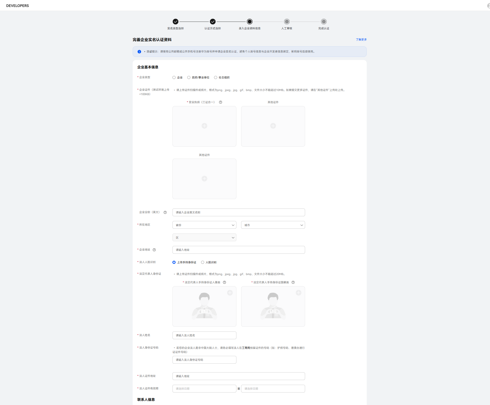

   企业证件：请上传证件扫描件或照片，格式为png、jpeg、jpg、gif、bmp。如需提交更多证件，请在“其他证件”上传处上传。

    

   - 请提供最新的三证合一的营业执照，确保营业执照上的企业信息和国家企业信用信息公示系统公布的信息一致。请参见[实名认证介绍](https://developer.huawei.com/consumer/cn/doc/start/itrna-0000001076878172)。
   - 确保证件信息清晰可辨别，营业执照二维码可扫出企业信息（为确保证件信息清晰，建议上传高清原图）
   - 请上传证件扫描件或照片，请勿裁剪，确保边角完整，证件信息清晰可见。
   - 拍照注意事项，请参见[拍照指导](https://developer.huawei.com/consumer/cn/forum/topic/0201593982484970423?fid=23)。

   企业全称：须与企业证件保持一致。该名称会显示在您的应用名称下，如您需开通商户服务，您的银行账户名称需要与此保持一致。。

   企业全称（英文）：请填写您的企业英文名称，若无可不写。（英文名称只能包含英文字母、英文空格和-/()+'，请勿输入其他语言或字符，跨境银行开户名同此一致。）

   企业证件号码：请填写营业执照的统一社会信用代码。

   所在地区：请填写与营业执照一致的省和城市。

   企业地址：详细地址信息请按照您营业执照上的注册地址填写，所在地区、企业地址须与企业证件上保持一致。

   法人代表验证方式：您可以选择上传首次身份证或人脸识别。

   法人姓名（填写中文汉字）：填写法定代表人的真实姓名。

   法定身份证号码：填写法定代表人的真实身份证号。（若您的企业法人是非中国大陆人士，请务必填写法人在工商局预留证件的号码（如：护照号码、港澳台通行证证件号码）

   法人证件地址：请您如实填写法人的证件地址。

   法人证件有效期：请您如实选择证件有效期。

   <strong>联系人信息：</strong>

   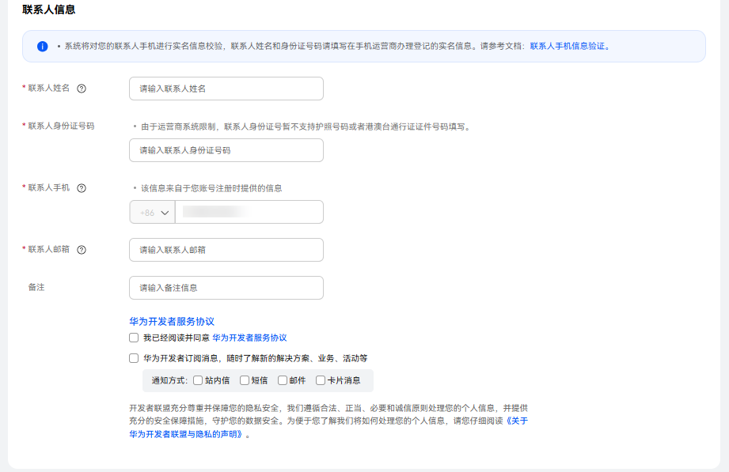

   联系人姓名：请填写联系人姓名<strong>。</strong>

   联系人身份证号码：请填写联系人身份证号码。

   联系人手机：请填写联系人的手机号，系统的通知短信会发送到此电话，请确保号码可以正常接收短信。<strong>此处的电话不作为鲸鸿动能广告账户登录凭证</strong>。（该手机号码将用于账号管理、消息接收等。）

   联系人邮箱：请填写联系人的邮箱，系统的通知邮件会发送到此邮箱，请确保邮箱可以正常接收邮件。<strong>此处的邮箱不作为鲸鸿动能广告账户登录凭证</strong>。

   备注：您可以在此处填写您的备注信息。

   勾选我已经阅读并同意《华为开发者服务协议》。

   勾选华为开发者订阅消息，随时了解新的解决方案、业务、活动等。通知方式可以选择；站内信、短信、邮件和卡片消息。

   开发者联盟充分尊重并保障您的隐私安全，我们遵循合法、正当、必要和诚信原则处理您的个人信息，并提供充分的安全保障措施，守护您的数据安全。为便于您了解我们将如何处理您的个人信息，请您仔细阅读[《关于华为开发者联盟与隐私的声明》](https://privacy.consumer.huawei.com/legal/huawei-developer-app/privacy-statement.htm?&code=CN&language=zh-CN&branchid=0&contenttag=default)。

   <strong>单击“下一步”，提交信息后等待审核</strong>。

   

   审核时间为1-2个工作日，通过后我们将通过邮件通知您。您还可以通过开发者联盟，获知实名审核结果、产品上架进展、联盟最新资讯与活动、行业视频等信息。

## FAQ

<strong>Q1：</strong> <strong>成员账号可以用来开通服务商账户吗？</strong>

<strong>A：</strong>不可以，成员账号不能用于一级服务商、直客等需要进行开票、充值的角色，支持子客账户、子客服务商账户、团队账号、协作者账号、经理账户场景。

<strong>Q2</strong> <strong>：</strong> <strong>成员账号开户时提示“开户失败”/“不支持此账户角色开户”/“实名信息缺失”等异常是什么原因？</strong>

<strong>A：</strong>若成员账号开户异常，请排查以下原因：

1. 成员账号不支持注册服务商账户或直客账户。
2. 成员账户开户时，不支持使用对公银行打款认证方式做对公认证。
