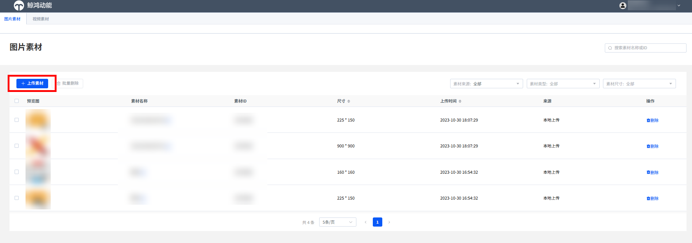
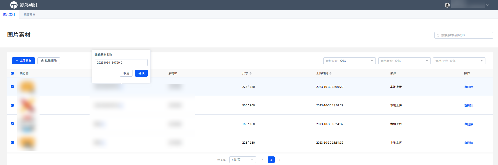
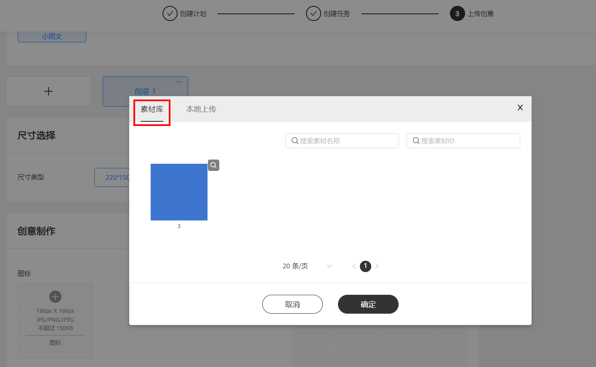

# 素材库

## 功能简介

素材库提供账户资产管理能力，支持素材上传、预览、批量删除等操作，上传的素材可以在创建广告的“上传创意”阶段直接选用。

通过审核的广告创意素材会自动保存到素材库，在Venus图片/视频工具中创建的素材若选择“同步至DSP”，也会保存到素材库。

素材库支持上传JPG、 JPEG、PNG格式图片素材，图片大小不超过150KB；支持上传MP4格式视频素材，视频大小不超过100MB。

## 操作步骤

1. 单击<strong>“上传素材”</strong>，可查看支持上传的素材类型。

   
2. 素材上传成功后，支持按照素材来源、类型和尺寸<strong>筛选素材</strong>，支持<strong>批量删除</strong>素材。

   
3. 创建广告时直接<strong>使用素材</strong>进行创建。

   
