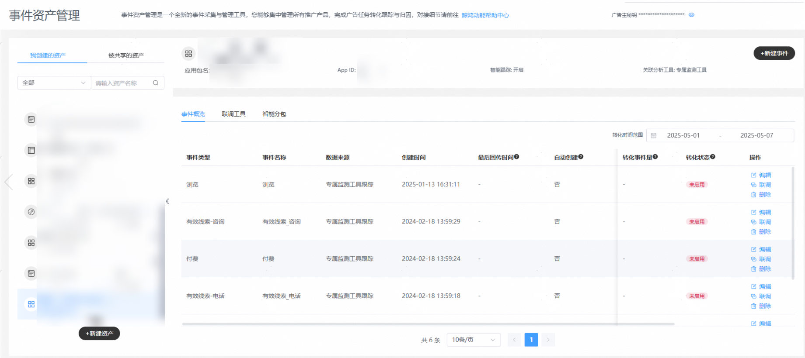
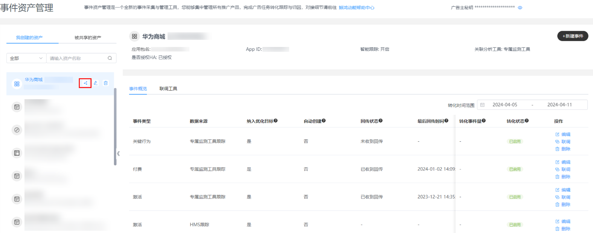
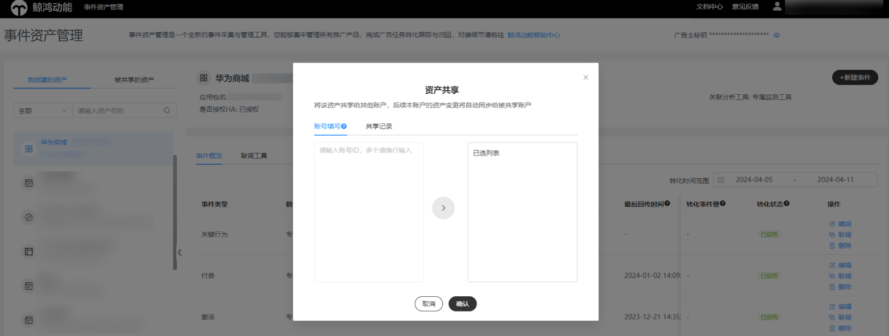
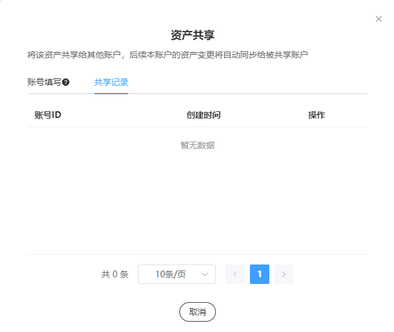
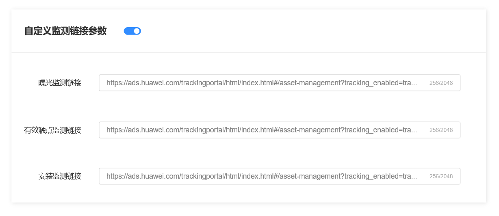

# 简介

## 功能简介

【事件资产管理】作为【转化跟踪】的升级版本，是一个全新的事件采集与管理工具，您能够集中管理所有推广产品（包括应用App，HarmonyOS服务，快应用、小程序、Venus落地页、元服务及三方落地页）的数据，转化跟踪的目的是建立广告平台与广告主数据交换的通道，借助转化跟踪接口，能够将广告行为发送给广告主，并收集广告主侧的转化数据（如激活、付费等），有效提升广告投放效果分析能力。

## 相关名词定义详解

|  |  |
| --- | --- |
| <strong>名词</strong> | <strong>释义</strong> |
| 分析工具 | 分析工具为转化事件数据与鲸鸿动能广告进行对接的数据上报方式，可以将资产绑定具体分析工具进行数据上报；分析工具主要承载了和华为归因平台的对接密钥。 |
| 资产 | 资产，是您在鲸鸿动能广告平台上投放的推广标的，资产具有唯一性，例如一个应用App，一个落地页。  应用：AppID/包名校验  快应用：包名校验  网页：主域名+路径校验（domain+path），通常指URL问号前  元服务：APP LINKING跟踪是借助元服务自定义参数能力传递广告跟踪参数（CALLBACK等）  微信小程序：主域名+路径校验（domain+path），通常指path问号前  维纳斯落地页：账户下的创建过的维纳斯落地页 |
| 事件 | 事件，即对应原转化跟踪的指标，具体理解为广告投放后的转化事件，广告主可创建资产下可回传的具体转化事件类型。由于没有收到广告主回传的响应事件，无法确定是否可以对接成功，因此事件是有状态的。事件创建后默认为未启用（指标待激活）状态。通过手动联调或者自动激活，成功后可更新事件状态为已启用（指标激活）状态。 |
| 手动联调 | 手动联调是模拟广告发生后鲸鸿动能和广告主数据交换的过程，在监测链接跟踪场景下，会向广告主发送模拟点击；在落地页跟踪场景下，会拼接跟踪参数在落地页上；广告主在自己服务端完成归因后，向鲸鸿动能回传转化数据，鲸鸿动能监测回传情况。 |
| 转化数据回传 | 广告主将归因结果通过转化跟踪API回传给鲸鸿动能，可将该数据用于目标优化出价等功能。 |
| 监测链接跟踪 | 鲸鸿动能通过将曝光点击事件发给广告主，广告主自主采集转化行为，并完成归因匹配。 |
| 落地页跟踪 | 通过落地页拼接跟踪参数，广告主在落地页转化同时记录渠道跟踪参数完成归因。 |
| 智能分包 | 为帮助衡量买量效果，鲸鸿动能推出智能分包跟踪方案，广告主可针对不同的推广任务选择不同的虚拟分包；相比传统渠道包归因，广告主无需管理分包，通过应用市场传递分包参数，实现分包跟踪。 |
| HMS跟踪 | HMS跟踪借助于HMS Core的能力，能够在不借助任何其他跟踪平台、不集成任何SDK、免开发免埋码的情况下跟踪应用的激活、次留和付费，后期将开放更多事件类型。 |
| 自动激活 | 广告主新建完资产后，手动添加事件后，无需进行联调动作。广告主可以从真实广告投放场景对接完成自动联调。广告主通过任何一条广告任务（试投放、CPC任务）推广，广告平台将该资产的在事件资产管理平台配置的监测参数，广告主归因后进行回传，若您账户下的资产存在未启用事件，平台将把事件状态变更为已启用，后续可开始投放oCPC任务。 |
| 智能跟踪 | 广告主新建完资产后，无需手动创建事件，无需手动联调，通过转化跟踪API上报具体的事件类型，鲸鸿动能广告平台将解析具体事件类型，并自动创建该事件，自动创建事件将默认已启用。此智能跟踪建议广告主都开启，后续账户下任何一条广告任务（试投放、CPC任务），广告主完成归因后回传，将自动建立事件。 |
| 密钥 | 密钥为账户级密钥，用于广告主通过转化跟踪API回传数据时的鉴权操作。无论资产类型，密钥统一为一个，可点击事件资产管理平台右上角查看或复制。 |

## 资产&事件概览

<strong>1、资产概览</strong>

资产的单位为广告任务的推广标的，在一个资产下，广告主可管理监测链接，转化事件，智能分包、事件联调等。

 

安装应用、鸿蒙应用资产编辑监测链接后请重新手动联调，联调后生效。其余推广产品，编辑监测链接后立即生效。

如果该资产已经创建了具体事件，资产将无法直接删除，您需要先删除该资产下的所有事件，否则会删除失败。

<strong>2、事件概览</strong>

事件为您所关注的转化行为，转化状态为已启用表示数据通路正常，您可通过联调等方式进行验证。

 

如果事件已经绑定了广告任务，则无法被删除。

<strong>3、智能分包概览</strong>

智能分包为您的虚拟分包，通过客户端传递您的智能分包渠道号，达到虚拟分包的效果。

## 事件资产共享功能

如果您有多个账户需接入转化跟踪，可以在其中一个账户建立资产进行联调，通过事件管理共享把联调通过后的资产事件共享给其他账户使用，帮您减少重复操作，提升广告投放效率。

## 功能简介

1. 您可在事件资产管理中把资产共享给其他账号，无需多账号多次联调。在左侧资产列表单击共享按钮，在资产共享页面填写需要共享的账号加入已选列表，单击确定即可完成资产共享。

   

   
2. 可在资产共享页面“共享记录”查询到该资产被共享的账户，并可操作取消共享。

   
3. 资产共享功能使用限制：如存在共享关系，共享账户无法删除资产；被共享账户如果已有相同资产则无法被共享。
4. 转化事件启用后，您可在任务投放界面自定义监测链接。

## 相关链接

[鲸鸿动能转化跟踪接口对接说明(中国大陆)v2.1.6](https://alliance-communityfile-drcn.dbankcdn.com/FileServer/getFile/cmtyPub/011/111/111/0000000000011111111.20260529160209.45658237305259849488591192170752:20260531101412:2800:CB493CBB500AD89D71E3454A3D5FC363EB81E55A2A24BA4BCE19FEE1F7CB2845.pdf?needInitFileName=true)

视频课程直达[《事件资产管理介绍》](https://ads.shixizhi.huawei.com/course/1502116313077112833/application-view?courseId=1697182820542828545&appId=570366217228181504&appType=1&activeIndex=-1&sxz-lang=zh_CN)
