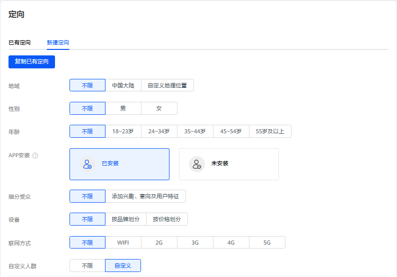
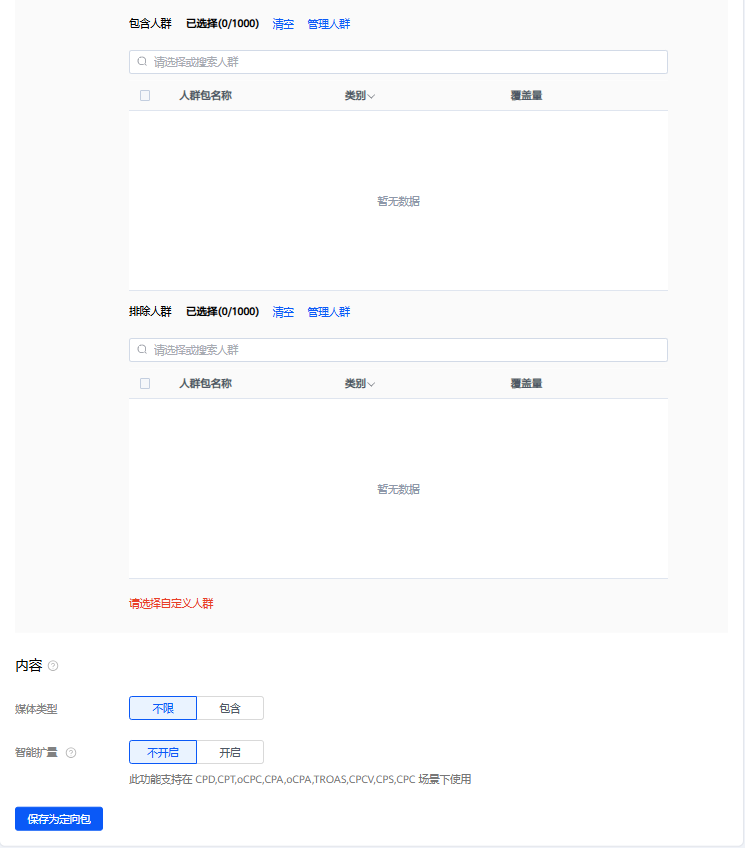
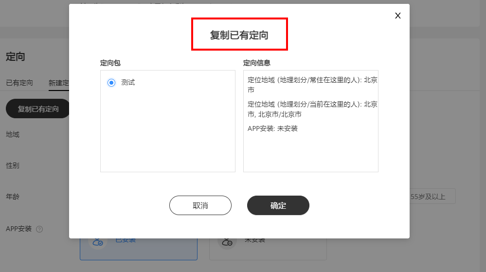
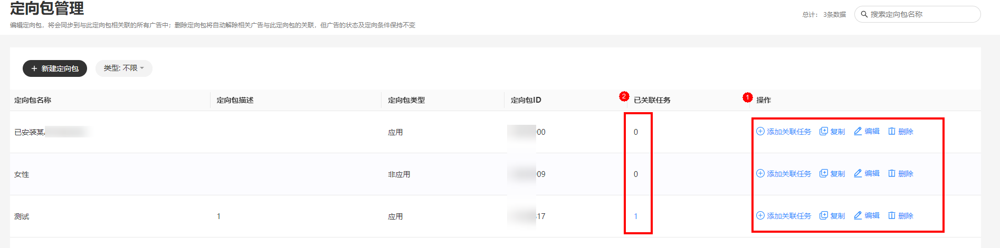

# 定向包管理

## 功能简介

定向包是定向方式的集合，用户可以将地域定向、年龄定向、App、性别定向等多种定向条件进行组合，创建广告时可以方便地使用已创建的定向包。

## 操作步骤

- 创建广告任务时<strong>新建/复用定向包</strong>
  1. 在创建广告任务时，可以将已选的定向方式组合保存为定向包

     
  2. 下一次创建广告任务时可以直接复制已有定向包进行投放。

  
- 在工具中<strong>新建/管理</strong> <strong>定向包</strong>
  1. 在定向包管理页面，支持新建定向包，并对已有的定向包进行“添加关联任务”、“复制”、“编辑”、”删除”等操作。
  2. 单击“已关联任务”下的数字，即可查看到定向包关联的任务，在该界面可以进行任务的解绑。

     

 

当定向包关联的任务为0时，该定向包可被删除。

审核中、审核不通过任务也可进行关联，当用户修改任务并重新审核通过后，任务会使用该定向包进行投放。

1个定向包最多关联500个广告任务。
