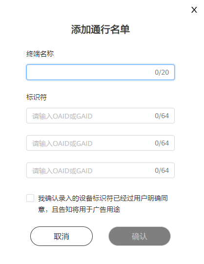

# 通行名单管理

## 功能简介

为方便广告主查看和验收广告上线效果，鲸鸿动能投放平台提供通行名单管理工具，在通行名单中添加相应的手机终端OAID号或GAID，向部分指定的设备进行广告投放，可预览到账户内投放的所有广告。

 

OAID或者GAID指的是一种非永久性设备标识符，可在保护用户个人数据隐私安全的前提下，向用户提供个性化广告。HMS手机一般用OAID，GMS手机一般用GAID。

- HMS手机OAID获取方式：打开手机的设置，找到隐私功能，单击广告和隐私，单击更多信息，获取OAID。请注意因手机型号不一致，广告标识符所处的位置有所差别。
- GMS手机GAID获取方式：打开手机的设置，找到谷歌，单击隐私，找到广告，获取GAID。请注意因手机型号不一致，广告标识符所处的位置有所差别。

## 操作步骤

1. 在投放端首页单击“工具”-&gt;“通行名单管理”。
2. 单击左上角“添加通行名单”，进入通行名单录入界面，如下图所示。

   

    

   OAID即设备标识符，获取方式：打开手机的“设置”，找到“隐私功能”-&gt;“广告与隐私”-&gt;“更多信息”。
3. 录入完成后单击“确定”，该账户下的广告任务将会被优先投放至通行名单内的设备。
