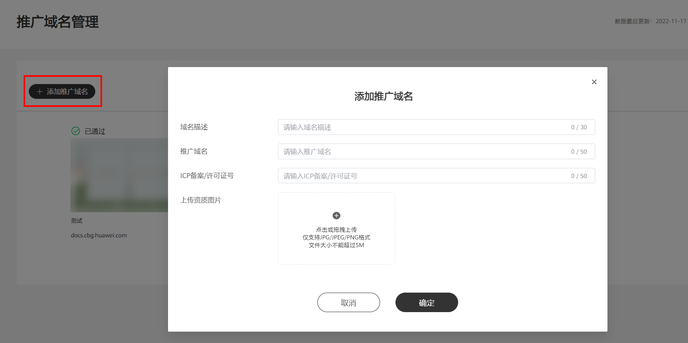
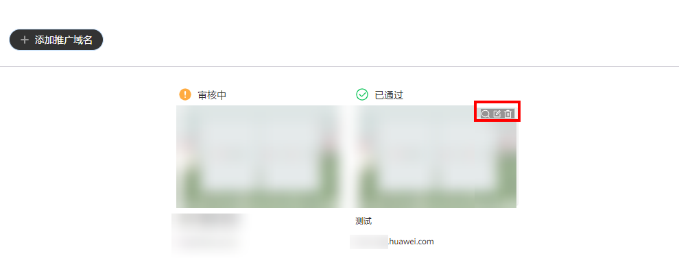

# 推广域名管理

## 功能简介

推广域名管理功能用于广告主管理账户中的推广链接，支持提交域名备案审核、查看/修改域名信息等操作。

## 操作步骤

1. 在投放端首页单击“工具”-&gt;“推广域名管理”，进入域名管理首页。
2. 单击“添加推广域名”进行添加：

   

   - 域名描述：自定义内容，可填写网站名称/企业主体名称；
   - 推广域名：例如网址``https://ads.huawei.com``，域名为huawei.com；
   - ICP备案码/许可证号：填写ICP备案主体信息中的许可证号码，查询网址为``https://beian.miit.gov.cn/#/Integrated/index``；
   - 资质图片：完整截取ICP备案查询结果详情页，至少包括备案主体名称、备案域名及备案号。
3. 查看域名审核状态，包含“审核中、已驳回和已通过”三种状态。
   - 审核中：域名内容仅支持查看；
   - 已驳回：域名内容支持查看、编辑和删除操作，鼠标移到“已驳回”字样上可查看具体驳回原因；
   - 已通过：域名描述支持修改，不触发审核；其他内容不支持修改，仅支持删除。

   
4. 域名审核通过后可用于广告投放。

    

   同一域名仅需提交一次，不同域名需分别提交审核，举例：123.<strong>huawei.com</strong>和456.<strong>huawei.com</strong>为同一主域名；<strong>123huawei.com</strong>与<strong>456huawei.com</strong>为不同主域名。

## 相关链接

[《推广域名审核规范指南》](https://alliance-communityfile-drcn.dbankcdn.com/FileServer/getFile/cmtyPub/011/111/111/0000000000011111111.20260529160138.73507329586766678410913822636738:20260531101432:2800:76754E5742A185AC62A5C9FD6A1BA811DF5D127258B47FE010E1318DADE1268A.pdf?needInitFileName=true)
