# 维纳斯落地页简介

## 功能简介

维纳斯落地页工具是鲸鸿动能平台为广告主免费提供的落地页制作工具，为广告主提供丰富的模板和多功能的营销组件，帮助广告主快速搭建高效的转化页面。

- 全量的生命周期管理：支持查看、复制、编辑等操作，支持移动端扫码预览，实时查看落地页状态。
- 完善的自建站组件：多样化的基础组件及营销组件，简单拖拽组件排列组合即可快速搭建落地页。
- 优质的产品性能：落地页加载速度快，支持视频边播边下载应用及延迟直达，表单组件支持号码验证、去重、二跳外链。
- 丰富的行业模板：精选教育、金融、家居等多行业应用下载和网页落地页模板，无需具备PS能力也能创作自如。
- 精细的效果分析：提供元素级别的用户点击、浏览热力分析，精细化的效果分析能力助力落地页效果优化。

落地页工具提供基础组件和排版组件，组件拖放功能可以高效地制作优质推广页面。不同的落地页类型包含不同的组件：

| 组件类型 | 组件 | 应用下载落地页 | 网页落地页 | 动态商品落地页 |
| --- | --- | --- | --- | --- |
| 基础组件 | 标题 | √ | √ | √ |
| 文本 | √ | √ | √ |
| 视频 | √ | √ | √ |
| 按钮 | √ | √ | √ |
| 图片 | √ | √ | √ |
| 轮播图 | √ | √ | √ |
| 地图 | √ | √ | √ |
| 日历 | √ | √ | √ |
| 倒计时 | - | √ | √ |
| 链接 | - | √ | √ |
| 动态商品 | - | - | √ |
| 动态视频 | - | - | √ |
| 动态图文 | - | - | √ |
| 营销组件 | 表单 |  | √ | - |
| 排版组件 | 分割线 | √ | √ | √ |
| 矩形 | √ | √ | √ |

- <strong>基础组件</strong>：
  - <strong>标题与文本组件：</strong>支持编辑文本、颜色、字号、字体、背景等设置。
  - <strong>视频组件：</strong>包含基础视频和按钮视频两种样式。
    - 基础视频：视频点击后仅支持播放。

      按钮视频：播放视频的同时静默下载安装应用，应用安装完成后，视频界面显示“<strong>立即打开App</strong>”，展示应用的图标与名称，单击直达应用首页，完成促活转化；视频可选填Deeplink链接，应用安装完成后，单击直达对应界面。
  - <strong>按钮组件：</strong>包含基础按钮和图片按钮两种样式，单击按钮下载，支持Deeplink链接直达。
    - 基础按钮：支持小按钮样式和热区样式，热区样式可结合图片组件使用，单击按钮或热区范围即开始下载安装应用。
    - 图片按钮：可添加下载提示语，下载提示语支持修改颜色、字号、文本位置以及边距。按钮可选填Deeplink链接，应用安装完成后，单击直达对应界面。
  - <strong>图片组件</strong>：图片支持单击或拖拽上传，支持JPG/JPEG/PNG/GIF多种图片格式。
  - <strong>轮播图</strong>：轮播图支持上传5张同尺寸图片；轮播图支持4种轮播方式，播放速度和位置可自定义调整；可运用于游戏行业游戏截图展示，电商行业促销活动头图展示，房产行业房源展示，快消行业产品展示，旅游行业景点图片展示等。
  - <strong>地图</strong>：根据您提供的地址，精准定位，提供3种地图样式，用户点击地图后即可进入高德地图。
  - <strong>日历组件</strong> ：
    - 支持内容自主设置：可以对日历的预约文案、日程标题、地点、日程时间、提前提醒、说明、时区、日历颜色、按钮颜色、文案字号等进行设置。
    - 直接添加日程信息：用户点击日历后，将直接向手机日历App对应项写入日程信息。
    - 日历预约应用下载双转化：应用下载落地页支持对日历开启下载功能，开启后单击日历将同时预约日历和下载App。
  - <strong>倒计时</strong>：您可以设置倒计时或者正计时：
    - 倒计时：通过设置倒计时的结束日期，系统自动进行计算。
    - 正计时：通过设置正计时的开始日期，系统自动进行计算。
  - <strong>链接</strong>：您可以在落地页中添加跳转链接，用户进入落地页后点击链接即可完成跳转
  - <strong>动态商品</strong>：点击组件区域即可触发应用下载，此组件初始状态包含4个商品，每个商品区域为一块下载热区，即有4个下载区域。您可以下拉选择投放区域，设置动态商品样式（分为单列、双列、三列）和展示商品数量（4-20个），商品模板直接拉取商品库中的商品主图、描述、现价、原价、应用直达链接等商品信息，并支持修改标签、按钮文案，保存提交审核。

    - 商品信息：
      - 商品图：自动拉取商品中心的商品图，默认显示商品主图。
      - 描述：默认显示您在商品中心填写的商品名称，可设置颜色和字号，顶多只显示两行文案。
      - 现价：即折扣价，默认显示您在商品中心填写的商品现价，展示样式为“¥现价”，可设置颜色和字号。如果您添加了动态组件，浏览币种由界面语言决定，界面语言为中文时展示￥，界面语言为英语时展示$，界面语言为俄语时展示₽，此币种只为预览效果呈现，真实投放中展示的币种为商品库中拉取的币种，与预览无关。

        如果现价（折扣价）失效，就不展示这个折扣价，仅展示原价。原价默认显示您在商品中心填写的商品原价可设置颜色和字号，选择“无”则不展示该字段。
      - 应用直达链接：支持绑定各个商品对应各自的链接 。应用下载完后再次点击商品区域，可拉起对应的商品的应用直达页面 。
    - 标签、按钮文案：
      - 标签（选填）：默认“超值低价”，支持自定义个文案，如果您未填写文案，则不显示此标签。支持设置标签文案颜色、填充颜色和文案的字号。
      - 按钮：默认文案“下载安装查看”，支持设置按钮文案、按钮填充、按钮外框的颜色、字号大小、外框圆角。

    - 商品信息：
      - 商品图：自动拉取商品中心的商品图，默认显示商品主图。
      - 描述：默认显示您在商品中心填写的商品名称，可设置颜色和字号，顶多只显示两行文案。
      - 现价：即折扣价，默认显示您在商品中心填写的商品现价，展示样式为“¥现价”，可设置颜色和字号。如果您添加了动态组件，浏览币种由界面语言决定，界面语言为中文时展示￥，界面语言为英语时展示$，界面语言为俄语时展示₽，此币种只为预览效果呈现，真实投放中展示的币种为商品库中拉取的币种，与预览无关。

        如果现价（折扣价）失效，就不展示这个折扣价，仅展示原价。原价默认显示您在商品中心填写的商品原价可设置颜色和字号，选择“无”则不展示该字段。
      - 应用直达链接：支持绑定各个商品对应各自的链接 。应用下载完后再次点击商品区域，可拉起对应的商品的应用直达页面 。
    - 标签、按钮文案：
      - 标签（选填）：默认“超值低价”，支持自定义个文案，如果您未填写文案，则不显示此标签。支持设置标签文案颜色、填充颜色和文案的字号。
      - 按钮：默认文案“下载安装查看”，支持设置按钮文案、按钮填充、按钮外框的颜色、字号大小、外框圆角。
  - <strong>动态视频</strong>：默认为商品视频，关联调用Video字段；可设置商品布局（单列、双列）和展示商品数量（4-20个），可开启商品描述与按钮视频功能；商品描述可选商品名称、品牌名称和广告文案；可编辑下载提示语并支持设置开启应用直达链接功能；商品描述与下载提示语均支持设置位置。
  - <strong>动态图文</strong>：默认为商品主图；可设置商品布局（单列、双列）和展示商品数量（4-20个），可开启商品描述与按钮下载功能；商品描述可选商品名称、品牌名称和广告文案；可编辑下载提示语并支持设置开启应用直达链接功能；商品描述与下载提示语均支持设置位置。

- <strong>营销组件：</strong>详情请参考：[营销组件](#ZH-CN_TOPIC_0000001477131173__li61001512205718)。
- <strong>排版组件：</strong>
  - 分割线：用于落地页排版优化，分割线组件支持颜色、长宽及布局编辑，适用于不同模块的区分。
  - 矩形：您可以利用矩形工具进行留白、遮挡等操作。

### 落地页工具入口

在投放端首页，单击“工具”-&gt;“创意中心”-&gt;“落地页工具”，进入维纳斯落地页工具界面。

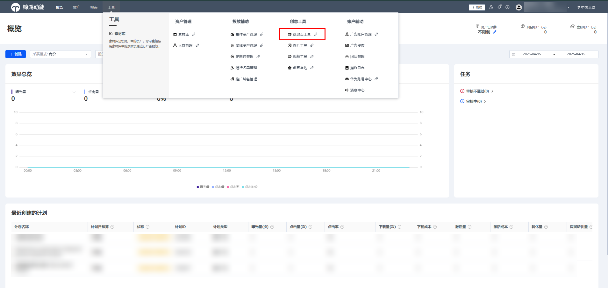

### 界面介绍

- <strong>首页：</strong>创建落地页一键直达。
- <strong>我的落地页：</strong>落地页管理界面，支持新建、删除落地页，实时查看落地页类型、状态以及来源和编辑复制落地页等操作。

  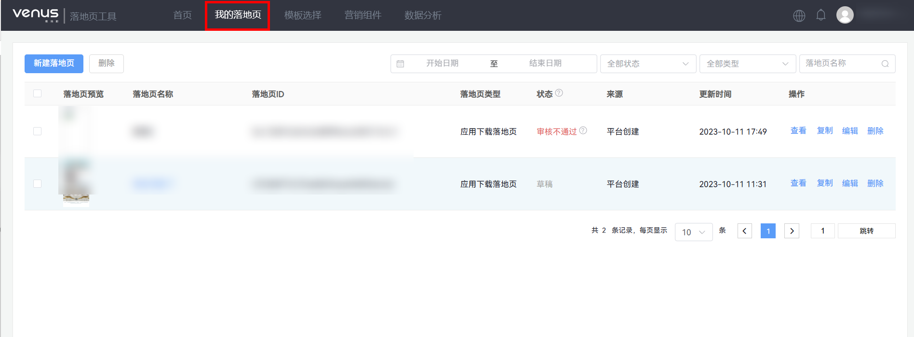
- <strong>模板选择：</strong>落地页模板选择界面，维纳斯提供不同行业的优质模板，包含应用下载落地页模板和网页落地页模板。

  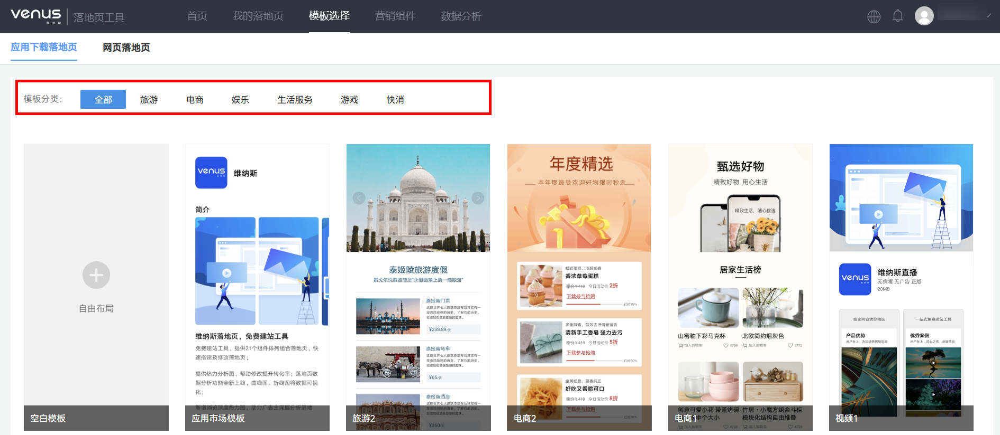
- <strong>营销组件：</strong>表单、企业微信、抽奖、智能电话、商品订购等营销组件管理和线索转发设置、经销商管理界面，帮助广告主管理历史营销活动，支持查看营销活动状态、数据和编辑营销活动。线索转发设置请参考[《维纳斯线索推送接口说明》](https://alliance-communityfile-drcn.dbankcdn.com/FileServer/getFile/cmtyPub/011/111/111/0000000000011111111.20260529160210.74998641658030299908472120251765:20260531101432:2800:62E95718E6F527982BED664CA89654916B679B842A7FABDE5F33513C770F597E.pdf?needInitFileName=true)和[《维纳斯营销线索推送操作指引》](https://alliance-communityfile-drcn.dbankcdn.com/FileServer/getFile/cmtyPub/011/111/111/0000000000011111111.20260529160210.61714720319625572470473849866280:20260531101432:2800:C11651E3463A3943CDF0A949BD5103F9092C4B6E8F70289DE42529FD98BF0A86.pdf?needInitFileName=true)。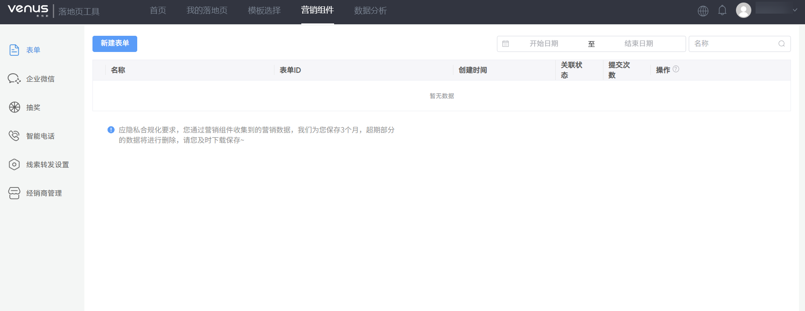

  表单：可使用表单组件收集潜在用户信息，提供常规表单与分步式置底表单，支持多种表单内容样式，留资后意向收集能力，同时支持提交跳转链接页面。

  - 基础信息：您可以填写表单的名称，并且可以选择表单类型：常规表单和置底表单。
  - 表单内容：您可以根据自己的需求，选择表单收集的内容，自定义输入提示，是否必填等相关设置。
  - 线索设置：数据转发，您需要填写数据转发接口，具体可参考单击右侧操作指引，您还可以设置是否开启手机号码短信验证和手机号码去重。
  - 隐私声明：由于您收集的是用户信息，基于隐私合规化，请设置您的隐私声明，让用户知悉并同意您按照隐私声明使用信息，我们将在表单下方展示声明链接以便查看。

  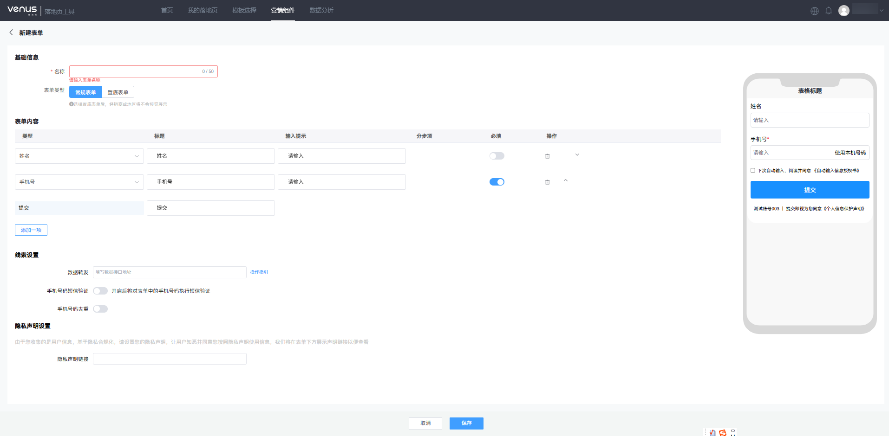

  企业微信：您可以通过企业微信扫码授权，开通企业微信获客助手。通过该模块，您可以查看企业微信的获客链接，授权时间等。

  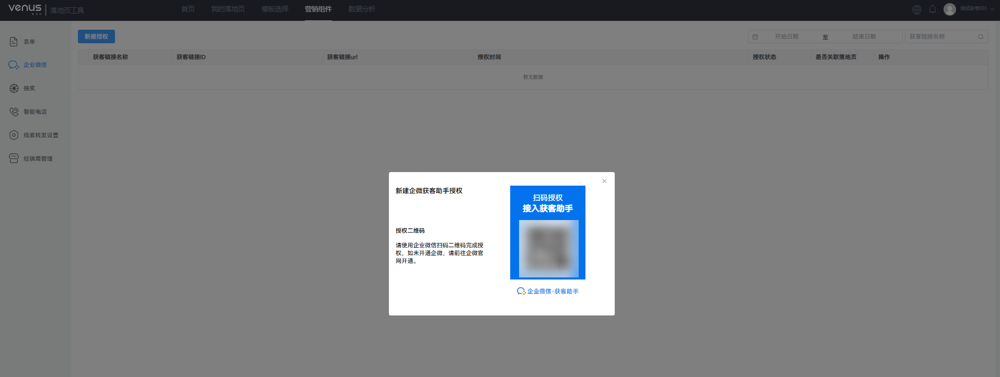

  抽奖：可通过抽奖活动收集用户姓名、手机号信息。

  - 基础信息：您需要填写活动的名称，并且设置活动时间、抽奖次数和抽奖样式。
  - 抽奖内容：您可以设置奖项，奖项内容和抽中的概率等信息。
  - 线索设置：数据转发，您需要填写数据转发接口，具体可参考单击右侧操作指引。
  - 隐私声明：由于您收集的是用户信息，基于隐私合规化，请设置您的隐私声明，让用户知悉并同意您按照隐私声明使用信息，我们将在表单下方展示声明链接以便查看。

  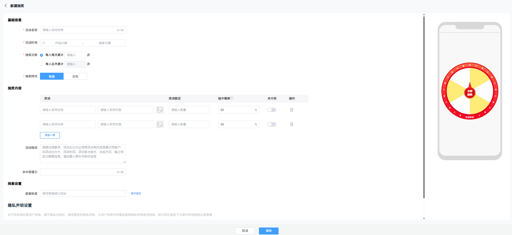

  智能电话：通过电话组件可直接调起手机拨号盘，智能电话支持手机号码、固定电话和400电话。

  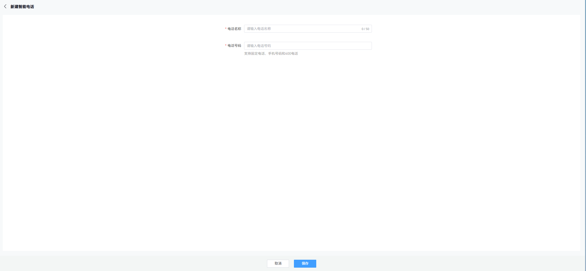

  线索转发设置：通过营销组件收集的用户线索，若广告主有CRM系统，可通过线上对接维纳斯线索转发接口，实现线索直接入库，提升线索处理时效性。

  广告主可在顶部导航单击“营销组件”-“线索转发设置”进入线索转发接口配置界面，详细对接流程请参考[《维纳斯线索推送接口说明》](https://alliance-communityfile-drcn.dbankcdn.com/FileServer/getFile/cmtyPub/011/111/111/0000000000011111111.20260529160210.33905703825278550221332463046364:20260531101432:2800:93F6BE3FC4B57522966BCCAB95C7C63E6F5E3EDA4A3143E068C4349A21D10E9E.pdf?needInitFileName=true)和[《维纳斯营销线索推送操作指引》](https://alliance-communityfile-drcn.dbankcdn.com/FileServer/getFile/cmtyPub/011/111/111/0000000000011111111.20260529160210.89182221482838195035693842480597:20260531101432:2800:B23E6C48FF846D1C6E9642198D5A14871E832E50C61F2ECD0B1B2EE7FD653E67.pdf?needInitFileName=true)。或在配置界面查看“操作指引”。

  

  经销商管理：为方便您管理经销商，您可以通过经销商管理组件新建经销商组，具体格式请登录投放端后台查看。

  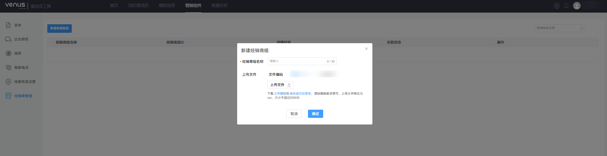

   

  商品订购营销组件为白名单开放，如需申请开通请联系运营经理。
- <strong>数据分析</strong> <strong>：</strong>支持广告主查看落地页数据概览和热力分析图，可帮助广告主监测落地页数据，了解落地页的质量以及用户在落地页上的浏览行径，明确落地页优化方向。

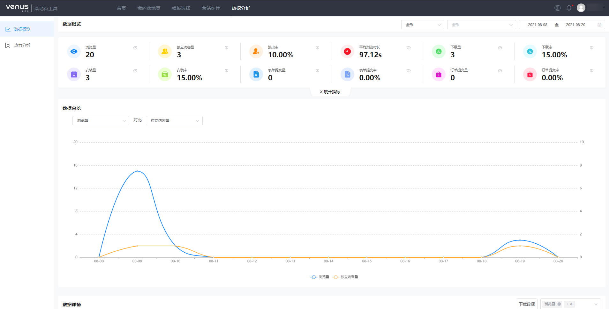

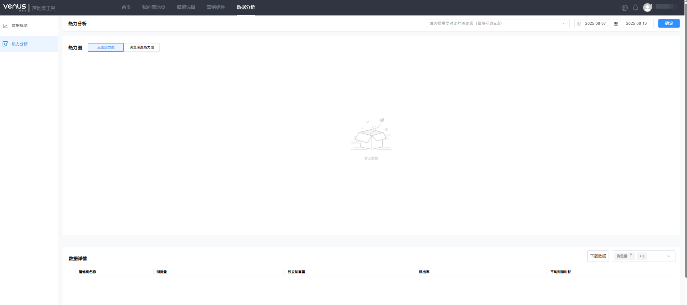
