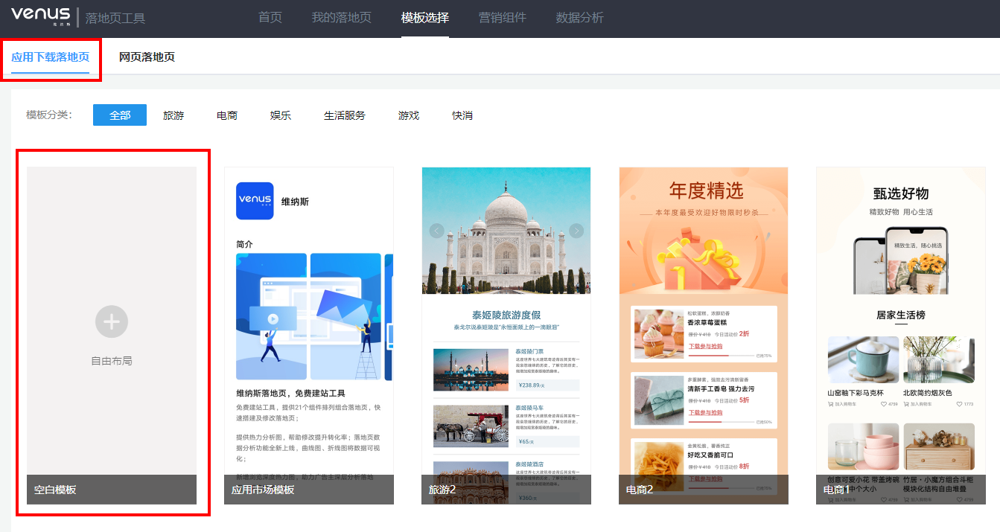
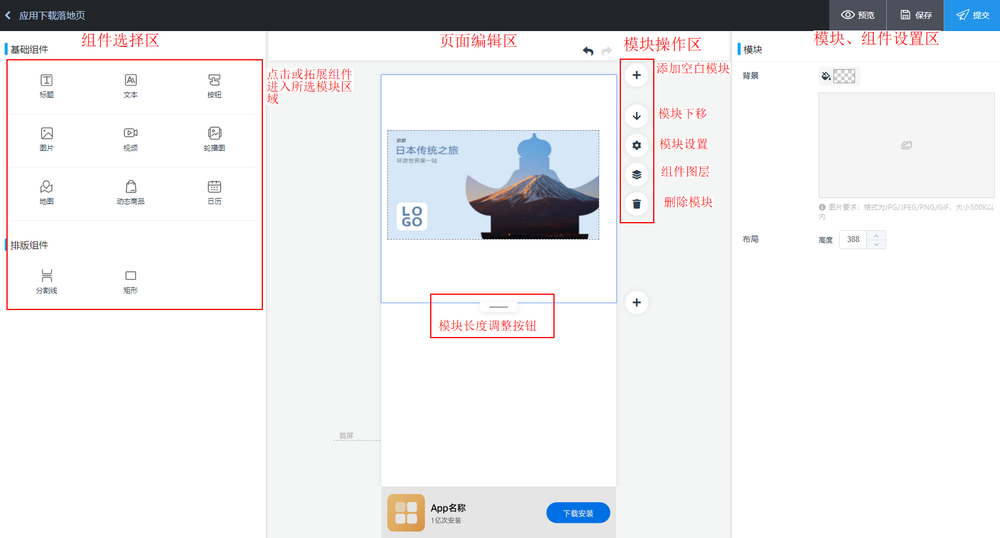
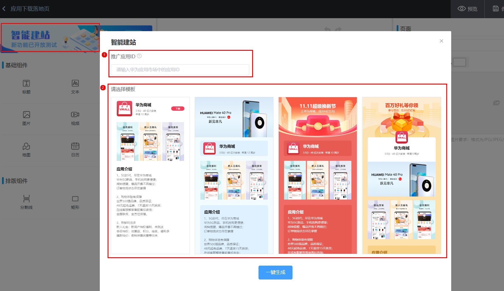

# 创建应用下载落地页

<strong>应用下载落地页：</strong>目的为用于App下载的点击型落地页，通过下载按钮来引导用户下载App，下载时无需跳转至应用市场，于落地页内静默下载。

## 操作步骤

1. 在落地页工具“首页”单击“创建落地页”或在“我的落地页”界面单击“新建落地页”或直接单击导航栏“模板选择”，进入创建落地页界面，默认显示应用下载落地页。
2. <strong>进入落地页编辑页面</strong>

   方式一：单击“自由布局”空白模板，进入应用下载落地页编辑页面。

   方式二：选择合适的落地页模板，鼠标悬停模板上，单击“预览”可查看模板内容详情，单击“使用”则进入模板编辑页面。

   
3. <strong>编辑落地页</strong>

   落地页编辑页面分为3个区域，左侧为组件展示区，中部为页面编辑区，右侧为组件编辑区，点击或拖拽左侧的组件进入页面编辑区，在页面右侧进行组件内容、排版等设置，如为模板建站，可直接在页面右侧组件编辑区替换相应组件内容素材。

   
4. <strong>配置下载按钮</strong>

   应用下载落地页中可通过配置基础按钮（包括下载热区）、日历组件下载功能实现App下载，如使用维纳斯落地页组件中配置的下载文案，在用户下载安装完成后，按钮文案会自动变为“立即打开App”号召用户打开应用，还可通过配置按钮组件的Deeplink链接在App安装完成后实现链接页面跳转；组件介绍及操作指导请参考[《维纳斯落地页工具使用指导V2023.8》](https://alliance-communityfile-drcn.dbankcdn.com/FileServer/getFile/cmtyPub/011/111/111/0000000000011111111.20260529160219.84994704606909003879506665413109:20260531101432:2800:06DE864B753128694E56E7236C5EB3812BC16F9A3C9732A97CBB45A185B69637.pdf?needInitFileName=true)。
5. <strong>调整落地页页面</strong>

   如对之前的操作不满意可以单击落地页编辑区上方的撤销、重做按钮，如对某个组件不满意可点击组件编辑区右上角的“删除当前组件”直接删除；还支持添加空白模板、模块下移、模块设置、组件图层（支持拖动改变组件图层顺序）、删除模块、调整模块长度等操作。
6. <strong>编辑完成</strong>

   页面基础信息与组件内容编辑完毕，可单击页面右上角的“预览”，实时预览新建落地页；单击“保存”，新建落地页以草稿的形式保存至“我的落地页”；单击“提交”，落地页提交审核。
7. <strong>（可选）智能建站：</strong>输入应用ID，选择模板，单击一键生成，系统即根据应用信息结合模板即刻输出落地页。

   
