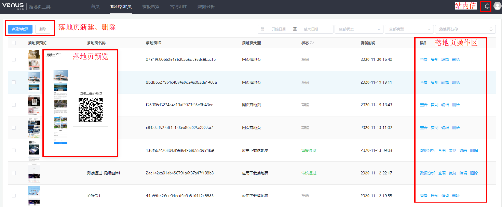

# 管理落地页

落地页编辑完成保存的落地页草稿或编辑完成直接提交审核的落地页均会存储至“我的落地页”界面。广告主可在此界面管理历史落地页，包括查看、复制、编辑、删除、查找、预览落地页等功能。

- <strong>管理落地页</strong>

  支持实时查看落地页状态和编辑、复制、删除落地页，对于已通过审核的落地页，支持单击“数据分析”一键直达落地页数据分析页面。
- <strong>筛选落地页</strong>

  支持根据落地页状态、类型、更新时间和落地页名称搜索落地页。
- <strong>预览落地页</strong>

  支持单击落地页缩略图和右侧操作栏的“查看”实时预览落地页，也可通过手机扫码实时预览落地页。
- <strong>编辑落地页</strong>

  单击落地页名称支持编辑更改，更改落地页名称不触发审核。单击右侧操作栏的“编辑”，进入落地页编辑页面，通过审核的在投落地页支持编辑，不影响在投任务，如落地页更新审核通过，审核通过后的页面会自动替换。

  
