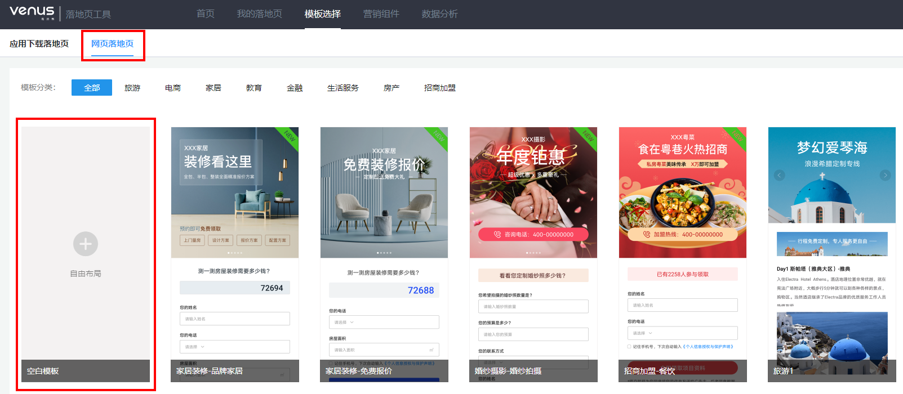
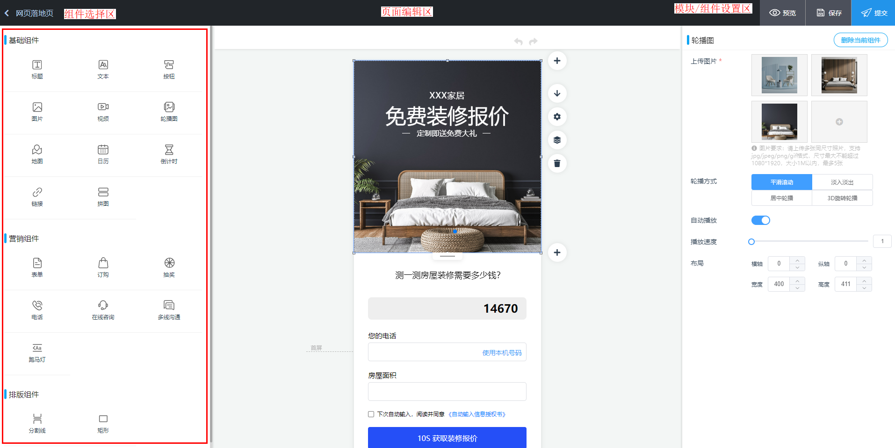
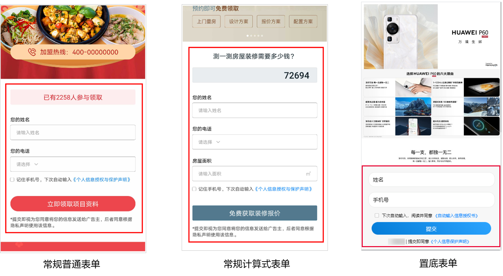
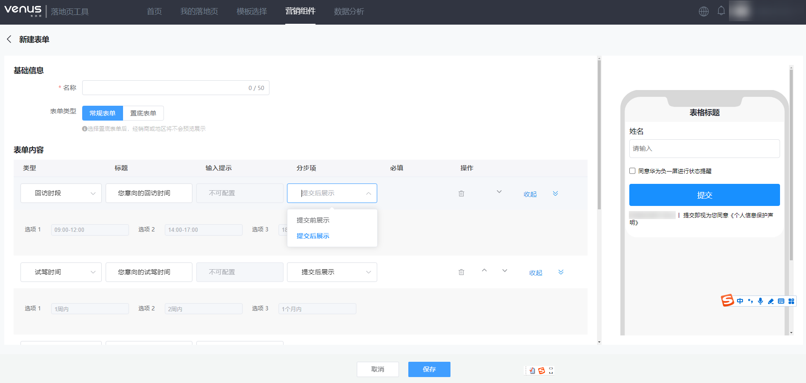
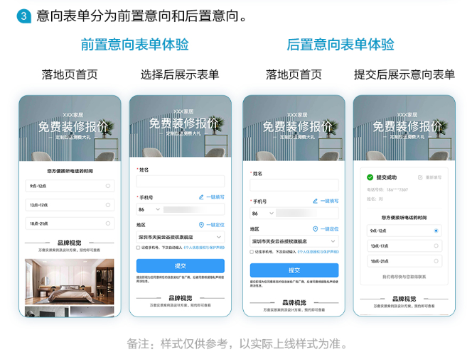
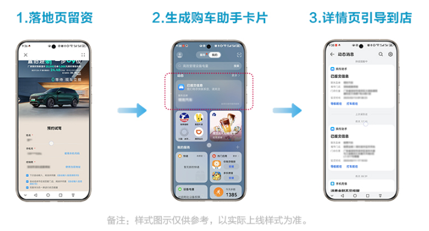
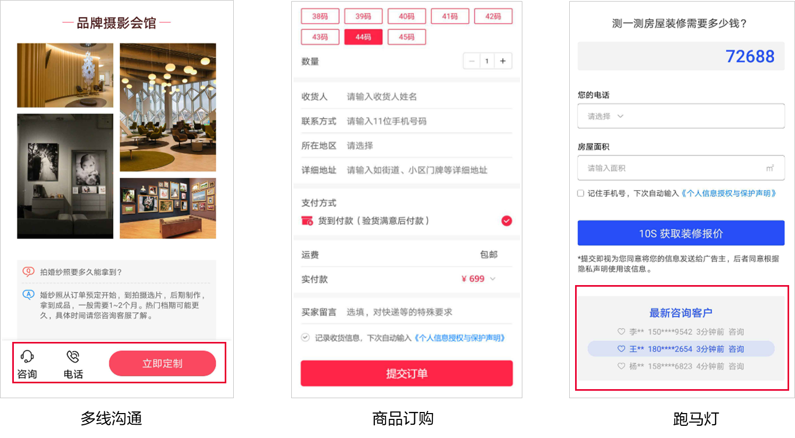
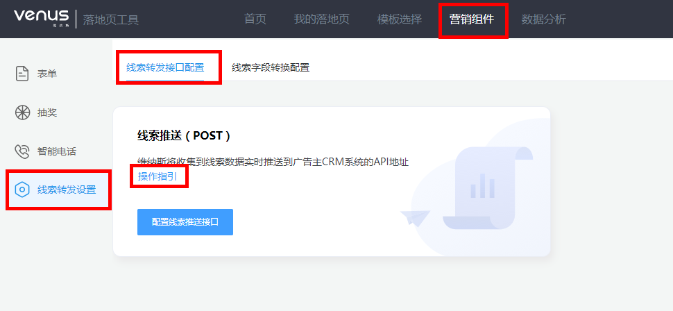

# 创建网页落地页

<strong>网页落地页：</strong>为用于获取潜在客户信息（如姓名，电话号码等）或直接引导客户线上购买商品，主要通过表单、电话、抽奖、在线咨询等营销方式获取客户信息，通过商品订购组件完成商品售卖闭环。

## 操作步骤

1. <strong>进入创建落地页界面</strong>

   在落地页工具“首页”单击“创建落地页”或在“我的落地页”界面单击“新建落地页”或直接点击导航栏“模板选择”，进入创建落地页界面，单击“网页落地页”，跳转至网页落地页创建界面。

   
2. <strong>进入落地页编辑页面</strong>

   方式一：单击“自由布局”空白模板，进入网页落地页编辑页面。

   方式二：选择合适的落地页模板，鼠标悬停模板上，单击“预览”可查看模板内容详情，单击“使用”则进入模板编辑页面。
3. <strong>编辑落地页</strong>

   落地页编辑页面分为3个区域，左侧为组件展示区，中部为页面编辑区，右侧为组件编辑区，广告主根据自身需求点击或拖拽左侧的组件进入页面编辑区，在页面右侧进行组件内容、排版等设置，如为模板建站，可直接在页面右侧组件编辑区替换相应组件内容素材。

   
4. <strong>配置营销组件</strong>

   网页落地页营销组件支持表单、电话、在线咨询、抽奖、商品订购和多线沟通、跑马灯，组件介绍及操作指导参考[《维纳斯落地页工具使用指导V2023.8》](https://alliance-communityfile-drcn.dbankcdn.com/FileServer/getFile/cmtyPub/011/111/111/0000000000011111111.20260529160225.33072910616907778625744106848216:20260531101432:2800:B5802693A8E00FF48AD9E9770910C56AEDF8EE22CE35A0F1346D2ACF11A3688E.pdf?needInitFileName=true)。

   - 表单组件：可使用表单组件收集潜在用户信息，提供常规表单与分步式置底表单，支持多种表单内容样式，留资后意向收集能力，同时支持提交跳转链接页面；其中分步式置底表单为底部悬浮表单，滑动落地页时表单持续固定在底部，支持地区/经销商分步提交填写。

     

     其中维纳斯落地页表单模块具备留资意向收集能力，用于收集用户更多相关信息，如：汽车行业用于了解用户近期详细购车时间计划（1个月内，3个月内，6个月内）， 房产行业用于了解房子的面积和户型等。

     

     意向表单分为前置意向和后置意向。

     

     维纳斯表单新增购车助手，用户通过维纳斯落地页留资后，即可在负一屏生成服务卡片通知，并根据留资时选择的经销商位置信息，提供门店导航、打车服务、电话直连等功能。服务卡片通知的服务门店信息、门店位置及电话信息，需通过维纳斯经销商管理功能上传。

     

      

     购车助手为白名单功能，如您需推广此类产品请联系运营申请权限。
   - 电话组件：通过电话组件可直接调起手机拨号盘，智能电话支持手机号码、固定电话和400电话。
   - 咨询组件：通过咨询组件可直接跳转至在线咨询页面，支持对接多家第三方在线咨询平台。
   - 抽奖组件：可通过抽奖活动收集用户姓名、手机号信息。

     
   - 商品订购组件：可通过商品订购组件让用户下单购买商品；该组件白名单开放，如需使用请联系运营经理开通。
   - 多线沟通组件：咨询、电话、表单、订购四种组件随意组合，不同方式触发不同类型用户转化。
   - 跑马灯为辅助营销组件，需关联落地页内的表单或抽奖、订购组件使用。

     
   - 表单、智能电话和抽奖组件需关联已创建的营销活动，以表单为例，如无营销活动，单击右侧编辑区的“新建表单”或“表单管理”前往营销组件界面创建表单。
5. <strong>调整落地页页面</strong>

   如对之前的操作不满意可以点击落地页编辑区上方的撤销、重做按钮，如对某个组件不满意可单击组件编辑区右上角的“删除当前组件”直接删除，还支持添加空白模板、模块下移、模块设置、组件图层（支持拖动改变组件图层顺序）、删除模块、调整模块长度等操作。
6. <strong>编辑完成</strong>

   页面基础信息与组件内容编辑完毕，可单击页面右上角的“预览”，实时预览新建落地页；单击“保存”，新建落地页以草稿的形式保存至“我的落地页”，单击“提交”，落地页提交审核。
7. <strong>线索转发设置</strong>

   通过营销组件收集的用户线索，若广告主有CRM系统，可通过线上对接维纳斯线索转发接口，实现线索直接入库，提升线索处理时效性。

   广告主可在顶部导航单击“营销组件”-“线索转发设置”进入线索转发接口配置界面，详细对接流程请参考[《维纳斯线索推送接口说明》](https://alliance-communityfile-drcn.dbankcdn.com/FileServer/getFile/cmtyPub/011/111/111/0000000000011111111.20260529160225.64912589226836827815222056713343:20260531101432:2800:F0D7D336181FFC5BCD4A0D60789D1E69B7980E7714A821DC0A3728D14C289497.pdf?needInitFileName=true)和[《维纳斯营销线索推送操作指引》](https://alliance-communityfile-drcn.dbankcdn.com/FileServer/getFile/cmtyPub/011/111/111/0000000000011111111.20260529160225.29046806426714573131344959880896:20260531101432:2800:1D388E66C29E0877D58FEFB01E38552612E5835E8F81A22BB473B97C332BDE1F.pdf?needInitFileName=true)。或在配置界面查看“操作指引”。

   
