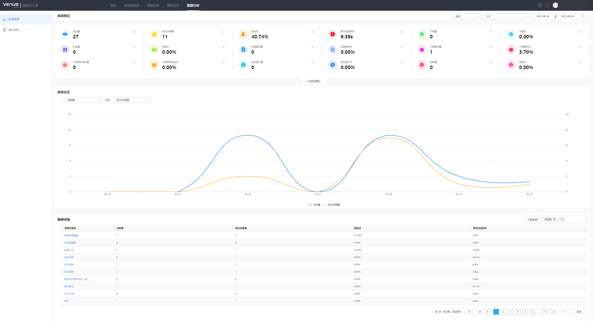
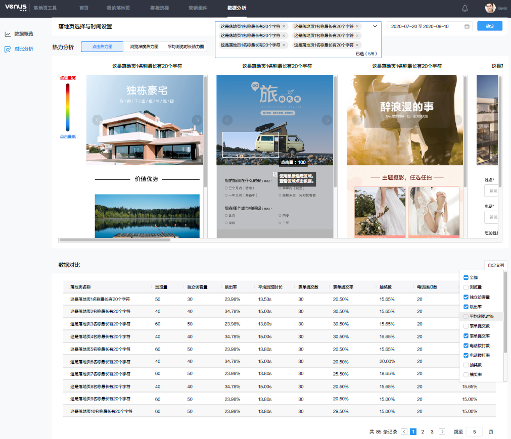

# 分析落地页

## 操作步骤

维纳斯落地页工具为广告主提供落地页数据分析功能，可帮助广告主监测落地页数据，了解落地页的质量的同时了解用户在落地页上的浏览行径，掌握用户的行为偏好，明确落地页优化方向和策略。支持广告主查看落地页的基础数据和热力分析图，对不同的落地页进行数据对比分析。

### 数据概览

1. 单击导航栏的“数据分析”进入落地页数据分析页面。
2. 单击“数据概览”，可以直观看到落地页的“数据概览”和任意两个指标的 “对比曲线图”，及“数据详情<strong>”</strong>。
   - <strong>数据概览</strong>：页面呈现落地页浏览量、独立访客量、跳出率、平均浏览时长、下载量、下载率、安装量、安装率、表单提交量、表单提交率、订单提交量、订单提交率、日历预约成功量、日历预约成功率、电话拨打量、电话拨打率、抽奖量、抽奖率等基础数据。
   - <strong>对比曲线图</strong>：可自定选择两个指标查看对比曲线图。
   - <strong>数据详情：</strong>展示不同落地页的数据详情，指标自定义选择，支持下载数据。

   

### 对比分析

1. 单击导航栏的“数据分析”进入落地页数据分析页面。
2. 单击“对比分析”，选择需要分析的落地页，可以查看到所选落地页的“热力分析”图 和 “数据对比”列表。其中“热力分析”包括“点击热力图”和“浏览深度热力图”。
   - <strong>点击热力图：</strong>统计用户在页面上点击行为的热力图分布，颜色越红的区域，代表该区域点击量越高。点击热力图支持使用鼠标选定区域查看该区域点击量，帮助广告主分析落地页元素级别点击量。通过对点击热力图的分析，能帮助广告主快速获取页面中用户最感兴趣的区域和内容，将广告需要突出的信息结合用户点击习惯，制定落地页优化策略。
   - <strong>浏览深度热力图：</strong>浏览深度热力图展示了浏览到页面的某个具体位置的用户比例，通过浏览深度热力图广告主可以清晰地了解到用户在哪里开始流失，精准找到流失的页面位置，制定落地页优化策略。
   - <strong>数据对比</strong> <strong>：</strong>可选择2-6个落地页，对其热力数据进行对比分析。对比数据指标支持自定义，支持下载数据，数据对比分析可以帮助广告主清晰的了解哪个落地页效果更佳，便于及时调整投放策略。

   
