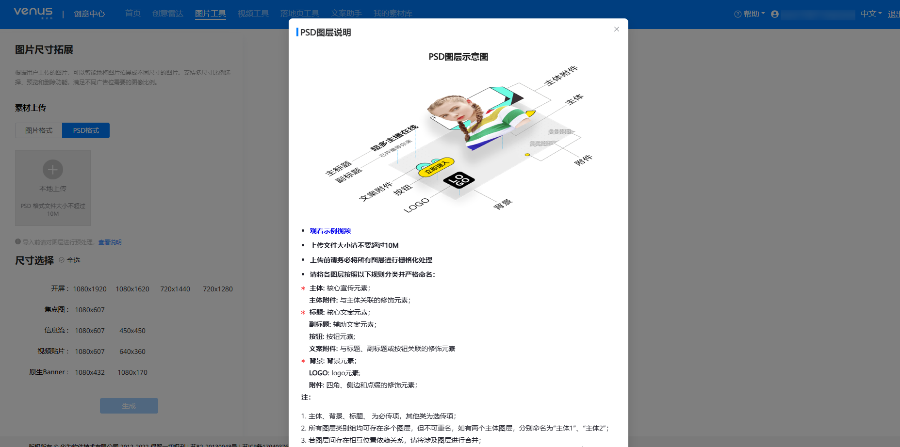
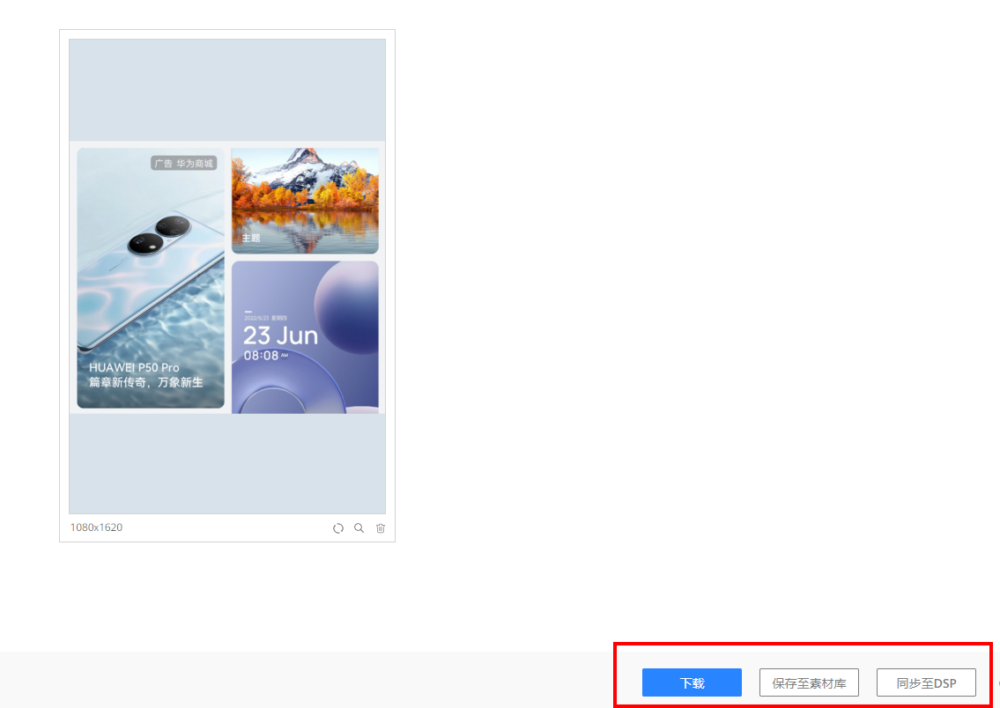
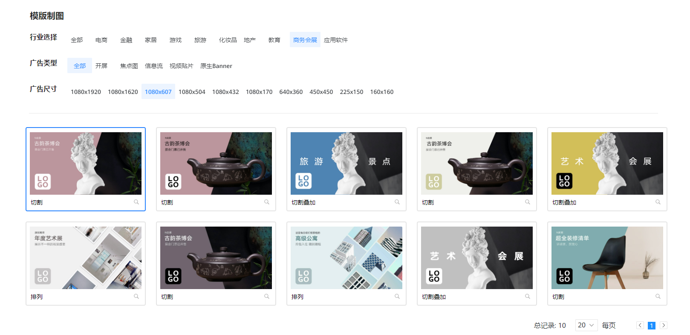
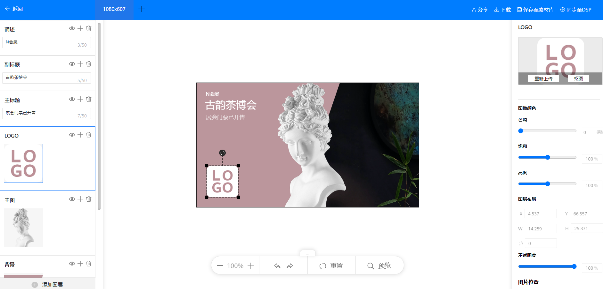
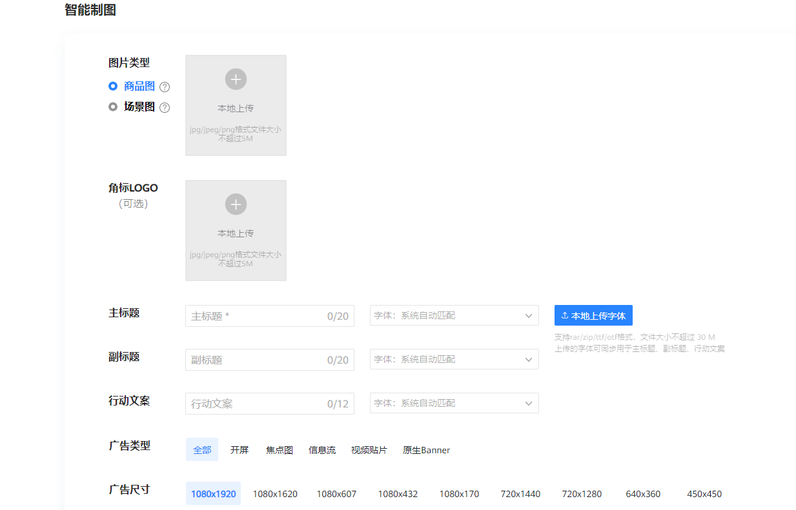
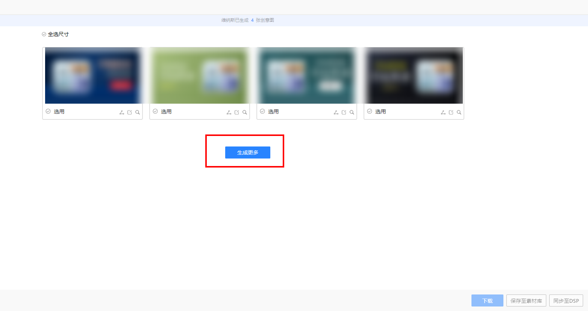

# 图片工具

## 功能简介

维纳斯图片工具是鲸鸿动能平台为广告主免费提供的图片素材制作工具，功能包括图片尺寸拓展、模板制图和智能制图。

- <strong>尺寸拓展</strong>：可根据不同版位尺寸要求一键拓展图片或PSD文件，智能生成多种图片尺寸。
- <strong>模板制图</strong>：提供多个行业120+创意图片模板，满足不同行业个性化创意需求，帮助广告主快速制作素材、及时更新创意。
- <strong>智能制图</strong>：仅需上传1张商品图或场景图，选择广告尺寸和图片风格，系统即可批量生成数张不同样式的创意图片。

## 操作步骤

在投放端首页选择“工具”-&gt;“创意工具”-&gt;“图片工具”，可选择“图片尺寸拓展”、“模板制图”、“智能制图”分别进入功能详情页。

### 图片尺寸拓展

1. 选择图片格式或PSD格式上传素材。图片格式支持PNG/JPEG/JPG，大小不超过5M；PSD格式文件大小不超过50M，导入前请参考PSD图层说明进行预处理。

   
2. 选择拓展方式和尺寸，单击“生成”，生成的素材支持下载、保存至素材库或同步至DSP（创建任务时直接选用）。

   

### 模板制图

1. 广告主可根据行业、广告类型、广告尺寸筛选模板，单击模板右下角的放大镜图标可预览模板。

   
2. 单击选中的图片模板即可进入图片编辑界面，广告主可自由替换图片、文字进行素材创作。

   
3. 图片制作完成后，可选择下载、保存至素材库或同步至DSP。

### 智能制图

1. 广告主可选择上传商品图片或者场景图片进行智能制图。

   
2. 素材上传后，设置主副标题，选择广告类型、尺寸、风格，单击“智能生成”，系统将根据各项参数智能生成对应的图片。
3. 选用智能生成的图片素材，单击“生成更多”可生成更多创意图片。

   
4. 图片制作完成后，可选择下载、保存至素材库或同步至DSP。
