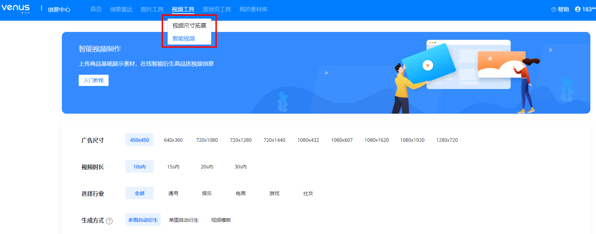
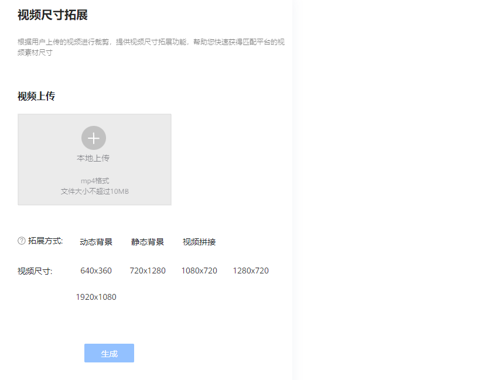
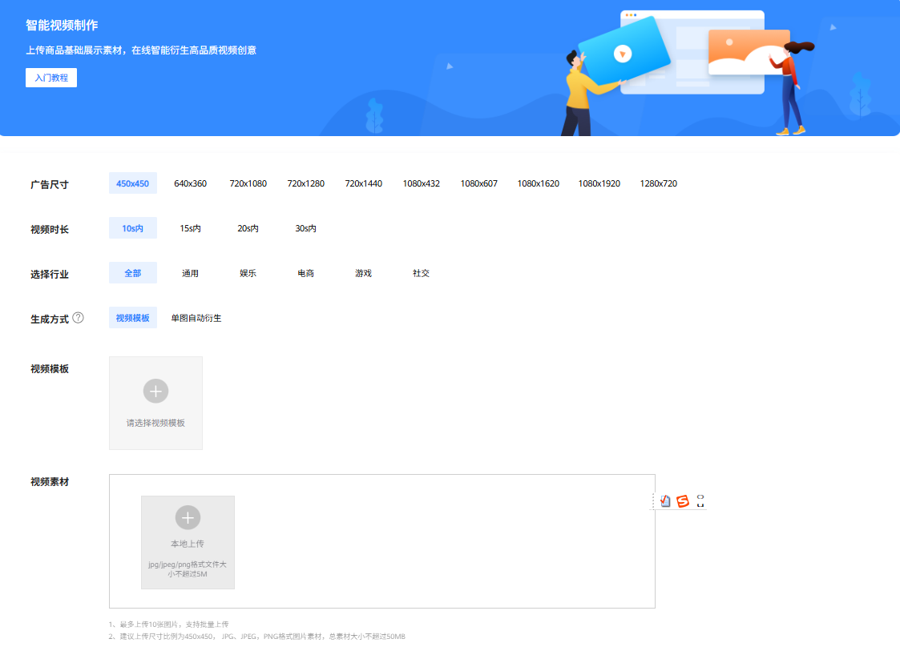

# 视频工具

## 功能简介

维纳斯视频工具是鲸鸿动能平台为广告主免费提供的视频素材制作工具，功能包括视频尺寸拓展和智能视频。

- <strong>视频尺寸拓展</strong>：根据您上传的视频进行裁剪或拓展，帮助您快速获得匹配平台的视频素材尺寸。
- <strong>智能视频</strong>：上传商品基础展示素材，在线智能衍生高品质视频创意。

## 操作步骤

在投放端首页选择“工具”-&gt;“创意工具”-&gt;”视频工具”，可选择“视频尺寸拓展”、“智能视频”分别进入功能详情页。

### 视频尺寸拓展

1. 广告主上传视频素材，格式为MP4，大小不超过10M。
2. 选择拓展方式和视频尺寸，单击生成。

   
3. 拓展完成的视频支持下载、保存至素材库或同步至DSP。

### 智能视频

1. 设置视频尺寸、时长，并选择行业和生成方式。
   - 单图自动衍生：一张图片智能衍生1~3个视频，把静态图片转化为动态视频。
   - 视频模板：广告主选择一个模板后上传素材，系统根据模板替换素材生成视频。

   
2. 上传视频素材，单图自动衍生支持上传1张图片，支持JPG、JPEG，PNG格式，总素材大小不超过5MB。
3. 单击“智能生成”即可生成符合条件的视频素材。
4. 生成的视频素材支持下载、保存至素材库或同步至DSP，也支持二次编辑和修改背景音乐。
