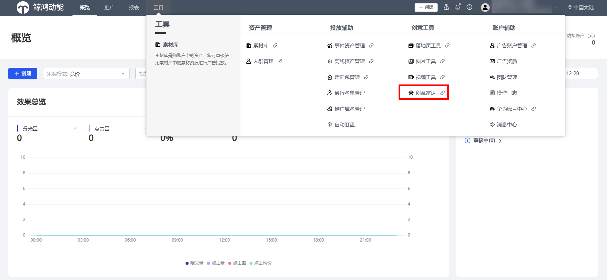
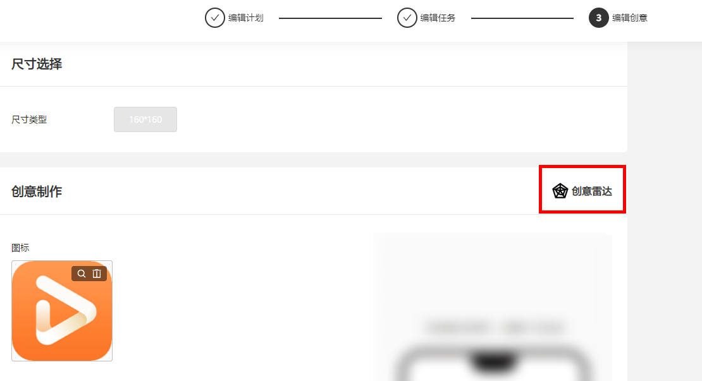
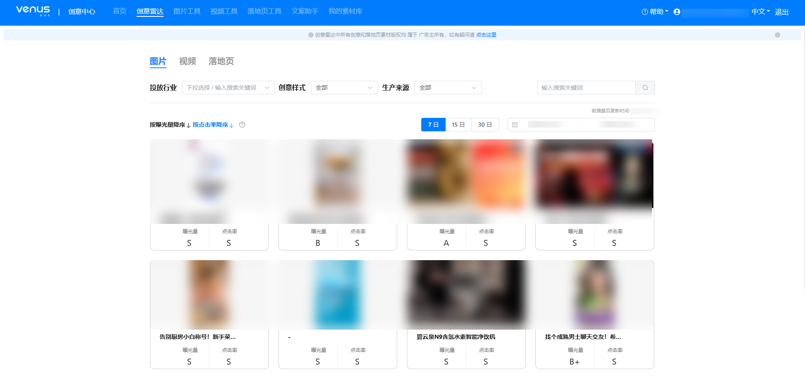
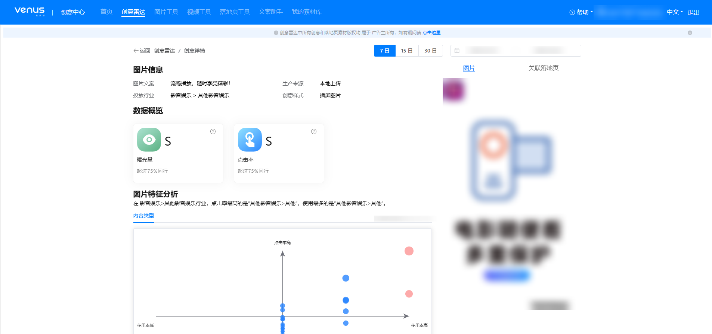
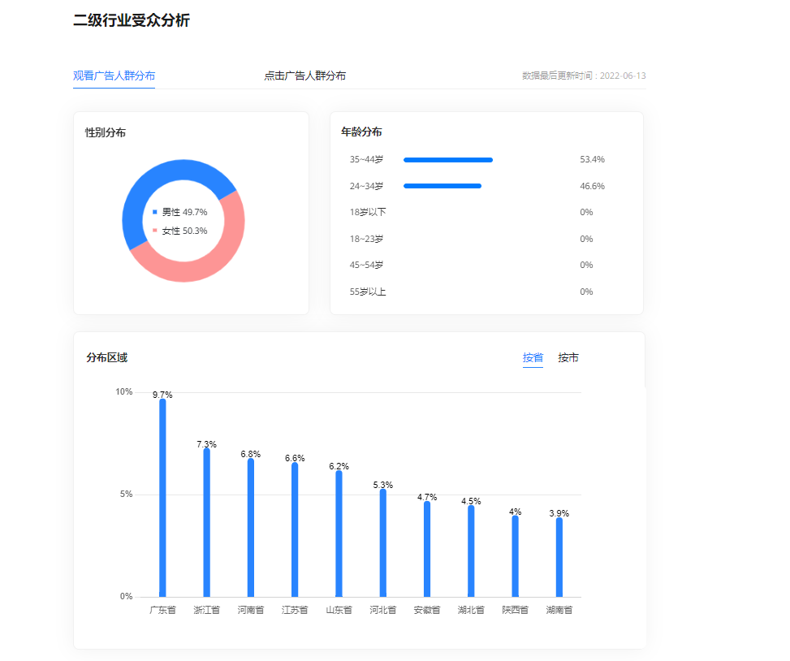
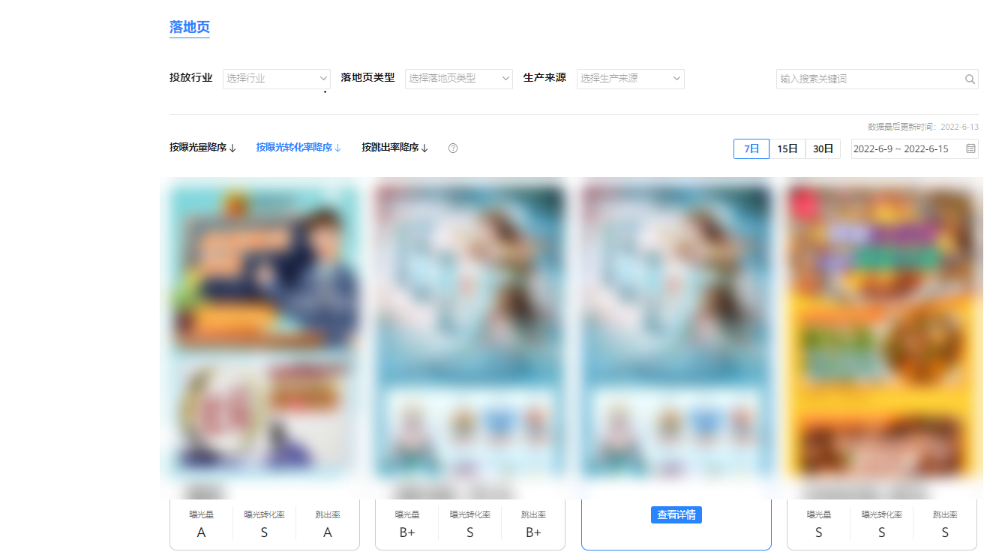
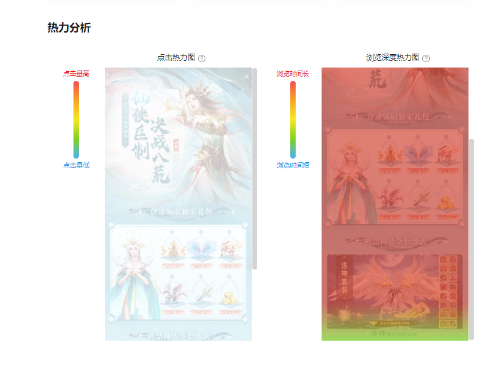
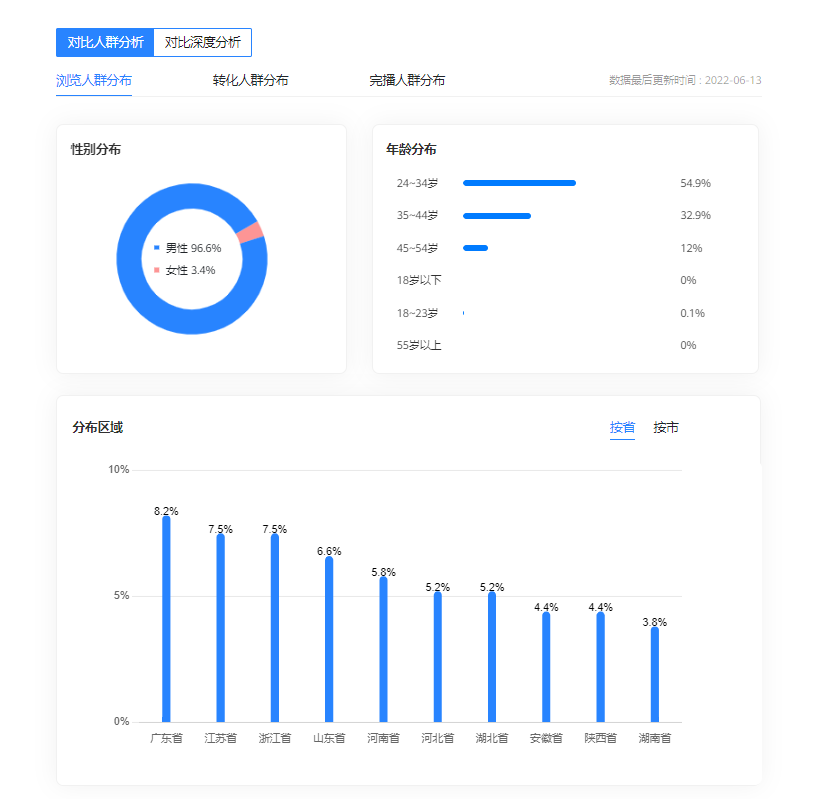
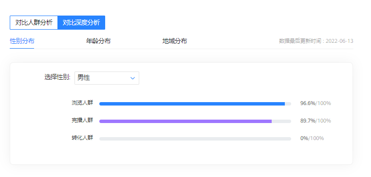

# 创意雷达

## 简介

创意雷达是汇聚鲸鸿动能投放平台全行业优质图片创意、视频创意和落地页的展示平台。助力广告主深度洞察行业推广趋势，为广告主制作创意提供灵感和优秀案例参考，启发广告主输出高质量创意和落地页。

目前创意雷达支持以下能力：

1. <strong>创意热度榜单：</strong>查看不同行业、创意样式、生产来源、时间等维度下的图片、视频、落地页热度榜单。
2. <strong>创意数据指标概览：</strong>支持不同素材类型使用不同指标（如图片点击率，视频完播率）衡量创意热度。
3. <strong>创意二级行业人群分布：</strong>分析该创意行业的点击、转化、曝光、完播等人群特征分布(性别/年龄/地域等)。
4. <strong>创意内容标签：</strong>分析创意所在二级行业的不同创意特征数据指标优良。

## 操作步骤

1. <strong>进入创意雷达</strong>
   - 入口1：“投放平台”&gt;“工具”&gt;“创意工具”&gt;“创意雷达”

   

   - 入口2：“投放平台”-&gt;“编辑创意”-&gt;“创意雷达”

   
2. <strong>查看图片热榜</strong>
   - 可通过筛选不同行业、创意样式、生产来源、时间等维度，按曝光量或点击率降序查看创意图片与文案素材，支持关键词搜索。

     
   - 支持查看创意的指标等级（曝光量与点击率），分以下4个级别：

     S：超过75%同行

     A：超过50%同行

     B+：超过25%同行

     B：表现一般
   - 图片创意详情页汇总可看到图片信息、数据概览、图片特征分析、二级行业受众分析和关联落地页等内容。

     
     - 数据概览：曝光量与点击率的等级指标。
     - 图片特征分析：分析创意所在二级行业的不同创意特征数据指标优良，根据不同创意标签的点击率和使用情况了解行业趋势与用户兴趣分布。
     - 二级行业受众分析：支持查看创意所在二级行业的观看广告人群分布和点击广告人群分布，查看不同人群的性别、分布区域。

     
3. <strong>查看视频热榜</strong>
   - 可通过筛选不同行业、创意样式、生产来源、时间等维度，按曝光量、点击率、播放量降序查看创意视频与文案素材，支持关键词搜索。
   - 支持查看创意的指标等级（曝光量、点击率、播放量），指标等级请参见<strong>图片热榜</strong>
   - 视频创意详情页汇总可看到视频信息、数据概览、视频特征分析、二级行业受众分析和关联落地页等内容。
     - 数据概览：可查看曝光量、点击率、播放量、播放完成率、平均播放时长的等级指标。
     - 视频特征分析：分析创意所在二级行业的不同创意特征数据指标优良，根据不同创意标签的点击率和使用情况了解行业趋势与用户兴趣分布。
     - 二级行业受众分析：支持查看创意所在二级行业的观看广告人群分布和点击广告人群分布，查看不同人群的性别、年龄、分布区域。
4. <strong>查看落地页热榜</strong>
   - 可通过筛选不同行业、落地页类型、生产来源、时间等维度，按曝光量、曝光转化率、跳出率降序查看落地页，支持关键词搜索。

     
   - 支持查看落地页的指标等级（曝光量、曝光转化率、跳出率），指标等级请参见<strong>图片热榜。</strong>
   - 落地页详情页可看到落地页信息、数据概览、热力分析、对比人群分析和对比深度分析等内容。
     - 数据概览：可查看曝光量、曝光转化率、跳出率、平均停留时长、平均浏览深度比例、页面加载时长的等级指标。
     - 热力分析：可查看某落地页的点击热力图和浏览深度热力图；点击热力图了解用户在落地页上的点击分布，浏览深度热力图了解用户滑动到落地页任意位置的用户百分比，了解用户对落地页不同内容的兴趣程度。

     

     - 对比人群分析：支持查看落地页所在二级行业的浏览人群分布、转化人群分布、完播人群分布，查看不同人群的性别、年龄和分布区域。

       
     - 对比深度分析：此部分为落地页独有的对比深度分析：从性别、年龄、地域分布来看浏览、停留、转化人群比例。

     
