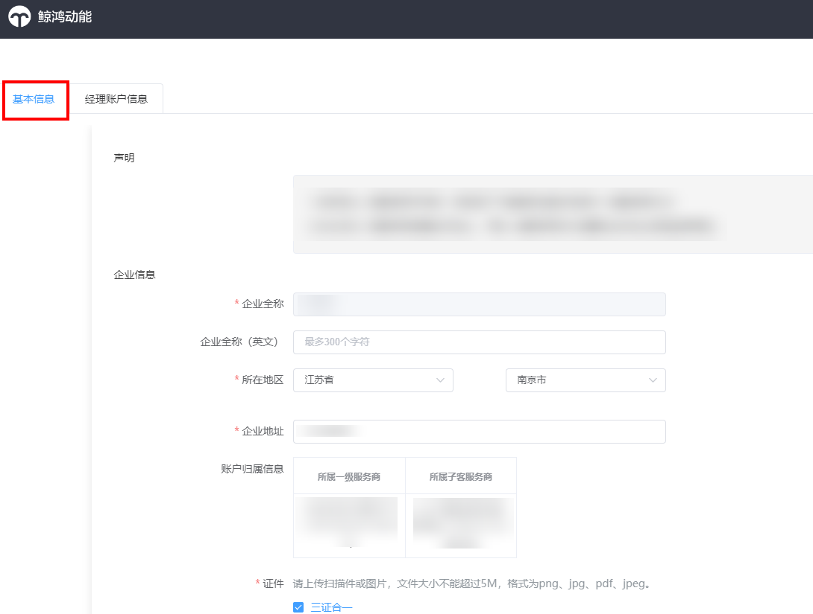
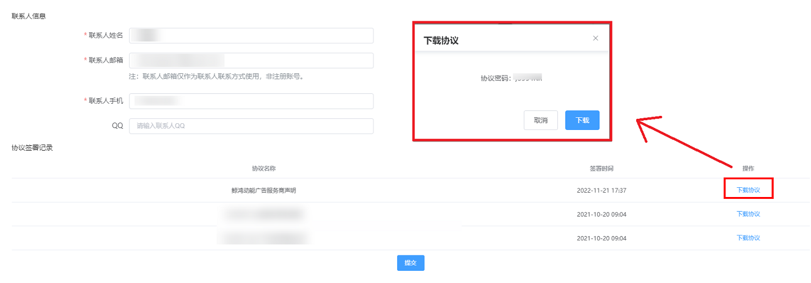
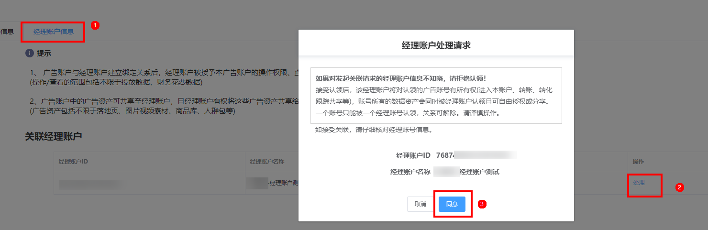
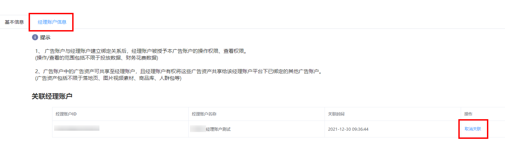

# 广告账户管理

## 功能简介

广告账户管理功能为广告主提供账户基本信息管理和经理账户信息管理服务，广告主可以在账户<strong>基本信息</strong>页面修改企业信息、行业资质、联系人信息等；在<strong>经理账户信息</strong>页面可以查看经理账户关联情况、处理经理账户绑定申请或取消关联经理账户。

## 操作步骤

### 账户基本信息

1. 支持查看、修改广告账户的企业信息、行业资质和联系人信息。

   
2. 支持下载查看已签署协议，单击“下载协议”后将弹出协议密码，下载完成后使用该密码查看协议即可。

   

### 经理账户信息

1. 支持查看该账户绑定的经理账户信息、处理经理账户关联请求。

   
2. 支持对已绑定的经理账户取消关联，取消关联后原经理账户将无法访问此广告账户。

   
