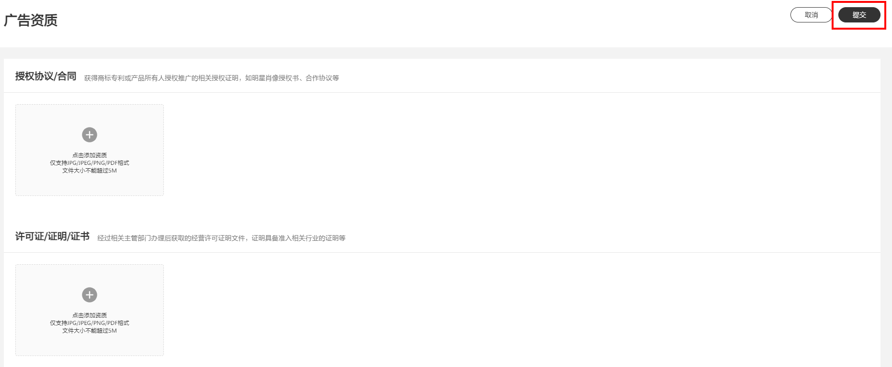
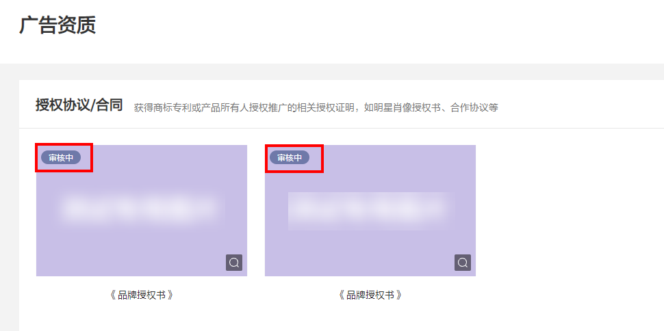

# 广告资质

## 功能介绍

您可以通过广告资质管理功能对账户中所需的各类资质（如授权协议、合同、许可证等）进行新增、修改和删除操作。

- 授权协议/合同：获得商标专利或产品所有人授权推广的相关授权证明，如明星肖像授权书、合作协议等；
- 许可证/证明/证书：经过相关主管部门办理后获取的经营许可证明文件，证明具备准入相关行业的证明等；
- 其他：可补充上传某个行业广告的非通用资质，资质审核通过后即可用于补充广告审核要求的所需认证。

## 操作步骤

1. 新增或修改资质后单击“提交”，审核结果将通过邮件发送到您的企业邮箱。

   
2. 支持查看资质审核状态，若账户中有正在审核中资质，需等待审核完毕后方可再次修改。

   
