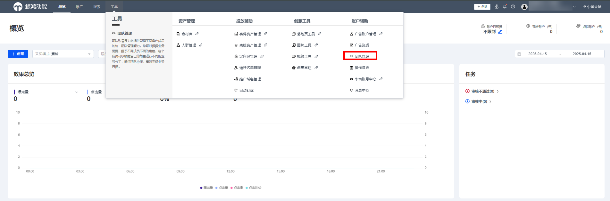
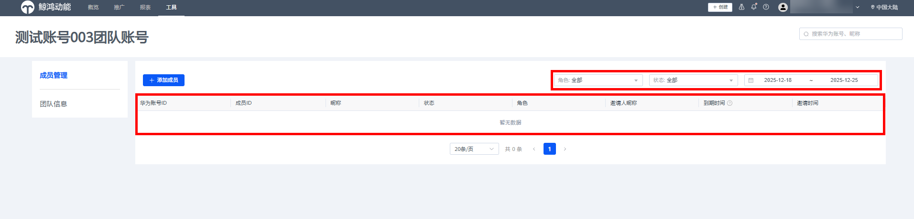
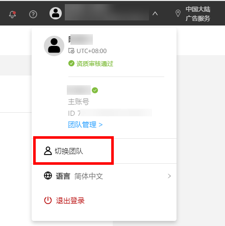
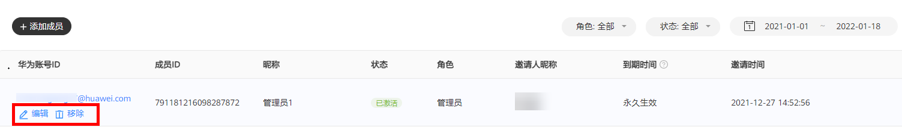

# 团队管理

## 功能简介

团队账号是鲸鸿动能提供给广告主（统称为<strong>账号持有者</strong>）实现多个团队成员共同管理广告账户的功能。账号持有者可对团队内的成员进行角色权限管理、可以和团队成员共同协作完成广告创建、优化和数据分析等工作，高效投放广告。

- 账号持有者可以邀请管理员、优化师、数据分析师，每个管理员有权限管理自己邀请的成员，账号持有者可以管理整个账号内的成员。
- 权限角色如下图所示，不支持自定义角色：

  | 角色名称 | 推广（创建广告计划/任务/创意） | 报表（查看广告数据） | 工具（用于推广的辅助工具） | 财务（充值、结算） |
  | --- | --- | --- | --- | --- |
  | 管理员 | √ | √ | √ | √ |
  | 优化师 | √ | × | √ | × |
  | 数据分析师 | × | √ | × | × |

 

1. 团队账号支持直客与子客使用。
2. 每个团队中，团队成员的上限为100人，每个华为账号最多可以被添加到10个团队。

## 操作步骤

1. 广告主登录投放平台，单击“<strong>工具</strong>”-&gt;“<strong>团队管理</strong>”，进入团队账号界面。

   

   成员管理列表如下，可以按照角色（管理员/优化师/数据分析师）、状态（邀请中/已激活/邀请失败/已过期）和邀请时间进行筛选查看成员。

   
2. <strong>添加成员</strong>

   被邀请者邮箱会收到一封邀请邮件，需要在10天有效期内按照邮件内容进行激活， 若当前成员加入了多个团队，可单击右上角“切换团队”进行切换。

   
3. <strong>编辑成员</strong>
   - <strong>账号持有者</strong>：可以进行成员管理，有权限看到成员管理及团队信息菜单，支持<strong>移除、编辑</strong>成员。

   

   - <strong>非账号持有者</strong>：包含管理员、数据分析师、优化师，非账号持有者只能看到当前账号持有者和自己的角色及权限相关信息；每个团队成员有权退出团队，成员单击退出团队之后，将会给邀请该成员的管理员以及账号持有者发送邮件通知。

 

1. 被邀请成员账号权限到期前7天提醒广告主。
2. 若管理员未得到成员反馈，可以重新邀请，不限制邀请次数；若邀请超出10天有效期，状态将会变为“已失效”，需要重新发起邀请。
3. 已注册华为账号可直接登录；若未注册华为账号，成员需在10天内先注册再接受邀请，然后用华为账号进行登录（成员账号不要求实名认证）。
4. 已生成的权限角色不支持修改。
