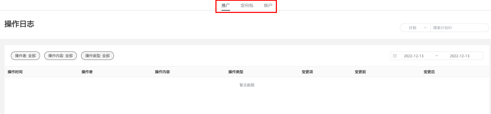

# 操作日志

## 功能简介

操作日志管理功能支持按照不同维度查看账户操作日志。

## 操作指引

1. 支持切换“推广”、“定向包”、”账户”层级维度查看操作日志。

   
2. 支持切换 “操作者”、 “操作内容” 、“操作类型”细分维度查看。

   |  |  |
   | --- | --- |
   | <strong>查看维度</strong> | <strong>支持查看的操作记录</strong> |
   | 操作者 | 支持查看分账户ID、系统审核员的操作记录 |
   | 操作内容 | 支持查看分计划、任务、创意层级的操作记录（不支持3.0创意查看） |
   | 操作类型 | 支持查看新建、修改、删除审核类型的操作日志 |
3. 支持筛选“计划ID/任务ID/创意ID”和“时间”查看对应的操作日志，支持查看“变更项”以及变更前后对比。
